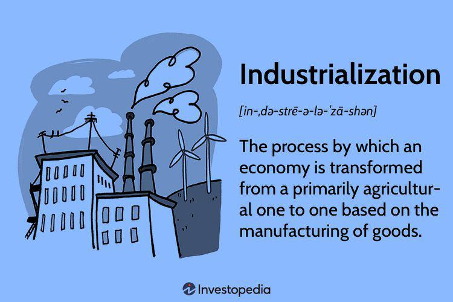

Industrialization has been a pivotal force in shaping modern economic development, serving as the catalyst for transforming agrarian societies into industrial powerhouses. This shift led to an unprecedented increase in productivity, technological innovation, and overall economic growth. The Industrial Revolution, beginning in the 18th century, marked the onset of this transformation, bringing about advancements in manufacturing processes, transportation, and communication. These changes not only redefined industry structures but also catalyzed urbanization, altering labor markets and shifting economic power dynamics globally.

In contrast, algorithmic trading represents a new frontier in economic evolution, leveraging advances in technology to revolutionize financial markets. Algorithmic trading uses automated computer programs to execute trades at speeds and volumes impossible for human traders. This technology has drastically changed the landscape of financial markets by improving market efficiency, enhancing liquidity, and reducing transaction costs. Algorithmic trading capitalizes on the ability to process vast amounts of data rapidly, making informed trading decisions in fractions of a second and thus influencing global markets significantly.

The convergence of industrialization principles with algorithmic trading is evident in their shared goal of optimizing efficiency and productivity. While industrialization laid the foundation for modern economies by transforming production and societal structures, algorithmic trading optimizes these economies further through the digitalization and automation of financial transactions.

Understanding the economic impacts of both industrialization and algorithmic trading is essential for stakeholders to navigate the evolving economic landscape. Industrialization's impact on economic growth, employment, and societal structures provides historical insights into how economies can leverage technological advancements. Similarly, the rapid expansion of algorithmic trading highlights the potential benefits and risks associated with integrating technology into economic operations.

This article will explore key historical contexts and economic impacts of both phenomena, drawing comparisons between their contributions to economic growth, shifts in labor dynamics, and technological advancements. Additionally, it will address governance challenges, regulatory considerations, and future projections to provide a comprehensive understanding of their convergence and implications for global economies.

## Table of Contents

## Historical Context of Industrialization

The Industrial Revolution, which commenced in the late 18th century, marked a pivotal transformation in global economies. Originating in Britain, this era was characterized by a remarkable shift from agrarian economies to industrialized societies. 

### Phases of Industrialization and Technological Advancements

The process of industrialization unfolded in several stages, each marked by significant technological innovations. The first phase, known as the First Industrial Revolution, focused on the mechanization of textile production and the utilization of steam power. Key inventions, such as the spinning jenny and the steam engine, revolutionized production processes, leading to unprecedented increases in output.

The Second Industrial Revolution, spanning the late 19th and early 20th centuries, witnessed the advent of electrical power, the expansion of steel and chemical industries, and remarkable innovations such as the internal combustion engine and the telegraph. This phase facilitated the emergence of mass production techniques, epitomized by assembly line production in factories.

### Impacts on Industry Structure, Labor Markets, and Urbanization

Industrialization profoundly restructured industries by shifting the focus from small-scale handcrafts to large-scale production. As factories burgeoned, demand for labor increased, leading to significant alterations in labor markets. Employment opportunities shifted from rural, agrarian settings to urban industrial centers, catalyzing mass urban migration. This urbanization spawned the rapid growth of cities, transforming them into economic and industrial hubs.

With industrialization, labor markets underwent substantial changes, not only in terms of employment numbers but also concerning the nature of work. Specialized factory jobs began replacing traditional artisan roles, necessitating new skills and contributing to the rise of a distinct working class. 

### Economic Shifts and Establishment of Industrial Economies

The transformative effects of industrialization extended to global economic power. Nations embracing industrialization, such as Britain, Germany, and the United States, gained significant economic advantages, shifting the balance of economic power from agrarian to industrial economies. This industrial ascendancy led to increased competition among nations, fostering further advancements in technology and productivity.

The establishment of industrial economies laid the groundwork for modern economic frameworks, characterized by higher productivity levels and increased capital accumulation. The intensified production capabilities propelled by industrialization not only spurred economic growth but also engendered social changes, prompting shifts in lifestyles and consumption patterns.

In summary, the Industrial Revolution and subsequent phases of industrialization reshaped the economic landscape by driving technological innovation, altering labor and industry structures, and establishing powerful industrial economies. These changes set the stage for contemporary economic development, serving as a precursor to the modern technological advancements that continue to influence economic dynamics today.

## Algorithmic Trading: A New Economic Frontier

Algorithmic trading represents a significant shift in the functioning of financial markets, characterized by the deployment of complex algorithms to automate trading activities. At its core, [algorithmic trading](/wiki/algorithmic-trading) refers to the use of computer systems and software to enter trading orders with minimal human intervention. These algorithms are capable of analyzing vast datasets and executing orders based on pre-defined criteria such as timing, price, or [volume](/wiki/volume-trading-strategy), thereby optimizing transaction outcomes.

The evolution of technology in financial markets has catalyzed the emergence and growth of algorithmic trading. The integration of advanced computing technologies and connectivity infrastructures, coupled with the availability of high-frequency trading platforms, has enabled market participants to process information and execute trades at speeds unattainable by human traders alone. The rise of [machine learning](/wiki/machine-learning) and [artificial intelligence](/wiki/ai-artificial-intelligence) has further augmented the capabilities of algorithmic trading systems, allowing for predictive analytics and adaptive responses to dynamic market conditions.

One of the primary advantages of algorithmic trading over traditional trading methods is its ability to increase efficiency in trade execution. Automated systems can process and analyze market data in real-time, making split-second decisions without the delay inherent in human interventions. This speed enhances market [liquidity](/wiki/liquidity-risk-premium) by facilitating a higher volume of transactions and reducing bid-ask spreads. Additionally, algorithmic trading minimizes human error and emotional biases, leading to more consistent and objective trading outcomes.

Another significant benefit is the reduction in transaction costs. Algorithmic trading systems can identify optimal trading opportunities and execute orders at the best available prices, thereby minimizing costs associated with slippage and market impact. The enhanced precision in executing trades also allows for improved risk management strategies and portfolio optimization.

The impact of algorithmic trading on global markets is evidenced by its rapid growth and widespread adoption across various exchanges. Technological advancements have democratized access to algorithmic trading tools, enabling not only institutional investors but also retail traders to participate. As a result, algorithmic trading accounts for a substantial proportion of trading activities in leading financial centers worldwide. Automated strategies are also increasingly used in emerging markets, further expanding their global footprint.

In conclusion, algorithmic trading represents a new economic frontier, driven by technological innovation and characterized by enhanced market efficiency, reduced transaction costs, and increased accessibility. As financial markets continue to evolve, algorithmic trading is poised to play an even more prominent role, shaping the future of global economic activities.

## Economic Impacts of Industrialization

The process of industrialization had profound economic impacts that reshaped societies worldwide. One of the most significant outcomes was the dramatic increase in productivity and economic growth. By harnessing machinery, factories could produce goods on an unprecedented scale, reducing the need for manual labor and leading to economies of scale. This mechanization allowed countries to significantly boost their industrial output and national income, laying the foundation for modern economic powerhouses.

The employment landscape also shifted as a consequence of industrialization. As factories became the epicenters of production, there was a massive migration of labor from rural agriculture to urban manufacturing. This shift necessitated new skills, prompting changes in education and vocational training systems. While industrialization created jobs, it also led to job displacement in traditional sectors, thus altering the nature and distribution of employment. Workers had to adapt to new roles often requiring different skill sets, which sometimes exacerbated socio-economic divides.

Environmental and societal changes were additional impacts of industrial activity. The increased use of fossil fuels and raw materials led to significant environmental degradation, including pollution and habitat destruction. Urbanization, a direct result of industrialization, altered living conditions, with many people experiencing overcrowded and unsanitary environments. These changes spurred social reforms and regulatory measures aimed at improving living standards and addressing environmental concerns.

The impact of industrialization on income distribution and economic inequality was multifaceted. While it improved overall standards of living and increased average income levels, it also widened the gap between different social classes. The rise of industrial capitalists and the concentration of wealth among a small elite contributed to economic disparities. Workers often faced harsh working conditions and low wages, leading to social tensions and, eventually, labor movements advocating for better working conditions and fair pay.

In summary, industrialization catalyzed significant economic growth and transformed labor markets. However, it also introduced challenges such as environmental degradation and income inequality, underscoring the need for balanced and equitable development strategies.

## Economic Impacts of Algorithmic Trading

Algorithmic trading, the use of computer algorithms to automate trading decisions and execute trades, has had significant economic impacts on financial markets globally. One of the most notable effects is the increased market efficiency and liquidity. Algorithms can analyze vast datasets in real-time to identify trading opportunities, which allows for rapid price adjustments to reflect new information, thereby reducing inefficiencies. This capability enhances market liquidity as there is a continuous flow of buyers and sellers, facilitating smoother and quicker transactions.

A key advantage of algorithmic trading is the substantial reduction in transaction costs and the enhancement of decision-making speed. Algorithms reduce manual intervention, minimizing errors and inconsistencies that human traders may introduce. They can execute trades at the optimal price points with precise timing, considering factors like volume, timing, and market conditions. This precision not only lowers transaction costs but also allows for high-frequency trading ([HFT](/wiki/high-frequency-trading-strategies)), where thousands of trades are executed within microseconds, further speeding up the decision-making process.

Despite these benefits, algorithmic trading poses potential risks related to market [volatility](/wiki/volatility-trading-strategies) and systemic risks. The rapid pace of trading can amplify market movements, leading to volatility spikes. For example, the 2010 "Flash Crash" illustrated how algorithms could trigger large price swings within a short timeframe, resulting in a temporary but severe market disruption. The interconnectedness of algorithm-driven trades also raises concerns about systemic risks, where a failure in one part of the system could rapidly propagate and affect the entire market.

For investors and financial institutions, algorithmic trading presents considerable implications. On the one hand, investors benefit from improved market conditions with lower transaction fees and better execution prices. This shift necessitates that institutions invest in advanced technology and infrastructure to compete effectively. Furthermore, the reliance on complex algorithms requires transparency and robust risk management procedures to mitigate the potential detrimental effects of algorithm failures.

To conclude, algorithmic trading has transformed modern financial markets by enhancing efficiency and reducing costs. However, these benefits are juxtaposed with considerable risks that require careful management and regulatory oversight. As algorithmic trading continues to evolve, stakeholders must adapt to the changing landscape to harness its potential while safeguarding market integrity.

## Comparative Analysis: Industrialization vs. Algorithmic Trading

Industrialization and algorithmic trading are two pivotal developments that have significantly influenced economic growth and technological advancement. Industrialization, marked by the mechanization of agriculture and the rise of factories, set the stage for an exponential increase in productivity and technological innovation. This period entrenched the factory as the centerpiece of production, leading to the expansion of industrial economies and fostering a shift from agrarian societies to urbanized, industrial ones. The introduction of steam power, the spinning jenny, and later, the assembly line, transformed manufacturing methods and accelerated economic output.

Algorithmic trading, on the other hand, represents a new frontier in economic evolution by utilizing computer algorithms to execute trades at speeds and efficiencies unattainable by human traders. Its emergence has fundamentally altered the dynamics of financial markets, contributing to increased market liquidity and reduced transaction costs.

In terms of employment and industry dynamics, industrialization led to significant societal shifts. It created a high demand for factory labor, which simultaneously generated employment opportunities and prompted urban migration. However, this also resulted in labor exploitation and the need for regulatory frameworks to protect workers' rights. Algorithmic trading impacts employment differently. While it increases efficiency, it also reduces the need for human traders, shifting demand towards jobs requiring advanced technological skills such as data analysis and computer programming. This transition challenges labor markets to adapt, emphasizing the importance of continuous skill development in technology and financial literacy.

Governance challenges and regulatory considerations are crucial aspects of both industrialization and algorithmic trading. The Industrial Revolution necessitated the development of new policies to manage labor rights, industrial safety, and environmental concerns. Similarly, algorithmic trading presents governance challenges, particularly concerning market transparency, fairness, and systemic risk management. Regulators are tasked with ensuring that the rapid pace of technological adoption does not outstrip the frameworks designed to safeguard financial stability and protect investor interests.

Insights from past industrial shifts provide valuable lessons for the future trajectory of algorithmic trading. The transition from manual to mechanized production underscores the need for proactive policy approaches and the importance of aligning technological advancements with human welfare. As algorithmic trading evolves, it is expected that regulatory bodies will continue to adapt, emphasizing the prevention of market distortions and the maintenance of investor confidence.

In conclusion, the comparison between industrialization and algorithmic trading highlights both sectors' profound impacts on economic structures and labor dynamics. While each has driven unparalleled growth and technological progress, they have also posed significant challenges requiring comprehensive governance. These historical narratives, combined with future projections for algorithmic trading, underscore the need for strategic policy interventions to ensure balanced economic development.

## Future Prospects and Challenges

Emerging technologies are poised to significantly shape the future landscape of industrialization and algorithmic trading. These advancements are expected to drive efficiency, innovation, and transformative economic change. In the sector of industrialization, technologies such as automation, artificial intelligence (AI), and the Internet of Things (IoT) are leading the charge. Automation and AI are enhancing manufacturing processes, reducing costs, and improving precision. IoT connectivity enables smarter resource management and predictive maintenance, further optimizing production cycles.

In algorithmic trading, the future is being reshaped by advancements in machine learning and real-time data analytics. These technologies bring about enhanced decision-making capabilities, enabling trading algorithms to process vast amounts of financial data and adapt to market trends with unprecedented speed and accuracy. The integration of quantum computing holds potential for even more significant changes, offering computing power that could drastically reduce processing times for complex trading algorithms.

As these technologies continue to advance, potential economic scenarios emerge. One possible outcome is the reduction of barriers to entry in various markets, fostering competition and innovation. Enhanced production capabilities and trading efficiencies may lead to accelerated economic growth and expansion into new markets. However, with rapid technological change comes the challenge of balancing economic benefits with sustainability. Industrial advancements could exacerbate environmental challenges if not managed responsibly. Similarly, the high-speed nature of algorithmic trading may lead to increased market volatility and systemic risks, impacting financial stability.

Global policy frameworks play a crucial role in managing these economic transitions. Regulatory bodies must adapt to the rapid pace of technological change, ensuring standards that promote innovation while safeguarding against risks. Industry and government collaboration is essential for developing policies that address fair competition, data privacy, and ethical considerations in automation and algorithmic decision-making.

In summary, the future of industrialization and algorithmic trading presents vast opportunities for economic advancement, tempered by challenges of sustainability and regulatory governance. Strategic policy planning and international cooperation will be paramount in navigating these transitions and ensuring that technological benefits are realized alongside sustainable economic growth.

## Conclusion

Industrialization and algorithmic trading represent pivotal forces that have significantly shaped modern economic paradigms. Industrialization drove unprecedented economic growth through enhancements in productivity, industry structure, and urbanization. Similarly, algorithmic trading, with its technological advancements, transformed financial markets by providing increased market efficiency, reduced transaction costs, and heightened decision-making speed.

The economic impacts of industrialization were profound as they facilitated a major shift in labor markets and altered income distributions, leading to a structural reconfiguration of economies worldwide. While industrialization laid the foundation for contemporary economic development, it also introduced challenges such as environmental degradation and socioeconomic inequalities.

Algorithmic trading, on the other hand, imparts a dual impact: optimizing market operations while also introducing potential systemic risks and market volatility. Financial markets have become more efficient and liquid, yet they face challenges around regulatory controls and ethical trading practices.

Strategic planning is essential in harnessing the benefits of both industrialization and algorithmic trading. Such endeavors necessitate a thoughtful approach to policy frameworks that aim at maximizing positive outcomes while mitigating associated risks. These strategies must focus on sustainable development, equitable growth, and an agile adaptation to technological advancements.

Looking ahead, the successful navigation of future economic landscapes hinges on the ability of stakeholders to be forward-thinking and adaptive. Policymakers, industries, and investors must collaborate to create robust frameworks that support technological innovation while safeguarding economic stability and equity.

As we confront the challenges and embrace the opportunities posed by these dynamic economic forces, all stakeholders must engage in proactive adaptation and strategic investment to ensure balanced growth and economic prosperity.

## References & Further Reading

[1]: Allen, R. C. (2009). ["The British Industrial Revolution in Global Perspective."](https://www.cambridge.org/core/books/british-industrial-revolution-in-global-perspective/29A277672CCD093D152846CE7ED82BD9) Cambridge University Press.

[2]: McCraw, T. K. (1997). ["Creating Modern Capitalism: How Entrepreneurs, Companies, and Countries Triumphed in Three Industrial Revolutions."](https://archive.org/details/creatingmodernca0000unse) Harvard University Press.

[3]: Lopez de Prado, M. (2018). ["Advances in Financial Machine Learning."](https://www.amazon.com/Advances-Financial-Machine-Learning-Marcos/dp/1119482089) Wiley.

[4]: Jansen, S. (2020). ["Machine Learning for Algorithmic Trading."](https://github.com/stefan-jansen/machine-learning-for-trading) Packt Publishing.

[5]: Piketty, T. (2014). ["Capital in the Twenty-First Century."](https://www.jstor.org/stable/j.ctt6wpqbc) Harvard University Press.

[6]: Rajan, R. G., & Zingales, L. (2003). ["Saving Capitalism from the Capitalists: Unleashing the Power of Financial Markets to Create Wealth and Spread Opportunity."](https://press.princeton.edu/books/paperback/9780691121284/saving-capitalism-from-the-capitalists) Princeton University Press.

[7]: Turner, A. (2015). ["Between Debt and the Devil: Money, Credit, and Fixing Global Finance."](https://press.princeton.edu/books/hardcover/9780691169644/between-debt-and-the-devil) Princeton University Press.