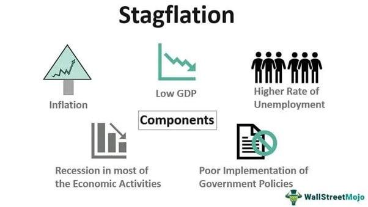

In recent years, discussions about economic challenges have increasingly emphasized the complex interactions between stagflation and modern trading techniques. This article investigates the economic impact of stagflation and the evolving role of algorithmic trading within this complex context. Stagflation, characterized by a rare combination of economic stagnation and high inflation, presents significant threats to both economic growth and inflation dynamics. This dual burden creates a complex scenario for economists and policymakers, who traditionally rely on separate tools to combat inflation and stimulate growth. 

The global economy, which has become increasingly interconnected, is attempting to navigate these turbulent waters, making a nuanced understanding of stagflation and its effects more crucial than ever. This exploration is particularly pertinent for policymakers who must adopt strategies capable of addressing both stagnant growth and inflation, often requiring a delicate balance of monetary and fiscal policies. Similarly, investors are faced with the challenge of safeguarding their portfolios against the unpredictability introduced by stagflation, and this is where algorithmic trading enters the discussion. As a cutting-edge approach in the financial markets, algorithmic trading holds the potential to influence, and in some cases, mitigate the adverse effects of stagflation.



Investors and policymakers alike need to comprehend these phenomena—not only to navigate the economic challenges they present but also to leverage opportunities offered by technological advancements in trading systems. Algorithmic trading, with its promise of speed and efficiency, has revolutionized market operations, yet its role during periods of economic uncertainty such as stagflation remains a subject of continuous analysis. 

Join us as we explore the implications of stagflation and how algorithmic trading could influence or mitigate its detrimental effects, offering a glimpse into the future of financial markets in an era defined by economic unpredictability and technological innovation.

## Table of Contents

## Understanding Stagflation

Stagflation is an economic condition characterized by the simultaneous occurrence of stagnation—indicated by slow economic growth or recession—coupled with inflation. This phenomenon defies the conventional economic scenarios where typically, inflation and economic growth are positively correlated. In stagflation, inflation rises even as the economy remains stagnant or contracts, creating a challenging environment for policymakers and businesses.

Historically, one of the most notable instances of stagflation occurred in the 1970s. This period was marked by significant economic turmoil, which provided a textbook case of stagflation. The 1970s stagflation was primarily driven by supply shocks and inappropriate policy responses. Specifically, the OPEC oil embargo of 1973–1974 led to substantial increases in oil prices, acting as a supply shock that rippled through economies worldwide. This increase in oil prices raised the cost of goods and services, contributing to widespread inflation. Simultaneously, the economic growth rates slowed considerably, leading to recessionary conditions in many developed nations.

The causes of stagflation often include external supply shocks and poor policy decisions. A supply shock, such as a sudden increase in the price of a crucial input like oil, can lead to higher production costs across industries, resulting in elevated consumer prices. This inflationary pressure, when coupled with slack demand and rising unemployment, creates a stagnant economic environment.

Policy decisions can also exacerbate stagflation. During the 1970s, various governments resorted to expansionary fiscal and monetary policies with the intent to stimulate growth. However, these policies often ended up fueling inflation without significantly contributing to economic recovery. For example, attempts to curb inflation through wage and price controls eventually proved counterproductive, as they stifled business investment and failed to address underlying supply constraints.

Understanding the dynamics of stagflation requires an examination of the delicate balance between supply, demand, and policy interventions. It challenges traditional economic tools, as the simultaneous adversities of high inflation and low growth limit the effectiveness of typical policy responses aimed at either curbing inflation or stimulating economic growth. Consequently, tackling stagflation often requires a nuanced approach that addresses both supply-side disruptions and demand-side weaknesses.

## Economic Impact of Stagflation

Stagflation presents a formidable challenge to traditional economic policy tools, which are primarily designed to address either inflation or economic stagnation, but not both simultaneously. This economic anomaly complicates the task of policymakers, as the standard measures to control these issues individually often prove ineffective or counterproductive when applied during stagflation.

High inflation in a stagflationary environment curtails the capability of central banks to implement monetary policies aimed at stimulating growth. Ordinarily, in times of economic stagnation, central banks might reduce interest rates to spur consumer spending and encourage business investment. However, when inflation is high, reducing interest rates can further fuel price increases, exacerbating the inflation problem. This leaves central banks in a precarious position, as they are unable to employ their usual tactic of [interest rate](/wiki/interest-rate-trading-strategies) adjustments to combat unemployment and stagnation without worsening inflation.

The ripple effects of stagflation extend into several critical economic sectors. Consumer spending, a significant driver of economic growth, is particularly impacted. High inflation erodes purchasing power, diminishing consumers' ability to buy goods and services. With stagnating incomes and rising prices, consumers are forced to cut back on spending, leading to decreased demand and production slowdowns.

Business investment also suffers during stagflation. The dual pressures of slow economic growth and rising costs discourage companies from investing in new projects or expanding operations. Uncertain economic conditions heighten the risk of investment, and companies may hold off on committing capital, leading to further economic stagnation.

Government fiscal positions are another area significantly affected by stagflation. As unemployment rises and consumer spending falls, tax revenues are likely to decrease, limiting the government's fiscal capability to stimulate the economy through public spending. At the same time, the cost of government borrowing can increase due to high inflation, constraining the fiscal space even further.

In summary, stagflation disrupts the effectiveness of traditional economic policies, creating a complex situation where typical remedies for inflation or stagnation alone are insufficient. Its impact permeates key areas such as consumer spending, business investment, and government fiscal balance, thereby posing a considerable challenge to economic stability and growth.

## Algorithmic Trading in the Face of Economic Challenges

Algorithmic trading, often referred to as algo trading, is a method of executing orders using automated and pre-programmed trading instructions accounting for variables such as time, price, and [volume](/wiki/volume-trading-strategy). This practice has transformed financial markets by enhancing transactional pace and operational efficiency. However, its impact during periods of economic uncertainty, like stagflation, is multifaceted.

One of the primary advantages of [algorithmic trading](/wiki/algorithmic-trading) is its ability to process large volumes of data rapidly, allowing for high-frequency trading strategies that capitalize on small price differentials. During stagflation, where market conditions are unpredictable due to concurrent inflation and economic stagnation, this ability can provide [liquidity](/wiki/liquidity-risk-premium) to otherwise volatile markets. By analyzing patterns and executing trades within milliseconds, algorithmic trading can, in instances, serve a stabilizing function, mitigating some of the erratic price swings typical of turbulent economic periods.

However, the same qualities that can stabilize markets under algorithmic trading can also lead to increased [volatility](/wiki/volatility-trading-strategies). Algorithms are designed to respond to specific signals or thresholds, and during times of economic duress, such signals can trigger a cascade of automated trading actions. For instance, if an algorithm is programmed to sell when a stock drops below a certain level, this can create a domino effect, where the initial sell triggers further declines, prompting additional automated sales. Similar patterns can emerge in bond and foreign exchange markets, potentially exacerbating the destabilizing effects of stagflation.

The response of algorithms to economic slowdowns and inflationary pressures often hinges on their underlying programming models that include [machine learning](/wiki/machine-learning) techniques and statistical [arbitrage](/wiki/arbitrage) strategies. These models analyze historical data to identify trends that might indicate future price movements. For example, a simple moving average crossover strategy might be employed:

```python
def moving_average(prices, window):
    return [sum(prices[i:i+window]) / window for i in range(len(prices) - window + 1)]

# Example Usage
prices = [120, 122, 121, 119, 121, 124, 126, 125, 127, 129]
short_window = 3
long_window = 5

short_mavg = moving_average(prices, short_window)
long_mavg = moving_average(prices, long_window)

signal = [1 if short > long else 0 for short, long in zip(short_mavg, long_mavg)]
```

This Python code snippet represents a simple algorithm for generating buy or sell signals based on the moving averages of stock prices. When the shorter moving average surpasses the longer moving average, it triggers a buy signal, and the inverse triggers a sell signal. During economic downturns, such strategies must be adapted to avoid reinforcing negative market trends.

Investors and institutions using algorithmic trading in stagflationary contexts typically look for algorithms adaptable to rapidly changing market conditions. Incorporating real-time economic indicators, such as unemployment rates or consumer price indices, into trading algorithms could provide a more nuanced approach, potentially offsetting adverse economic impacts.

As algorithmic trading continues to evolve, balancing its rapid execution capabilities with safeguards against destabilizing market impacts will be crucial. Continuous advancements in technology, particularly in [artificial intelligence](/wiki/ai-artificial-intelligence) and machine learning, hold the potential for developing more resilient algorithms that not only navigate but also mitigate economic challenges like stagflation.

## Case Studies: Algorithmic Responses to Stagflation

Analyzing historical data related to stagflation-like conditions reveals interesting insights into how algorithmic trading systems have both influenced and responded to economic shifts. Algorithmic trading utilizes computer algorithms to conduct trades at speeds and frequencies impossible for human traders. During periods reminiscent of stagflation—characterized by simultaneous stagnation and inflation—these systems have been crucial in navigating volatile markets.

One notable historical instance that sheds light on how algorithmic trading systems respond to stagflation is during the early 2000s when certain economies faced inflationary pressures due to rising commodity prices even as growth slowed. During this period, algorithmic trading systems played a pivotal role in increasing market liquidity but were also scrutinized for exacerbating volatility.

For instance, in the stock markets, algorithms capable of high-frequency trading ([HFT](/wiki/high-frequency-trading-strategies)) often react instantaneously to economic indicators, corporate earnings, or geo-political events that signal inflationary concerns or growth slowdowns. This immediate reaction can cause significant short-term volatility, as seen in the aftermath of unexpected interest rate announcements. Algorithmic strategies often leverage [statistical arbitrage](/wiki/statistical-arbitrage) and market-making methods to capitalize on brief price discrepancies, further increasing trading volumes during uncertain periods.

Consider a scenario where inflationary pressures drive expectations of interest rate hikes. Algorithms analyzing such macroeconomic indicators may automatically adjust portfolios, shifting away from interest-sensitive stocks and bonds towards commodities or inflation-linked securities. While this can contribute to rapid adjustments in asset prices, it may also provide stabilizing liquidity by ensuring that there are always buyers and sellers in the market.

An illustrative example involves bond yield adjustments in reaction to economic reports suggestive of inflation. Algorithms equipped with natural language processing (NLP) capabilities parse central bank communications and economic news to forecast these market movements. As these algorithms execute trades based on yield predictions, they could either stabilize the market by quickly integrating new information or introduce instability through herding behavior, where many systems simultaneously make similar trades.

To explore these dynamics further, a Python-based simulation of algorithmic responses to interest rate shifts during stagflationary conditions could be valuable. Here is a simple code snippet to simulate such an environment:

```python
import numpy as np
import matplotlib.pyplot as plt

# Simulating bond prices under inflationary pressure
np.random.seed(42)
n_days = 100
interest_rate_shock = np.linspace(0, 1, n_days) + np.random.normal(0, 0.1, n_days)

def simulate_bond_price_change(shock):
    return 100 * np.exp(-0.05 * shock)

bond_prices = simulate_bond_price_change(interest_rate_shock)

plt.plot(bond_prices)
plt.title("Simulated Bond Prices During Inflationary Shock")
plt.xlabel("Days")
plt.ylabel("Bond Price")
plt.show()
```

This simulation illustrates how bond prices could respond to inflationary pressures, offering insights into potential algorithmic trading strategies during stagflationary environments.

Case studies focusing on these automated trading systems highlight both their capability to manage risks in volatile markets and their potential to introduce new challenges. As algorithmic trading continues to evolve, understanding its response to economic conditions akin to stagflation will remain critical for regulators and investors alike.

## The Future: Mitigating Stagflation with Technology

The integration of machine learning (ML) and artificial intelligence (AI) into trading systems presents promising avenues for addressing economic disturbances such as stagflation. As these technologies continue to evolve, they offer the potential for financial systems to better predict and adapt to economic downturns and inflation, helping to alleviate some of the pressures associated with stagflation.

Machine learning algorithms can process vast amounts of data, identifying patterns and correlations that may not be immediately obvious to human analysts. By using these insights, trading systems can anticipate economic trends and adjust strategies accordingly. For instance, machine learning models can analyze historical market data and macroeconomic indicators to forecast potential stagflationary periods. This predictive capability enables traders to position themselves strategically, potentially reducing losses during downturns and capitalizing on market volatilities.

One application of such technology lies in dynamic asset allocation. Algorithms can be designed to optimize portfolios by continuously learning and adapting based on new economic data, thus improving decision-making under conditions of economic stress. For example, if a model identifies signals of impending inflation during a period of economic stagnation, it might shift asset allocations towards commodities or hard assets traditionally seen as hedges against inflation.

Furthermore, advancements in AI-driven sentiment analysis allow trading systems to gauge market sentiment from unstructured data, such as news articles and social media. By incorporating these qualitative data points, AI can enhance its predictions regarding market movements, consumer confidence, and potential economic shifts.

The rise of AI-powered technologies also holds promise for enhancing the transparency and accountability of algorithmic trading. By employing explainable AI (XAI) methods, the decision-making processes of algorithms during volatile economic conditions can be clarified for regulators and investors, fostering trust in automated trading systems.

Emerging technologies such as [reinforcement learning](/wiki/reinforcement-learning) are pushing the boundaries even further by allowing algorithms to make autonomous decisions based on rewards and penalties from their trading actions. This self-improving capability means that algorithms can continually refine their strategies, becoming more resilient to market disruptions caused by stagflationary pressures.

Python, with its robust libraries such as TensorFlow and PyTorch, is widely used in implementing these advanced ML techniques. Here is a simplified example of using Python for a predictive model:

```python
import pandas as pd
from sklearn.model_selection import train_test_split
from sklearn.ensemble import RandomForestRegressor
from sklearn.metrics import mean_squared_error

# Load historical economic and market data
data = pd.read_csv('economic_data.csv')
X = data.drop('future_trend', axis=1)
y = data['future_trend']

# Split data into train and test sets
X_train, X_test, y_train, y_test = train_test_split(X, y, test_size=0.2, random_state=42)

# Train a random forest model
model = RandomForestRegressor(n_estimators=100)
model.fit(X_train, y_train)

# Predict and evaluate the model
predictions = model.predict(X_test)
mse = mean_squared_error(y_test, predictions)
print(f'Mean Squared Error: {mse}')

# The model can then be used to forecast future trends based on new data
```

In conclusion, leveraging machine learning and AI in trading systems offers exciting possibilities to forecast and adapt to the adverse effects of stagflation. As these technologies become increasingly sophisticated, their role in stabilizing economic systems amidst challenges will likely grow, making them a critical component in future economic strategies.

## Conclusion

Navigating an era of potential stagflation necessitates innovative thinking and a multidisciplinary approach. Stagflation presents an economic paradox where high inflation coexists with stagnant growth, challenging conventional monetary and fiscal strategies. In this complex landscape, algorithmic trading emerges as a tool with significant potential. Algorithms can process vast amounts of financial data rapidly, offering potential stabilizing effects by quickly adjusting to market conditions. However, their success in mitigating stagflation relies heavily on continuous advancements in technology and the ethical application of these systems.

For algorithmic trading to effectively mitigate the impacts of stagflation, enhancements in machine learning and AI are crucial. Algorithms must evolve to predict economic downturns more accurately and optimize trading strategies to adapt to inflationary pressures without exacerbating market volatility. This requires ongoing investment in research and development to refine predictive models and risk management frameworks.

Ethical considerations also play a pivotal role. The deployment of advanced trading technologies must adhere to regulatory standards and be guided by principles that prevent market manipulation and protect investor interests. As these technologies become more sophisticated, ensuring transparency and accountability will be essential to maintain trust in financial markets.

Policymakers and market participants must work collaboratively to adapt to these economic challenges. Policymakers need to formulate fiscal and monetary policies that not only address immediate economic concerns but also support long-term technological integration. Market participants, including traders and investors, must embrace these technological advancements, leveraging them to make informed decisions while ensuring economic stability.

In conclusion, while algorithmic trading offers promising solutions to some of the challenges posed by stagflation, its effectiveness will depend on continued technological progress and ethical implementation. Balancing these factors will be crucial to safeguarding economic stability and fostering growth in an increasingly complex financial landscape.

## References & Further Reading

[1]: Blanchard, O. (2008). ["The State of Macro."](https://www.nber.org/papers/w14259) Journal of Economic Perspectives, 21(4), 3-24.

[2]: Lopez de Prado, M. (2018). ["Advances in Financial Machine Learning."](https://www.amazon.com/Advances-Financial-Machine-Learning-Marcos/dp/1119482089) Wiley.

[3]: Aronson, D. R. (2006). ["Evidence-Based Technical Analysis: Applying the Scientific Method and Statistical Inference to Trading Signals."](https://www.amazon.com/Evidence-Based-Technical-Analysis-Scientific-Statistical/dp/0470008741) Wiley.

[4]: Jansen, S. (2020). ["Machine Learning for Algorithmic Trading: Second Edition."](https://www.oreilly.com/library/view/machine-learning-for/9781839217715/) Packt Publishing.

[5]: Chan, E. P. (2008). ["Quantitative Trading: How to Build Your Own Algorithmic Trading Business."](https://github.com/ftvision/quant_trading_echan_book) Wiley.

[6]: Phillips, A.W. (1958). ["The Relation between Unemployment and the Rate of Change of Money Wage Rates in the United Kingdom, 1861-1957."](https://onlinelibrary.wiley.com/doi/full/10.1111/j.1468-0335.1958.tb00003.x) Economica, 25(100), 283-299.

[7]: Bordo, M. D., & Filardo, A. J. (2005). ["Deflation and Monetary Policy in a Historical Perspective: Remembering the Past or being Condemned to Repeat It?"](https://www.jstor.org/stable/3601059) NBER Working Paper No. 10833.