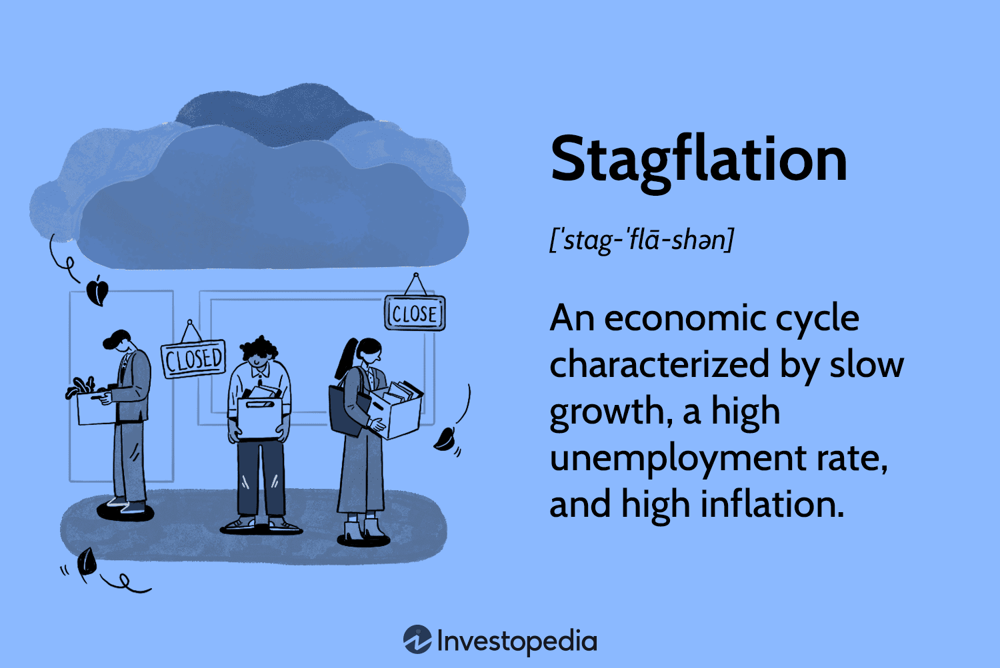

## Table of Contents

## What is stagflation?

Stagflation is when an economy has high inflation, high unemployment, and slow economic growth all at the same time. It's a tough situation because usually, when inflation is high, unemployment is low, and the economy is growing. But with stagflation, things are different and more difficult to fix.

This problem can happen because of things like big increases in oil prices, which make everything more expensive and slow down the economy. When this happens, people might not spend as much money, and businesses might not hire as many workers. Governments and central banks have a hard time solving stagflation because the usual solutions, like lowering interest rates to boost spending, might make inflation even worse.

## How does stagflation differ from other economic conditions?

Stagflation is different from other economic conditions because it combines three problems that usually don't happen together: high inflation, high unemployment, and slow economic growth. Normally, if inflation is high, it means people are spending a lot of money, which should lead to more jobs and a growing economy. But with stagflation, even though prices are going up, people are not finding jobs easily, and the economy is not growing much.

Other economic conditions, like a recession, focus more on high unemployment and slow growth without the high inflation. In a recession, the economy shrinks, and people lose jobs, but prices might not go up as much. On the other hand, during periods of high inflation without stagflation, the economy might still be growing, and unemployment could be low. This is because people are spending money, which pushes prices up but also keeps businesses hiring.

Stagflation is tricky because the usual solutions don't work well. For example, to fight high unemployment and slow growth, a government might lower interest rates to encourage spending. But with stagflation, this could make inflation even worse. So, managing stagflation requires a careful balance of policies that can be hard to achieve.

## What are the main causes of stagflation?

Stagflation often starts with big jumps in the prices of important things like oil. When oil prices go up a lot, it makes everything more expensive because oil is used to make and move so many things. This causes inflation. At the same time, because things are more expensive, businesses might not make as much money, so they might not hire as many people. This leads to higher unemployment and slower economic growth.

Another cause of stagflation can be big changes in how much people want to buy things. If people suddenly want to buy less, businesses might cut back on what they make and who they hire. But if the government or central bank tries to fix this by printing more money, it can lead to inflation. So you end up with high inflation, high unemployment, and slow growth all at once. It's a tough mix to handle because the usual ways to fix one problem can make the others worse.

## Can you explain the historical occurrences of stagflation?

One of the most famous times when stagflation happened was in the 1970s in the United States. It started when oil prices went up a lot because of decisions made by oil-producing countries. This made everything more expensive, causing inflation. At the same time, because things were more expensive, businesses didn't make as much money and didn't hire as many people. This led to high unemployment and slow economic growth. It was a hard time because the usual ways to fix the economy didn't work. Lowering interest rates to help people spend more money could make inflation even worse.

Another time when stagflation was a problem was in the United Kingdom during the same period, the 1970s. Like in the U.S., oil prices going up caused inflation. The UK also had issues with workers going on strike a lot, which made it hard for businesses to keep running smoothly. This led to more unemployment and slow growth. The government tried different things to fix it, but it was tough because making one problem better often made another problem worse. It took a long time and a lot of effort to get the economy back on track.

## How does stagflation affect employment rates?

Stagflation makes it harder for people to find jobs. When the economy is growing slowly, businesses don't need as many workers. They might even let some people go to save money. At the same time, because everything is more expensive because of high inflation, people might not buy as much stuff. This means businesses make less money and are less likely to hire new workers.

High unemployment during stagflation can also make things worse. When a lot of people are out of work, they don't have money to spend. This can slow down the economy even more. It's a tricky situation because the usual ways to help people find jobs, like lowering interest rates, can make inflation even higher. So, it's hard for the government to fix the problem without making other parts of the economy worse.

## What impact does stagflation have on consumer spending?

Stagflation makes people spend less money. When prices go up a lot because of high inflation, things cost more, and people can't buy as much with the same amount of money. At the same time, when a lot of people are out of work, they don't have money to spend. This means they have to be careful with what they buy and might only get the things they really need.

Because people are spending less, businesses don't make as much money. This can make the economy grow even slower, which is already a problem with stagflation. It's a tough cycle because when people don't spend, businesses struggle, and it's harder for the economy to get better.

## How do businesses adapt to stagflation?

When stagflation happens, businesses have to find ways to keep going even though things are tough. They might try to cut costs by letting some workers go or by not hiring new ones. This helps them save money when people are not buying as much because everything is more expensive. Businesses might also look for cheaper ways to make their products, like finding new suppliers or using less expensive materials. They do this to keep their prices from going up too much, which can help them keep selling things even when people are being careful with their money.

Another thing businesses might do during stagflation is to change what they sell. If people are buying less of some things because they're too expensive, businesses might start selling more of the cheaper stuff that people still need. They might also try to sell things in different ways, like offering deals or discounts to get people to buy more. By being flexible and trying different things, businesses can try to stay strong even when the economy is struggling with high prices, slow growth, and lots of people out of work.

## What are the effects of stagflation on government fiscal policy?

When stagflation happens, it's hard for the government to know what to do with its money. Usually, if the economy is slow and people are out of work, the government might spend more money to help. This can mean giving people money or building new things to create jobs. But with stagflation, this can make prices go up even more, which is already a problem. So the government has to be careful not to make inflation worse by spending too much.

The government might also try to raise taxes to slow down spending and cool off inflation. But this can make the slow economy even slower and might make it harder for people to find jobs. It's a tricky balance because the government needs to fight both high prices and slow growth at the same time. They might end up doing a mix of things, like spending a little more in some areas and raising taxes a little in others, trying to keep everything from getting worse.

## How does stagflation influence monetary policy?

When stagflation happens, it's tough for the people in charge of money, like central banks, to know what to do. Normally, if the economy is growing slowly and people are out of work, the central bank might lower interest rates to make it easier for people to borrow money and spend more. But with stagflation, this can make prices go up even more, which is already a big problem. So, the central bank has to be careful not to make inflation worse by lowering interest rates too much.

Instead, the central bank might try to raise interest rates to slow down spending and cool off inflation. But this can make the slow economy even slower and might make it harder for people to find jobs. It's a tricky balance because the central bank needs to fight both high prices and slow growth at the same time. They might end up doing a mix of things, like keeping interest rates steady or making small changes, trying to keep everything from getting worse.

## What are the long-term economic consequences of stagflation?

Stagflation can leave a big mark on an economy for a long time. When prices keep going up and people can't find jobs easily, it can make people lose trust in the economy. They might start saving more money instead of spending it, which can slow down the economy even more. Businesses might not want to invest in new things because they're not sure if they'll make money back. This can mean fewer new jobs and less growth for a long time.

Over time, stagflation can also make it hard for the government to help the economy. If the government spends a lot of money to create jobs, it might make prices go up even more. But if they raise taxes to slow down spending and cool off inflation, it can make the economy even slower. It's a tough balance, and it might take years to fix all the problems. In the end, stagflation can lead to a weaker economy that takes a long time to get better.

## How can countries recover from stagflation?

Countries can recover from stagflation by using careful and balanced plans. They need to fight high prices, slow growth, and lots of people out of work all at the same time. One way is for the government to spend money on things that create jobs, like building roads or schools, but they have to be careful not to spend too much because it could make prices go up even more. At the same time, the people in charge of money, like the central bank, might keep interest rates steady or make small changes to try to slow down spending without making the economy too slow.

Another important thing is for businesses to find new ways to make money and create jobs. They might need to change what they sell or find cheaper ways to make things. This can help keep prices from going up too much and help the economy start growing again. It's also important for people to keep spending money on things they need, even if prices are high, because this helps businesses stay open and keeps the economy moving.

Recovering from stagflation can take a long time and needs everyone to work together. The government, businesses, and people all need to do their part to help the economy get better. It's not easy, but with careful planning and hard work, countries can slowly get back to having lower prices, more jobs, and a growing economy.

## What are some global case studies on managing stagflation?

In the 1970s, the United States faced a big problem with stagflation. Oil prices went up a lot because of decisions made by oil-producing countries. This made everything more expensive, causing inflation. At the same time, businesses didn't make as much money and didn't hire as many people, leading to high unemployment and slow growth. The government tried to help by spending money on things like roads and schools to create jobs. But they had to be careful not to spend too much because it could make prices go up even more. The central bank also tried to keep interest rates steady to slow down spending without making the economy too slow. It took a lot of time and effort, but slowly, the U.S. economy started to get better.

The United Kingdom also had a tough time with stagflation in the 1970s. Like the U.S., oil prices going up caused inflation. The UK also had a lot of workers going on strike, which made it hard for businesses to keep running smoothly. This led to more unemployment and slow growth. The government tried different things to fix it, like spending money on public projects and changing taxes. They also worked with the central bank to keep interest rates in check. It was a hard balance to find, but over time, the UK managed to bring down inflation and start growing the economy again. Both countries showed that recovering from stagflation takes careful planning and a lot of hard work from everyone involved.

## References & Further Reading

[1]: Blanchard, O. (2008). ["The State of Macro."](https://www.nber.org/papers/w14259) Journal of Economic Perspectives, 21(4), 3-24.

[2]: Lopez de Prado, M. (2018). ["Advances in Financial Machine Learning."](https://www.amazon.com/Advances-Financial-Machine-Learning-Marcos/dp/1119482089) Wiley.

[3]: Aronson, D. R. (2006). ["Evidence-Based Technical Analysis: Applying the Scientific Method and Statistical Inference to Trading Signals."](https://www.amazon.com/Evidence-Based-Technical-Analysis-Scientific-Statistical/dp/0470008741) Wiley.

[4]: Jansen, S. (2020). ["Machine Learning for Algorithmic Trading: Second Edition."](https://www.oreilly.com/library/view/machine-learning-for/9781839217715/) Packt Publishing.

[5]: Chan, E. P. (2008). ["Quantitative Trading: How to Build Your Own Algorithmic Trading Business."](https://github.com/ftvision/quant_trading_echan_book) Wiley.

[6]: Phillips, A.W. (1958). ["The Relation between Unemployment and the Rate of Change of Money Wage Rates in the United Kingdom, 1861-1957."](https://onlinelibrary.wiley.com/doi/full/10.1111/j.1468-0335.1958.tb00003.x) Economica, 25(100), 283-299.

[7]: Bordo, M. D., & Filardo, A. J. (2005). ["Deflation and Monetary Policy in a Historical Perspective: Remembering the Past or being Condemned to Repeat It?"](https://www.jstor.org/stable/3601059) NBER Working Paper No. 10833.