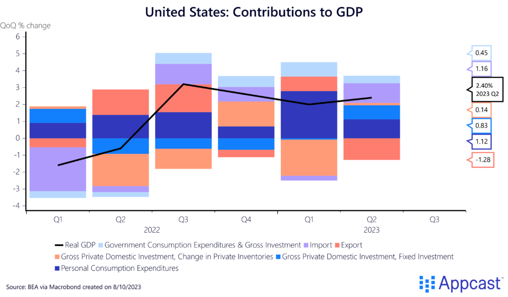

## Table of Contents

## Who is Taylor Swift and why is her economic impact significant?

Taylor Swift is a famous singer and songwriter from the United States. She started her music career when she was very young and became very popular. She sings many different kinds of music like country, pop, and folk. Her songs are loved by people all around the world. She has won many awards for her music, and she is known for writing songs about her own life and feelings.

Taylor Swift's economic impact is significant because she brings a lot of money to the places where she performs. When she goes on tour, many people buy tickets to see her, and this helps the local economy. People also spend money on things like hotels, food, and souvenirs. Her tours can bring millions of dollars to a city. Also, when she releases new music or merchandise, it sells very well, which helps the music and retail industries. Her influence shows how one person's work can affect a big part of the economy.

## How does Taylor Swift's music tours contribute to local economies?

Taylor Swift's music tours help local economies a lot. When she performs in a city, many people come to see her. They buy tickets, which brings money to the place where she is performing. But it's not just the ticket money. Fans also spend money on things like hotels, food, and transportation. This means more business for restaurants, hotels, and shops in the area. All these things add up and help the local economy grow.

Her tours can bring millions of dollars to a city. For example, when she performs, local businesses see more customers. This can create more jobs for people in the city. Also, the money spent by fans can help the city's tax money go up. This extra money can be used to make the city better, like fixing roads or building new parks. So, Taylor Swift's tours are good for the places she visits because they help the economy in many ways.

## What is the estimated economic impact of a single Taylor Swift concert?

A single Taylor Swift concert can bring a lot of money to a city. People from all over come to see her, and they spend money on tickets. But it's not just the ticket money. Fans also spend money on hotels, food, and things like T-shirts and posters. All this spending can add up to millions of dollars for the city where the concert happens.

For example, when Taylor Swift performs, the city sees more business. Restaurants and shops get more customers, and hotels might be full. This extra money can help create jobs and make the city's tax money go up. The city can use this extra money to fix roads or build new parks. So, a Taylor Swift concert is good for the local economy because it helps in many ways.

## How do Taylor Swift's album releases affect the music industry's economy?

When Taylor Swift releases a new album, it's a big deal for the music industry. Her albums sell a lot of copies, which means more money for the music companies. People also listen to her music on streaming services, and this helps those companies make more money too. Her albums often reach the top of the charts, which means more people hear about her music and want to buy it. This can help other artists too, because when people buy Taylor's album, they might also listen to other new music.

Taylor Swift's album releases also help other parts of the music business. When she releases new music, there's a lot of excitement, and this can lead to more people going to concerts and buying merchandise. Stores that sell music and merchandise see more customers, which means more money for them. This extra money can help create jobs in the music industry. So, when Taylor Swift puts out a new album, it's not just good for her, it's good for the whole music industry.

## What role do Taylor Swift's endorsement deals play in the economy?

Taylor Swift's endorsement deals help the economy by making people want to buy the things she promotes. When she says she likes a product, her fans listen and often buy it. This means more sales for the companies she works with. These companies make more money, which can help them grow and hire more people. So, her endorsements can create jobs and help businesses do well.

Her influence also makes other companies want to work with her. They see how much her fans trust her and want to use that to sell their own products. This can lead to more endorsement deals, which means more money for Taylor and the companies. It's a cycle that helps the economy because it keeps money moving and helps businesses grow.

## How does Taylor Swift's influence on social media impact economic trends?

Taylor Swift has a huge following on social media, and what she does online can change what people buy. When she posts about something she likes, a lot of her fans want to buy it too. This can make certain products sell more and even start new trends. For example, if she wears a certain brand of shoes, those shoes might sell out fast. This is good for the companies she talks about because they make more money. It also helps the economy because when people buy more things, it keeps money moving.

Her social media influence can also help smaller businesses. If Taylor Swift shares a post about a small shop or a new product, it can get a lot of attention. This can bring in new customers and help the business grow. More sales mean the business can hire more people or expand. So, her posts can have a big impact on the economy by helping businesses of all sizes do better.

## What are the economic effects of Taylor Swift's philanthropy and charitable contributions?

Taylor Swift's philanthropy and charitable contributions help the economy in many ways. When she gives money to charities, those charities can use it to help people. This can mean giving food to people who are hungry or helping pay for school. When people get this help, they can spend more money on other things they need. This keeps money moving in the economy and can help businesses do better. Her donations can also create jobs at the charities she supports, which means more people have money to spend.

Her charitable work also makes people want to give more. When people see Taylor Swift helping others, they might want to do the same. This can lead to more donations to charities, which helps the economy even more. More money for charities means they can do more good work, like building homes or helping sick people. All this helps the economy because it keeps money flowing and helps people have better lives.

## How does Taylor Swift's presence affect tourism in cities she visits or resides in?

When Taylor Swift visits a city or lives there, it can make more people want to visit that place. Fans from all over the world might come to see where she is. They might want to go to the places she likes or where she has been seen. This can bring a lot of tourists to the city. More tourists mean more money for the city because they spend money on hotels, food, and things to do. This can help the city's economy grow.

Her presence can also make the city more famous. When people hear that Taylor Swift is in a certain place, they might think that city is cool or interesting. This can make more people want to visit, even if they are not her fans. The city can use this fame to attract more tourists and make money from them. So, Taylor Swift's visits or living in a city can be good for tourism and the local economy.

## What is the impact of Taylor Swift's business ventures, such as her record label, on the economy?

Taylor Swift's business ventures, like her record label, help the economy by creating jobs and making money. When she started her own record label, she could make her own music and help other artists too. This means more people working in the music business, like songwriters, producers, and people who help with the business side of things. All these jobs help the economy because people with jobs spend money on things they need, like food and homes.

Her record label also makes money by selling music and merchandise. When people buy Taylor Swift's music or things with her name on them, it helps the record label grow. This can lead to more money for the company, which can be used to help more artists or make new music. When the record label does well, it's good for the whole music industry because it keeps money moving and helps other businesses that work with the label.

## How do Taylor Swift's fanbase demographics influence her economic footprint?

Taylor Swift's fans come from all over the world and are of different ages. A lot of her fans are young people, like teenagers and young adults. They spend money on her music, concert tickets, and things like T-shirts and posters. Because her fans are so many and spread out, she can have a big impact on many places. When she goes on tour, fans from different countries come to see her, which helps the local economy where she performs.

Her fans also spend money on things that are not directly related to her music. For example, if they travel to see her in concert, they might stay in hotels, eat at restaurants, and buy souvenirs. This helps the economy in the cities she visits because more people are spending money there. Also, her fans might buy things she talks about on social media, which can help those companies make more money. So, the variety of her fans helps her have a bigger economic impact.

## What are the long-term economic implications of Taylor Swift's career on the entertainment industry?

Taylor Swift's long career has helped the entertainment industry in big ways. She started out as a country singer and then moved to pop and folk music. This shows how one person can change and grow with the industry. Her music sells a lot, which helps record companies make money. When she goes on tour, she brings in millions of dollars not just for herself but for the whole industry. Other artists and companies see how she does things and learn from her. This makes the entertainment industry stronger and more creative.

Over time, Taylor Swift's influence has also helped other parts of the entertainment world. She has started her own record label, which helps other artists and creates jobs. Her fans are loyal and spend money on her music, concerts, and things she promotes. This keeps money moving in the industry. Her social media presence also helps other businesses because when she talks about something, her fans want to buy it. So, Taylor Swift's career has long-term effects that make the entertainment industry better and more successful.

## How can economic theories and models be applied to analyze Taylor Swift's economic influence?

Economic theories and models can help us understand how Taylor Swift affects the economy. One way is by using the multiplier effect. This idea says that when Taylor Swift performs a concert, the money fans spend on tickets, hotels, and food goes into the local economy. This money then gets spent again by businesses on things like supplies and wages. So, the initial spending by fans leads to even more spending and helps the economy grow. Another way is through consumer behavior theories. Taylor Swift's fans are loyal and often buy what she promotes, which shows how her influence can change what people buy and help businesses sell more.

Another useful model is the concept of brand value. Taylor Swift's name is like a brand, and her fans trust it. When she endorses a product, it can sell more because people want to buy things she likes. This shows how her personal brand can affect the economy by helping companies make more money. Also, the idea of economic impact studies can be used to look at how her tours and album releases bring money into cities and the music industry. These studies can show how her work helps create jobs and makes the economy stronger over time.

## What is Swiftonomics and how can it be understood?

Swiftonomics refers to the economic phenomena associated with the widespread influence of Taylor Swift, particularly highlighting how her activities generate substantial financial impacts on both local and global scales. This concept underscores the magnitude of Swift's influence beyond her music, emphasizing her role as a significant economic driver.

Taylor Swift's Eras Tour is a prime example of Swiftonomics in action, serving as a considerable catalyst for economic activity. The tour not only attracts millions of attendees worldwide but also stimulates massive economic transactions. According to industry reports, concerts of such scale contribute to significant GDP enhancements, akin to those caused by large-scale sporting events like the Super Bowl or the Olympics. These events typically amplify financial turnover due to increased spending in sectors directly and indirectly associated with the main event.

Concert-related spending is a critical component of Swiftonomics. Fans attending the concert engage in various expenditures, including ticket purchases, travel, accommodation, and dining. This spending is not confined to the duration of the concert alone but extends to preparations and post-concert activities. Such spending patterns yield secondary economic benefits, driving increased revenues for nearby businesses such as hotels, restaurants, local shops, and transportation services. The surge in economic activities translates to temporary spikes in employment within the localities of the concerts, contributing to overall economic vitality.

The impact of Swift's concerts on the economy can be likened to that of major sporting events. Studies have shown that events of this nature can contribute significant monetary inflows to local economies, often equating to substantial GDP (Gross Domestic Product) boosts. For instance, an increase in GDP can be modeled using a simple economic impact formula:

$$
\Delta \text{GDP} = \sum (\text{spending}_{\text{direct}} + \text{spending}_{\text{indirect}} + \text{spending}_{\text{induced}})
$$

where $\Delta \text{GDP}$ is the change in GDP, $\text{spending}_{\text{direct}}$ refers to direct concert-related expenditures, $\text{spending}_{\text{indirect}}$ involves expenses on supporting services, and $\text{spending}_{\text{induced}}$ includes further economic activities stimulated by the initial spending.

In conclusion, Swiftonomics encapsulates Taylor Swift's profound economic influence, with her endeavors echoing the financial ripple effects typical of global sporting events. Her strategic initiatives not only elevate local economies but concurrently affirm her status as a pivotal figure in economic discourse, driving substantial contributions akin to recognized global economic stimulators.

## References & Further Reading

[1]: Bergstra, J., Bardenet, R., Bengio, Y., & Kégl, B. (2011). ["Algorithms for Hyper-Parameter Optimization."](https://papers.nips.cc/paper/4443-algorithms-for-hyper-parameter-optimization) Advances in Neural Information Processing Systems 24.

[2]: ["Advances in Financial Machine Learning"](https://www.amazon.com/Advances-Financial-Machine-Learning-Marcos/dp/1119482089) by Marcos Lopez de Prado

[3]: ["Evidence-Based Technical Analysis: Applying the Scientific Method and Statistical Inference to Trading Signals"](https://www.amazon.com/Evidence-Based-Technical-Analysis-Scientific-Statistical/dp/0470008741) by David Aronson

[4]: ["Machine Learning for Algorithmic Trading"](https://github.com/stefan-jansen/machine-learning-for-trading) by Stefan Jansen

[5]: ["Quantitative Trading: How to Build Your Own Algorithmic Trading Business"](https://www.amazon.com/Quantitative-Trading-Build-Algorithmic-Business/dp/1119800064) by Ernest P. Chan