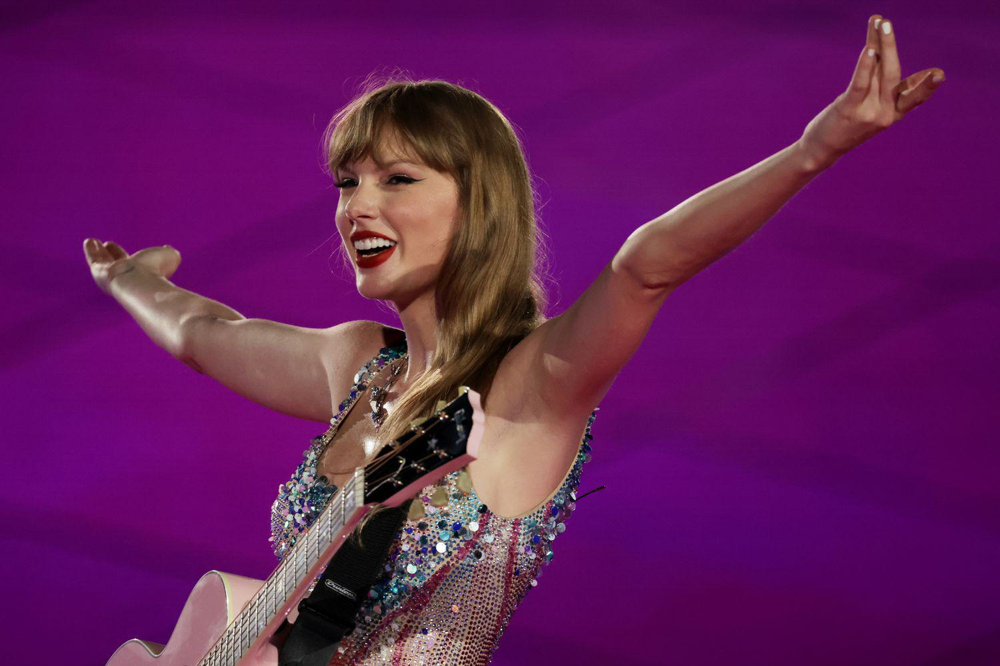

The intersections of music, celebrity influence, and financial markets have become a fascinating area of economic exploration. These three elements converge in unique ways, shaping consumer behaviors and market dynamics. A quintessential example of this convergence is embodied in the phenomenon known as "Swiftonomics," which encapsulates the economic impact of pop icon Taylor Swift. Swift has emerged as a significant economic force, with her influence permeating various sectors and catalyzing substantial economic activity. Her recent tour, the Eras Tour, exemplifies this impact by driving massive local and global spending, akin to the effects of major sporting events on GDP. Such cultural phenomena underline the importance of celebrity influence in contemporary economic landscapes.

While the music industry influences economic activity through concerts and related events, financial markets are increasingly driven by algorithmic trading. This form of trading utilizes complex algorithms and cutting-edge technology to optimize investment strategies and market efficiencies. Algorithmic trading represents a parallel avenue by which financial innovations contribute to the economy, offering insights into how data-driven strategies can amplify market engagement and profitability.

The music industry's unique economic footprint, fueled by celebrity influence, can draw comparisons to trends observed in financial markets. Both domains leverage strategic tactics to maximize reach and financial gain. This convergence poses an intriguing narrative on how entertainment can reflect broader economic strategies and innovations. The dynamic interplay between celebrity-driven economic impact, like that of Taylor Swift, and financial market advances, such as algorithmic trading, sets the stage for understanding their combined role in shaping modern economic paradigms.

## Table of Contents

## Understanding Swiftonomics

Swiftonomics refers to the economic phenomena associated with the widespread influence of Taylor Swift, particularly highlighting how her activities generate substantial financial impacts on both local and global scales. This concept underscores the magnitude of Swift's influence beyond her music, emphasizing her role as a significant economic driver.

Taylor Swift's Eras Tour is a prime example of Swiftonomics in action, serving as a considerable catalyst for economic activity. The tour not only attracts millions of attendees worldwide but also stimulates massive economic transactions. According to industry reports, concerts of such scale contribute to significant GDP enhancements, akin to those caused by large-scale sporting events like the Super Bowl or the Olympics. These events typically amplify financial turnover due to increased spending in sectors directly and indirectly associated with the main event.

Concert-related spending is a critical component of Swiftonomics. Fans attending the concert engage in various expenditures, including ticket purchases, travel, accommodation, and dining. This spending is not confined to the duration of the concert alone but extends to preparations and post-concert activities. Such spending patterns yield secondary economic benefits, driving increased revenues for nearby businesses such as hotels, restaurants, local shops, and transportation services. The surge in economic activities translates to temporary spikes in employment within the localities of the concerts, contributing to overall economic vitality.

The impact of Swift's concerts on the economy can be likened to that of major sporting events. Studies have shown that events of this nature can contribute significant monetary inflows to local economies, often equating to substantial GDP (Gross Domestic Product) boosts. For instance, an increase in GDP can be modeled using a simple economic impact formula:

$$
\Delta \text{GDP} = \sum (\text{spending}_{\text{direct}} + \text{spending}_{\text{indirect}} + \text{spending}_{\text{induced}})
$$

where $\Delta \text{GDP}$ is the change in GDP, $\text{spending}_{\text{direct}}$ refers to direct concert-related expenditures, $\text{spending}_{\text{indirect}}$ involves expenses on supporting services, and $\text{spending}_{\text{induced}}$ includes further economic activities stimulated by the initial spending.

In conclusion, Swiftonomics encapsulates Taylor Swift's profound economic influence, with her endeavors echoing the financial ripple effects typical of global sporting events. Her strategic initiatives not only elevate local economies but concurrently affirm her status as a pivotal figure in economic discourse, driving substantial contributions akin to recognized global economic stimulators.

## The Music Industry's Economic Ripple Effects

Music tours are significant economic ventures that extend their impact beyond the immediate production of concerts, generating substantial cash flows that benefit various sectors. This economic ripple effect begins with direct expenditures related to organizing the tour and extends into local economies, creating a wide range of economic opportunities.

One of the primary ways music tours contribute to economic growth is through the creation of employment and the stimulation of local job markets. Tours require a wide array of professionals, from technical staff handling sound and lighting to logistics coordinators who manage transportation and accommodations. Moreover, the influx of fans to concert venues supports local businesses, notably hotels, restaurants, and retail establishments. A study by Eventbrite highlights that live music venues can see up to a 30% increase in their direct neighborhood business activity ([Eventbrite - Economic Impact of Live Music](https://www.eventbrite.com/blog/live-music-impact-ds00/)).

Additionally, musicians employ strategies to maximize their economic returns through diversified revenue streams. Merchandise sales during tours are one significant aspect, as artists often design exclusive tour-related products that appeal to fans wanting memorabilia. For instance, Taylor Swift’s tours have consistently featured unique merchandise lines that contribute substantially to her revenue. Moreover, the rise of digital platforms has allowed artists to capitalize on media rights. Recording live performances and distributing them through streaming services or as part of deluxe album packages can create lasting revenue beyond the tour's duration.

In maximizing economic impacts, artists often enter into partnerships with local vendors and brands to expand their merchandise offerings, creating mutually beneficial arrangements that enhance local business profiles while boosting merchandise appeal and distribution efficiency. These partnerships can extend into sectors such as fashion, where artists collaborate with local designers for exclusive tour apparel, further embedding the tour’s economic influence into the regional market.

In conclusion, music tours serve as powerful economic engines that not only generate direct cash flows from ticket sales and direct employment but also activate broader economic benefits through local commerce, strategic merchandising, and media ventures. This comprehensive impact underscores the importance of the music industry as a catalyst for economic vitality in both local and global contexts.

## Algorithmic Trading: Parallels and Insights

Algorithmic trading represents a modern and highly effective approach to investment within financial markets. By utilizing computer algorithms to execute trades, this method seeks to optimize investment strategies by capitalizing on market efficiencies and [liquidity](/wiki/liquidity-risk-premium). As these algorithms analyze vast datasets at speeds unattainable by human traders, they can identify trading opportunities and execute them with precision, reducing transaction costs and improving overall portfolio performance.

The parallels between [algorithmic trading](/wiki/algorithmic-trading) and strategies used in music marketing, such as those employed by Taylor Swift, are noteworthy. In both domains, data-driven approaches are critical for achieving wide-reaching influence and optimized outcomes. For example, just as algorithmic trading models analyze historical market data to predict price movements, music marketing teams often leverage consumer data to tailor promotional campaigns and maximize audience engagement. These data-centric tactics enable music marketers to target specific demographics with precision, analogous to how trading algorithms might target specific market conditions for trade execution.

A primary shared goal is the efficient allocation of resources to maximize financial rewards. In trading, this might mean calibrating algorithms to ensure trades are executed at volumes that maintain market stability while maximizing returns. Similarly, in music marketing, resources are allocated to promotional efforts that promise the highest return on investment, such as targeted social media advertising or strategic partnerships. The success of both approaches hinges on the ability to analyze and respond to vast amounts of data, a feat made possible through advancements in technology and computing power.

These data-driven strategies underscore the potential for substantial financial gains. Trading algorithms can take into account statistical patterns, back-testing strategies against historical data to refine their predictive power. Meanwhile, data analytics in music marketing can facilitate an understanding of fan behavior, guiding decisions on concert locations, merchandise offerings, and pricing strategies.

Programming languages like Python are often employed to develop sophisticated algorithms for both fields. A simple Python script for algorithmic trading strategies might use libraries such as NumPy for numerical calculations, Pandas for data manipulation, and scikit-learn for implementing [machine learning](/wiki/machine-learning) models to forecast stock prices. A comparable approach in music marketing could involve leveraging Python's data analysis capabilities to dissect listener trends and inform marketing strategies selectively.

Overall, the intersection of algorithmic strategies in financial markets and music marketing highlights a broader trend towards data-driven decision-making. This trend can lead to optimized performance and significant financial rewards in both the high-stakes environment of trading and the competitive landscape of music industry marketing.

## Linking Celebrity Influence to Financial Outcomes

Taylor Swift's business strategies in the music industry exhibit parallels to maneuvers in financial markets through a blend of branding, diversification, and consumer engagement. Her enterprise includes music sales, tours, merchandise, and media rights, akin to a diversified investment portfolio designed to minimize risk and maximize returns. Swift employs strategic timing in her releases and tour promotions, much like market timing in finance, which involves making buy or sell decisions of financial assets by attempting to predict future market price movements. This skillful navigation of market dynamics exemplifies her entrepreneurial acumen.

Individual influencers like Taylor Swift substantially impact economies, comparable to trading strategies that can trigger significant market movements. Through strategic partnerships and masterful utilization of social media, Swift exerts influence over consumer spending habits. This effect resonates with the [volatility](/wiki/volatility-trading-strategies) seen in stock prices due to large institutional trades or algorithmic trading moves. Swift's economic impact on local communities, often termed the "Swift effect," underscores her ability to single-handedly generate substantial economic inflows, establishing her as a force comparable to a significant market mover.

The concept of 'Funflation' is critical in understanding Swift-driven market phenomena. Funflation refers to consumers willing to spend extravagant amounts for experiences and entertainment despite broader economic constraints. Taylor Swift exemplifies this by setting new benchmarks for concert ticket prices, yet consistently selling out venues—indicative of a robust inelastic demand. This consumer behavior parallels scenarios in financial markets where investors might pay a premium for stocks with strong brand recognition or growth potential, even in uncertain economic conditions.

In summary, Taylor Swift's business strategies produce economic effects analogous to strategic financial maneuvers. Her influence speaks to the broader capacity of cultural figures to shape and drive economic trends. Through understanding these dynamics, we see the intersection of celebrity influence and financial outcomes, revealing a complex interplay of media, markets, and consumer behavior.

## Conclusion

Celebrity influence and algorithmic trading emphasize how personal brands and technological innovation shape economic landscapes. Taylor Swift exemplifies this with her significant "Swiftonomics" effect, influencing various economic sectors. Her tours not only boost ticket sales but also energize local economies, enhancing revenues for adjacent sectors such as hospitality and retail. This mirrors how algorithmic trading revitalizes financial markets by optimizing transactions through technological precision and data analysis. 

Platforms used by musicians for marketing and outreach overlap with strategies in algorithmic trading that utilize data for maximum market impact. Both sectors rely on strategic use of data to create financial value, highlighting a shared pathway between celebrity influence and market economics. 

Looking forward, the potential for cross-industry learning is vast. Music marketing and algorithmic trading can benefit from shared strategies, particularly in data analytics, consumer behavior insights, and market optimization techniques. Imagine a future where celebrity-driven data analytics enhance both tour planning and market prediction, creating a dual benefit for entertainment and finance.

Ultimately, as celebrities like Taylor Swift and innovations in algorithmic trading continue to evolve, they offer insights into broader economic impacts and growth. The influence of personal brands, combined with precision technology, may redefine traditional economic models, creating new avenues for economic expansion and sustainability.

## References & Further Reading

[1]: Bergstra, J., Bardenet, R., Bengio, Y., & Kégl, B. (2011). ["Algorithms for Hyper-Parameter Optimization."](https://papers.nips.cc/paper/4443-algorithms-for-hyper-parameter-optimization) Advances in Neural Information Processing Systems 24.

[2]: ["Advances in Financial Machine Learning"](https://www.amazon.com/Advances-Financial-Machine-Learning-Marcos/dp/1119482089) by Marcos Lopez de Prado

[3]: ["Evidence-Based Technical Analysis: Applying the Scientific Method and Statistical Inference to Trading Signals"](https://www.amazon.com/Evidence-Based-Technical-Analysis-Scientific-Statistical/dp/0470008741) by David Aronson

[4]: ["Machine Learning for Algorithmic Trading"](https://github.com/stefan-jansen/machine-learning-for-trading) by Stefan Jansen

[5]: ["Quantitative Trading: How to Build Your Own Algorithmic Trading Business"](https://www.amazon.com/Quantitative-Trading-Build-Algorithmic-Business/dp/1119800064) by Ernest P. Chan