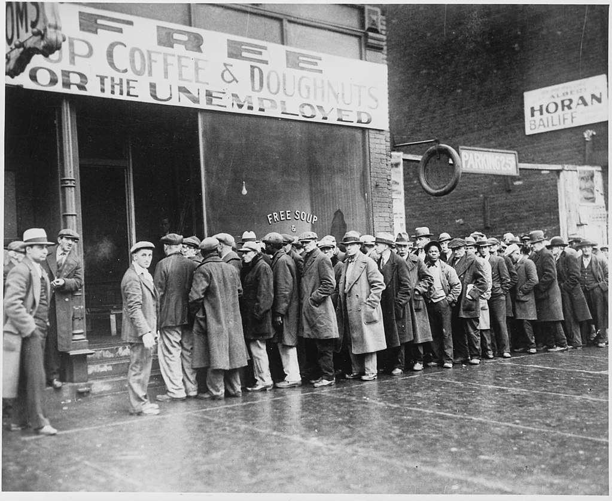

The Great Depression was a profound global economic downturn that began in 1929, marked by the collapse of stock prices on Black Tuesday, October 29, 1929. This event precipitated a decade-long economic crisis that affected economies worldwide. In the United States, the Great Depression led to significant declines in GDP and widespread unemployment. The industrial production fell dramatically, and international trade plummeted, while personal incomes, tax revenues, and profits hit rock bottom. The United States witnessed unprecedented failures in banking, business closures, and farm foreclosures, culminating in severe societal impacts.

In response to the devastating effects of the Great Depression, President Franklin D. Roosevelt implemented the New Deal, a series of federal programs, public work projects, financial reforms, and regulations. Introduced between 1933 and 1939, the New Deal aimed to provide relief for the unemployed and poor, recover the economy to normal levels, and reform the financial system to prevent a repeat of the 1930s depression. Key initiatives under the New Deal included the creation of Social Security, the establishment of new labor rights, and large-scale infrastructure projects that laid the groundwork for future economic growth.



As economies have evolved, so too have the methods of engaging with financial markets. In contemporary times, Algorithmic Trading represents a revolutionary step in market transactions. It involves using complex algorithms to automate and enhance trading decisions, allowing for rapid execution and precise monitoring of market conditions. The integration of machine learning and artificial intelligence in algorithmic trading systems has further refined these strategies, enabling the analysis of large datasets to identify trading opportunities that would be impossible for human traders to spot at the same speed or efficiency.

This article examines the economic repercussions of the Great Depression, explores the reforms introduced by the New Deal, and discusses how modern algorithmic trading has redefined financial markets. By understanding the historical context of economic interventions and the technological transformations in trading processes, we can extract valuable lessons that are pivotal for shaping future economic strategies.

## Table of Contents

## Analyzing the Economic Impact of the Great Depression

The onset of the Great Depression was signaled by the stock market crash known as Black Tuesday, which occurred on October 29, 1929. This catastrophic event led to a drastic loss of confidence in the financial sector, triggering a chain reaction that spread throughout the global economy. In the aftermath, the United States witnessed a significant contraction in its Gross Domestic Product (GDP), with GDP per capita experiencing a sharp decline. Between 1929 and 1933, the GDP fell by approximately 30%, contributing to severe economic dislocation. Unemployment rates soared, peaking at around 25% in 1933, leaving millions without jobs and means of support.

Every sector of the economy felt the repercussions of the Great Depression. Industrial production plummeted by nearly 47%, while international trade fell by over 50% as countries adopted protectionist measures. The agricultural sector was hit particularly hard, with falling prices leading to widespread farm bankruptcies. The deflationary spiral exacerbated the economic situation, as declining prices led to reduced consumer spending, further driving down production and increasing unemployment.

Deflation during this period was marked by a persistent decrease in general price levels, intensifying the economic downturn. With deflation, the real value of debt increased, placing a heavier burden on both households and businesses, which struggled to meet their financial obligations. The lack of [liquidity](/wiki/liquidity-risk-premium) in the financial system led to numerous bank failures, with about 9,000 banks closing their doors by the end of the 1930s.

In summary, the Great Depression was characterized by massive declines in economic output, skyrocketing unemployment, and a pervasive deflationary environment that hindered economic recovery efforts. The impact of the Depression was profound and far-reaching, influencing economic policies and theories for decades to come.

## The New Deal: An Economic Reform

The New Deal, enacted by President Franklin D. Roosevelt, was a comprehensive series of federal programs and reforms implemented primarily between 1933 and 1939 with the goals of providing economic relief, recovery, and reform in response to the Great Depression. One of the most significant aspects of the New Deal was the introduction of Social Security, which was established in 1935 to provide financial assistance to the elderly and unemployed. This landmark legislation laid the foundation for the modern welfare state and marked the federal government's unprecedented commitment to the economic security of individuals.

Another crucial component of the New Deal was the labor rights legislation, which significantly transformed labor relations in the United States. The National Labor Relations Act of 1935, also known as the Wagner Act, guaranteed workers the right to form unions and engage in collective bargaining. This empowered labor forces and led to the growth of union membership, contributing to improved working conditions and fair wages.

The New Deal also included fiscal stimulus through extensive public work projects, aimed at reducing unemployment and stimulating economic activity. The Works Progress Administration (WPA) and the Civilian Conservation Corps (CCC) were among the most notable programs, employing millions of Americans in various public infrastructure projects, such as building roads, schools, and parks. These initiatives not only provided immediate employment opportunities but also contributed to long-term economic development by enhancing the nation's infrastructure.

Despite its ambitious scope, the New Deal's effectiveness has been a topic of ongoing debate among economists. In the short term, the New Deal alleviated some of the economic hardships by providing jobs and stabilizing the banking system. However, its impact on ending the Great Depression remains contested, as the economy did not fully recover until World War II spurred industrial demand.

In the long term, the New Deal fundamentally reshaped the role of the federal government in the economy, leading to a more active and interventionist state. It established regulatory agencies and mechanisms designed to prevent future economic crises, contributing to a more resilient economic system. Nevertheless, critics argue that the New Deal's policies increased government intervention to an unsustainable level and imposed burdensome regulations.

There is a consensus that while the New Deal laid crucial groundwork for economic reform and recovery, its legacy is complex. It highlights the challenges of implementing sweeping economic changes and the importance of adapting policies to attend to both immediate and future economic needs.

## A Transition to Economic Recovery

The New Deal, introduced in the 1930s by President Franklin D. Roosevelt, aimed to recover the U.S. economy from the Great Depression. However, despite its numerous programs and reforms, the New Deal was unable to fully extricate the economy from the depths of the depression. By the late 1930s, the American economy remained sluggish, with unemployment rates still high and economic output below pre-Depression levels.

World War II is credited with providing the definitive boost to the U.S. economy, marking a pivotal transition to economic recovery. The war effort generated unprecedented industrial demand, which resulted in a rapid increase in production and employment. Factories that had been idle or underutilized were reactivated and retooled to produce weapons, vehicles, and other military supplies. This surge in industrial activity drastically reduced unemployment and increased the Gross Domestic Product (GDP).

Economic [statistics](/wiki/bayesian-statistics) from this period underscore the impact of World War II. For instance, GDP grew by approximately 10% annually during the early 1940s, primarily driven by defense spending and production. This demand spurred technological innovations and improved industrial efficiency, laying the groundwork for sustained economic growth in the post-war years.

After the war, the foundation for modern financial systems was established through several key developments. Firstly, the Bretton Woods Conference in 1944 created a new international monetary order, establishing fixed exchange rates and creating the International Monetary Fund (IMF) and the World Bank to promote economic stability and growth. Secondly, the G.I. Bill provided education and housing benefits to returning veterans, stimulating domestic economic development and contributing to the expansion of the middle class. Finally, consumer demand surged as wartime savings were spent on goods and services, further fueling economic growth.

In summary, while the New Deal initiated critical economic reforms, it was the industrial demands of World War II that truly revitalized the American economy. The post-war period saw the establishment of financial systems and international agreements that would stabilize and stimulate economic growth for decades to come.

## Algorithmic Trading: A Modern Economic Force

Algorithmic trading has revolutionized financial markets by significantly enhancing trading speed and efficiency. It employs complex algorithms to automate trading processes, allowing for rapid decision-making and execution. This technological advancement has led to a transformative shift in the way financial transactions are conducted, offering a level of speed and precision that manual trading cannot match.

Advancements in [machine learning](/wiki/machine-learning) and [artificial intelligence](/wiki/ai-artificial-intelligence) (AI) have been at the forefront of this revolution, providing traders with more sophisticated strategies. These technologies enable the analysis of large datasets in real-time, identifying patterns and trends that inform trading decisions. Machine learning models can predict price movements with an impressive degree of accuracy, enabling traders to develop strategies that capitalize on short-term opportunities. For instance, [reinforcement learning](/wiki/reinforcement-learning)—a subset of machine learning—allows trading algorithms to learn and optimize from their results, continuously improving their performance over time. A simple example of a trading strategy using Python might involve using historical price data to predict future trends:

```python
import numpy as np
from sklearn.ensemble import RandomForestRegressor

# Example price data and labels
X = np.array([[1, 2], [2, 3], [3, 4], [4, 5]], dtype=float)
y = np.array([1, 2, 2, 3], dtype=float)

# Train a simple machine learning model
model = RandomForestRegressor(n_estimators=100)
model.fit(X, y)

# Predict the next price
next_price = model.predict([[5, 6]])
print("Predicted price:", next_price)
```

However, while [algorithmic trading](/wiki/algorithmic-trading) increases efficiency, it also introduces challenges, such as exacerbating market [volatility](/wiki/volatility-trading-strategies) and raising concerns about fairness. High-frequency trading, a subset of algorithmic trading, can lead to extreme market fluctuations in a very short time. This increased volatility can destabilize markets, as seen during incidents like the Flash Crash of 2010. During this event, a rapid, deep decline in the U.S. stock market was triggered by algorithmic trades, leading to a temporary and dramatic drop in market indices.

The fairness of algorithmic trading is another point of contention. The significant technological and financial resources required to develop and maintain competitive algorithms can create an uneven playing field, favoring large institutions over individual investors. This disparity raises concerns about equal access and the potential manipulation of markets.

In conclusion, while algorithmic trading delivers substantial benefits in terms of speed and efficiency, it is crucial to address its associated challenges. Balancing innovation with regulation is essential to ensure that the advancements in financial technologies contribute to stable and fair markets.

## Comparing Historical and Modern Economic Interventions

Economic interventions have evolved significantly from the era of the Great Depression and the New Deal to the current age of algorithmic trading. The historical landscape, punctuated by the Great Depression, revealed the acute necessity for active economic interventions to stabilize markets. The New Deal, introduced by Franklin D. Roosevelt in the 1930s, was a landmark series of programs aiming to restore economic stability. These interventions included wide-ranging federal programs that provided economic relief, initiated public work projects, and fostered labor rights, significantly impacting the social and economic fabric of the United States.

In stark contrast, today's financial markets are dominated by technological advancements that provide new mechanisms for market intervention. Algorithmic trading, which involves the use of complex algorithms to automate trading processes, has revolutionized the speed and efficiency of financial markets. This approach not only enhances trading strategies but also increases liquidity and reduces transaction costs. The importance of algorithmic trading is underscored by its ability to analyze vast datasets quickly, a task that manual trading cannot accomplish. The integration of machine learning and artificial intelligence into algorithmic trading systems has further increased their sophistication, allowing for the prediction of market trends with higher accuracy.

While algorithmic trading offers numerous benefits, it also introduces significant challenges. Increased market volatility, such as the infamous "flash crashes," where stock prices plummet rapidly before recovering, highlights the risk of relying on automated systems. Additionally, the fairness of markets is questioned as only entities with substantial technological resources can fully exploit these advanced tools.

Drawing lessons from historical interventions such as the New Deal, modern economic policies must balance innovation with regulation. The unregulated proliferation of advanced technological tools can lead to stability issues similar to those observed during the Great Depression. Consequently, regulators and policymakers face the challenge of ensuring that technological advancements contribute to, rather than detract from, market stability. Regulatory frameworks may include measures such as circuit breakers to halt trading during extreme volatility or requirements for real-time monitoring and compliance checks.

In conclusion, understanding the role of historical economic interventions provides a useful perspective in shaping future strategies. As financial markets continue to evolve with technology, ensuring a judicious mix of innovation and regulation is crucial for maintaining economic stability in a digital age.

## Conclusion

The Great Depression and New Deal remain pivotal historical events, offering valuable economic insights that are still relevant today. The Great Depression, marked by the 1929 stock market crash, triggered extensive economic disruption worldwide, highlighting the vulnerabilities of financial systems. The New Deal, introduced by Franklin D. Roosevelt, showcased a series of strategic interventions aimed at economic relief, recovery, and reform. These interventions, including Social Security and labor rights legislation, have left a lasting legacy on economic policies and institutional frameworks, demonstrating the significance of government action in stabilizing economies during severe downturns.

In contrast, modern financial markets have undergone transformative changes, largely influenced by the rise of algorithmic trading. This technological advancement has significantly increased the speed and efficiency of trading operations, reshaping market dynamics. The integration of machine learning and artificial intelligence has further refined trading strategies, providing market participants with sophisticated tools for decision making. However, these advancements also pose complex challenges, such as heightened market volatility and concerns regarding fairness and transparency.

Drawing lessons from historical economic interventions is crucial for developing future strategies in an era increasingly dominated by technology. The ability to balance innovation with regulation will be essential in maintaining market stability and ensuring equitable economic growth. Understanding past interventions allows policymakers to navigate the complexities of modern economies, adapt to technological advancements, and ensure that financial systems evolve in a manner that supports sustainable development. As technology continues to advance, ongoing evaluation and adaptation of economic policies will remain vital in addressing the challenges and opportunities presented by the ever-changing financial landscape.

## References & Further Reading

[1]: Shlaes, A. (2007). ["The Forgotten Man: A New History of the Great Depression."](https://www.amazon.com/Forgotten-Man-History-Great-Depression/dp/0060936428) HarperCollins.

[2]: Katz, Michael B. (1986). ["In the Shadow of the Poorhouse: A Social History of Welfare in America."](https://www.amazon.com/Shadow-Poorhouse-History-Welfare-Anniversary/dp/0465032109) Basic Books.

[3]: Lo, Andrew W. (2019). ["Adaptive Markets: Financial Evolution at the Speed of Thought."](https://books.google.com/books/about/Adaptive_Markets.html?id=Q4d7DwAAQBAJ) Princeton University Press.

[4]: Mandelbrot, Benoit B.; Hudson, Richard L. (2004). ["The (Mis)Behavior of Markets: A Fractal View of Risk, Ruin, and Reward."](https://searchworks.stanford.edu/view/9081909) Basic Books.

[5]: ["New Deal and Financial Regulation."](https://www.thoughtco.com/top-new-deal-programs-104687) Federal Reserve History.