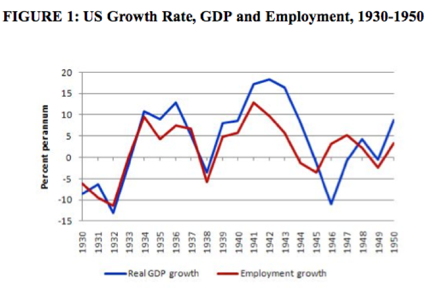

## Table of Contents

## What was the New Deal?

The New Deal was a series of programs and projects started by President Franklin D. Roosevelt in the 1930s. It was created to help the United States recover from the Great Depression, a time when many people were out of work and struggling. The New Deal aimed to provide relief for the poor and unemployed, reform the financial system to prevent future crises, and help the economy recover.

Some of the most famous New Deal programs included the Works Progress Administration (WPA), which provided jobs building roads and public buildings, and the Social Security Act, which set up a system to help elderly and unemployed people. These programs not only helped people get through tough times but also changed the role of the government in the economy. The New Deal showed that the government could take action to improve people's lives during hard times.

## When was the New Deal implemented?

The New Deal was implemented starting in 1933, when Franklin D. Roosevelt became President of the United States. This was right after the Great Depression began, which was a very hard time for many people because they couldn't find jobs and were struggling to get by.

Roosevelt started the New Deal to help people and to fix the economy. He introduced many programs over the years, but the main ones started between 1933 and 1938. These programs helped people find jobs, gave them money if they were old or out of work, and worked to make the economy stronger.

## What were the main goals of the New Deal?

The New Deal had three main goals: relief, recovery, and reform. Relief meant helping people who were suffering right away. During the Great Depression, many people didn't have jobs and were struggling to buy food and pay for a place to live. The New Deal created programs to give people jobs and money to help them through these tough times.

Recovery was about fixing the economy. The Great Depression caused the economy to shrink, and businesses were failing. The New Deal tried to get the economy growing again by starting big projects that created jobs and by helping banks and businesses. This was important because a stronger economy meant more people could find work and support their families.

Reform was about making changes to prevent another depression from happening. The New Deal introduced new rules and systems to make the economy safer. For example, it set up the Social Security system to help people when they got old or lost their jobs. These reforms were meant to protect people and make sure the economy stayed stable in the future.

## How did the New Deal aim to address unemployment?

The New Deal aimed to address unemployment by creating jobs through various programs. One of the biggest programs was the Works Progress Administration (WPA), which hired people to build roads, schools, and other public projects. This gave people work and money to support their families. Another program, the Civilian Conservation Corps (CCC), hired young men to work on projects like planting trees and building parks. These jobs helped many people who were out of work during the Great Depression.

In addition to creating jobs, the New Deal also tried to help people who couldn't find work. The Federal Emergency Relief Administration (FERA) gave money directly to people who needed it. This was important because it provided immediate help to those who were struggling the most. The Social Security Act was another big part of the New Deal. It set up a system to give money to people when they got too old to work or if they lost their jobs. This helped to reduce the fear of being unemployed and gave people a safety net.

## What were some key programs introduced under the New Deal?

The New Deal introduced many important programs to help people during the Great Depression. One key program was the Works Progress Administration (WPA), which gave jobs to millions of people. They worked on building roads, schools, and other public projects. This helped people earn money and support their families. Another important program was the Civilian Conservation Corps (CCC), which hired young men to work on projects like planting trees and building parks. This not only provided jobs but also improved the environment.

The Federal Emergency Relief Administration (FERA) was another big program. It gave money directly to people who were struggling and couldn't find work. This was important because it provided immediate help to those in need. The Social Security Act was also a major part of the New Deal. It set up a system to give money to people when they got too old to work or if they lost their jobs. This helped people feel more secure and provided a safety net for the future.

The Public Works Administration (PWA) focused on large construction projects, like dams and bridges, to help stimulate the economy. The National Recovery Administration (NRA) tried to help businesses by setting rules to stop unfair competition. These programs, along with others, worked together to provide relief, recovery, and reform during a very difficult time in American history.

## How did the New Deal affect the banking sector?

The New Deal had a big impact on the banking sector. One of the first things President Roosevelt did was to declare a "bank holiday," which closed all banks for a short time. This was to stop people from taking all their money out of the banks, which was making the situation worse. After the holiday, the government checked the banks and only let the safe ones open again. This helped people trust banks more and stopped the panic.

The New Deal also created the Federal Deposit Insurance Corporation (FDIC). The FDIC insured people's bank deposits up to a certain amount, which meant if a bank failed, people would still get their money back. This made people feel safer about keeping their money in banks. Another important change was the Glass-Steagall Act, which separated commercial banking from investment banking. This was to prevent banks from taking too many risks with people's money. These changes helped make the banking system more stable and protected people's savings.

## What was the impact of the New Deal on infrastructure development?

The New Deal had a big impact on infrastructure development in the United States. One of the main ways it did this was through the Works Progress Administration (WPA). The WPA hired millions of people to work on building roads, bridges, schools, and other public projects. This not only helped people find jobs during the Great Depression but also improved the country's infrastructure. Many of the roads and buildings we use today were built back then, thanks to the WPA.

Another important part of the New Deal was the Public Works Administration (PWA). The PWA focused on bigger projects, like dams and airports. These projects helped to create jobs and also made the country's infrastructure better. For example, the Hoover Dam, which provides electricity and water, was built with help from the PWA. These projects not only helped during the Great Depression but also had long-lasting benefits for the country's infrastructure.

## How did the New Deal influence labor laws and workers' rights?

The New Deal made big changes to labor laws and workers' rights. One of the most important laws was the National Labor Relations Act, also called the Wagner Act. This law gave workers the right to join unions and to bargain with their bosses for better pay and working conditions. Before the New Deal, many workers were afraid to speak up because they could lose their jobs. The Wagner Act made it safer for them to stand together and fight for their rights.

Another important law was the Fair Labor Standards Act. This law set rules about how many hours people could work and how much they should be paid. It made sure that workers got paid at least a minimum wage and got extra pay if they worked more than 40 hours a week. This helped to stop companies from making people work too long for too little money. These laws from the New Deal made work fairer and safer for many Americans.

## What were the short-term economic effects of the New Deal?

The New Deal had some big effects on the economy right away. It helped a lot of people who were out of work by giving them jobs. Programs like the Works Progress Administration (WPA) and the Civilian Conservation Corps (CCC) hired millions of people to build roads, schools, and parks. This meant more people had money to spend, which helped the economy start to grow again. The New Deal also helped banks by stopping the panic that was making things worse. The government checked the banks and only let the safe ones open again, and the Federal Deposit Insurance Corporation (FDIC) made sure people's money was safe if a bank failed.

But, the New Deal didn't fix everything right away. Even with all the new jobs, unemployment stayed high for a while. Some people thought the New Deal was too slow and that it didn't do enough to help the economy recover quickly. Also, some of the programs were expensive, and not everyone agreed on whether they were the best way to spend money. Still, the New Deal did make a difference by providing help to people who needed it and by starting to rebuild trust in the economy.

## What were the long-term economic impacts of the New Deal?

The New Deal had big long-term effects on the economy. It changed how the government worked with the economy. Before the New Deal, the government didn't do much to help people during hard times. But the New Deal showed that the government could step in to help fix things. It created programs like Social Security, which gave money to people when they got old or lost their jobs. This made people feel more secure and helped keep the economy stable. The New Deal also set up rules for banks and businesses to make them safer and stop another big depression from happening.

Another important long-term effect was on infrastructure. The New Deal built a lot of roads, bridges, and buildings that we still use today. This helped the economy grow because better roads and buildings made it easier for people to work and for businesses to run. The New Deal also helped workers by making labor laws better. Laws like the Fair Labor Standards Act made sure people got paid fairly and didn't have to work too many hours. This made work safer and more fair for everyone. Overall, the New Deal made big changes that helped the economy for many years.

## How did the New Deal affect the national debt?

The New Deal cost a lot of money. To pay for all the new programs and projects, the government had to borrow money. This made the national debt grow a lot during the 1930s. Before the New Deal, the national debt was about $20 billion. By the end of the 1930s, it had grown to over $40 billion. This was a big increase, and some people were worried about how the country would pay it back.

Even though the national debt went up, many people thought the New Deal was worth it. The programs helped a lot of people who were struggling during the Great Depression. They also made the economy stronger and set up systems like Social Security that helped people for many years. So, while the New Deal did increase the national debt, it also had big benefits that many people felt were important.

## What are the criticisms and defenses of the New Deal's economic impact?

Some people criticized the New Deal because they thought it cost too much money and made the national debt grow a lot. They said the government was spending too much and that it wasn't helping the economy recover fast enough. Some also thought that the New Deal made people too dependent on the government and that it didn't really fix the problems that caused the Great Depression. They believed that the economy should be left to fix itself without so much government help.

On the other hand, many people defended the New Deal because they saw how it helped people who were struggling. The programs gave jobs to millions of people and helped them get through the Great Depression. Defenders also pointed out that the New Deal made big changes that helped the economy in the long run, like Social Security and better labor laws. They believed that the government needed to step in to help fix the economy and that the benefits of the New Deal were worth the cost.

## References & Further Reading

[1]: Shlaes, A. (2007). ["The Forgotten Man: A New History of the Great Depression."](https://www.amazon.com/Forgotten-Man-History-Great-Depression/dp/0060936428) HarperCollins.

[2]: Katz, Michael B. (1986). ["In the Shadow of the Poorhouse: A Social History of Welfare in America."](https://www.amazon.com/Shadow-Poorhouse-History-Welfare-Anniversary/dp/0465032109) Basic Books.

[3]: Lo, Andrew W. (2019). ["Adaptive Markets: Financial Evolution at the Speed of Thought."](https://books.google.com/books/about/Adaptive_Markets.html?id=Q4d7DwAAQBAJ) Princeton University Press.

[4]: Mandelbrot, Benoit B.; Hudson, Richard L. (2004). ["The (Mis)Behavior of Markets: A Fractal View of Risk, Ruin, and Reward."](https://searchworks.stanford.edu/view/9081909) Basic Books.

[5]: ["New Deal and Financial Regulation."](https://www.thoughtco.com/top-new-deal-programs-104687) Federal Reserve History.