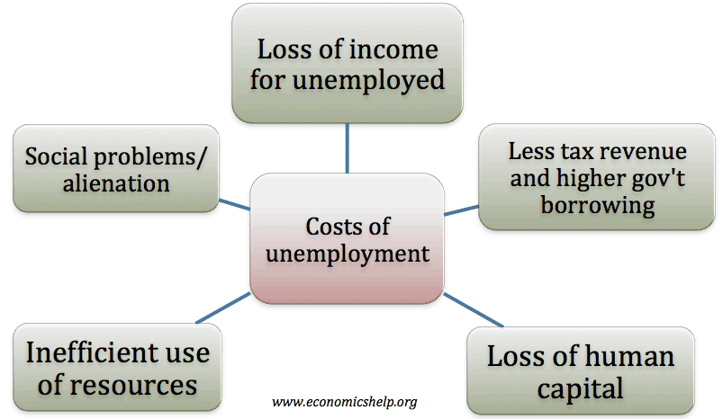

## Table of Contents

## What is unemployment?

Unemployment is when people who want to work cannot find a job. It happens for many reasons, like when there are not enough jobs available or when the economy is not doing well. Sometimes, people might not have the right skills for the jobs that are available, or they might be looking for work in places where jobs are hard to find.

When a lot of people are unemployed, it can cause problems for everyone. It can make it harder for businesses to sell things because people have less money to spend. Governments often try to help by creating programs to train people for new jobs or by helping businesses start up and hire more workers. Understanding unemployment is important because it affects how well a country's economy is doing and how people live their lives.

## How is unemployment measured?

Unemployment is measured by looking at the number of people who are not working but are actively looking for a job. This is usually done through surveys where people are asked if they are employed, unemployed, or not in the labor force. The labor force includes everyone who is either working or looking for work. To find the unemployment rate, you take the number of unemployed people, divide it by the total labor force, and then multiply by 100 to get a percentage.

Different countries might use slightly different ways to measure unemployment, but the basic idea is the same. For example, in the United States, the Bureau of Labor Statistics conducts a monthly survey called the Current Population Survey. They ask a sample of households about their employment status, and from this data, they calculate the national unemployment rate. It's important to have a clear and consistent way to measure unemployment so that we can understand how the job market is changing over time and compare it with other countries.

## What are the different types of unemployment?

There are several types of unemployment, and each type happens for different reasons. One type is frictional unemployment. This happens when people are between jobs or just starting to look for work. It's normal and happens when people move, finish school, or decide to change careers. Another type is structural unemployment. This happens when the skills workers have don't match the jobs available. It can happen when technology changes or when industries move to different places. Cyclical unemployment is another type that happens when the economy is not doing well. During a recession, businesses might not need as many workers, so more people are out of work.

Seasonal unemployment is when jobs are only available at certain times of the year. For example, people who work at ski resorts might not have jobs in the summer. Technological unemployment happens when machines or computers take over jobs that people used to do. This can lead to workers losing their jobs because they are no longer needed. Lastly, there's voluntary unemployment, which happens when people choose not to work, even though they could find a job if they wanted to. Understanding these different types helps us see why people might be out of work and what can be done to help them find jobs.

## What are the immediate economic effects of unemployment?

When unemployment goes up, it can hurt the economy right away. People who don't have jobs don't have money to spend on things they need and want. This means stores and businesses sell less stuff. When businesses sell less, they might make less money and have to cut back on what they do or even close down. This can lead to even more people losing their jobs. Also, when a lot of people are out of work, the government has to spend more money on helping them, like through unemployment benefits. This can make it harder for the government to spend money on other important things.

Unemployment can also make it harder for people who still have jobs. They might feel worried about losing their jobs too, so they might spend less money just to be safe. This can slow down the economy even more. Banks might also be more careful about giving out loans because they're worried people won't be able to pay them back. This means businesses might have a harder time getting the money they need to grow or even stay open. Overall, high unemployment can make the economy weaker and slower, which can lead to more problems for everyone.

## How does unemployment affect consumer spending?

Unemployment makes people worried about money. When someone loses their job, they don't have a regular paycheck coming in. This means they have less money to spend on things they want and need. Even people who still have jobs might start saving more and spending less because they're scared they might lose their jobs too. This can lead to less money going around in the economy, which can hurt businesses.

When a lot of people are not spending money, stores and companies sell fewer things. This can make them lose money, and they might have to cut back on what they do or even close down. If businesses are struggling, they might not hire new workers or might have to let some go. This can make unemployment even worse and start a cycle where less spending leads to more job losses, which then leads to even less spending.

## What impact does unemployment have on government budgets?

When a lot of people are out of work, it can make things hard for the government's budget. The government has to pay for unemployment benefits to help people who lost their jobs. This means the government needs to spend more money. At the same time, when people are not working, they are not paying taxes. So, the government gets less money coming in. This can make it tough for the government to balance its budget and pay for important things like schools, roads, and healthcare.

High unemployment can also mean the government has to spend more money on other programs to help people. For example, the government might need to give more help to people who can't afford food or a place to live. All this extra spending can add up and make the government's budget problems even worse. If the government has to borrow money to cover these costs, it can lead to more debt, which can be a problem for a long time.

## How does long-term unemployment affect the economy?

Long-term unemployment, when people are out of work for a long time, can hurt the economy in big ways. When people don't have jobs for a long time, they might stop looking for work altogether. This means they're not part of the economy anymore, and they're not spending money. Businesses sell less because of this, and it can make the economy slower. Also, when people are out of work for a long time, their skills can get rusty. This makes it harder for them to find new jobs, even when the economy gets better. This can keep unemployment high for a long time and make the economy weaker.

Another big problem with long-term unemployment is that it can make the government's budget worse. The government has to pay for unemployment benefits for a longer time, which costs a lot of money. At the same time, people who are out of work for a long time aren't paying taxes. So, the government gets less money coming in but has to spend more. This can make the government's debt bigger and make it harder for them to pay for important things like schools and roads. In the end, long-term unemployment can keep the economy from growing and make life harder for everyone.

## What are the social costs of unemployment?

Unemployment can hurt people in many ways that are not about money. When someone loses their job, they might feel sad or worried about the future. This can make them feel bad about themselves and even lead to health problems like stress or depression. Families can also have a harder time because they might not have enough money for things like food or a place to live. Kids in these families might not do as well in school because they're worried about their family's problems.

Unemployment can also make problems in the community bigger. When a lot of people don't have jobs, crime might go up because people feel like they have no other choices. This can make the neighborhood less safe and make people not want to live there. Also, when many people are out of work, it can make people feel like they don't trust the government or the economy. This can lead to more anger and fighting in the community. In the end, unemployment doesn't just hurt the people who lose their jobs; it can make life harder for everyone around them too.

## How does unemployment influence inflation and interest rates?

Unemployment can affect inflation in a big way. When a lot of people are out of work, they're not spending as much money. This means there's less demand for things like food, clothes, and other stuff people buy. When demand goes down, prices usually don't go up as fast. So, high unemployment can help keep inflation low. But if unemployment gets too low, and almost everyone has a job, people might start spending more money. This can make demand go up, and prices might start to rise faster, leading to more inflation.

Unemployment also has an effect on interest rates. When unemployment is high, the economy is usually not doing so well. To help the economy grow, the government or central bank might lower interest rates. Lower interest rates make it cheaper for people and businesses to borrow money, which can help them spend more and create more jobs. On the other hand, when unemployment is low and the economy is doing well, the government might raise interest rates to slow things down and keep inflation from getting too high. So, unemployment and interest rates are connected, and changes in one can lead to changes in the other.

## What role do unemployment benefits play in the economy?

Unemployment benefits are important because they help people who lose their jobs. When someone is out of work, these benefits give them money to help pay for things like food and a place to live. This can stop people from feeling too worried or sad because they don't have money. It also helps families stay okay even when someone loses their job. By giving people money when they need it, unemployment benefits make sure that people can keep spending a little bit, which is good for stores and businesses.

Unemployment benefits also help the whole economy. When people get these benefits, they can keep spending money on things they need. This helps keep the economy moving because businesses sell more stuff. It can also stop the economy from getting worse because it keeps some money going around. But, if too many people get benefits for a long time, it can cost the government a lot of money. So, it's a balance between helping people who need it and making sure the government can pay for it.

## How can government policies mitigate the economic impact of unemployment?

Governments can help with unemployment by making new jobs. They can spend money on big projects like building roads or fixing schools. This gives people work and helps the economy grow. Governments can also help people learn new skills through training programs. If someone loses their job because a factory closes, they can learn new skills to work in a different kind of job. This makes it easier for people to find work and can help lower unemployment.

Another way governments can help is by giving money to people who lose their jobs. Unemployment benefits give people money to help them pay for things they need while they look for new work. This keeps people spending a little bit, which is good for businesses. Governments can also make rules easier for businesses to start up or grow. If it's easier for businesses to do well, they might hire more people. By doing these things, governments can help make the economy stronger and reduce the bad effects of unemployment.

## What are the global economic implications of high unemployment rates in major economies?

When big countries like the United States or China have a lot of people out of work, it can affect the whole world. These countries buy and sell a lot of things with other countries. If a lot of people in these big countries are not working, they won't buy as much stuff. This means other countries might sell less to them, which can make their economies weaker too. Also, if big countries are not doing well, they might not invest as much in other countries. This can make it harder for smaller countries to grow and create jobs.

High unemployment in major economies can also make the world's money system less stable. When big countries have a lot of people out of work, their governments might spend more money to help them. This can make their money weaker compared to other countries' money. This can cause problems for everyone because it can make prices go up in other places. Also, if big countries are struggling, they might not help other countries as much. This can make it harder for the whole world to work together to solve big problems like climate change or poverty.

## References & Further Reading

[1]: U.S. Securities and Exchange Commission. (n.d.). [Algorithmic Trading.](https://www.sec.gov/files/Algo_Trading_Report_2020.pdf)

[2]: Bergstra, J., Bardenet, R., Bengio, Y., & Kégl, B. (2011). ["Algorithms for Hyper-Parameter Optimization."](https://dl.acm.org/doi/10.5555/2986459.2986743) Advances in Neural Information Processing Systems 24.

[3]: Lopez de Prado, M. (2018). ["Advances in Financial Machine Learning."](https://www.amazon.com/Advances-Financial-Machine-Learning-Marcos/dp/1119482089) Wiley.

[4]: Jansen, S. (2018). ["Machine Learning for Algorithmic Trading"](https://github.com/stefan-jansen/machine-learning-for-trading). Packt Publishing.

[5]: Chan, E. P. (2008). ["Quantitative Trading: How to Build Your Own Algorithmic Trading Business."](https://github.com/ftvision/quant_trading_echan_book) Wiley.

[6]: Aronson, D. R. (2006). ["Evidence-Based Technical Analysis: Applying the Scientific Method and Statistical Inference to Trading Signals."](https://onlinelibrary.wiley.com/doi/book/10.1002/9781118268315) Wiley.