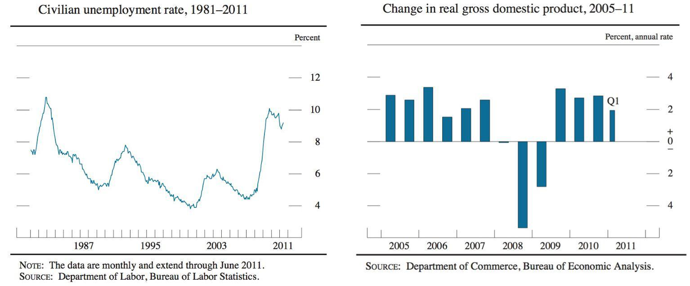

Unemployment is a critical economic indicator that significantly influences the global economy. It reflects the health of labor markets and has direct implications for economic growth, inflation, and societal well-being. High unemployment not only exerts pressure on governmental resources due to increased welfare spending but also diminishes consumer spending power, thereby stymying economic growth. In contrast, full employment fosters robust economic health, supporting sustainable growth and development.

Algorithmic trading, often referred to as algo trading, represents a paradigm shift in financial markets. It involves the use of algorithms to automatically execute trades based on established criteria, transforming the speed, efficiency, and nature of trading activities. Over the past decade, algo trading has proliferated, becoming a fundamental component of modern finance. This rise introduces significant changes not only in how trades are conducted but also in the broader market dynamics of liquidity, volatility, and price discovery.

Understanding the interaction between unemployment rates and algorithmic trading is increasingly essential in comprehending contemporary economic dynamics. As markets evolve, the two factors—unemployment and algo trading—intertwine in complex ways. Changes in market conditions, often influenced by algorithmic activities, can affect business investment decisions, subsequently impacting employment rates. Conversely, labor market conditions may influence investor sentiment and trading strategies, affecting market outcomes.

This article aims to explore the economic impact of unemployment alongside the role of algorithmic trading in the current economic landscape. By examining these elements, we seek to provide insights into how they influence each other and their implications for various stakeholders, including policymakers, investors, and the workforce. This analysis is crucial for crafting informed policies that promote economic resilience and prosperity amid evolving market conditions.

## Table of Contents

## Unemployment: Definition and Causes

Unemployment is defined as the condition where individuals who are both capable and willing to work do not find employment opportunities. This phenomenon can largely be attributed to several underlying causes, including technological advancements, economic recessions, and globalization.

Technological advances often lead to automation and the adoption of new technologies, which can displace certain jobs, rendering specific skills obsolete. This transformation frequently results in structural unemployment, where a mismatch exists between the skills of the workforce and the requirements of the new job positions created by technological progress.

Economic recessions, characterized by a decline in economic activity, commonly lead to a reduction in the demand for goods and services. As a result, companies may downsize or halt hiring, leading to cyclical unemployment. This form of unemployment is usually temporary and linked to the economic cycle, often alleviated when the economy recovers.

Globalization, the process of increased interconnectedness among countries, can lead to shifts in labor markets. While it opens up new opportunities, it also leads to the redistribution of jobs across borders, often causing job losses in sectors that face international competition. This dynamic contributes to both structural and frictional unemployment.

Unemployment can fundamentally be categorized into three primary types:

1. **Structural Unemployment**: Arising from shifts in the economy that alter the structure of industry and the demand for different talents and skills. This type tends to persist as the workforce adapts to changed conditions.

2. **Cyclical Unemployment**: Directly related to the business cycle, this type is prevalent during economic downturns when demand for goods and services decreases, leading to job losses.

3. **Frictional Unemployment**: This temporary form of unemployment occurs as individuals transition between jobs, careers, or geographic locations. It is considered a natural component of a healthy economy as it reflects voluntary mobility.

A comprehensive understanding of these causes is vital for developing effective policies aimed at mitigating unemployment. Policymakers can leverage this understanding to reduce unemployment rates through strategies such as workforce re-skilling, economic stimulus packages, and enhancing social safety nets during economic downturns.

The impact of unemployment extends beyond mere economic parameters. High levels of unemployment can suppress economic growth by reducing consumer spending, one of the primary drivers of economic activity. Additionally, sustained high unemployment can result in inflationary pressures easing due to reduced demand for goods and services. Social stability is also at risk, as prolonged unemployment can exacerbate poverty levels and widen income inequality, posing significant challenges to societal cohesion and wellbeing.

## Economic Impact of Unemployment

Unemployment is a significant [factor](/wiki/factor-investing) influencing economic dynamics, societal wellbeing, and governmental policies. When unemployment rates rise, a cascade of economic consequences typically follows, primarily characterized by reduced consumer spending. When individuals are without work, their disposable income falls, subsequently decreasing their ability to purchase goods and services. This reduction in consumer demand can stifle economic growth as businesses might experience a decline in sales, leading to lower production levels and potentially resulting in further job cuts—a phenomenon that can exacerbate economic downturns.

Moreover, elevated unemployment rates place additional pressure on government resources. During such periods, governments often increase spending on social services and welfare programs to support unemployed individuals. This increased fiscal burden can lead to higher budget deficits and might necessitate adjustments in other areas of public spending or borrowing, impacting overall economic stability.

The social implications of unemployment extend to heightened poverty levels and increased inequality. As income sources diminish, affected individuals and families may face financial insecurity, contributing to a rise in poverty. The gap between different socio-economic groups can widen, potentially leading to social unrest and challenges in maintaining social cohesion.

Long-term unemployment poses a particular threat to the economy by eroding workforce skills. When individuals remain unemployed for extended periods, they risk skill depreciation, making it more challenging to secure future employment. This skill loss can lead to a mismatch in the labor market, where available jobs do not align with the skillset of the unemployed workforce, thereby reducing overall productivity and economic potential.

Understanding these impacts is crucial for formulating effective economic and employment policies. Policymakers must consider interventions that can stimulate job creation, enhance workforce skills, and support affected individuals to maintain economic stability and growth. By analyzing unemployment's ramifications, governments can implement targeted measures to mitigate its negative effects, such as investing in job training programs, offering incentives for businesses to hire, and carefully managing public resources to support both economic and social welfare.

 to Algorithmic Trading

Algorithmic trading, commonly referred to as algo trading, employs computer algorithms to execute trading decisions with minimal human intervention. These algorithms follow predefined execution rules, leveraging a variety of parameters such as timing, price, and quantity to optimize trading strategies. By mechanizing the trading process, algo trading intends to enhance efficiency and reduce the cognitive burden on human traders.

One of the primary advantages of [algorithmic trading](/wiki/algorithmic-trading) is its ability to significantly increase trading speed. Algorithms can process complex datasets and execute trades in fractions of a second, a feat unattainable through traditional manual trading methods. This high-speed processing capability allows traders to capitalize on fleeting market opportunities.

In addition to speed, algo trading enhances efficiency by reducing transaction costs and minimizing the slippage between the expected and actual trade prices. Through precise algorithmic execution, traders can achieve more consistent results, improving overall portfolio performance. Algo trading also diminishes the likelihood of human errors, such as those caused by emotional biases or fatigue, which can adversely impact trading outcomes.

Over the last decade, the adoption of algorithmic trading has grown dramatically, driven by advancements in technology and the liberalization of financial markets. This growth has solidified its position as a crucial component of modern finance. Large institutional investors, hedge funds, and even retail traders increasingly incorporate algorithmic strategies to gain a competitive edge.

However, the nature of algorithmic trading can both positively and negatively influence market behaviors. For instance, algorithms contribute to greater market [liquidity](/wiki/liquidity-risk-premium) by providing constant buy and sell orders, which can narrow bid-ask spreads and facilitate smoother market functioning. On the other hand, certain high-frequency trading strategies, a subset of algo trading, have been linked to increased market [volatility](/wiki/volatility-trading-strategies), potentially leading to rapid and significant price fluctuations. An example is the 2010 Flash Crash in the United States, where algorithmic trading was implicated in the acceleration of a market downturn.

Price formation in financial markets is also affected by algorithmic trading, which rapidly assimilates information and reflects it in asset prices. This can lead to more efficient markets, where prices quickly adjust to new information. However, the presence of sophisticated algorithms can obscure true price discovery if these algorithms react to artificially generated signals rather than fundamental market data.

Understanding the mechanics and effects of algorithmic trading is crucial for both individual investors and regulatory bodies. Investors must recognize the benefits and risks associated with algorithmic strategies, while regulators face the challenge of overseeing these technologies to ensure market stability and integrity. As algorithmic trading continues to evolve, it remains an essential aspect of the financial landscape, requiring ongoing attention to its developmental and regulatory aspects.

## Interplay Between Unemployment and Algo Trading

Algorithmic trading, a method of executing orders using automated and pre-programmed trading instructions, has grown rapidly in recent years and now plays a substantial role in financial markets. This growth holds various implications for economic stability and, subsequently, unemployment rates.

One key aspect is the impact of market volatility driven by algorithmic trading on businesses' investment decisions and hiring practices. High-frequency and algorithmic trading can sometimes lead to significant price fluctuations within short timeframes. Such volatility can create an uncertain business environment, potentially influencing firms to delay capital investments and hiring processes, affecting employment rates. Businesses generally prefer stable economic conditions to commit to long-term investments and labor contracts. Sudden market movements may lead firms to adopt a more cautious approach, refraining from expanding their workforce.

Moreover, trading algorithms can induce economic shifts that reverberate across job markets. By altering liquidity and price formation, algorithmic trading could influence monetary policy and interest rates indirectly. These changes may, in turn, affect borrowing costs for businesses, with potential implications for their growth strategies and workforce expansion plans. Employment rates might fluctuate as companies adjust their strategies in response to trading-induced economic transformations.

Another significant concern is the role algo trading might play during economic crises. Past financial events, such as the Flash Crash of 2010, demonstrate how rapid, algorithm-driven trading can exacerbate crises. During economic downturns, heightened market instability can amplify financial uncertainty, worsening unemployment as companies react to unpredictable market conditions by downsizing or freezing hiring.

Policymakers need to comprehend these dynamics to better address potential labor market side effects. By understanding how algorithmic trading influences economic and employment conditions, regulators can develop more informed, nuanced policies aimed at mitigating adverse impacts on unemployment. Implementing corrective measures, such as circuit breakers to prevent excessive volatility or increasing transparency in trading activities, may enhance market stability. Balancing the need for market efficiency and integrity with the safeguarding of employment rates is essential for maintaining economic resilience in the face of growing algorithmic trading activities.

## Mitigating Negative Impacts on the Economy

Effective regulation of algorithmic trading (algo trading) is a crucial step towards mitigating market volatility and enhancing overall economic stability. Regulation can help control the speed and [volume](/wiki/volume-trading-strategy) of transactions executed by algorithms, thereby reducing the risk of abrupt market movements. For instance, measures such as implementing circuit breakers or imposing trading limits during periods of high volatility can prevent flash crashes. Regulatory bodies can also mandate transparency in algorithmic strategies to ensure a fair and stable trading environment. The U.S. Securities and Exchange Commission (SEC) and other regulatory authorities globally have been exploring these regulatory frameworks to better oversee algo trading activities [1].

Beyond regulating algo trading, fostering innovation in employment is essential to counteract the impacts of unemployment. Policymakers can encourage the creation of jobs in emerging industries by providing incentives for research and development and supporting start-up ecosystems. This can help integrate displaced workers into new sectors by promoting entrepreneurial ventures and growth in technology-driven markets.

Investments in education and skill development are imperative for preparing the workforce of the future. As technology evolves, the demand for new skills escalates. Providing access to quality education and vocational training programs can equip workers with the necessary skills to meet these evolving job requirements. For instance, integrating computer science, data analysis, and [machine learning](/wiki/machine-learning) concepts into curricula can help bridge the skills gap in the technology sector.

Collaborative efforts between governments, businesses, and educational institutions are vital to nurture a resilient workforce. Governments can establish partnerships with industries to align educational programs with market needs, ensuring that graduates possess relevant skills. Businesses can invest in employee development programs, and education providers can continually update [course](/wiki/best-algorithmic-trading-courses) offerings to match industry trends.

Finally, continuous monitoring and adaptation of economic strategies are crucial in addressing the changing dynamics of the labor market and financial systems. By leveraging data analytics and forecasting models, policymakers can track employment trends and anticipate future shifts. This proactive approach allows for timely adjustments in economic policies to optimize economic growth while maintaining employment stability.

Implementing these strategies requires a multifaceted approach, but it is essential for addressing the intertwined challenges of unemployment and the influence of algo trading on market stability.

**References:**

1. U.S. Securities and Exchange Commission. (n.d.). Algorithmic Trading. Retrieved from [www.sec.gov](https://www.sec.gov)

## Conclusion

Unemployment and algorithmic trading are critical components that significantly influence the contemporary economy. Unemployment presents numerous challenges, prominently by reducing consumer spending, which can impede economic growth and exacerbate social inequalities. When a significant portion of the workforce is unable to find employment, it strains government resources due to increased demand for social services and welfare programs. This situation can also lead to long-term skill erosion, diminishing future workforce productivity.

Conversely, the emergence and growth of algorithmic trading introduce both opportunities and risks to financial markets and economic structures. On one hand, algorithmic trading enables more efficient and faster trading processes, enhances market liquidity, and minimizes human error, offering new avenues for financial gains. However, it also brings potential risks, such as increased market volatility and the potential for rapid, large-scale market shifts that may destabilize financial systems and indirectly influence employment rates.

Balancing economic growth with employment stability is critical for ensuring a robust and dynamic economy. As unemployment and algo trading are interconnected, future economic policies must be adaptable. Policymakers should consider both the direct and indirect effects that these elements have on economic structures and labor markets. 

A deep understanding of the interaction between unemployment and algorithmic trading will aid in crafting comprehensive solutions aimed at fostering economic resilience and prosperity. By integrating innovative regulatory approaches for algorithmic trading and proactive employment strategies, such as investments in education and skills development, nations can better prepare their economies and workforces for the evolving challenges and opportunities presented by these pivotal elements.

## References & Further Reading

[1]: U.S. Securities and Exchange Commission. (n.d.). [Algorithmic Trading.](https://www.sec.gov/files/Algo_Trading_Report_2020.pdf)

[2]: Bergstra, J., Bardenet, R., Bengio, Y., & Kégl, B. (2011). ["Algorithms for Hyper-Parameter Optimization."](https://dl.acm.org/doi/10.5555/2986459.2986743) Advances in Neural Information Processing Systems 24.

[3]: Lopez de Prado, M. (2018). ["Advances in Financial Machine Learning."](https://www.amazon.com/Advances-Financial-Machine-Learning-Marcos/dp/1119482089) Wiley.

[4]: Jansen, S. (2018). ["Machine Learning for Algorithmic Trading"](https://github.com/stefan-jansen/machine-learning-for-trading). Packt Publishing.

[5]: Chan, E. P. (2008). ["Quantitative Trading: How to Build Your Own Algorithmic Trading Business."](https://github.com/ftvision/quant_trading_echan_book) Wiley.

[6]: Aronson, D. R. (2006). ["Evidence-Based Technical Analysis: Applying the Scientific Method and Statistical Inference to Trading Signals."](https://onlinelibrary.wiley.com/doi/book/10.1002/9781118268315) Wiley.