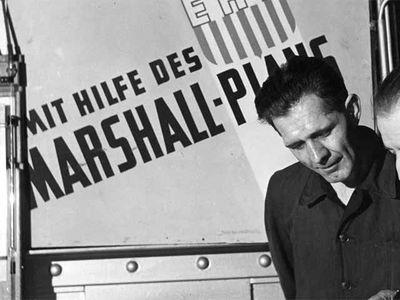

## Table of Contents

## What was the overall economic impact of World War II on the global economy?

World War II had a huge impact on the global economy. Before the war, many countries were struggling because of the Great Depression. The war created a lot of jobs, especially in countries like the United States, because they needed to make weapons and supplies for the war. This helped to end the Great Depression in these countries. However, the war also destroyed a lot of cities and factories, especially in Europe and Asia. This meant that after the war, these countries had to spend a lot of money to rebuild.

After the war, the world's economy changed a lot. The United States became the strongest economy because it was not damaged by the war and it helped other countries rebuild. Countries in Europe and Asia needed to borrow money and get help from the United States to rebuild their economies. This led to a new world order where the United States had a lot of power. Also, the war led to the start of the Cold War between the United States and the Soviet Union, which affected the global economy for many years. Overall, World War II changed the way countries worked together economically and politically.

## How did World War II affect the economies of the major powers involved?

World War II had different effects on the economies of the major powers involved. For the United States, the war helped end the Great Depression. The government spent a lot of money on the war, which created many jobs. Factories started making weapons and supplies instead of cars and other goods. This made the economy grow fast. By the end of the war, the United States had the strongest economy in the world because it was not damaged by fighting.

For countries like Germany, Japan, and many in Europe, the war was very bad for their economies. These countries were bombed and many cities and factories were destroyed. After the war, they had to spend a lot of money to rebuild. Germany and Japan, for example, had to start almost from nothing. They got help from the United States, which gave them money and resources. Over time, these countries were able to rebuild and their economies grew strong again, but it took many years.

The Soviet Union also faced big challenges. It lost many people and a lot of its land was destroyed. The government had to spend a lot to rebuild, but it did not get as much help from other countries. The Soviet Union's economy grew after the war, but it was always behind the United States. The war changed the balance of power in the world, with the United States and the Soviet Union becoming the two superpowers, and this affected their economies for many years.

## What were the immediate economic effects of World War II on different countries?

The immediate economic effects of World War II varied greatly depending on the country. For the United States, the war effort led to a booming economy. The government spent a lot of money on the war, which created jobs and helped end the Great Depression. Factories switched from making cars to making weapons and supplies, leading to high employment and economic growth. By the end of the war, the United States had the strongest economy in the world because it was not damaged by fighting.

In contrast, countries like Germany, Japan, and many in Europe faced severe economic challenges immediately after the war. These countries were bombed and their cities and factories were destroyed. This meant they had to spend a lot of money to rebuild. Germany and Japan, in particular, had to start almost from scratch. They received help from the United States through programs like the Marshall Plan, which provided money and resources to help them rebuild. However, it took many years for these countries to recover economically.

The Soviet Union also suffered greatly from the war. It lost millions of people and much of its land was destroyed. The government had to spend a lot to rebuild, but it did not receive as much help from other countries as Western Europe did. The Soviet Union's economy did grow after the war, but it was always behind the United States. The war changed the balance of power in the world, with the United States and the Soviet Union becoming the two superpowers, and this affected their economies for many years.

## How did World War II influence global trade patterns?

World War II changed how countries traded with each other. Before the war, many countries traded with each other a lot, but the war made trade difficult. Countries could not trade as much because ships were used for the war, not for carrying goods. Also, many countries were fighting each other, so they stopped trading with their enemies. After the war, countries had to rebuild, and they needed to trade to get the things they needed. The United States helped a lot with trade because it had a strong economy and it gave money and resources to other countries to help them rebuild.

After the war, new trade patterns started to form. The United States became a big leader in trade because it was not damaged by the war and it had a lot of resources. Many countries in Europe and Asia needed to trade with the United States to get the things they needed to rebuild. This made the United States very important in global trade. Also, the war led to the start of the Cold War between the United States and the Soviet Union. This affected trade because countries had to choose sides, and this changed who they traded with. Overall, World War II changed the way countries traded with each other and made new trade patterns that lasted for many years.

## What role did wartime production play in shaping post-war economies?

Wartime production during World War II played a big role in shaping the economies of countries after the war. In the United States, making weapons and supplies for the war helped end the Great Depression. Factories that used to make cars started making tanks and planes instead. This created a lot of jobs and made the economy grow fast. After the war, the United States had a strong economy because it was not damaged by fighting. This helped the United States become a leader in the world economy and in global trade.

In countries like Germany and Japan, wartime production also changed their economies, but in a different way. These countries were bombed and many factories were destroyed. After the war, they had to rebuild everything. The United States helped them by giving money and resources. Over time, these countries were able to rebuild their economies and start making things again. Wartime production showed them how to make things quickly and efficiently, which helped them grow their economies after the war. Overall, wartime production during World War II set the stage for how economies would grow and change after the war.

## How did the war lead to changes in economic policies and systems worldwide?

World War II led to big changes in economic policies and systems around the world. Before the war, many countries were dealing with the Great Depression and did not have a lot of money. The war made countries spend a lot on weapons and supplies, which meant they had to change their economic policies. Governments started to control more of the economy to make sure they had enough for the war. This was called a command economy, where the government decided what to make and how much. After the war, many countries kept some of these controls because they helped with rebuilding. The United States, for example, used its strong economy to help other countries rebuild through programs like the Marshall Plan, which gave money and resources to Europe.

The war also led to the start of new economic systems. In Europe and Asia, countries had to rebuild their economies from almost nothing. They needed to find new ways to grow their economies fast. This led to new economic policies that focused on making things quickly and efficiently. In the Soviet Union, the war made the government control the economy even more, leading to a strong command economy. In Western countries, the war showed that the government could play a big role in the economy to help people and businesses. This led to the start of welfare states, where governments helped people with things like healthcare and education. Overall, World War II changed how countries thought about their economies and led to new economic policies and systems that lasted for many years.

## What were the long-term economic consequences of World War II for developed nations?

World War II had big long-term effects on the economies of developed nations. For the United States, the war helped its economy grow a lot. The country was not damaged by fighting, so it could keep making things and trading with other countries. This made the United States a leader in the world economy. The war also showed that the government could help the economy grow by spending money on things like roads and schools. This led to new economic policies that helped people have better lives.

For countries like Germany and Japan, the war was hard on their economies at first. Their cities and factories were destroyed, so they had to start over. The United States helped them rebuild by giving money and resources. Over time, these countries were able to grow their economies again. They learned to make things quickly and well, which helped them become strong economies. The war also changed how these countries thought about their economies. They started to focus more on helping people and making sure everyone could have a good life.

The Soviet Union also felt the long-term effects of the war. It lost a lot of people and its land was destroyed. The government had to spend a lot to rebuild, but it did not get as much help from other countries as Western Europe did. The Soviet Union's economy grew after the war, but it was always behind the United States. The war made the Soviet Union control its economy even more, which led to a strong command economy. This affected how the Soviet Union worked with other countries and how its people lived for many years.

## How did World War II contribute to the economic development of the United States?

World War II helped the United States' economy grow a lot. Before the war, the country was struggling because of the Great Depression. Many people did not have jobs. But when the war started, the government spent a lot of money on making weapons and supplies. This created many jobs and helped end the Great Depression. Factories that used to make cars started making tanks and planes instead. This made the economy grow fast. By the end of the war, the United States had the strongest economy in the world because it was not damaged by fighting.

After the war, the United States kept growing its economy. It helped other countries rebuild by giving them money and resources through programs like the Marshall Plan. This made the United States very important in global trade. The war also showed that the government could help the economy by spending money on things like roads and schools. This led to new economic policies that helped people have better lives. Overall, World War II made the United States a leader in the world economy and changed how the country thought about helping its people.

## In what ways did the war affect the economic recovery of Europe and Japan?

World War II made it hard for Europe and Japan to recover their economies. The war destroyed many cities and factories in these countries. After the war, they had to spend a lot of money and time to rebuild everything. Germany and Japan, for example, had to start almost from nothing. They got help from the United States, which gave them money and resources through programs like the Marshall Plan. This help was very important because it let them rebuild their economies faster. Without this help, it would have taken much longer for them to recover.

Over time, Europe and Japan were able to grow their economies again. They learned to make things quickly and well, which helped them become strong economies. The war also changed how these countries thought about their economies. They started to focus more on helping people and making sure everyone could have a good life. This led to new economic policies that helped them grow and stay strong. The war showed that even after big problems, countries could recover and become strong again if they got help and worked hard.

## How did World War II impact the economies of colonized and decolonizing countries?

World War II had a big impact on the economies of countries that were colonies or were becoming independent. During the war, many colonized countries had to give resources and soldiers to help the countries that controlled them. This made it hard for them to grow their own economies because they were focused on helping others. After the war, many of these countries started to become independent. They had to build their own economies from scratch, which was very hard. They did not have a lot of money or resources, and they had to find new ways to make things and trade with other countries.

The war also changed how these countries thought about their economies. Many of them wanted to grow fast and help their people have better lives. They started to make new economic policies that focused on making things quickly and well. Some countries got help from other countries, like the United States, which gave them money and resources to help them grow. Over time, these countries were able to build strong economies, but it took a lot of hard work and time. The war showed that even after big problems, countries could recover and become strong if they got help and worked hard.

## What were the effects of World War II on global financial systems and institutions?

World War II changed how money worked around the world. Before the war, countries used gold to back their money, but the war made them spend a lot of money they did not have. After the war, countries met at a place called Bretton Woods to make new rules for money. They decided to use the U.S. dollar as the main money for the world, and they made new groups like the International Monetary Fund (IMF) and the World Bank to help countries with their money problems. These new rules and groups helped countries work together better and made the world's money system more stable.

The war also made countries think about how to help each other more. The United States gave a lot of money to Europe and other countries to help them rebuild after the war. This was called the Marshall Plan. It helped these countries grow their economies again and made the United States very important in the world's money system. The war showed that countries needed to work together to make their economies strong. This led to more trade and more help between countries, which changed how the world's money system worked for many years.

## How did the economic strategies implemented during and after World War II influence modern economic theories and practices?

World War II made countries think differently about their economies. During the war, governments had to control more of the economy to make sure they had enough for the war. This was called a command economy, where the government decided what to make and how much. After the war, many countries kept some of these controls because they helped with rebuilding. The United States, for example, used its strong economy to help other countries rebuild through programs like the Marshall Plan. This showed that government spending could help grow the economy, which is an idea that is still important in modern economic theories. Economists today often talk about how governments can help the economy by spending on things like roads and schools.

The war also led to new ways of thinking about trade and money. Countries met at Bretton Woods to make new rules for the world's money system. They decided to use the U.S. dollar as the main money for the world and created groups like the International Monetary Fund (IMF) and the World Bank to help countries with their money problems. These new rules and groups helped countries work together better and made the world's money system more stable. This idea of working together and helping each other is still important in modern economic practices. Today, countries often work together through groups like the World Trade Organization (WTO) to make trade easier and help their economies grow.

## References & Further Reading

[1]: Milward, A. S. (1984). *The Reconstruction of Western Europe, 1945-51.* Methuen Publishing.

[2]: Funk, Pierre, Masamichi Kanno, and Jennifer B. Sheefel. "Evolution of the International Monetary Fund and the World Bank Multilateral Policy Coordination, 1970–2005: Survey and Analysis." *IMF Working Papers*, 2005.

[3]: Hogan, Michael J. *The Marshall Plan: America, Britain and the Reconstruction of Western Europe, 1947-1952.* Cambridge University Press, 1989.

[4]: *The Rise of Financial Markets: Globalization and the Role of Information Technology* (Book Chapter). In: Allen, F., Nowak, E., & Tirole, J. (Eds.), *Economic Transition in Central and Eastern Europe: Planting the Seeds.* Palgrave Macmillan.

[5]: Goldin, Claudia, and Lawrence F. Katz. *The Race Between Education and Technology.* Harvard University Press, 2008.