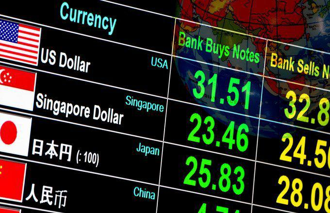

The global economic climate today is characterized by significant volatility and rapid changes influenced by a multitude of factors including geopolitical tensions, technological advancements, and shifting consumer preferences. One of the key elements in this dynamic environment is the currency market, where the valuation of national currencies plays a crucial role in shaping economic policies and influencing international trade.

A 'strong dollar', a term often used to describe the relative high value of the U.S. dollar compared to other currencies, has far-reaching implications. The strength of the dollar is determined by a variety of metrics, including exchange rates against other world currencies and purchasing power parity. A strong dollar often signifies confidence in the U.S. economy, attracting foreign investments and impacting global trade balances. It affects the cost competitiveness of exports, the value of foreign earnings for multinational companies, and the dynamics of emerging market economies that hold large amounts of dollar-denominated debt.



Currency valuation is critical in understanding these dynamics. It involves assessing a currency's strength through indicators like interest rates, inflation, and economic growth. A higher currency value can signal economic health but also poses challenges such as competitive disadvantage for exports. Algorithmic trading, increasingly prevalent in currency markets, involves the use of complex mathematical models and algorithms to trade currencies. These automated systems can quickly process vast amounts of data, allowing for more efficient and strategic decision-making in response to currency fluctuations.

This article examines these intersecting dynamics, aiming to provide a comprehensive analysis of the impacts of a strong dollar, the nuances of currency valuation, and the role of algorithmic trading. Understanding these facets is paramount for investors and policymakers who must navigate the complexities of global financial markets. By exploring these topics, this article highlights the importance of considering multiple economic indicators and technological tools in crafting informed economic policies and investment strategies.

## Table of Contents

## Understanding the Strong Dollar

The concept of a 'strong dollar' refers to the relative value of the U.S. dollar against other currencies. It is primarily determined using various metrics, such as exchange rates, purchasing power parity (PPP), and the U.S. Dollar Index (DXY). The DXY measures the dollar's strength against a basket of foreign currencies, including the Euro, Japanese Yen, British Pound, Canadian Dollar, Swedish Krona, and Swiss Franc. A rising DXY index indicates a strengthening dollar.

Historically, the U.S. dollar has experienced fluctuating strength due to various factors. Key contributors to its current strength include a robust U.S. economy, high-interest rates set by the Federal Reserve, and geopolitical uncertainties that encourage investors to seek the dollar as a safe haven. For example, during times of global economic volatility, investors often regard the dollar as a stable asset, driving up its value.

A strong dollar impacts global trade and economics significantly. For the United States, it makes imports cheaper, benefiting consumers and businesses that rely on foreign goods. However, it also results in U.S. exports becoming more expensive for foreign buyers, potentially widening the trade deficit. This scenario can adversely affect domestic manufacturing and agriculture sectors reliant on exports. On a global scale, countries with significant dollar-denominated debt may face increased financial burdens as their local currencies weaken against the dollar, exacerbating economic stability concerns.

Several key economic indicators are influenced by dollar valuation. Inflation rates, for instance, are affected as a strong dollar typically keeps import prices low, exerting downward pressure on inflation. Conversely, high dollar value can lead to decreased competitiveness for U.S. businesses abroad, impacting GDP growth. Interest rates are another critical indicator, with central banks potentially adjusting rates to manage economic growth and currency valuation dynamics. Therefore, understanding the intricacies of a strong dollar is essential for investors and policymakers aiming to navigate the complexities of global financial markets.

## Economic Impact of a Strong Dollar

A strong U.S. dollar can significantly influence various facets of the global and domestic economy. One primary effect of a strong dollar is its impact on U.S. exports and the trade balance. When the dollar appreciates against other currencies, U.S. goods and services become relatively more expensive for foreign buyers. This can lead to a decrease in exports as American products are less competitively priced in the global market. Consequently, the trade balance may shift towards a deficit, as the value of imports, now cheaper for U.S. purchasers, might increase.

Furthermore, a strong dollar can adversely affect emerging markets and global financial stability. Many emerging market economies have debt denominated in U.S. dollars. As the dollar strengthens, the cost of servicing and repaying these debts in local currencies increases, potentially leading to financial strain and decreased fiscal stability. This situation is exacerbated if these countries rely on exports, as their goods become less competitive in the U.S. market, further diminishing their income.

Domestically, the implications of a strong dollar extend to inflation and interest rates. A robust dollar can help keep inflation in check by reducing the cost of imports, thus dampening price increases for consumer goods. However, this may influence the Federal Reserve's monetary policy decisions regarding interest rates. Typically, lower inflation might lead to lower interest rates to stimulate economic activity, but the broader economic context and the health of other sectors are crucial considerations.

Multinational corporations and businesses are also impacted by a strong dollar. U.S. firms with substantial international operations may face reduced profits when foreign earnings are converted back to dollars. These exchange rate effects can lead to decreased competitiveness globally, impacting revenue streams and possibly leading to strategic shifts such as cost-cutting measures or restructuring of international operations to mitigate currency risks.

Overall, the dynamics introduced by a strong dollar necessitate careful consideration and adjustment from investors, policymakers, and multinational enterprises to navigate the associated economic impacts and financial challenges effectively.

## Role of Currency Valuation in Global Economics

Currency valuation plays a pivotal role in global economics by determining the relative value of one nation's currency compared to another's. This valuation is central to how economies interact on the global stage, influencing trade, investments, and diplomatic relations. 

### Methods to Evaluate Currency Strength and Value
Several methods are employed to evaluate currency strength and value. One common method is the **exchange rate**, which measures the value of a currency in terms of another currency. Exchange rates can be determined by the foreign exchange market, where currencies are bought and sold.

Additionally, the **Purchasing Power Parity (PPP)** is a crucial metric, suggesting that in the long run, exchange rates should move towards the rate that equalizes the prices of an identical basket of goods and services in any two countries. The PPP model is often used to compare economic productivity and standards of living between countries. 

The **Interest Rate Parity (IRP)** theory also influences currency value. It asserts that the difference in nominal interest rates between two countries is equal to the relative change in their currency exchange rates over the same period. These methods provide a framework to understand how currency values are set and adjusted.

### Relationship Between Currency Valuation and Economic Health
The valuation of a currency reflects and impacts a country's economic health. A **strong currency** can indicate a robust economy, marked by stable government, low inflation, and high interest rates, which attract foreign investments. Conversely, a **weak currency** may signal economic instability, high inflation, or low interest rates.

Currency values affect inflation rates. A strong currency often reduces the cost of imports, keeping inflation low. However, it can also harm domestic industries that rely on exports, as their products become more expensive abroad. Conversely, a weak currency makes exports cheaper and more competitive but can increase the price of imports, leading to inflation.

### Impact on Investments and Asset Allocation
Currency valuation significantly affects investment decisions and asset allocation. Investors seek currencies that will maintain or increase their value. A strong currency is generally seen as stable, which attracts investment to bonds and other financial assets denominated in that currency. On the other hand, a weaker currency might lead investors to seek higher returns elsewhere to compensate for potential valuation losses.

Moreover, international investors must consider currency fluctuations in their asset allocation strategies. For example, a U.S. investor buying European stocks needs to [factor](/wiki/factor-investing) in the euro-dollar exchange rate, as currency appreciation or depreciation can heavily impact actual returns.

### Examples of Currency Valuation Affecting International Economic Relations
Currency valuation can alter international economic relations significantly. For example, China's practice of keeping the yuan undervalued has been a source of tension with its trading partners, especially the United States. By maintaining a lower currency value, Chinese exports remain competitively priced, resulting in large trade surpluses for China and deficits for its trade partners.

Another example is the European Union's handling of the euro. The euro's strength or weakness can affect intra-EU trade dynamics and relations with non-EU countries. A strong euro benefits EU imports but can hurt its exports, making them more expensive globally.

These examples underscore the profound impact of currency valuation on not just economic balance sheets but also on global diplomatic and trade dynamics, highlighting the need for countries to navigate these waters carefully.

## Algorithmic Trading in the Currency Market

Algorithmic trading, a form of trading that employs algorithms to execute orders, is increasingly prevalent in the currency market. Algorithms are designed to observe market conditions, analyze data, and execute trades based on predefined criteria. This ability to process vast amounts of financial data and respond in milliseconds gives traders an edge, especially in the highly liquid and volatile foreign exchange ([forex](/wiki/forex-system)) market.

### Predicting and Reacting to Currency Valuation Changes

Algorithmic trading systems leverage financial models and statistical methods to predict price movements. These systems utilize historical data and real-time information to identify patterns and market anomalies. For example, algorithms may employ moving averages, regression analysis, or [machine learning](/wiki/machine-learning) techniques to anticipate changes in currency valuation.

Consider a Python-based example where a simple moving average crossover is used to detect trading signals:

```python
# Import necessary libraries
import pandas as pd
import numpy as np

# Function to calculate moving average
def moving_average(data, window):
    return data.rolling(window=window).mean()

# Main execution for currency trading signals
def main():
    # Load historical currency data
    data = pd.read_csv('currency_data.csv')

    # Calculate short and long moving averages
    short_ma = moving_average(data['Close'], window=5)
    long_ma = moving_average(data['Close'], window=20)

    # Detect crossover events
    buy_signals = (short_ma > long_ma) & (short_ma.shift(1) <= long_ma.shift(1))
    sell_signals = (short_ma < long_ma) & (short_ma.shift(1) >= long_ma.shift(1))

    return buy_signals, sell_signals

buy, sell = main()
```

In this context, these moving averages serve as simplified predictors of currency valuation changes that the algorithm can react to by generating buy or sell signals.

### Impact of a Strong Dollar on Algorithmic Trading Strategies

A strong dollar, characterized by high valuation relative to a basket of other currencies, influences [algorithmic trading](/wiki/algorithmic-trading) strategies significantly. With a robust dollar, trading algorithms might shift focus towards currency pairs where the dollar is one of the components. This is due to the typically increased [liquidity](/wiki/liquidity-risk-premium) and [volatility](/wiki/volatility-trading-strategies), which can amplify trading opportunities.

Furthermore, as a strong dollar affects global trade and economic conditions, algorithms may need to adapt quickly to associated market risks and opportunities. Sophisticated models might even incorporate macroeconomic data, such as interest rates and trade balances, to better align their strategies with the broader economic environment.

### Case Studies of Algo Trading Influenced by Currency Valuations

Several historical instances highlight how algorithmic trading has adapted to movements in currency valuation. For instance, during the European sovereign debt crisis, algorithms that could rapidly assimilate news and economic indicators about the euro showed superior performance. These systems adjusted their strategies in response to euro depreciation against the dollar, capitalizing on [arbitrage](/wiki/arbitrage) opportunities.

Another example is the use of high-frequency trading ([HFT](/wiki/high-frequency-trading-strategies)) algorithms that exploit microsecond discrepancies between different currency exchanges. These algorithms often benefit from shifts in the dollar's strength, as they can quickly execute large volumes of trades based on slight prediction advantages gleaned from current valuation data.

In conclusion, as algorithmic trading continues to evolve, its interdependence with currency valuation becomes evident. Algorithms' ability to predict and react to the strong dollar helps traders navigate complexities of the forex market, ensuring efficiency and potentially higher returns. As these technologies advance, their influence on global economic systems and trading strategies will likely intensify, mandating continuous adaptation by market participants.

## Interconnectedness: Strong Dollar, Currency Valuation, and Algo Trading

The feedback loop between currency valuation and algorithmic trading is a critical aspect of modern financial markets. Algorithms, by their design, can quickly adapt to and predict changes in currency valuations, effectively amplifying market trends. When algorithms identify a strong dollar, they may initiate buying strategies, further strengthening the currency through increased demand. Conversely, should algorithms detect signals indicative of a weakening dollar, they might short sell, exacerbating the currency's depreciation. This self-reinforcing nature of algorithmic trading has the potential to accentuate market movements beyond what traditional trading would typically produce.

Algorithmic trading can magnify currency fluctuations due to its reliance on high-frequency trading and automation. Algorithms react within milliseconds to market data, which allows them to amplify trends by rapidly executing large volumes of trades. If many algorithms are calibrated similarly, they may collectively drive more pronounced market shifts, causing either extreme strength or weakness in currency valuation. Such scenarios create an environment where short-term volatility increases, potentially impacting the broader economic landscape.

This interaction introduces several risks and opportunities. One substantial risk is the potential for 'flash crashes,' where rapid sell-offs occur suddenly due to algorithmic responses to market triggers, leading to abrupt and severe devaluations. However, opportunities also exist, particularly for those adept at programming sophisticated trading algorithms. Investors can capitalize on short-term trends and anomalies that arise from algorithmic trading dynamics.

To navigate this complex landscape, investors might consider employing diversified strategies. They can integrate machine learning models to predict currency movements more accurately and hedge against adverse market conditions. By leveraging a mixture of technical analysis and fundamental insights, investors could enhance their capacity to anticipate algorithm-driven fluctuations.

Another prudent strategy involves stress testing portfolios against potential algorithmic trading scenarios. This involves simulating different market conditions, including sudden changes due to algorithmic activity, to assess the resilience of investment portfolios. Moreover, maintaining a diverse portfolio could mitigate risks inherent to single-currency exposure, thereby stabilizing returns in volatile markets.

In essence, understanding the interplay between strong dollar dynamics, currency valuation, and algorithmic trading informs investors and policymakers of potential systemic risks and strategic opportunities. By recognizing these interactions, participants in the financial markets can better anticipate market shifts and implement more robust investment strategies.

## Conclusion

The analysis of the economic implications of a strong dollar, alongside the dynamics of currency valuation and algorithmic trading, underscores the interconnected nature of global financial systems. A strong dollar affects numerous aspects of the economy, including U.S. exports, trade balances, inflation, interest rates, and the operational dynamics of multinational corporations. The consequences extend beyond U.S. borders, influencing emerging markets and the overall stability of global finances.

Currency valuation plays a critical role in determining economic health. Methods for evaluating currency strength directly impact investment strategies and asset allocation, affecting international economic relations. Algorithmic trading, with its capability to predict and react swiftly to market changes in currency valuation, has introduced new complexities and efficiencies into the currency markets. The integration of algorithmic trading strategies into these markets, particularly in the presence of a strong dollar, presents both challenges and opportunities for traders and investors.

The feedback loop between currency valuation and algorithmic trading highlights an essential area of interest. Trading algorithms, which can exacerbate currency strength or weakness, necessitate careful oversight to mitigate potential risks. For investors and policymakers, understanding the interactions between these components is crucial for capitalizing on opportunities and minimizing vulnerabilities.

A forward-looking approach to currency valuation and algorithmic trading is necessary. This requires an awareness of the evolving technological and economic landscapes and a commitment to further research. Stakeholders should prioritize adaptability, continuously updating strategies to reflect changes in currency dynamics and trading technologies. By doing so, they can better navigate the complexities of an interconnected global economy and ensure robust economic policy-making and investment strategies.

## References & Further Reading

[1]: King, M. R., & Rime, D. (2010). ["The $4 trillion question: What explains FX growth since the 2007/8 crisis?"](https://papers.ssrn.com/sol3/papers.cfm?abstract_id=1727410) BIS Quarterly Review.

[2]:["The Impact of the Strong Dollar on U.S. Corporations"](https://www.morningstar.com/markets/how-does-strong-dollar-impact-stock-investors) by Brookings Institution

[3]: Rogoff, K. (1996). ["The Purchasing Power Parity Puzzle."](https://scholar.harvard.edu/rogoff/publications/purchasing-power-parity-puzzle) Oxford Economic Papers.

[4]: ["International Macroeconomics and Finance: Theory and Econometric Methods"](https://archive.org/details/internationalmac0000mark) by Nelson C. Mark

[5]: ["Trading and Exchanges: Market Microstructure for Practitioners"](https://www.acsu.buffalo.edu/~keechung/MGF743/Readings/Trading-Exchanges-Market-Microstructure-Practitioners%20Draft%20Copy.pdf) by Larry Harris