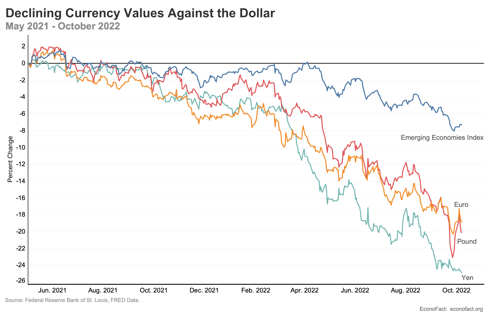

## Table of Contents

## What does it mean for the US dollar to be strong?

When people say the US dollar is strong, they mean it can buy more of other countries' money. For example, if you have one US dollar, you might be able to get more euros or yen than before. This happens because the value of the dollar goes up compared to other currencies. A strong dollar is good for Americans who want to travel or buy things from other countries because their money goes further.

However, a strong dollar can also have some downsides. It can make it harder for American companies to sell their products in other countries because their products become more expensive for people using weaker currencies. This can lead to fewer exports and might affect jobs in industries that rely on selling goods abroad. So, while a strong dollar has its benefits, it can also create challenges for the US economy.

## How does a strong US dollar affect US exports?

A strong US dollar makes US exports more expensive for people in other countries. When the dollar is strong, it means that other countries' money can buy less of it. So, if a US company wants to sell its products in Europe or Asia, those products will cost more in euros or yen. This can make it harder for US companies to sell their goods abroad because people in other countries might choose to buy cheaper products from other places.

This situation can hurt US businesses that rely on exporting their goods. When fewer people buy US products because they are too expensive, these companies might have to lower their prices, which can mean less profit. They might also have to lay off workers or even close down if they can't sell enough. So, a strong dollar can lead to fewer jobs and less money coming into the US from selling things to other countries.

## What impact does a strong US dollar have on US imports?

A strong US dollar makes it cheaper for people in the US to buy things from other countries. When the dollar is strong, it can buy more of other countries' money. So, if you want to buy a car from Japan or clothes from Europe, those things will cost less in dollars. This is good for Americans because they can get more for their money when they shop from other countries.

However, this can be bad for some American businesses. If it's cheaper to buy things from other countries, people might choose to buy those instead of things made in the US. This can hurt American companies that make the same kinds of products because they have to compete with cheaper imports. So, while a strong dollar is good for people buying things from abroad, it can make it harder for some US businesses to sell their products at home.

## How does a strong US dollar influence inflation in the US?

A strong US dollar can help keep inflation low in the US. When the dollar is strong, it's cheaper to buy things from other countries. This means that the prices of imported goods, like electronics or clothes, don't go up as much. If these things are cheaper, it can stop the overall prices in the US from going up too fast. So, a strong dollar can make life a bit easier for people because they don't have to pay more for things.

However, a strong dollar can also make some things more expensive. If US companies find it hard to sell their products abroad because they're too pricey for people in other countries, they might have to raise prices at home to make up for it. This can push up inflation a bit. But usually, the effect of cheaper imports is stronger, so overall, a strong dollar tends to keep inflation in check.

## What are the effects of a strong US dollar on American tourism?

A strong US dollar makes it cheaper for Americans to travel to other countries. When the dollar is strong, it can buy more of other countries' money, so trips abroad cost less in dollars. This means Americans can go on more vacations or stay longer in places like Europe or Asia because their money goes further. They can also spend more on fun things like eating out or buying souvenirs without worrying about the cost.

On the other hand, a strong US dollar can make it harder for people from other countries to visit the US. When their money can buy less dollars, trips to America become more expensive for them. This might mean fewer tourists coming to the US, which can hurt businesses like hotels, restaurants, and attractions that rely on visitors from abroad. So, while a strong dollar is good for Americans traveling out, it can be bad for businesses that depend on international tourists.

## How does a strong US dollar impact foreign investments in the US?

When the US dollar is strong, it can make the US a more attractive place for foreign investors. This is because their money can buy more dollars, so they can invest more in American businesses, real estate, or stocks. For example, if someone from Japan wants to buy a company in the US, their yen will go further when the dollar is strong. This can lead to more foreign money coming into the US, which can help the economy grow.

However, a strong dollar can also make some foreign investors think twice. If they believe the dollar might get weaker later, they might wait to invest. This is because they could lose money if they buy things in dollars now and the dollar falls later. So, while a strong dollar can bring in more foreign investment, it can also make some investors cautious about jumping in right away.

## What are the implications of a strong US dollar for US multinational corporations?

A strong US dollar can make things harder for US multinational corporations that sell a lot of their products in other countries. When the dollar is strong, the price of their products goes up in other countries' money. This makes their products more expensive for people in those countries, and they might choose to buy cheaper things from other places. This can lead to fewer sales for US companies abroad, which can hurt their profits. They might have to lower their prices to stay competitive, but that means they make less money.

On the other hand, a strong dollar can be good for US multinationals when they buy things from other countries. It becomes cheaper for them to get materials or products from abroad, which can help them save money. This can be really helpful for companies that rely on imports to make their products. But they have to balance this with the challenges of selling their own products in other countries. So, a strong dollar has both good and bad effects for US multinational corporations, and they need to figure out how to handle both sides.

## How does a strong US dollar affect the competitiveness of US goods abroad?

When the US dollar is strong, it makes US goods more expensive for people in other countries. This happens because their money can buy less of the strong dollar. So, if an American company wants to sell its products in Europe or Asia, those products will cost more in euros or yen. People in those countries might choose to buy cheaper things from other places instead of the more expensive US goods. This can lead to fewer sales for US companies abroad, which can hurt their profits and make it harder for them to compete.

However, a strong dollar isn't all bad for US companies. It makes it cheaper for them to buy things from other countries. If a US company needs materials or parts from abroad, a strong dollar means they can get these things at a lower cost. This can help them save money and maybe even lower the price of their products. But they have to balance this with the challenge of selling their own products in other countries where they are more expensive because of the strong dollar.

## What is the relationship between a strong US dollar and interest rates?

When the US dollar is strong, it often means that interest rates in the US might be higher compared to other countries. People from other countries might want to invest their money in the US to get those higher interest rates. This demand for US dollars can make the dollar even stronger. The Federal Reserve, which controls interest rates in the US, might raise rates to keep inflation in check or to make the dollar stronger if they think it's needed.

But it's not always that simple. Sometimes, a strong dollar can lead to lower interest rates. If the dollar is too strong, it can hurt US companies that sell things to other countries because their products become more expensive abroad. If the Federal Reserve sees that this is causing problems, they might lower interest rates to weaken the dollar a bit and help those companies. So, the relationship between a strong dollar and interest rates can go both ways, depending on what the Federal Reserve is trying to do.

## How does a strong US dollar influence global commodity prices?

When the US dollar is strong, it can make global commodity prices go down. Commodities like oil, gold, and wheat are often priced in US dollars. When the dollar is strong, it means that people in other countries need more of their own money to buy these commodities. This can make it harder for them to buy, so the demand might go down, and prices might drop.

But a strong dollar can also make it cheaper for countries that use other currencies to buy commodities. If they have a weaker currency, a strong dollar means they can buy more commodities with the same amount of money. This can increase demand from these countries and push prices up a bit. So, while a strong dollar often leads to lower commodity prices, it can also have the opposite effect in some cases depending on how different countries react.

## What are the potential long-term economic consequences of a sustained strong US dollar?

If the US dollar stays strong for a long time, it can have big effects on the US economy. One big effect is that it can make it harder for US companies to sell their stuff to people in other countries. When the dollar is strong, US products cost more in other countries' money, so people there might choose to buy cheaper things from somewhere else. This can lead to fewer jobs in the US because companies might need to cut back if they're not selling as much. Also, a strong dollar can make it cheaper for Americans to buy things from other countries, which can hurt US businesses that make the same things because they have to compete with these cheaper imports.

On the other hand, a strong dollar can help keep prices from going up too fast in the US. When it's cheaper to buy things from other countries, it can stop the overall cost of living from rising too much. This can be good for people in the US because they don't have to pay more for things. But if the dollar stays strong for too long, it might make some countries think twice about investing in the US because their money can buy less dollars. So, while a strong dollar has some good points, it can also create problems if it lasts too long.

## How do central banks and governments typically respond to a prolonged period of a strong US dollar?

When the US dollar stays strong for a long time, central banks and governments around the world start to worry. They might see that their own money is getting weaker compared to the dollar, which can make it harder for their businesses to sell things to the US. To help their own currency, they might try to buy more of it using their reserves of other currencies, like the dollar. This can make their own money stronger and the dollar a bit weaker. Sometimes, they also lower their interest rates to make their currency less attractive to investors, hoping to stop the dollar from getting even stronger.

The US government and the Federal Reserve might also take action if the dollar stays strong for too long. If they think it's hurting US companies that sell things abroad, they might lower interest rates to make the dollar weaker. This can help those companies by making their products cheaper for people in other countries. But if the strong dollar is helping to keep prices low in the US, they might not want to change things too much. It's a balancing act, and they have to think about what's best for the whole economy.

## References & Further Reading

[1]: King, M. R., & Rime, D. (2010). ["The $4 trillion question: What explains FX growth since the 2007/8 crisis?"](https://papers.ssrn.com/sol3/papers.cfm?abstract_id=1727410) BIS Quarterly Review.

[2]:["The Impact of the Strong Dollar on U.S. Corporations"](https://www.morningstar.com/markets/how-does-strong-dollar-impact-stock-investors) by Brookings Institution

[3]: Rogoff, K. (1996). ["The Purchasing Power Parity Puzzle."](https://scholar.harvard.edu/rogoff/publications/purchasing-power-parity-puzzle) Oxford Economic Papers.

[4]: ["International Macroeconomics and Finance: Theory and Econometric Methods"](https://archive.org/details/internationalmac0000mark) by Nelson C. Mark

[5]: ["Trading and Exchanges: Market Microstructure for Practitioners"](https://www.acsu.buffalo.edu/~keechung/MGF743/Readings/Trading-Exchanges-Market-Microstructure-Practitioners%20Draft%20Copy.pdf) by Larry Harris