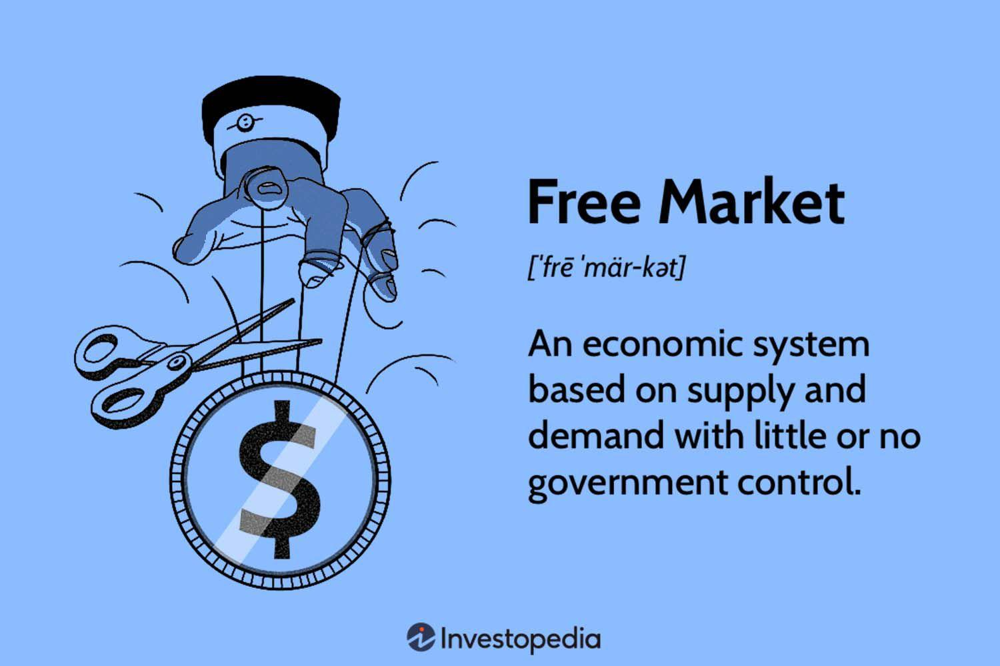

Free markets represent an economic system where prices for goods and services are determined by open competition in a self-regulated framework, devoid of excessive government intervention. Their fundamental role in global economies is underscored by their ability to allocate resources efficiently, stimulate innovation, and provide consumers with a diverse range of choices. The invisible hand, a concept introduced by economist Adam Smith, illustrates how self-interested actions of individuals can lead to positive economic outcomes when guided by competitive market forces.

As economies have matured, the complexity of market transactions has increased, necessitating advanced techniques to navigate these intricacies efficiently. One significant development is the introduction and widespread adoption of algorithmic trading in modern finance. Algorithmic trading employs complex algorithms to make decisions about buying and selling financial instruments, often executing orders at speeds far beyond human capability. This method leverages vast computational power and sophisticated mathematical models to analyze multiple market variables simultaneously, making it a cornerstone of contemporary financial markets.

The purpose of this article is to explore the economic impacts associated with both free markets and algorithmic trading, while also considering the inherent costs and implications of operating within these frameworks. By examining these critical aspects, we seek to understand the transformative effects they have on market dynamics, regulating mechanisms, and their overall influence on global economic stability.

## Table of Contents

## Understanding Free Markets

Free markets, also known as open markets, are economic systems in which the prices of goods and services are determined by unrestricted competition between privately owned businesses. The fundamental characteristics of free markets include voluntary exchange, competitive bargaining, and the free flow of information. In such markets, the allocation of resources is guided predominantly by the forces of demand and supply, with minimal government intervention.

Historically, the development of free markets can be traced back to the end of the feudal system in Europe, marked by the emergence of a more structured monetary economy. The Industrial Revolution further catalyzed the spread of free markets as technological advancements required a more flexible economic system to accommodate the rapid changes in production and distribution. By the late 20th century, free markets had gained global prominence, influencing economic policies and trade liberalization worldwide.

Free markets are lauded for several benefits. Primarily, they drive efficiency, as businesses strive to optimize production and reduce waste to stay competitive. Innovation is another hallmark, fostered by the need to differentiate products and services to capture consumer interest. This competition subsequently broadens consumer choice, offering a variety of options tailored to diverse preferences and budgets. 

Despite these advantages, free markets face significant challenges and criticisms. Chief among them is economic inequality, as free markets can exacerbate disparities in wealth and income. Market [volatility](/wiki/volatility-trading-strategies) is another concern, with rapid changes in prices and speculative trading often leading to economic instability. Moreover, regulatory issues arise as the absence of sufficient oversight can lead to malpractices such as monopolization and exploitation, requiring governments to find a balance between regulation and market freedom. 

Ultimately, while free markets are integral to fostering economic dynamism, they require careful management to address inherent limitations and ensure sustainable and inclusive growth.

## Economic Impact of Free Markets

Free markets are pivotal in shaping economic landscapes, contributing significantly to economic growth and GDP. The core mechanism of free markets, where supply and demand determine price levels without central intervention, promotes efficiency and resource allocation. This leads to increased productivity and innovation, ultimately boosting economic output and growth. 

The impact on employment and industries is substantial. In a free market, industries are compelled to innovate and optimize operations to maintain competitiveness. This drive often results in the creation of new jobs, although it may also lead to job displacement as obsolete industries decline. Despite this, the dynamism of free markets typically fosters overall employment growth through the emergence of new sectors and technologies.

Inflation and pricing mechanisms are also profoundly influenced. Free markets enable more responsive price adjustments to reflect changes in demand and supply, reducing prolonged periods of imbalance that can lead to inflation. However, without regulatory oversight, there can be instances of price volatility that may disproportionately affect consumers and small businesses.

In terms of global competitiveness and trade, free markets are instrumental. They facilitate international trade by allowing goods and services to flow with minimal restrictions, enhancing global supply chains and economic integration. This openness encourages competitive pricing, diversification of products, and enhances a nation's global market standing.

Consequently, the adoption of free market principles has made significant contributions to economic prosperity worldwide, although it necessitates careful regulation to mitigate challenges such as inequality and market instability.

## Market Costs in Free Market Economies

Market costs in free market economies play a critical role in shaping economic behavior and influencing the efficiency of market transactions. These costs can be classified into three primary categories: transaction costs, information costs, and opportunity costs.

**Transaction Costs**

Transaction costs refer to the expenses incurred during the process of buying or selling goods and services. These costs can include search and information costs, bargaining and decision costs, and policing and enforcement costs. In financial markets, transaction costs are particularly relevant, encompassing brokerage fees, commissions, and spreads. Lower transaction costs can enhance market efficiency by facilitating smoother trade flows and enabling participants to act on price signals more effectively.

**Information Costs**

Information costs arise from the need to acquire and evaluate data necessary for making informed economic decisions. In a free market, where decisions are decentralized, gathering relevant market information can pose a significant challenge. The availability and accessibility of information can vary greatly among market participants, creating disparities that may affect competitive fairness and market efficiency. With advancements in technology, such as high-speed internet and data analytics, these costs have been reduced, promoting greater transparency and informed decision-making.

**Opportunity Costs**

Opportunity costs represent the potential benefits forgone when choosing one alternative over another. In a free market, individuals and firms continuously evaluate opportunity costs when making economic decisions. These costs are inherent to the concept of scarcity and trade-offs. Effective decision-making hinges on the ability of market participants to accurately assess and compare opportunity costs, which can be facilitated by access to reliable information and efficient market structures.

**Factors Influencing Market Costs**

1. **Technology**: Technological advancements significantly influence market costs by improving information dissemination and reducing transaction frictions. Technologies like automation and artificial intelligence streamline processes and minimize the time and resources needed for transactions, thus lowering costs and enhancing market efficiency.

2. **Regulation**: Government policies and regulations can have dual effects on market costs. While appropriately designed regulations can reduce risks and provide stability, excessive or poorly crafted regulations may increase compliance costs and limit competition, thereby raising market costs.

3. **Competition**: The level of competition within a market correlates with market costs. Enhanced competition can drive firms to innovate and become more efficient, subsequently reducing prices and transaction costs. Conversely, monopolistic or oligopolistic conditions can elevate costs due to limited pressure to cut inefficiencies.

**Strategies for Minimizing Market Costs**

Several strategies can be adopted to minimize market costs, thereby enhancing economic efficiency:

- **Implementing Technology Solutions**: Leveraging modern technologies such as blockchain can reduce transaction costs by enabling decentralized, transparent, and secure transactions without intermediaries.

- **Deregulation to Encourage Competition**: Carefully considered deregulation can foster competitive markets, helping to minimize deadweight loss and transaction costs while encouraging consumer-friendly prices.

- **Enhancing Information Access**: Ensuring equal and open access to information through public repositories and standardized reporting can reduce information asymmetry and equalize opportunity costs among market participants.

**Impact of Market Costs on Economic Transactions and Efficiency**

Market costs have a direct impact on the efficiency and frequency of economic transactions. High market costs can act as barriers to entry and inhibit the natural flow of goods and services. This can lead to reduced market [liquidity](/wiki/liquidity-risk-premium) and increased price volatility. Conversely, minimized market costs enhance market fluidity, allowing prices to reflect supply and demand dynamics accurately. By reducing transaction and information costs, markets become more accessible, driving competitive pricing and innovation, which contribute to overall economic growth and development. 

Achieving low market costs is crucial for the optimal functioning of free markets, fostering an environment conducive to economic progress and prosperity.

 to Algorithmic Trading

Algorithmic trading, often referred to as algo trading, is a method of executing orders using automated pre-programmed trading instructions. These instructions take into account variables such as time, price, and [volume](/wiki/volume-trading-strategy), and are based on mathematical and statistical models. The primary purpose of [algorithmic trading](/wiki/algorithmic-trading) is to enhance efficiency and decision-making in financial markets by minimizing human intervention and emotion-driven decisions.

The history of algorithmic trading dates back to the late 20th century. With the advent of electronic trading platforms and the increasing speed and capacity of computers, traders began developing automated systems to execute trades. The 1970s saw the introduction of program trading, which involved the use of computer software to place a large number of stock orders simultaneously. By the late 1980s, algorithmic trading began evolving significantly, and it became more prominent with advancements in technology and data availability in the 1990s and 2000s.

Algorithmic trading functions by leveraging a set of predefined rules and conditions to execute trades. Key concepts include:

1. **Trading Strategies**: Algorithmic systems are often built around specific strategies, such as trend following, arbitrage, and market-making. Each strategy aims to exploit market inefficiencies or patterns.

2. **Order Execution**: Algorithms determine the optimal timing and price for order execution to minimize market impact and transaction costs.

3. **Data Analysis and Modelling**: Algorithms rely on vast amounts of market data and use techniques like statistical analysis and machine learning for predictive modelling.

4. **Technological Infrastructure**: High-frequency trading, a subset of algorithmic trading, requires sophisticated technology and infrastructure to execute a large number of trades at millisecond speeds.

In recent years, algorithmic trading has become prevalent in today's financial markets. It is estimated that algorithmic trading accounts for a significant portion of trading volumes on major stock exchanges, particularly in the United States. The rise of high-frequency trading has made algorithmic trading more influential, contributing to the increased speed and efficiency of financial markets.

When compared to traditional trading methods, algorithmic trading offers several advantages. It increases speed and accuracy, reduces transaction costs, and allows for the execution of complex trading strategies that would be cumbersome or impossible for human traders. Additionally, algorithmic systems can process vast amounts of market data much faster than humans, leading to more informed trading decisions.

However, traditional trading methods, characterized by human analysis and decision-making, still hold relevance. They provide the ability to incorporate qualitative insights, adapt to unforeseen market conditions, and manage unexpected risks, something algorithmic systems can struggle with due to their reliance on predefined rules.

Despite the rapid growth and advantages, algorithmic trading also poses potential risks. For instance, the high speed and frequency of trades might increase market volatility, as exemplified by incidents such as the "flash crash" of 2010. This highlights the need for careful oversight and regulation to ensure that the benefits of algorithmic trading are fully realized without compromising market stability.

## Economic Impact of Algorithmic Trading

Algorithmic trading has fundamentally transformed modern financial markets by enhancing market liquidity and efficiency. At its core, algorithmic trading utilizes computer algorithms to automatically make trading decisions, submit orders, and manage those orders after submission. This form of trading leverages mathematical models and statistical analyses to capitalize on price discrepancies and streamline transactions.

One of the principal benefits of algorithmic trading is its ability to enhance market liquidity. By executing trades rapidly and efficiently across a vast array of financial instruments, algorithms contribute to higher trading volumes and tighter bid-ask spreads. Liquidity, defined as the ease with which an asset can be bought or sold in the market without affecting its price, is crucial for the smooth functioning of financial markets. Enhanced liquidity reduces market friction, making it easier for buyers and sellers to transact, thereby resulting in more stable markets.

Algorithmic trading also significantly reduces trading costs, benefiting investors by lowering the cost of capital and increasing potential returns. Traditional trading methods often involve higher transaction costs due to manual processes and human intervention. Algorithms, on the other hand, can execute trades at optimal times and prices, minimizing the impact of market fluctuations. By reducing the time and resources required to complete trades, algorithmic trading allows for more efficient capital allocation and a more dynamic investment landscape.

Despite these advantages, algorithmic trading is not without its risks. One notable concern is market instability, highlighted by incidents such as flash crashes. Flash crashes refer to rapid, deep, and volatile market declines, typically followed by a quick recovery, which can be exacerbated by high-frequency trading algorithms that react to market movements in milliseconds. For example, the May 6, 2010, flash crash saw the Dow Jones Industrial Average plummet by nearly 1,000 points within minutes before quickly rebounding. Such events underscore the potential for algorithms to contribute to market volatility, especially when multiple algorithms interact, amplify trends, and create feedback loops.

These risks pose significant challenges for regulators and policymakers. Ensuring market stability while promoting innovation and efficiency necessitates a delicate balance. Regulators are tasked with developing frameworks that mitigate the potential negative impacts of algorithmic trading, such as introducing circuit breakers to halt trading during extreme fluctuations or implementing stringent risk management protocols for firms employing algorithmic strategies. Furthermore, transparency and accountability are key, mandating that trading algorithms be regularly tested and monitored to ensure they function as intended without contributing to undue market stress.

In summary, algorithmic trading enhances market liquidity and efficiency and reduces trading costs. However, it also introduces complexities and potential risks that require careful consideration. As financial markets continue to evolve, regulatory oversight must adapt to ensure a stable and fair trading environment.

## Balancing Free Markets, Market Costs, and Algorithmic Trading

Balancing free markets, market costs, and algorithmic trading presents a multifaceted challenge that requires careful consideration of both economic theories and technological advances. Free markets, driven by the principles of supply and demand, naturally foster competition and innovation; however, the rise of algorithmic trading has introduced new dynamics that must be effectively managed. 

One major challenge in integrating economic theories with technological advances lies in the rapid pace of technological innovation, which often outpaces the development of regulatory frameworks. Economic theories traditionally emphasize the importance of minimizing market costs and maximizing efficiency. Yet, with the advent of complex algorithms that execute trades at speeds far beyond human capabilities, maintaining an efficient market equilibrium can be challenging. Algorithms can exploit minor inefficiencies for gains, potentially creating market distortions or leading to situations like flash crashes—sudden, deep drops in market prices that may recover just as quickly—posing risks to market stability.

Policy and regulation play critical roles in ensuring market stability in an environment where technology accelerates market operations. Effective regulation can mitigate risks associated with algorithmic trading by establishing parameters for algorithmic behavior and monitoring systems for market anomalies. For instance, the implementation of circuit breakers, which temporarily halt trading during significant market drops, serves as a regulatory tool to prevent panic selling and restore order, thereby stabilizing markets.

Several case studies illustrate successful approaches to balancing free markets, market costs, and algorithmic trading. One notable example involves the London Stock Exchange, which implemented high-frequency trading controls. These controls include latency floors—deliberately slowing down trade speeds—and periodic auctions to manage volatility and enhance liquidity. These measures have shown success in maintaining a fair and orderly market, highlighting the effectiveness of targeted regulatory interventions.

Looking toward the future, the prospects for markets and trading in the digital age seem to hinge on the development and adoption of smart regulations and technological innovations that prioritize transparency and fairness. Artificial intelligence and [machine learning](/wiki/machine-learning) could enhance regulatory capability by providing real-time insights and predictive analytics, enabling more effective monitoring and intervention when necessary. Furthermore, the growing interest in blockchain technology hints at a potential transformation of market operations through decentralized and secure trading environments.

Ultimately, the future of global markets will depend on collaborative efforts between regulators, market participants, and technologists to craft strategies that leverage the benefits of algorithmic trading while safeguarding market integrity. By continuously adapting policies and embracing technological advancements with caution, market economies can strive to achieve a sustainable and dynamic balance between freedom and regulation, cost minimization, and trading innovation.

## Conclusion

The economic impact of free markets and algorithmic trading has been profound and multifaceted. Free markets, with their emphasis on efficiency, innovation, and consumer choice, have historically been pivotal in driving economic growth and enhancing global trade. They operate under the premise that minimal government intervention allows supply and demand to dictate prices and resource allocation. However, challenges such as inequality and the potential for market volatility necessitate a balanced approach in policy formulation.

Algorithmic trading has further revolutionized the financial landscape by significantly enhancing market liquidity and efficiency. By utilizing complex algorithms to execute trades at speeds and volumes beyond human capacity, it has reduced trading costs and offered investors narrower spreads. Despite these benefits, the risks of market instability and phenomena such as flash crashes highlight the necessity for robust regulatory frameworks. Policymakers must ensure these technologies can thrive without compromising market stability.

Looking to the future, it is crucial for market economies to adapt to the rapidly evolving technological landscape. The integration of free market principles with advanced trading technologies presents an opportunity to foster economic resilience and competitiveness. This requires stakeholders - including regulators, industry leaders, and investors - to actively engage with and understand these dynamics. Collaborative efforts will be essential in crafting regulations that harness the benefits of algorithmic trading while mitigating its risks.

In conclusion, the interplay between free markets and algorithmic trading will continue to shape the future of global economies. Stakeholders must remain vigilant and proactive in embracing these changes, ensuring that the advantages of innovation and economic growth are realized without compromising market integrity.

## References & Further Reading

[1]: Smith, A. (1776). ["The Wealth of Nations"](https://www.ibiblio.org/ml/libri/s/SmithA_WealthNations_p.pdf). London: W. Strahan and T. Cadell.

[2]: Aldridge, I. (2010). ["High-Frequency Trading: A Practical Guide to Algorithmic Strategies and Trading Systems"](https://www.ahmetbeyefendi.com/wp-content/uploads/2020/07/High-Frequency-Trading-Irene-Aldridge.pdf). New York: Wiley.

[3]: Lopez de Prado, M. (2018). ["Advances in Financial Machine Learning"](https://www.amazon.com/Advances-Financial-Machine-Learning-Marcos/dp/1119482089). Hoboken, NJ: Wiley.

[4]: Chan, E. P. (2009). ["Quantitative Trading: How to Build Your Own Algorithmic Trading Business"](https://github.com/ftvision/quant_trading_echan_book). New York: Wiley.

[5]: Patel, S. A., & Zunaira, A. (2021). ["Artificial Intelligence for Algorithmic Trading: Build Your Own AI Algorithm in Python"](https://www.sciencedirect.com/science/article/pii/S004016252031218X). Birmingham: Packt Publishing.

[6]: Hull, J. C. (2018). ["Options, Futures, and Other Derivatives"](https://www.semanticscholar.org/paper/Options%2C-Futures%2C-and-Other-Derivatives-Hull/89bdee500c8623864fc9eb7a471546aa713acc44). Boston: Pearson.

[7]: Gomber, P., Arndt, B., Lutat, M., & Uhle, T. (2011). ["High-Frequency Trading"](https://papers.ssrn.com/sol3/papers.cfm?abstract_id=1858626). Journal of Electronic Commerce Research and Applications, 11(2), 60-73.

[8]: MacKenzie, D. (2019). ["Trading at the Speed of Light: How Ultrafast Algorithms Are Transforming Financial Markets"](https://ieeexplore.ieee.org/document/9647710). Princeton, NJ: Princeton University Press.