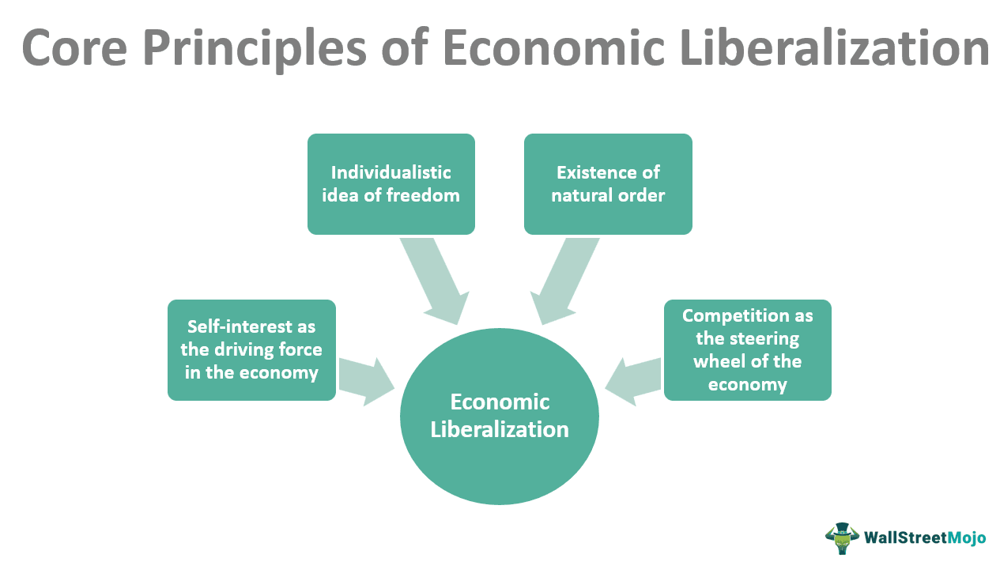

Economic liberalization, as a national policy, refers to the reduction or elimination of government regulations and restrictions in an economy to enhance economic growth. This policy is typically characterized by the removal of trade barriers, reduction of tariffs, and deregulation, creating an environment more conducive to private enterprise. One of the primary objectives is to open the economy to international markets, which can stimulate competition, attract foreign direct investment (FDI), and spread technology and innovation. The potential economic effects of economic liberalization include increased efficiency, higher economic growth rates, and improved standards of living.

When examining the intersection of economic liberalization and algorithmic trading, we observe a significant transformation in global financial markets. Algorithmic trading, which utilizes advanced algorithms to execute trading decisions at speeds and frequencies infeasible for human traders, thrives in deregulated and liberalized markets. The interplay between these two phenomena is increasingly important as they collectively reshape the landscape of international trade and financial markets. Algorithmic trading can benefit from the increased liquidity and reduced transaction costs that are typically associated with liberalized economies. In turn, as financial markets become more automated and sophisticated, there is a growing obligation for these markets to remain open and facilitative to sustain competition on a global scale.

Understanding the implications of economic liberalization and algorithmic trading is crucial for gauging their combined impact on global trade and economic policy. Economic policies that support liberalization can significantly influence national competitiveness, while developments in algorithmic trading continue to shift the paradigms of financial market operations. This article will explore these themes, delving into definitions and effects, the revolutionary nature of algorithmic trading, and how these elements intertwine to influence both local and global economic structures.

The structure of this article consists of several sections focusing on different facets of the topic. We begin by defining economic liberalization and assessing its economic implications. Following this, we address how algorithmic trading operates and its revolutionary impact on financial markets. We then explore the interconnectedness of liberalization policies and algorithmic trading, supported by real-world case studies. Finally, we conclude with future prospects for these entwined elements and the challenges they pose to policymakers. Each section will build towards a comprehensive understanding of how economic liberalization and algorithmic trading are redefining contemporary economic landscapes.

## Table of Contents

## Understanding Economic Liberalization and Its Economic Effects

Economic liberalization refers to the process by which governments reduce restrictions on economic activities in order to encourage a freer market environment. It typically involves removing regulatory barriers to trade, deregulating interest rates, reducing tariffs and non-tariff barriers, and allowing greater freedom of movement for capital and labor. The primary aim of economic liberalization is to enhance efficiency, productivity, and growth by fostering competition and innovation.

The removal of barriers to international investing is a crucial component of economic liberalization. By eliminating restrictions on cross-border capital flows, countries can attract foreign investors, which in turn helps in channeling resources into various sectors of the economy. This openness allows investors to seek out productive investments across borders, fostering an environment where capital is allocated more efficiently on a global scale.

Unrestricted capital flow can significantly impact a country's economy, both positively and negatively. On the positive side, it enables capital to move quickly to where it is most needed, supporting investment in infrastructure, technology, and other areas crucial for economic growth. Increased capital mobility can lead to stock market appreciation, as foreign and domestic investors pour money into markets seeking high returns. This influx of investment can boost economic development, raise productivity, and improve living standards.

However, the downsides of unrestricted capital flow include the potential for economic instability. Sudden stops or reversals in capital flow can lead to financial crises. For example, if investors lose confidence in a country's economy, they may rapidly withdraw their investments, leading to a sharp decline in currency value and financial turmoil.

Stock market appreciation resulting from economic liberalization can bolster investor confidence. As markets grow and offer higher returns, both domestic and international investors become more confident in the stability and potential of the market. This increased confidence can attract even more investment, fueling a positive cycle of economic growth and development.

Another important effect of economic liberalization is the reduction of political risks. By creating a more predictable and transparent regulatory environment, liberalization can decrease the uncertainties associated with government interference in the economy. This makes the country a more attractive destination for investors. The diversification benefits for investors are also significant; they can spread their investments across different countries and sectors, reducing risk and potentially increasing returns.

In summary, economic liberalization plays a critical role in shaping economic policies and outcomes. By enabling the freer movement of capital and reducing regulatory barriers, it can stimulate economic growth, improve market efficiency, and enhance investor confidence. However, it also necessitates careful management of potential risks to ensure sustainable and stable economic development.

## Algorithmic Trading: Revolutionizing the Financial Markets

Algorithmic trading refers to the use of computer algorithms to execute trading orders at speeds and frequencies that are beyond human capabilities. It involves the use of mathematical models and historical data to make decisions on the buying and selling of financial instruments. This technology has transformed financial markets by enhancing efficiency and reducing human error. 

### Market Efficiency and Speed

Algorithmic trading significantly enhances market efficiency and speed by automating the trading process. Algorithms can analyze market data and execute orders in milliseconds, enabling traders to capitalize on minor price discrepancies that may exist for only short durations. This rapid execution helps narrow bid-ask spreads and improves [liquidity](/wiki/liquidity-risk-premium) in the market. For instance, a high-frequency trading ([HFT](/wiki/high-frequency-trading-strategies)) algorithm might analyze stock prices, order [books](/wiki/algo-trading-books), and market sentiment and execute trades based on predefined criteria. This speed is particularly beneficial during periods of high market [volatility](/wiki/volatility-trading-strategies) when rapid execution can protect trades against sudden market shifts.

### Influence on International Trade and Capital Flow

The global reach of [algorithmic trading](/wiki/algorithmic-trading) is profound due to its capacity to operate continuously across different markets and time zones. It can predict and react to international market movements effectively, facilitating a seamless flow of capital across borders. This cross-market ability can lead to more synchronized international trading environments, influencing currency exchange rates, enhancing the integration of global markets, and allowing firms to optimize portfolios globally.

### Potential Risks: Market Volatility

Despite its advantages, algorithmic trading also carries potential risks, particularly in terms of market volatility. Algorithms can amplify market movements by initiating a cascade of trades in response to price changes or other algorithmic signals. In some instances, this can lead to flash crashes, where markets experience rapid, deep, and volatile dives. A famous example is the Flash Crash on May 6, 2010, when the Dow Jones Industrial Average dropped nearly 1,000 points within minutes, largely attributed to algorithmic trading effects. While the precise triggers for such events can vary, they highlight the need for robust regulatory measures and risk management frameworks to mitigate these risks.

In summary, while algorithmic trading brings significant efficiency and improvements to global financial markets, it also necessitates careful management of its innate risks to ensure stability and fair trading practices.

## The Interconnection Between Economic Liberalization and Algorithmic Trading

Economic liberalization policies have significantly transformed the landscape of global trade, creating environments conducive to the rapid evolution and adoption of algorithmic trading. Central to these policies is the reduction of trade barriers, which enhances the fluidity of capital flows and investments across borders. This reduction not only boosts market accessibility but also fosters competitive and efficient financial environments, essential conditions for the proliferation of algorithmic trading.

#### Economic Liberalization and Algorithmic Trading Symbiosis

Economic liberalization engenders a robust platform for algorithmic trading by opening up markets to international participants. When nations lift restrictions on foreign investment and decontrol interest rates, they open channels for technology transfers and innovative financial practices. These open market policies pave the way for the deployment of advanced trading technologies which thrive on speed and efficiency—hallmarks of algorithmic trading.

Algorithmic trading, characterized by the use of computer algorithms to automate trading decisions at lightning speed, benefits from reduced trade barriers in several ways:
- **Market Liquidity**: Open markets with fewer restrictions typically exhibit greater liquidity. Algorithmic traders, who rely on liquid markets for rapid execution and minimal price impact, find such environments ideal.
- **Data Availability**: Liberalized economies often have less restrictive information regimes, providing the transparency required by algorithmic models to function accurately and efficiently.
- **Cost Efficiency**: The competition facilitated by open markets tends to reduce transaction costs, which is critical for algorithmic traders who execute numerous trades within short periods.

#### Impacts on Liberalized Economies

Algorithmic trading's rise within liberalized economies yields both benefits and challenges. On the positive side, it can lead to more efficient markets by ensuring tighter spreads and better price discovery, driven by high-frequency trading activities. This efficiency can translate to increased market participation by reducing the cost of entry for new investors, thereby broadening the economic base.

However, these advancements are not without their challenges. Algorithmic trading can contribute to increased market volatility, particularly during periods of economic stress. For instance, rapid execution capabilities might trigger systemic risks, where a cascading effect from one market to another is initiated by high-frequency, automated trades. This raises concerns about market stability and the need for regulatory frameworks to manage potential ultrafast market crashes, famously noted in the "Flash Crash" of May 6, 2010.

Furthermore, the technological arms race instigated by algorithmic trading necessitates constant technological upgrades and investments, which may create disparities between wealthier market participants and those with fewer resources. Developing nations undergoing economic liberalization must carefully balance the attractiveness of foreign direct investments through open markets with ensuring fair and equitable access to technological advancements in trading.

To summarize, while economic liberalization provides fertile ground for the expansion of algorithmic trading by enhancing market conditions and technological diffusion, careful policy design is required to harness the benefits while mitigating the associated financial risks. As trade barriers continue to diminish, the interplay between economic policy and technological advancements will play a pivotal role in shaping future financial landscapes.

## Case Studies: Real World Applications and Impacts

### Case Studies: Real World Applications and Impacts

#### Economic Liberalization and the North American Free Trade Agreement (NAFTA)

The North American Free Trade Agreement (NAFTA), enacted in 1994, serves as a prominent example of economic liberalization in the global trade policy arena. NAFTA was designed to eliminate tariffs and reduce trade barriers among the United States, Canada, and Mexico, thereby creating one of the world's largest free trade zones. Its primary goal was to increase economic cooperation and trade within the region, fostering greater economic growth and integration.

Economic liberalization through NAFTA significantly impacted trade and economic performance among the member countries. In terms of trade, NAFTA succeeded in increasing exports and imports between the countries. For instance, trade between the U.S. and Mexico tripled in the decade following the agreement's implementation. U.S. foreign direct investment (FDI) in Mexico also increased, indicating heightened investor confidence due to reduced political and economic risks. The reduction of trade barriers under NAFTA prompted U.S. and Canadian companies to expand their operations and investments in Mexico, particularly in sectors like manufacturing and automotive.

Moreover, NAFTA influenced technology adoption in the region. The agreement facilitated cross-border collaboration on technological advancement, particularly in manufacturing processes and supply chain management. Companies leveraged emerging technologies to optimize production and logistics, resulting in increased operational efficiency and innovation.

#### Algorithmic Trading: Shaping Economic Landscapes

Algorithmic trading has emerged as a transformative element in the financial markets, powered by the automation of trading decisions using predefined criteria. This form of trading has revolutionized market operations by enhancing efficiency and speed, influencing economic activities globally. Algorithmic trading accounts for a significant portion of stock market transactions, particularly in developed economies like the United States and the European Union.

One notable impact of algorithmic trading is the enhancement of market liquidity. By facilitating rapid execution of trades, algorithms ensure that assets can be bought and sold promptly, stabilizing market conditions. This enhances investor confidence and encourages participation in stock markets, a positive outcome for any liberalized economy.

However, algorithmic trading is not without risks. The 2010 Flash Crash in the United States exemplifies the potential for increased market volatility due to faulty algorithms. Within a span of minutes, the Dow Jones Industrial Average plummeted nearly 1,000 points but recovered just as swiftly, demonstrating the destabilizing potential of high-frequency trading.

Despite its challenges, algorithmic trading continues to shape economic landscapes positively. In India, for instance, the deployment of algorithmic trading by institutional investors has contributed to more systematic and data-driven investment decisions, bolstering the efficiency of the Indian stock markets.

### Conclusion

An examination of NAFTA and algorithmic trading highlights the profound influence of economic liberalization and technological advancements on global trade and economic policies. While these case studies underscore notable achievements in trade facilitation and market efficiency, they also signal challenges that call for balanced regulatory oversight to ensure sustainable and equitable economic growth.

### References & Further Reading

1. Office of the United States Trade Representative. (NAFTA). Retrieved from [https://ustr.gov/issue-areas/trade-organizations/north-american-free-trade-agreement-nafta](https://ustr.gov/issue-areas/trade-organizations/north-american-free-trade-agreement-nafta)
2. Securities and Exchange Commission. (Concept Release on Equity Market Structure). Retrieved from [https://www.sec.gov/rules/concept/2010/34-61358.pdf](https://www.sec.gov/rules/concept/2010/34-61358.pdf)
3. Investopedia. (Algorithmic Trading). Retrieved from [https://www.investopedia.com/terms/a/algorithmictrading.asp](https://www.investopedia.com/terms/a/algorithmictrading.asp)

## Future Prospects and Challenges

Economic liberalization and algorithmic trading have emerged as pivotal components in shaping the future of global economic landscapes. The convergence of these elements presents both opportunities and challenges that require careful navigation.

Potential future developments in economic liberalization suggest a continued trend toward reducing trade barriers and promoting free markets. As countries seek to integrate more deeply into the global economy, policies that encourage cross-border investments and reduce tariffs will likely gain prominence. This environment could foster innovations in financial markets, particularly for emerging economies, providing them with broader access to international capital and diversified investment opportunities.

In tandem, algorithmic trading is set to evolve with advancements in technology such as [artificial intelligence](/wiki/ai-artificial-intelligence) and [machine learning](/wiki/machine-learning). These tools can potentially refine trading algorithms, making them more efficient and adaptive to market conditions. The continued development of blockchain technology also holds promise for increasing transparency and security in trading processes, potentially reshaping the methodologies used in financial transactions.

However, aligning national and international policies for trade and technology poses notable challenges. Disparities in regulatory frameworks across countries can create friction in implementing coherent economic liberalization and adopting algorithmic trading universally. Policymakers face the task of crafting regulations that prevent asymmetric advantages while preserving the benefits of open markets. Moreover, ethical considerations regarding data privacy and market manipulation need to be addressed to maintain investor trust and market integrity.

Policymakers play a crucial role in managing risks and promoting equitable growth. They must establish a regulatory environment that safeguards against the potential pitfalls of algorithmic trading, such as market volatility and systemic risks, while ensuring that technological innovations do not exacerbate economic inequalities. This involves not only regulating financial markets but also investing in education and infrastructure that enable a broader population to participate in and benefit from technological advancements.

Ultimately, striking a balance between economic liberalization, technological progress, and regulatory oversight is essential for fostering a sustainable and equitable future in global trade and economic policy. Through proactive policymaking, collaboration among nations, and continuous adaptation to emerging technologies, the challenges of this evolving landscape can be effectively managed.

## Conclusion

In summarizing the exploration of economic liberalization and algorithmic trading, it is evident that both phenomena have significantly reshaped global financial markets and trade policies. Economic liberalization, with its emphasis on removing barriers to international investing, has facilitated an environment where capital flow is more fluid, affecting economies by boosting stock market appreciation and investor confidence. This reduction in political risks and the diversification benefits have created a fertile ground for technological advancements such as algorithmic trading.

Algorithmic trading has, in turn, revolutionized financial markets by enhancing efficiency and transaction speed, influencing both domestic and international trade dynamics. However, it also presents risks, such as increased market volatility, highlighting the necessity for a balance between technological progression and robust regulatory frameworks.

As these elements intertwine, the challenge remains to harmonize liberalization policies and advancements in trading technology. The interplay between reduced trade barriers and sophisticated trading algorithms presents both opportunities for economic growth and potential challenges in terms of market stability and equitable wealth distribution. Policymakers must navigate these complex relationships to foster environments that support sustainable economic expansion while mitigating systemic risks.

Looking to the future, the balance between liberalization, technological advancement, and regulatory oversight will be crucial. Policymakers and financial stakeholders must focus on creating adaptive and resilient frameworks that accommodate rapid technological changes while ensuring fair and inclusive economic growth. The sustainability of global trade and economic policies hinges on collaborative efforts to manage the dichotomy between open markets and the need for regulation, ultimately steering towards a future that benefits all participants in the global economy.

## References & Further Reading

1. **Economic Liberalization and International Investment**:
   - Blanchard, O. (2019). *Macroeconomics*. Pearson. This textbook provides comprehensive insights into economic liberalization and its broader macroeconomic impacts.
   - Bhagwati, J. (1998). *The Capital Myth: The Difference Between Trade in Widgets and Dollars*. Foreign Affairs. This article discusses the implications of removing barriers to international investment.

2. **Impacts of Capital Flows on Economies**:
   - Obstfeld, M., & Rogoff, K. (1996). *Foundations of International Macroeconomics*. MIT Press. This work explores how capital flow liberalization can impact a nation's economy.
   - Kose, M. A., Prasad, E. S., & Terrones, M. E. (2003). *Financial Integration and Macroeconomic Volatility*. IMF Economic Review. This paper analyses the relationship between financial integration and economic stability.

3. **Algorithmic Trading and Financial Markets**:
   - Chaboud, A. P., et al. (2009). *Rise of the Machines: Algorithmic Trading in the Foreign Exchange Market*. FRB International Finance Discussion Paper No. 980. This paper offers an introduction to algorithmic trading and its role in market efficiency.
   - Patterson, S. (2013). *Dark Pools: High-Speed Traders, A.I. Bandits, and the Threat to the Global Financial System*. Crown Business. This book investigates the implications of algorithmic trading on financial markets, including potential risks.

4. **Economic Liberalization and Algorithmic Trading Synergy**:
   - Stulz, R. M. (2005). *The Limits of Financial Globalization*. Journal of Finance. An exploration of how financial globalization, driven by liberalization, can complement advancements like algorithmic trading.
   - Gomber, P., et al. (2017). *Algorithmic Trading: Pros, Cons, and Impact on Security Markets*. Journal of Business Economics. The synergy between liberalization and trading technologies is discussed with an emphasis on market impacts.

5. **Case Studies and Real-world Examples**:
   - World Trade Organization. (1995). *The North American Free Trade Agreement (NAFTA) and its Impact*. This report outlines the effects of NAFTA on trade and technological adoption across North America.
   - Brogaard, J., Hendershott, T., & Riordan, R. (2014). *High-Frequency Trading and Price Discovery*. The Review of Financial Studies. This study illustrates the real-world influence of algorithmic trading on market dynamics.

6. **Future Prospects and Regulatory Challenges**:
   - Zingales, L. (2012). *A Capitalism for the People: Recapturing the Lost Genius of American Prosperity*. Basic Books. Zingales discusses potential future developments in economic policies and the role of regulation.
   - Brummer, C. (2015). *Soft Law and the Global Financial System: Rule Making in the 21st Century*. Cambridge University Press. This book stresses the importance of aligning international and national policies amidst technological advancements. 

For those seeking additional insights, the referenced materials offer a spectrum of perspectives and in-depth analyses pertinent to the topics of economic liberalization and algorithmic trading, vital for understanding modern economic policies and global trade dynamics.

