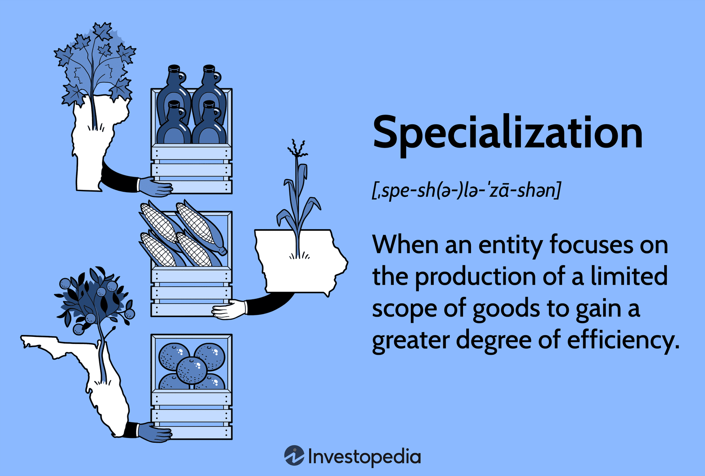

## Table of Contents

## What is economic specialization?

Economic specialization is when people, businesses, or countries focus on doing one kind of work or making one kind of product. Instead of trying to do everything themselves, they get really good at one thing. For example, a farmer might specialize in growing apples instead of growing many different crops. By focusing on apples, the farmer can become an expert and produce more apples than if they were trying to grow everything.

This specialization can help everyone in the economy. When people specialize, they can trade their goods or services with others who specialize in different things. This is called trade. For example, the apple farmer can trade apples with a baker who specializes in making bread. Both the farmer and the baker benefit from this trade because they can get things they need without having to do all the work themselves. Specialization and trade can make the economy more efficient and help people live better lives.

## How does specialization affect individual productivity?

Specialization can make people more productive. When someone focuses on one job, they can get really good at it. They learn the best ways to do the job and can do it faster and better. For example, if a worker specializes in making shoes, they will learn all about different shoe materials and the best ways to put shoes together. This makes them more productive because they can make more shoes in less time than someone who tries to make many different things.

However, specialization can also have some downsides. If someone only does one job, they might get bored or tired of it. This can make them less productive over time. Also, if the demand for their specialized job goes down, they might have a hard time finding work. For example, if fewer people want to buy shoes, the shoe maker might struggle to find work. So, while specialization can increase productivity, it's important to think about these other factors too.

## Can you explain the concept of comparative advantage in relation to specialization?

Comparative advantage is a big idea in economics that helps explain why countries or people should specialize in certain jobs or products. It says that even if someone is better at doing everything, they should still focus on what they are relatively best at. For example, imagine two friends, Sam and Tara. Sam can make 10 cookies or 5 cupcakes in an hour, while Tara can make 6 cookies or 3 cupcakes in the same time. Sam is better at making both, but he has a bigger advantage in making cookies. So, Sam should make cookies and Tara should make cupcakes because that's what she's relatively better at.

When people or countries focus on what they have a comparative advantage in, everyone can benefit. In our example, Sam and Tara can trade their cookies and cupcakes with each other. Sam can give some of his cookies to Tara in exchange for some of her cupcakes. This way, they both end up with more cookies and cupcakes than if they tried to make everything themselves. This idea helps explain why specialization and trade can make the economy more efficient and help everyone live better lives.

## What are the benefits of specialization for a country's economy?

Specialization can help a country's economy grow and become more efficient. When a country focuses on making certain products or services, it can get really good at them. This means they can make more of those things and do it better than if they tried to make everything. For example, if a country is good at making cars, it can specialize in car manufacturing. By doing this, the country can produce more cars and maybe even sell them to other countries. This can create jobs and bring in money from other countries, helping the economy grow.

Specialization also helps a country use its resources better. Every country has different resources like land, workers, and technology. When a country specializes, it can use these resources in the best way possible. For example, a country with a lot of farmland might specialize in growing crops. This way, they can use their land to grow food efficiently and trade it with other countries that need it. This can make the whole world's economy more efficient because everyone is using their resources in the best way they can.

## How does specialization influence international trade?

Specialization influences international trade by making countries focus on what they are good at. When a country specializes, it can make more of a certain product than if it tried to make everything. For example, if a country is good at making computers, it can make a lot of computers and then trade them with other countries. This means countries can get things they need from other countries instead of trying to make everything themselves. This makes trade between countries more efficient because everyone is using their resources in the best way possible.

When countries trade more because of specialization, it can help everyone's economy grow. Countries can sell their specialized products to other countries and make money. This can create jobs and help the economy. For example, if a country specializes in making cars and sells them to other countries, it can use the money to buy things it needs, like food or clothes. This way, specialization and trade can make the world's economy better because everyone is working together and using their strengths.

## What are the potential drawbacks of economic specialization?

Specialization can sometimes cause problems. If a country or a person focuses too much on one thing, they might have trouble if something goes wrong with that thing. For example, if a country only makes cars and then people stop buying cars, the country might have a hard time. This can lead to job losses and economic problems. It's like putting all your eggs in one basket. If the basket breaks, you lose everything.

Another issue is that workers who specialize in one job might get bored or tired of it. This can make them less happy and productive. Also, if the job they specialize in becomes less needed, they might struggle to find new work. It can be hard to switch to a different job if you've only done one thing for a long time. So, while specialization can help make things more efficient, it's important to think about these risks too.

## How does specialization impact employment and labor markets?

Specialization can change how people find jobs and what kinds of jobs are available. When businesses focus on making one thing, they need workers who are good at that one thing. This can mean more jobs in certain areas. For example, if a country specializes in making cars, there will be a lot of jobs for people who know how to make cars. But, if everyone is trying to specialize in the same thing, it can be hard to find a job in that area because there will be more people looking for those jobs than there are jobs available.

On the other hand, specialization can also make it harder for workers to find new jobs if their specialized skill is no longer needed. If a worker has spent a long time learning how to do one job, it can be tough to switch to a different job. This can lead to unemployment if the demand for their skill goes down. For example, if fewer people want to buy cars, the workers who make cars might lose their jobs and struggle to find new ones. So, while specialization can create more jobs in some areas, it can also make it harder for workers to find work if the job they know changes or goes away.

## In what ways can specialization lead to economic growth?

Specialization can help a country's economy grow by making it more efficient. When a country focuses on making certain things, it can get really good at making those things. This means they can make more of them and do it better than if they tried to make everything. For example, if a country is good at making computers, it can make a lot of computers and sell them to other countries. This can create jobs and bring in money from other countries, which helps the economy grow.

Specialization also helps a country use its resources better. Every country has different things like land, workers, and technology. When a country specializes, it can use these resources in the best way possible. For example, a country with a lot of farmland might focus on growing crops. By doing this, they can use their land to grow food efficiently and trade it with other countries that need it. This makes the whole world's economy more efficient because everyone is using their resources in the best way they can.

## How do economies of scale relate to specialization?

Economies of scale and specialization go hand in hand. Economies of scale happen when making more of something makes it cheaper to make each thing. When a country or a business specializes in making one thing, they can make a lot of it. This means they can take advantage of economies of scale. For example, if a factory makes only cars, it can buy car parts in big amounts, which makes each part cheaper. This helps the factory make cars at a lower cost.

Specialization also helps businesses get better at making things. When they focus on one thing, they can find the best ways to make it. This can lead to even more savings because they get better at using their machines and workers. So, specialization helps businesses use economies of scale to make things cheaper and better. This can help the economy grow because businesses can sell their products for less money and make more profit.

## What role does technology play in the process of specialization?

Technology helps people and businesses specialize by making it easier to do one thing really well. When a business uses new machines or computer programs, it can make more of a product faster and better. For example, a farmer can use a new tractor to plant more crops in less time. This means the farmer can focus on growing one type of crop and become really good at it. Technology also helps businesses learn new ways to make things. They can use computers to find the best ways to make their products, which helps them specialize even more.

Technology also helps connect people and businesses so they can trade what they specialize in. With the internet, a business can sell its products to people all over the world. This means they can focus on making one thing and sell it to a lot of different people. For example, a company that makes shoes can use the internet to sell shoes to people in different countries. This helps the company specialize in making shoes and use technology to reach more customers. So, technology is a big part of helping people and businesses specialize and grow.

## How can specialization affect income inequality within a country?

Specialization can make income inequality worse in a country. When people focus on one job, some jobs pay more than others. For example, if a country specializes in making computers, the people who know how to make computers might get paid a lot more than people who do other jobs. This can make the gap between rich and poor bigger because some people earn more money than others. If only a few people have the skills that are needed for the specialized jobs, they can ask for higher pay, which can make income inequality even worse.

On the other hand, specialization can sometimes help reduce income inequality if it creates a lot of new jobs. When a country focuses on making something, it might need more workers to do that job. For example, if a country starts making a lot of cars, it might need more people to work in car factories. If these new jobs pay well and are available to a lot of people, it can help more people earn good money. But, this depends on how the benefits of specialization are shared. If only a few people get the good jobs and most people are left with low-paying jobs, specialization can still make income inequality worse.

## What are the long-term sustainability concerns associated with high levels of specialization?

High levels of specialization can create long-term sustainability concerns. When a country or a business focuses too much on one thing, it can be risky. If something goes wrong with that one thing, like if people stop wanting to buy it, the whole economy can be in trouble. For example, if a country only makes cars and then people start buying fewer cars, the country might have a hard time. This can lead to job losses and economic problems. It's like putting all your eggs in one basket. If the basket breaks, you lose everything.

Another concern is that specialization can harm the environment. When businesses focus on making one thing, they might use a lot of resources to do it. For example, if a country specializes in making electronics, it might need a lot of rare metals and energy. Using a lot of resources can lead to pollution and harm the environment. If the country doesn't think about how to use its resources in a sustainable way, it might face big problems in the future. So, while specialization can help make things more efficient, it's important to think about these long-term risks too.

## References & Further Reading

[1]: Smith, A. (1776). ["An Inquiry into the Nature and Causes of the Wealth of Nations."](https://archive.org/details/inquiryintonatur01smit_0/) 

[2]: Ricardo, D. (1817). ["On the Principles of Political Economy and Taxation."](https://www.econlib.org/library/Ricardo/ricP.html) 

[3]: Lopez de Prado, M. (2018). ["Advances in Financial Machine Learning."](https://www.amazon.com/Advances-Financial-Machine-Learning-Marcos/dp/1119482089)

[4]: Kissell, R. (2014). ["The Science of Algorithmic Trading and Portfolio Management."](https://www.sciencedirect.com/book/9780124016897/the-science-of-algorithmic-trading-and-portfolio-management)

[5]: Lewis, M. (2014). ["Flash Boys: A Wall Street Revolt."](https://en.wikipedia.org/wiki/Flash_Boys)

[6]: Gomber, P., Arndt, B., Lutat, M., & Uhle, T. (2011). ["High-frequency trading."](https://papers.ssrn.com/sol3/papers.cfm?abstract_id=1858626) In Banking and Information Technology (BIT) 12(1).