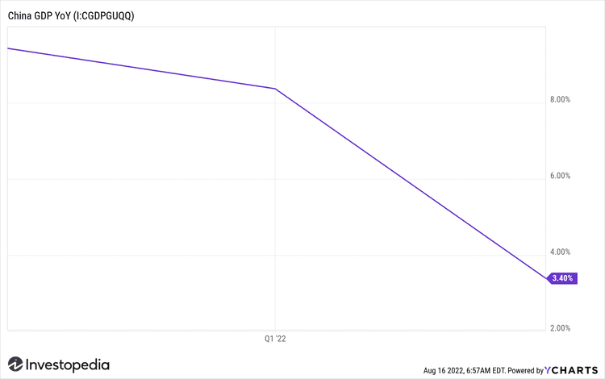

In recent years, China's economy has been experiencing a notable slowdown, raising concerns among investors and economists worldwide. Once the powerhouse driving global economic growth, China's GDP has decelerated to its lowest levels in decades. This downturn has prompted fears of broader economic implications both within and beyond its borders.

Investors are increasingly attentive to this economic shift, as China's slowdown may influence global financial stability. As the world's second-largest economy, China's growth rates have historically set the pace for international trade and investment dynamics. Now, with its economy cooling, questions arise regarding the potential seismic impacts across global markets.



This article will explore the critical factors contributing to China's economic deceleration, such as rising debt levels, a weakening property market, and external trade tensions. Understanding these elements is crucial for stakeholders aiming to mitigate risks associated with a slowing Chinese economy.

Moreover, the potential implications of this slowdown on the global financial system will be examined. Many countries, particularly those heavily reliant on commodity exports to China, may face significant economic challenges. Additionally, global financial markets could display increased volatility as they respond to economic and policy developments within China.

In this complex environment, algorithmic trading emerges as a tool for navigating market volatility. These automated systems can rapidly process large volumes of data, providing insights and opportunities in an unpredictable economic landscape.

Understanding these dynamics is essential for stakeholders aiming to mitigate risks and seize opportunities in a decelerating Chinese economy. By staying informed and adaptable, investors and policymakers can better navigate the challenges and prospects present in this evolving economic setting.

## Table of Contents

## Factors Contributing to China's Economic Slowdown

Several factors have played pivotal roles in the deceleration of China's economic growth, signaling a period of transition and adaptation for the world's second-largest economy. A notable concern is the rising levels of debt. Over the past decade, China has experienced an unprecedented accumulation of debt across various sectors, particularly in local governments and state-owned enterprises. This extensive borrowing has funded infrastructure projects and expansion initiatives, yet it has also led to potential financial vulnerabilities. The debt-to-GDP ratio has surged, prompting concerns about the sustainability of such growth and the risk of financial instability.

The property market, traditionally a significant pillar of China's economy, has also undergone a slowdown. Real estate is a major driver of economic activity in China, contributing substantially to GDP. However, regulatory measures intended to prevent overheating and speculative bubbles have curbed growth in this sector. Policies aimed at reducing leverage and curbing excessive borrowing in the real estate industry have led to a cooling property market, affecting related industries and contributing to broader economic deceleration.

Trade tensions, particularly with the United States, have further complicated China's economic landscape. The trade war initiated in 2018 introduced tariffs and trade barriers, disrupting China's export-driven economy. The imposition of tariffs on Chinese goods has led to decreased demand from one of its largest trading partners, affecting industrial production and trade balances. The uncertainty surrounding these trade disputes has also led to hesitancy among investors, impacting China's economic [momentum](/wiki/momentum).

Additionally, the issue of an overvalued currency has implications for international competitiveness. The Chinese yuan's valuation has been a contentious point, with impacts on export price competitiveness. An overvalued currency makes Chinese goods more expensive on the international market, potentially reducing exports and slowing economic growth.

Exhaustive credit growth is another [factor](/wiki/factor-investing) contributing to financial instability and investor wariness. In recent years, China has witnessed rapid credit expansion, which has led to concerns about the quality of loans and the potential for defaults. This scenario is compounded by existing financial imbalances, prompting cautious behavior among both domestic and international investors.

The demographic shift marked by an aging population and decreasing labor force growth presents long-term challenges to sustainable economic productivity. As China's population ages, the working-age population is shrinking, leading to potential decreases in labor supply and productivity. The transition from a population-led to a productivity-driven growth model requires significant adjustments in economic policies and social welfare systems.

Collectively, these elements portray an economy transitioning from an era of rapid industrial expansion to one increasingly oriented towards consumption and services. This shift reflects efforts to build a more sustainable economic model, but it also necessitates careful management of the risks and challenges inherent in such a transformation.

## Global Economic Implications of China's Slowdown

China's economic slowdown presents substantial implications for the global economy, impacting international trade and investment significantly. As one of the world's largest economies, any deceleration in China’s growth creates a cascading effect worldwide. Countries such as Australia and Brazil, which have economies largely dependent on exporting commodities to China, could encounter declining demand. This potential decrease in Chinese imports might result in economic difficulties for these nations, affecting their growth and employment rates.

The [volatility](/wiki/volatility-trading-strategies) in global financial markets serves as a strong indicator of the sensitivity to China's economic conditions. Investors across the globe react sharply to any economic report or policy change from China. Stock indices and commodity prices often fluctuate based on these updates, highlighting China's influence. This reaction underscores the importance of China's economy to investors, with markets exhibiting increased instability when adverse news emerges.

A notable global repercussion of China's economic slowdown is the potential for deflationary pressures. As China is a major consumer of various resources, a reduction in its economic activity can lead to lower demand for commodities, influencing global pricing structures. The resultant price drops may negatively impact countries reliant on exporting goods to China, adversely affecting their trade balances and economic stability.

The intricately linked nature of the world economy means that a slowdown in China does not remain contained within its borders. It influences growth trajectories across continents, affecting both emerging and developed markets. Trade partners may need to redirect their economic strategies to adapt to shifting demands from China, exploring new markets or diversifying their economic bases to mitigate risks associated with reduced Chinese consumption.

In conclusion, China's economic slowdown is not merely a national concern—it is a global one. The world economy must brace itself for the ripple effects, as countries and investors alike grapple with the consequences. Adjustments in economic policies and investment strategies will be vital in managing the challenges posed by shifts in China’s economic landscape, ensuring stability and growth in the interconnected global financial system.

## Algorithmic Trading and China's Economic Landscape

Algorithmic trading has become increasingly important for investors navigating the complexities of China's economic landscape. These automated systems are designed to process vast amounts of data quickly and efficiently, making them well-suited to identify emerging trends and investment opportunities amid the volatility associated with China's economic slowdown. At the heart of [algorithmic trading](/wiki/algorithmic-trading) are advanced algorithms that analyze market signals and execute orders at speeds and frequencies that would be impossible for human traders. This capability is particularly beneficial in responding promptly to policy changes and the latest economic data releases, allowing traders to maintain a competitive edge.

In the context of China's economic landscape, the ability to swiftly interpret policy announcements and macroeconomic indicators is invaluable. China's economy is subject to frequent policy adjustments, and the government often implements unexpected reforms to steer its economic trajectory. Consequently, algorithms used in trading must be updated constantly and refined to reflect the latest information and anticipated policy directions. By doing so, these systems can accurately predict market movements and adjust trading strategies accordingly.

Despite the advantages, algorithmic trading also carries inherent risks. The underlying models upon which these algorithms are built may not always be able to anticipate abrupt market shifts or political events, which are not uncommon in China's dynamic economic environment. For instance, unexpected government interventions or geopolitical developments can lead to rapid market changes, potentially outpacing the algorithms' ability to react and resulting in significant financial losses. Therefore, while these technologies offer a sophisticated approach to managing investments, they must be complemented by human judgment and strategic oversight to mitigate potential downside risks.

Furthermore, the complexity of China's financial markets requires that algorithmic models incorporate a diverse array of data inputs, including economic indicators, corporate performance data, and geopolitical analysis. Python is frequently used in developing these algorithms due to its versatile libraries, such as Pandas for data manipulation and NumPy for numerical computations, enabling traders to craft robust models that can adapt to the Chinese market's unique challenges.

```python
import pandas as pd
import numpy as np

# Example: Simple Moving Average (SMA) calculation
def calculate_sma(data, window):
    return data.rolling(window=window).mean()

# Sample data
market_data = pd.Series(np.random.randn(100))

# Calculate 10-day SMA
sma_10 = calculate_sma(market_data, 10)

print(sma_10)
```

In summary, while algorithmic trading presents powerful tools for capitalizing on opportunities within China's evolving economic framework, the unpredictability and rapid changes necessitate ongoing refinement of these systems. Balancing technology with strategic insight is crucial for leveraging the full potential of algorithmic trading in this complex environment.

## Conclusion

China's economic slowdown presents a complex challenge with significant global implications. As the world's second-largest economy, changes within China reverberate through international trade and financial markets. Investors and policymakers are urged to maintain vigilance in tracking China's economic shifts, adjusting their strategies to mitigate risks and leverage opportunities brought on by these changes.

Algorithmic trading, an essential tool in contemporary finance, offers advantages in navigating the volatility linked to China's slowdown. The ability of these systems to process substantial data swiftly and execute trades based on identified patterns can provide a competitive edge. However, caution is advised against over-reliance on automated systems. China's economic environment is characterized by its unpredictability, with frequent policy adjustments and unexpected developments. Models utilized in algorithmic trading must be dynamic, continuously updated to reflect the latest economic indicators and policy shifts.

Strategic flexibility, informed decision-making, and strong risk management frameworks are vital for entities operating within this uncertain landscape. Developing a nuanced understanding of China's economic indicators and geopolitical maneuvers can facilitate more accurate predictions and better-informed investment decisions. While advanced trading technologies enhance capabilities, they must be complemented by human insights and strategic analysis.

In conclusion, adapting to China's economic trajectory necessitates a well-rounded approach. This involves integrating sophisticated trading tools with a thorough comprehension of the market and the economic and political factors influencing it. By balancing technology with insight, stakeholders can better navigate the challenges and harness the opportunities posed by China's evolving economic landscape.

## References & Further Reading

[1]: Kennedy, S. (2016). ["The Political Economy of China’s Economic Reform Strategy"](https://www.jstor.org/stable/resrep22421.5). Center for Strategic and International Studies.

[2]: Pettis, M. (2013). ["Avoiding the Fall: China's Economic Restructuring"](https://www.amazon.com/Avoiding-Fall-Chinas-Economic-Restructuring/dp/0870034073). Carnegie Endowment for International Peace.

[3]: Lopez de Prado, M. (2018). ["Advances in Financial Machine Learning"](https://www.amazon.com/Advances-Financial-Machine-Learning-Marcos/dp/1119482089) by Wiley.

[4]: Chan, E. P. (2009). ["Quantitative Trading: How to Build Your Own Algorithmic Trading Business"](https://github.com/ftvision/quant_trading_echan_book) by Wiley.

[5]: Aronson, D. R. (2007). ["Evidence-Based Technical Analysis: Applying the Scientific Method and Statistical Inference to Trading Signals"](https://onlinelibrary.wiley.com/doi/book/10.1002/9781118268315) by Wiley.

[6]: Jansen, S. (2018). ["Machine Learning for Algorithmic Trading: Predictive Models to Extract Signals from Market and Alternative Data for Systematic Trading Strategies with Python"](https://github.com/stefan-jansen/machine-learning-for-trading) by Packt Publishing.