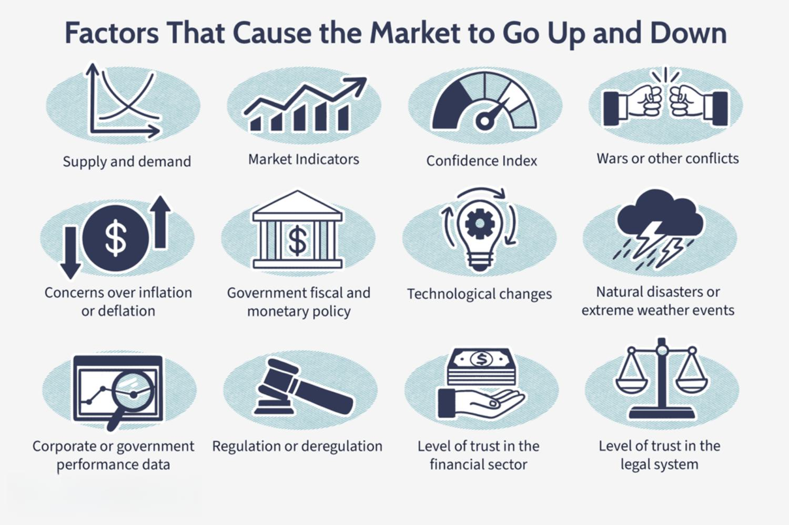

China, as the world’s second-largest economy, plays a pivotal role in global economic dynamics. Understanding its Gross Domestic Product (GDP) and various economic indicators is crucial for analysts and investors seeking to navigate the complexities of international markets. China's economic significance is underscored by its rapid growth over the past few decades, transitioning from a centrally planned economy to a more market-oriented one.

This article aims to explore the significant economic indicators of China's GDP, shedding light on the complex mechanisms that drive one of the world's most influential economies. Analysts and investors must be equipped with insights into these indicators to make informed decisions, considering factors such as GDP growth rates, industrial output, and consumer spending. By understanding these indicators, stakeholders can better assess the health and trajectory of China's economic landscape.

The evolution of China's economy is marked by a shift from an agrarian society to an industrial and manufacturing powerhouse. This transformation has brought about unprecedented economic growth, affecting global supply chains and market dynamics. The interaction between China's economic data and market sentiment is a focal point for stakeholders worldwide who are interested in anticipating trends and potential shifts in economic policies.

However, challenges abound when dealing with Chinese economic statistics. Concerns regarding data transparency and reliability pose significant hurdles for those attempting to interpret official figures accurately. These concerns highlight the need for robust analytical tools and methodologies to scrutinize and verify the data presented.

In the evolving landscape of digital finance, algorithmic trading has emerged as a powerful tool in interpreting and acting on China's economic indicators. Utilizing advanced algorithms capable of processing vast amounts of data, traders can make rapid decisions that align with market developments. As such, algorithmic trading could potentially redefine how analysts and investors engage with China's economy, offering new ways to interpret its multifaceted economic data.

In summary, understanding China's GDP and economic indicators is critical for grasping global economic trends. As these metrics evolve, so too must the methods by which they are analyzed, paving the way for innovative approaches such as algorithmic trading to play a significant role in future economic engagements.

## Table of Contents

## Historical Context of China's Economy

China's economic evolution over the past few decades stands as one of the most remarkable transformations in modern economic history. This transition embarked in the late 1970s when the Chinese government introduced a series of capitalist market reforms. These reforms began in 1978 under the leadership of Deng Xiaoping, marking the start of China's pivot from a centrally planned economy to a more market-oriented one. These changes facilitated significant shifts in the country's economic structure, characterized by a move from a predominantly agrarian-based economy to becoming a global manufacturing powerhouse. 

By the early 21st century, China had successfully established itself as the largest agricultural and manufacturing economy in the world, a position supported by large-scale domestic and foreign investments in infrastructure, technology, and human capital. The strategy centered around leveraging China's abundant labor force to fuel the growth of labor-intensive manufacturing industries, making China the world’s manufacturing hub, often referred to as "the world's factory."

In recent years, China has strategically pivoted its economic model to place greater emphasis on domestic consumption, aiming to achieve a more balanced and sustainable form of economic growth. This shift is part of the broader transition towards an economy characterized by higher value-added manufacturing and services, technology-driven industries, and a burgeoning consumer market. Nevertheless, this transformation has not been without challenges. 

As China's economy matures, it is experiencing a natural slowdown in growth, a common phase in developed economies. The rapid double-digit GDP growth rates that characterized the early years of reform have gradually slowed to more sustainable single-digit growth figures. This deceleration reflects both the structural adjustments occurring domestically and the broader global economic environment, emphasizing the importance of sustainable growth practices in the country’s continued economic development. 

In summary, China's historical economic progression is a testament to its adaptation and strategic shifts in policy and practice, positioning itself as a vital player in the global economy while facing future challenges associated with maintaining sustainable and balanced growth.

## Major Economic Indicators of China's GDP

The analysis of China's Gross Domestic Product (GDP) and its major economic indicators provides an essential framework for understanding the complexities of the country's economic dynamics. At the forefront of reporting China’s economic data is the National Bureau of Statistics (NBS), which classifies the GDP into three main sectors: primary (agriculture), secondary (industry), and tertiary (services). This classification is pivotal as it illustrates the economic transformation from an agrarian-based economy to a diverse industrial and service-oriented giant.

While the NBS is responsible for disseminating key economic [statistics](/wiki/bayesian-statistics), the reliability of its data has been a subject of global scrutiny. Concerns arise from perceptions of political interference and the influence of economic policy goals on data representation. Such skepticism compels economists and analysts to seek supplementary data sources to corroborate findings and make informed analyses.

Among these supplementary sources are international bodies such as the Organisation for Economic Co-operation and Development (OECD) and The Conference Board, which provide additional layers of insight through alternative economic indicators. These organizations assess a wide array of economic factors, thus enhancing the understanding of China's economic environment beyond NBS data alone.

Critical economic indicators used to evaluate China’s GDP include real GDP, which adjusts for inflation and reflects the true value of goods and services produced. The GDP growth rate is another vital metric, indicating how quickly the economy is expanding or contracting over a specific period. Similarly, the balance of trade, which measures the difference between a country's exports and imports, serves as a critical indicator of economic health and competitiveness.

Another specialized indicator is the Purchasing Managers' Index (PMI), which offers insights into the manufacturing and service sectors’ economic activities. This index is useful for capturing business sentiment and forecasting future economic performance.

Collectively, these economic metrics provide a multifaceted view of China's economic strength and trajectory. The interplay between these indicators highlights the robust yet intricate nature of China's market, guiding investors, policymakers, and analysts in their decision-making processes. By synthesizing data from both national and international sources, a more comprehensive picture of China’s economic standing and its potential future developments can be constructed.

## Challenges in Interpreting China's Economic Data

Interpreting China's economic data presents significant challenges, primarily due to concerns about transparency and accuracy. The reliability of data released by the National Bureau of Statistics (NBS) has come under scrutiny from both domestic critics and international observers. Critics point to discrepancies and potential political influences in reported figures, which can lead to skepticism among analysts and investors who rely on this data for economic forecasting and decision-making.

The rapid and multifaceted evolution of China's economy adds additional complexity. China's transition from an agrarian society to a global manufacturing hub, and now towards a consumption-driven economy, means that data must be interpreted in the context of a continuously shifting landscape. This dynamic environment can lead to variations in data collection methods, further complicating accurate assessment and analysis.

Despite these challenges, China is a focal point for global economic strategy and policy planning. Its immense economic size and growth trajectory mean that even slightly inaccurate metrics can have a substantial ripple effect worldwide. Thus, international organizations and investors strive to interpret and understand China's economic indicators more accurately.

Many analysts have turned to external sources for alternative perspectives on China's economic performance. The Organization for Economic Co-operation and Development (OECD), for instance, provides Composite Leading Indicators which are considered by some to offer a more reliable gauge. These indicators are designed to predict turning points in economic activity relative to trend, providing an independent framework to cross-check against official Chinese data.

In conclusion, while the path to interpreting China's economic data is riddled with challenges, its importance in the global economy necessitates continual efforts to enhance data transparency and reliability, utilizing both local and international analytical resources.

## The Role of Algorithmic Trading in China's Economy

Algorithmic trading has become a significant force in China's financial markets, leveraging sophisticated computational techniques to enhance trading efficiency. This form of trading utilizes advanced statistical models, mathematical equations, and machine-learning algorithms to interpret economic indicators and execute trades. In the context of China's economy, these techniques allow traders to react promptly to new data, effectively capturing market opportunities that manual trading may overlook.

The increasing prevalence of [algorithmic trading](/wiki/algorithmic-trading) in China is largely due to its ability to process vast amounts of economic data rapidly. Economic signals from indicators such as China's Gross Domestic Product (GDP), Purchasing Managers' Index (PMI), and trade balance can be quickly absorbed and acted upon. This agility is particularly crucial in a market environment characterized by frequent and swift changes in economic conditions.

A key advantage of algorithmic trading is its capability to implement complex trading strategies that account for various economic indicators and market dynamics. Algorithms can be designed to automatically buy or sell assets based on predetermined criteria, such as fluctuations in GDP growth rate or shifts in PMI values. This automated decision-making process minimizes human error and emotional bias, potentially leading to more consistent trading outcomes.

However, traders employing algorithmic systems in China face distinct challenges, particularly concerning data transparency and the accuracy of economic reporting. The inconsistency between Chinese economic data and international standards can create discrepancies, making it difficult to harmonize algorithmic trading strategies with global market reactions. This difficulty necessitates robust algorithms capable of adjusting to possible data unreliabilities and variations in reporting standards.

Despite the complexities involved, the opportunities afforded by algorithmic trading in China are considerable. Investors seeking to leverage China’s economic growth must navigate these challenges strategically, using algorithms to capitalize on the nuances of the Chinese economy. By doing so, they can gain a competitive edge in understanding and interpreting the signals emanating from one of the world's most dynamic financial markets.

In conclusion, as China's economic landscape continues to evolve, the role of algorithmic trading will likely expand, offering new insights and investment opportunities in response to China's multifaceted economic indicators.

## Conclusion

China's economic indicators serve as fundamental components in the analysis of global economic dynamics. Their complexity reflects a rapidly evolving economy that requires sophisticated tools for accurate interpretation and forecasting. One of the primary challenges faced by analysts is the transparency and reliability of economic data released by Chinese authorities. This has prompted the growing adoption of algorithmic trading, which relies on advanced statistical, mathematical, and [machine learning](/wiki/machine-learning) methodologies to extract actionable insights from economic indicators.

Algorithmic trading has emerged as a powerful tool in addressing the unpredictability inherent in China's economic data. It facilitates real-time analysis and can adjust swiftly to economic shifts, making it a valuable asset for investors trying to navigate China's complex landscape. These systems are designed to filter through noisy data and identify patterns that human analysts might miss, providing a more immediate reaction to fluctuations and enabling timely trading decisions.

Despite these advances, understanding China's GDP indicators and other economic metrics remains pivotal for global investors and economists. These indicators are essential not only for assessing China's internal economic health but also for determining its impact on the worldwide market. The nuances of China's economic data also mean that analysts must continually adapt their models to capture trends accurately.

As China continues to fine-tune its growth strategies, maintaining a close watch on its economic indicators will be crucial for anticipating future global economic trends. Algorithmic trading, with its capacity for rapid analysis and adaptation, is likely to transform how investors and analysts engage with China's economic data. It offers a sophisticated means of deciphering the vast array of signals emanating from the world's second-largest economy, thus providing significant strategic advantages in global economic forecasting.

## References & Further Reading

[1]: Perkins, D. H. (2013). *The Chinese Economy: Transitions and Growth*. Cambridge University Press.

[2]: Naughton, B. (2007). *The Chinese Economy: Transitions and Growth*. MIT Press.

[3]: Lee, J. (2010). ["Data Interpretation and the Impact of Chinese Economic Statistics"](https://wires.onlinelibrary.wiley.com/doi/abs/10.1002/wics.98). *The China Journal*, 63, 19-38.

[4]: Das, S. (2015). *The Age of Stagnation: Why Perpetual Growth is Unattainable and the Global Economy is in Peril*. Prometheus Books.

[5]: OECD. (2021). ["OECD Economic Surveys: China"](https://www.oecd-ilibrary.org/economics/oecd-economic-surveys-china_20725027). Organisation for Economic Co-operation and Development.

[6]: Zheng, Y., & Zhao, L. (2017). *Understanding China's Economic Indicators: Translating the Data into Investment Opportunities*. Wiley.

[7]: Lopez de Prado, M. (2018). *Advances in Financial Machine Learning*. Wiley.

[8]: Chan, E. P. (2009). *Quantitative Trading: How to Build Your Own Algorithmic Trading Business*. Wiley.

[9]: Jansen, S. (2018). *Machine Learning for Algorithmic Trading: Predictive Models to Extract Signals from Market and Alternative Data for Systematic Trading Strategies with Python*. Packt Publishing.

[10]: Bloomberg Terminal. ["Global Economic Indicators"](https://www.bloomberg.com/graphics/world-economic-indicators-dashboard/). Access to extensive global economic data, including China's indicators.