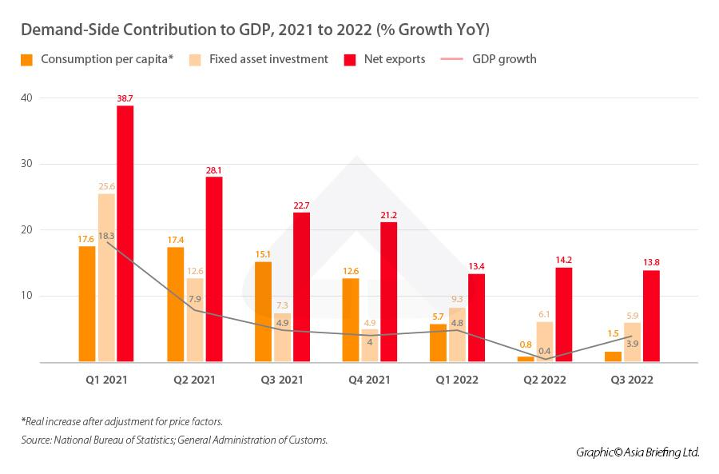

## Table of Contents

## What are economic indicators and why are they important?

Economic indicators are statistics that give information about the health of an economy. They help us understand how well a country's economy is doing. Some common economic indicators include things like unemployment rates, inflation rates, and gross domestic product (GDP). These numbers are collected and reported regularly, usually by government agencies or international organizations.

These indicators are important because they help people make decisions. For example, if the unemployment rate is high, people might be more careful with their money because they're worried about losing their jobs. Businesses use these indicators to decide whether to expand or cut back. Governments also use them to make policies that can help the economy grow or keep it stable. By keeping an eye on these indicators, everyone can get a better picture of what's happening in the economy and plan accordingly.

## What are some key economic indicators used to assess China's economy?

Some key economic indicators used to assess China's economy include Gross Domestic Product (GDP), which measures the total value of all goods and services produced in the country. GDP growth rate is watched closely because it shows how fast the economy is growing. Another important indicator is the Consumer Price Index (CPI), which tracks changes in the prices of goods and services that people buy. This helps to understand inflation, which is how much prices are going up over time. The unemployment rate is also crucial, as it shows how many people are out of work and looking for jobs.

In addition to these, China's trade balance is a significant indicator, showing the difference between what the country exports and imports. A positive trade balance means China is exporting more than it is importing, which is generally good for the economy. The Purchasing Managers' Index (PMI) is another key indicator, reflecting the economic health of the manufacturing sector. A PMI above 50 indicates expansion, while below 50 suggests contraction. These indicators together give a comprehensive view of China's economic performance and help policymakers, businesses, and investors make informed decisions.

## How is China's Gross Domestic Product (GDP) calculated and what does it indicate?

China's Gross Domestic Product (GDP) is calculated by adding up the total value of all goods and services produced within the country over a specific period, usually a year or a quarter. This includes everything from cars and clothes to haircuts and hotel stays. To avoid counting the same thing twice, only the value added at each stage of production is counted. For example, if a car manufacturer buys steel, the value of the steel is not counted again when the car is sold. Instead, only the difference between the price of the car and the cost of the steel is added to GDP. This method is called the value-added approach.

GDP indicates how well China's economy is doing. A high GDP means the country is producing a lot of goods and services, which usually means people are working and businesses are doing well. If GDP is growing, it shows the economy is getting bigger, and more money is being made. However, GDP alone doesn't tell the whole story. It doesn't show if the wealth is shared equally among people or if the growth is sustainable. Still, it's a key number that helps everyone understand the overall health of China's economy.

## What is the significance of China's Consumer Price Index (CPI) and how is it measured?

China's Consumer Price Index (CPI) is a really important number that tells us how much prices are going up for things people buy every day, like food, clothes, and gas. It's like a big shopping list that shows if it's getting more expensive to live in China. When the CPI goes up, it means there's inflation, which means people need more money to buy the same stuff they used to. This can make life harder for people if their salaries don't go up too. On the other hand, if the CPI stays the same or goes down, it means prices aren't changing much or are even getting cheaper, which can be good for people but might worry businesses if they can't sell their products for as much.

The CPI is measured by looking at the prices of a bunch of different things that people usually buy. The National Bureau of Statistics in China checks the prices of these items in lots of different places all over the country. They then compare these prices to what they were last month or last year. They give each item a weight, which means some things, like food, count more than others because people spend more money on them. By adding up all these weighted prices, they get the CPI number. This helps everyone from the government to regular people understand if they need to be ready for higher prices or if things are staying affordable.

## How does the Producer Price Index (PPI) reflect China's economic health?

The Producer Price Index (PPI) in China tells us how much the prices of things that factories and businesses sell to each other are changing. It's like checking the price tags on stuff before it gets to the stores where people buy them. When the PPI goes up, it means businesses are paying more for the things they need to make their products. This can be a sign that costs are going up, which might eventually make things more expensive for everyone if businesses pass those costs along.

If the PPI is going up a lot, it could mean that inflation is coming, because higher costs for businesses can lead to higher prices for consumers. But if the PPI is going down, it might mean that businesses are not doing as well, because they can't charge as much for what they make. The government and businesses watch the PPI closely because it helps them understand if the economy is growing or if there might be problems ahead. By keeping an eye on the PPI, they can make plans to keep the economy stable and help businesses and people prepare for changes.

## What role does the unemployment rate play in understanding China's economic situation?

The unemployment rate in China is a big clue about how the economy is doing. It tells us how many people who want jobs can't find them. If the unemployment rate is low, it means more people have jobs, which is good because it shows the economy is strong and businesses are doing well. When lots of people are working, they earn money and spend it, which helps the economy grow even more.

On the other hand, if the unemployment rate is high, it means more people are out of work and looking for jobs. This can be a sign that the economy is not doing so well. When people don't have jobs, they have less money to spend, which can slow down the economy. The government and businesses pay close attention to the unemployment rate because it helps them make plans to help people find jobs and keep the economy healthy.

## How do foreign exchange reserves impact China's economy and what are the current trends?

Foreign exchange reserves are like a big savings account for a country, and for China, they are really important. These reserves are the money that China has in other countries' currencies, like dollars or euros. They help China buy things from other countries, keep its own money stable, and deal with any money problems that come up. If China has a lot of foreign exchange reserves, it means the country can handle big changes in the world economy better. It's like having a safety net that makes people and businesses feel more secure.

Right now, China has one of the biggest foreign exchange reserves in the world. But the amount of these reserves can go up and down because of what's happening in the world economy. For example, if China is selling more stuff to other countries than it's buying, its reserves might grow. But if the world economy is not doing well, or if there are big changes in money markets, the reserves might go down. Lately, China has been trying to keep its reserves stable, which shows it wants to make sure its economy stays strong no matter what happens around the world.

## What is the importance of the Manufacturing Purchasing Managers' Index (PMI) for China?

The Manufacturing Purchasing Managers' Index (PMI) is really important for understanding how China's factories and industries are doing. It's like a report card that shows if the manufacturing part of China's economy is growing or shrinking. The PMI number is based on surveys of managers who buy things for factories. If the PMI is above 50, it means the manufacturing sector is getting bigger, which is good news because it shows more jobs and more production. If it's below 50, it means things are slowing down, which might worry people because it could mean fewer jobs and less stuff being made.

Right now, keeping an eye on the PMI is crucial for China because manufacturing is a big part of its economy. When the PMI goes up, it can make people feel more confident about the future, and businesses might decide to invest more. But if the PMI goes down, it can be a warning sign that the economy might need some help. The government and businesses use the PMI to make plans and decisions, like whether to build more factories or to help workers find new jobs if things slow down.

## How does the Services PMI provide insights into China's service sector performance?

The Services PMI is a helpful tool that tells us how well China's service businesses, like restaurants, hotels, and shops, are doing. It's based on surveys of managers who buy things for these businesses. If the Services PMI number is over 50, it means the service sector is growing, which is good because it shows more people are using these services and more jobs are being created. If it's below 50, it means the service sector is shrinking, which can be worrying because it might mean fewer jobs and less money being spent.

Right now, the Services PMI is important because the service sector is a big part of China's economy. When the Services PMI goes up, it can make people feel more confident about spending money and businesses might decide to open more shops or hire more workers. But if the Services PMI goes down, it can be a sign that the economy needs some help. The government and businesses watch this number closely to make plans and decisions that can help keep the service sector strong and growing.

## What are the implications of China's trade balance and how is it calculated?

China's trade balance shows if the country is selling more stuff to other countries than it's buying from them. It's like checking if you're making more money than you're spending. If China exports more than it imports, it has a trade surplus, which is good because it means more money is coming into the country. But if China is importing more than it's exporting, it has a trade deficit, which can be a problem because it means the country is spending more money than it's [earning](/wiki/earning-announcement) from trade.

To calculate the trade balance, you take the total value of everything China sells to other countries (exports) and subtract the total value of everything it buys from other countries (imports). If the result is a positive number, that's the trade surplus. If it's negative, that's the trade deficit. This number is important because it helps everyone understand how well China is doing in the world market and can affect decisions about money and jobs.

## How do fiscal policies in China influence economic indicators?

Fiscal policies in China, like how the government spends money and collects taxes, can really change the numbers we see in economic indicators. When the government decides to spend more money on things like building roads or helping people, it can make the economy grow faster. This can show up in a higher GDP because more goods and services are being made. Also, if the government gives people money or tax breaks, they might spend more, which can push up the Consumer Price Index (CPI) if prices start to rise because of more demand.

On the other hand, if the government decides to cut spending or raise taxes, it can slow down the economy. This might lead to a lower GDP growth rate because less money is being spent on making things. It can also affect the unemployment rate, making it go up if businesses can't afford to keep as many workers. The trade balance can change too, because if the government changes taxes on imports or exports, it can make China buy or sell more stuff to other countries. So, by changing fiscal policies, the government can influence a lot of the key numbers that tell us how the economy is doing.

## What advanced metrics, such as the Gini coefficient, tell us about income inequality in China?

The Gini coefficient is a number that helps us understand how evenly money is shared among people in China. It goes from 0 to 1, where 0 means everyone has the same amount of money, and 1 means one person has all the money and everyone else has nothing. In China, the Gini coefficient has been pretty high for a while, which means there's a big difference between rich and poor people. This can be a problem because when a few people have most of the money, it can make life harder for everyone else.

The government in China keeps an eye on the Gini coefficient because it wants to make sure everyone has a fair chance. If the Gini coefficient is too high, the government might try to help by making policies that give more money or help to poorer people. This can include things like better schools, more jobs, or even giving money directly to people who need it. By watching this number, the government can work to make sure that the gap between rich and poor doesn't get too big, which is important for keeping the country stable and happy.

## References & Further Reading

[1]: Perkins, D. H. (2013). *The Chinese Economy: Transitions and Growth*. Cambridge University Press.

[2]: Naughton, B. (2007). *The Chinese Economy: Transitions and Growth*. MIT Press.

[3]: Lee, J. (2010). ["Data Interpretation and the Impact of Chinese Economic Statistics"](https://wires.onlinelibrary.wiley.com/doi/abs/10.1002/wics.98). *The China Journal*, 63, 19-38.

[4]: Das, S. (2015). *The Age of Stagnation: Why Perpetual Growth is Unattainable and the Global Economy is in Peril*. Prometheus Books.

[5]: OECD. (2021). ["OECD Economic Surveys: China"](https://www.oecd-ilibrary.org/economics/oecd-economic-surveys-china_20725027). Organisation for Economic Co-operation and Development.

[6]: Zheng, Y., & Zhao, L. (2017). *Understanding China's Economic Indicators: Translating the Data into Investment Opportunities*. Wiley.

[7]: Lopez de Prado, M. (2018). *Advances in Financial Machine Learning*. Wiley.

[8]: Chan, E. P. (2009). *Quantitative Trading: How to Build Your Own Algorithmic Trading Business*. Wiley.

[9]: Jansen, S. (2018). *Machine Learning for Algorithmic Trading: Predictive Models to Extract Signals from Market and Alternative Data for Systematic Trading Strategies with Python*. Packt Publishing.

[10]: Bloomberg Terminal. ["Global Economic Indicators"](https://www.bloomberg.com/graphics/world-economic-indicators-dashboard/). Access to extensive global economic data, including China's indicators.