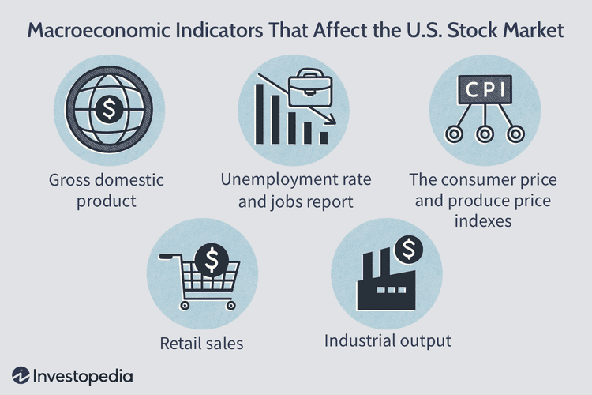

The modern financial landscape is characterized by a complex interplay of various influences, notably economic indicators, market trends, and advancements in algorithmic trading. Each of these elements plays a critical role in determining the trajectory of financial stocks and the overall market dynamics. Economic indicators provide essential insights into the economic health and performance of a country, affecting investor sentiment and market reactions. Key indicators such as interest rates, gross domestic product (GDP), and housing data offer valuable information on economic stability and growth potential.

Simultaneously, market trends are shaped by diverse factors, including geopolitical events, investor confidence, and actions of major financial entities like investment firms and hedge funds. The amalgamation of these influences can lead to significant shifts in stock prices, requiring traders to remain vigilant and informed about global developments.



In recent times, algorithmic trading has revolutionized the financial sector by introducing automated strategies that execute trades based on pre-defined parameters. This technological advancement leverages speed and precision to capitalize on fleeting market opportunities, thus reshaping decision-making processes within the industry.

Our objective is to provide a thorough understanding of how market influence, economic indicators, and algorithmic trading converge to impact financial stocks, addressing both individual investors and institutional players. By examining these components, readers will gain a comprehensive perspective on the forces governing financial markets and develop the ability to strategically navigate this ever-evolving landscape.

## Table of Contents

## Understanding Market Influence

Markets are influenced by a diverse range of factors, which can be broadly classified into economic reports, geopolitical events, and investor sentiment. These elements interact dynamically, collectively swaying stock prices and market trends. Economic reports, such as employment figures, inflation data, and manufacturing output, serve as a critical source of information for investors. These reports offer snapshots of economic conditions, enabling investors to gauge economic health and potential growth.

Geopolitical events, including elections, policy changes, and international conflicts, also play a pivotal role in influencing markets. Such events can create uncertainty, leading to increased volatility in stock prices. For instance, unexpected changes in government policies can affect sectors differently, depending on industries tied to legislation or international trade policies.

Investor sentiment is another significant force impacting stock prices. Often driven by news and perceived future economic conditions, investor sentiment can lead to market overreactions and subsequent corrections. For example, positive developments, like the advent of new technologies, can generate optimism and drive prices upward, while negative news, such as corporate scandals, can prompt sharp declines.

Major players in the market, such as investment firms and hedge funds, contribute to shaping market trends through large-scale trading strategies. These entities often employ sophisticated models and data analytics to inform their trades. As a result, their activities can lead to shifts in market dynamics, particularly when substantial volumes of assets are moved. For example, a large investment fund buying significant shares in a company could drive up its stock price, potentially attracting retail investors to follow suit.

Understanding these market forces is crucial for traders who seek to position themselves effectively in anticipation of market shifts. By analyzing patterns and interpreting signals from economic reports and geopolitical developments, traders can make informed decisions. Moreover, staying abreast of global events and emerging trends is essential for navigating financial markets successfully. 

To gain a strategic advantage, traders may employ a variety of analytical tools and platforms to scrutinize market data and trends. This continual assessment allows traders to adjust their strategies proactively in response to market shifts, thus optimizing their potential for success in a complex and fluid financial environment.

## Key Economic Indicators That Impact Financial Stocks

Economic indicators are vital tools for assessing the vitality of an economy, subsequently influencing the stock market. They provide quantitative measures that reflect the economic activities and trends that can sway investor confidence and decision-making.

Interest rates stand as one of the most pivotal economic indicators. They dictate the cost of borrowing money, influencing both consumer spending and business investment. Lower interest rates typically reduce the cost of financing purchases for both consumers and businesses, often leading to increased expenditure and investment in growth opportunities. Conversely, higher rates might curb spending and borrowing due to increased costs. Thus, stock markets often react swiftly to changes in [interest rate](/wiki/interest-rate-trading-strategies) policies set by central banks like the Federal Reserve in the United States.

Gross Domestic Product (GDP) is another significant indicator, representing the total economic output of a country. As a measure of economic health, GDP growth signals an expanding economy with increasing consumer and business activities, often boosting investor confidence. Conversely, a shrinking GDP might indicate economic trouble, potentially leading to a decline in stock markets. Economists and investors closely monitor both quarterly and annual GDP reports to gauge the economic direction and adjust their market strategies accordingly.

Government policy and regulation play a crucial role as economic indicators. Fiscal policy, involving government spending and taxation, directly impacts economic conditions by influencing aggregate demand. Expansionary fiscal policies, characterized by increased government spending or tax reductions, can stimulate economic growth, positively affecting stock markets. In contrast, contractionary policies might dampen economic activities, possibly leading to negative market reactions. Regulatory changes, such as modifications in banking regulations or trade policies, can also significantly impact financial stocks by altering the economic landscape within which businesses operate.

Housing data is another indicator of economic health. Metrics such as existing home sales provide insights into consumer confidence and spending power. High home sales generally suggest strong consumer finances and confidence, positively impacting retailers, home improvement companies, and financial stocks tied to real estate. On the other hand, a slowdown in the housing market might reflect broader economic challenges, potentially dampening expectations for economic growth and affecting related stocks.

Incorporating economic indicators like interest rates, GDP, government policy, and housing data into market strategies allows investors to better anticipate market shifts and make informed decisions regarding their stock portfolios. Understanding these indicators' influence can provide a strategic edge in navigating financial markets.

## The Role of Algorithmic Trading

Algorithmic trading, often abbreviated as algo trading, utilizes sophisticated algorithms and automated software to execute trades based on pre-determined criteria. This method leverages the power of computing to achieve rapid execution of trades, exploiting tiny market inefficiencies that may last only fractions of a second. By automating decision-making processes, algo trading minimizes the influence of human emotions on trade outcomes, thereby enhancing accuracy and speed.

The core advantage of algo trading lies in its ability to process vast amounts of data and execute trades at speeds unachievable by human traders. Algorithms can be programmed to follow specific patterns and react to changes in market conditions. For example, high-frequency trading ([HFT](/wiki/high-frequency-trading-strategies)), a subset of algo trading, seeks to profit from low-latency trade execution and has become a significant part of the trading landscape.

Common technical indicators employed in algo trading strategies include moving averages and the Relative Strength Index (RSI). Moving averages smooth out price data to identify trend directions over short or long periods, which helps in determining entry and [exit](/wiki/exit-strategy) points for trades. The RSI, on the other hand, measures the magnitude of recent price changes to evaluate overbought or oversold conditions in a market. These indicators, among others, are crucial in developing strategies that can generate consistent returns.

```python
# Example of a simple moving average calculation in Python
def moving_average(prices, window_size):
    """Calculate the moving average of a given price list."""
    if len(prices) < window_size:
        raise ValueError("Window size must be smaller than the length of the price list.")
    return [sum(prices[i:i+window_size]) / window_size for i in range(len(prices) - window_size + 1)]

prices = [10, 20, 30, 40, 50, 60, 70, 80, 90, 100]
window = 3
print(moving_average(prices, window))
```

Despite its advantages, algo trading is not devoid of risks. Algorithms are susceptible to the same market conditions that affect traditional trading, such as [volatility](/wiki/volatility-trading-strategies) spikes or unexpected economic events. Additionally, the reliance on technology means that technical failures or errors in the algorithm can lead to significant financial losses. To mitigate these risks, algos must be continuously refined and adapted to the ever-changing market landscapes. 

Furthermore, the competitive nature of algo trading necessitates constant innovation and improvement. As market participants update their algorithms, the edge provided by any single strategy may erode over time. Therefore, traders and firms engage in algo trading must remain vigilant, ensuring their algorithms incorporate the latest market data and analytical techniques. This ongoing refinement process is critical for maintaining a competitive advantage in dynamic financial markets.

## Adapting to Market Realities

Understanding both technical indicators and market realities is crucial for successful trading. Technical indicators, such as moving averages and the Relative Strength Index (RSI), provide insights into market trends and [momentum](/wiki/momentum). However, relying solely on these indicators can lead to an incomplete picture. Incorporating both technical and [fundamental analysis](/wiki/fundamental-analysis) offers a more comprehensive approach to market assessment. Fundamental analysis examines economic indicators, company performance, and broader economic conditions to provide context to technical signals.

Traders should be aware of both macroeconomic indicators and micro-level market changes to make informed decisions. Macroeconomic indicators, such as interest rates and GDP growth, can have substantial impacts on financial markets. These indicators often signal broader economic shifts that can influence stock prices and market trends. Micro-level changes, such as company earnings reports, mergers, or changes in management, can also have significant effects on individual stocks and sectors.

Risk management is an essential component of trading strategies, especially in volatile or rapidly shifting markets. Effective risk management involves setting stop-loss orders, diversifying portfolios, and determining position sizes based on risk tolerance. By limiting potential losses, traders can safeguard their investments against unforeseen market movements. The use of risk management tools can help traders maintain a disciplined approach, mitigating the emotional influence that often accompanies market volatility.

Flexibility and adaptability are important traits for traders to maintain success in dynamic financial markets. Markets are constantly influenced by new economic data, geopolitical events, and unexpected developments. Successful traders are those who can quickly adjust their strategies in response to these changes. This adaptability requires continual monitoring of market conditions and the ability to modify trading algorithms or strategies accordingly.

As financial markets evolve, staying informed and continuously updating one's knowledge base is crucial. This might involve leveraging new analytical tools, such as [machine learning](/wiki/machine-learning) models, to analyze vast datasets or integrating [alternative data](/wiki/best-alternative-data) sources to enhance trading strategies. In doing so, traders can ensure that their approaches remain relevant and effective amidst changing market environments. Embracing a mindset that values learning and flexibility can greatly enhance a trader's ability to navigate the complexities of modern financial markets.

## Conclusion

Market influence, economic indicators, and [algorithmic trading](/wiki/algorithmic-trading) collectively form the backbone of modern financial markets. Each element interacts with and influences the others, creating a complex web that impacts financial stock performance and investor decisions. Understanding this interconnectedness is crucial for traders seeking a strategic advantage.

Firstly, market influence encompasses various factors including investor sentiment, geopolitical events, and actions by major market players like hedge funds and investment firms. These factors can cause market shifts that may seem unpredictable but often follow underlying patterns related to economic conditions and public perception.

Economic indicators, such as interest rates, GDP, and housing data, offer essential insights into the health of the economy. They help predict trends and guide investment strategies. For instance, low-interest rates can stimulate borrowing and spending, potentially boosting stock prices. Conversely, high rates might lead to lower economic activity and stock market declines.

Algorithmic trading leverages technology to execute trades based on predefined criteria. It capitalizes on speed, executing transactions more rapidly than human traders could. This automation allows for exploiting market inefficiencies but requires continuous adaptation to remain effective amid evolving market conditions. Algorithms can process large volumes of data, applying mathematical models and technical analysis to identify investment opportunities.

By staying informed, investors can anticipate market shifts and optimize their strategies. As technology and data availability continue to improve, the influence of algorithmic trading is likely to increase, further intertwining with economic indicators and market influences. Investors should thus focus on ongoing education, keeping abreast of market trends and emerging technologies to remain competitive.

This continual learning approach ensures that investors are prepared to adapt their strategies according to changing market dynamics. By understanding how market influence, economic indicators, and algorithmic trading interact, they position themselves to navigate the complexities of financial stocks more effectively.

## References & Further Reading

[1]: Bergstra, J., Bardenet, R., Bengio, Y., & Kégl, B. (2011). ["Algorithms for Hyper-Parameter Optimization."](https://dl.acm.org/doi/10.5555/2986459.2986743) Advances in Neural Information Processing Systems 24.

[2]: ["Advances in Financial Machine Learning"](https://www.amazon.com/Advances-Financial-Machine-Learning-Marcos/dp/1119482089) by Marcos Lopez de Prado

[3]: ["Evidence-Based Technical Analysis: Applying the Scientific Method and Statistical Inference to Trading Signals"](https://www.amazon.com/Evidence-Based-Technical-Analysis-Scientific-Statistical/dp/0470008741) by David Aronson

[4]: ["Machine Learning for Algorithmic Trading"](https://github.com/stefan-jansen/machine-learning-for-trading) by Stefan Jansen

[5]: ["Quantitative Trading: How to Build Your Own Algorithmic Trading Business"](https://www.amazon.com/Quantitative-Trading-Build-Algorithmic-Business/dp/1119800064) by Ernest P. Chan