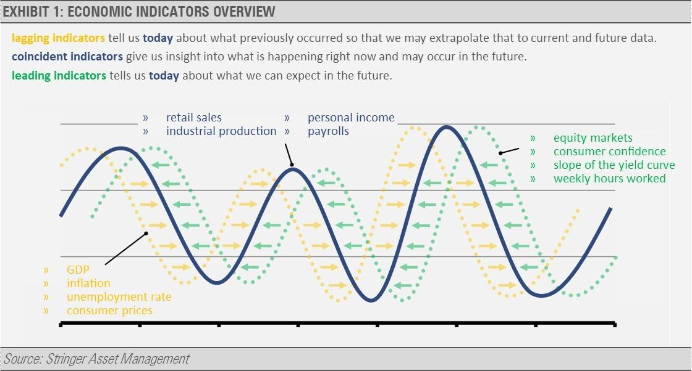

Economic indicators are essential tools for assessing the health and trajectory of an economy. These indicators are integral to economic analysis, providing insights that influence fiscal policy, business strategy, and investment decisions. They are typically classified into three categories: leading, lagging, and coincident indicators. Each category serves a distinct purpose, with leading indicators forecasting future economic events, lagging indicators confirming existing trends, and coincident indicators reflecting the current state of economic conditions. Understanding these classifications is crucial for both investors and policymakers as they navigate economic landscapes and anticipate potential changes.

Leading indicators, such as stock market returns and consumer sentiment indices, attempt to predict the direction of the economy before the trend becomes evident. They are indispensable for traders looking to capitalize on emerging market movements. Lagging indicators, including measures like the unemployment rate and corporate profits, confirm longer-term economic trends after they have unfolded. Despite their retrospective view, they provide valuable validation of prevailing economic conditions. Coincident indicators, such as Gross Domestic Product (GDP) and industrial production, offer real-time data that mirrors the present state of the economy.



This article focuses on the application of these economic indicators within the scope of algorithmic trading. The use of predictive models and data-driven strategies underscores the utility of these indicators in forecasting market movements and enhancing decision-making processes. The discussion will highlight their roles, benefits, and limitations, emphasizing the importance of integrating these indicators in trading algorithms to optimize performance and manage risk effectively.

## Table of Contents

## What Are Economic Indicators?

Economic indicators are vital statistics that help signal the broader trends in an economy, serving as essential tools for predicting and understanding both financial and economic shifts. They encompass a wide range of data types, including social statistics such as population growth rates, business statistics like manufacturing output, and government-released data such as unemployment rates and GDP growth figures. These indicators are often categorized into three main types: leading, lagging, and coincident, each providing unique insights into the economic cycle.

The importance of economic indicators lies in their ability to influence critical decisions across various domains. For instance, policymakers utilize these indicators to develop and adjust fiscal policies, ensuring that economic stability and growth are maintained. In the business sphere, companies analyze economic indicators to refine their strategies, optimize operations, and navigate market dynamics more effectively. Investors also rely heavily on these indicators when making portfolio decisions, seeking to capitalize on potential market opportunities or mitigate risks.

Economic indicators offer a data-driven foundation for decision-making processes and strategic planning. By analyzing patterns and trends within these [statistics](/wiki/bayesian-statistics), stakeholders can make informed choices, forecast potential economic conditions, and ultimately enhance their decision-making capabilities.

## Leading Indicators

Leading indicators are statistical measures that provide predictive insights into future economic activity by signaling potential trends before they materialize. These indicators are invaluable for traders and investors seeking to anticipate and leverage early market signals. Common examples of leading indicators include stock market returns, building permits, and the consumer sentiment index.

1. **Stock Market Returns**: The stock market is a forward-looking entity where investors base their decisions on expected economic conditions. Hence, changes in stock market returns often precede shifts in economic momentum. An increase in stock prices may indicate investor confidence in economic growth, while a decline may suggest impending economic slowdowns. However, it's crucial to recognize that stock market trends can be influenced by a variety of factors, not all of which directly correlate with economic fundamentals.

2. **Building Permits**: The number of building permits issued is a particularly potent leading indicator within the construction sector, as it reflects planned future construction activities. An increase in building permits typically suggests increased future construction activity, leading to higher employment and economic growth. Conversely, a decline may forecast reduced construction, potentially signaling economic contraction.

3. **Consumer Sentiment Index**: This index measures the overall economic confidence of consumers. High consumer confidence usually translates into increased consumer spending, which drives economic growth. Conversely, low confidence may indicate reduced spending, potentially pointing to a future economic downturn.

Leading indicators are crucial for anticipation of economic changes, allowing traders to adjust their strategies proactively. By analyzing these indicators, traders attempt to position themselves advantageously before widespread economic trends become apparent. For instance, an uptick in building permits might lead a trader to invest in construction-related stocks before the sector gains wider attention.

Importantly, while leading indicators provide valuable foresight, they are not infallible. They must be considered within a broader analytical framework that includes other types of economic indicators as well as qualitative factors. Traders often combine multiple leading indicators to reduce the influence of anomalies or sector-specific factors. This approach helps create a more accurate forecast of economic conditions, enhancing the decision-making process and increasing the potential for successful investment strategies.

## Lagging Indicators

Lagging indicators are critical components in the realm of economic analysis, serving as confirmation tools for trends or patterns that have already commenced within the economy. Unlike leading indicators, which attempt to forecast future movements, or coincident indicators that align with current economic conditions, lagging indicators provide retrospective insight, offering confirmation and validation to analysts and policymakers regarding prevailing trends.

One prominent example of a lagging indicator is the unemployment rate. This metric reflects the percentage of the labor force that is unemployed and actively seeking employment. The unemployment rate is invaluable because it reflects economic conditions after changes in the economy have occurred. For instance, a declining unemployment rate confirms that a previously identified upwards trend in economic recovery is indeed underway.

Another significant lagging indicator is corporate profits. This measure encapsulates total revenues minus the costs incurred by businesses and taxes paid, reflecting the profitability of companies within the economy. Corporate profits tend to increase after economic recovery has gained [momentum](/wiki/momentum), providing confirmation of sustained economic growth and stability.

While these indicators report events that have already transpired, they possess the capability to offer insights into ongoing economic shifts. For example, fluctuations in the unemployment rate can signal potential changes in consumer spending, a key driver of economic activity. Similarly, variations in corporate profits could presage adjustments in business investments, impacting future economic conditions.

The utility of lagging indicators primarily lies in their ability to validate long-term economic trends. By confirming trends, they aid analysts, investors, and policymakers in making informed decisions. In conjunction with other types of indicators, they help construct a comprehensive picture of the economic environment, assisting in strategic planning and policy formulation. Understanding and leveraging these indicators can enhance the accuracy of economic assessments and forecasts.

## Coincident Indicators

Coincident indicators serve as pivotal metrics for assessing the current state of an economy, offering real-time insights. Gross Domestic Product (GDP) and industrial production are quintessential examples of these indicators. GDP, representing the total value of all goods and services produced over a specific time period, is a comprehensive measure of a nation's overall economic output and health. Industrial production, on the other hand, tracks the output of the industrial sector, including manufacturing, mining, and utilities. Both indicators are released periodically, providing stakeholders with timely data to gauge economic momentum.

These indicators are crucial for understanding the present economic climate as they reflect the immediate effects of current economic policies and external factors. By analyzing changes in GDP or fluctuations in industrial production, policymakers can develop strategies that directly address economic challenges or take advantage of growth opportunities. Furthermore, coincident indicators are invaluable for businesses as they craft operational strategies to align with the prevailing economic conditions. Traders find these metrics beneficial as they can adjust their portfolios to current market realities, thereby managing risk more effectively.

The real-time nature of coincident indicators makes them indispensable for implementing adaptive strategies in economic planning and investment decision-making. They ensure that decisions are based on the most current data, reducing uncertainty and enhancing economic stability.

## Economic Indicators in Algorithmic Trading

Algorithmic trading utilizes economic indicators to anticipate market movements effectively. These indicators, encompassing leading, lagging, and coincident varieties, provide crucial inputs for constructing predictive models and strategies. These models assess future market trends and facilitate trading decisions based on anticipated economic conditions.

One of the critical aspects of leveraging economic indicators in [algorithmic trading](/wiki/algorithmic-trading) is the development of predictive models. These models analyze historical data to identify patterns and relationships between economic indicators and market movements. For example, a model might analyze the correlation between consumer sentiment and stock market performance, thereby predicting stock price changes based on shifts in consumer sentiment. 

The success of these predictive models heavily relies on [backtesting](/wiki/backtesting), a process that evaluates trading algorithms against historical data to determine their potential profitability and reliability. Backtesting allows traders to simulate how an algorithm would have performed in different economic conditions, offering insights into its robustness and effectiveness. This process can highlight strengths and weaknesses in the algorithm and help refine its parameters to enhance its performance.

Furthermore, real-time data integration plays a pivotal role in the efficacy of algorithmic trading. Economic indicators are often updated frequently, and trading algorithms must process this data instantly to make timely trading decisions. Real-time processing ensures that trading strategies can respond promptly to new information, such as sudden changes in GDP figures or industrial production reports, capturing opportunities or mitigating risks. The following Python snippet illustrates how real-time data can be integrated into a trading algorithm:

```python
import requests
import time

def fetch_real_time_data(api_url):
    response = requests.get(api_url)
    return response.json()

def execute_trading_strategy(data):
    # Sample trading strategy logic
    if data['indicator_value'] > some_threshold:
        print("Buy signal")
    else:
        print("Sell signal")

api_url = "https://api.example.com/economic_data"
while True:
    real_time_data = fetch_real_time_data(api_url)
    execute_trading_strategy(real_time_data)
    time.sleep(60)  # Fetch new data every minute
```

This example demonstrates a simple process where an algorithm retrieves real-time economic data from an API and employs it to decide whether to buy or sell based on a predefined threshold. The ability to continuously integrate fresh data ensures that trading algorithms are always operating with the most current and relevant information.

In summary, the use of economic indicators in algorithmic trading involves constructing predictive models to forecast market movements, backtesting these models to gauge their success under various economic conditions, and integrating real-time data to inform immediate trading decisions. This approach provides traders with a sophisticated toolkit for making informed, data-driven decisions in dynamic market environments.

## Challenges and Considerations in Using Economic Indicators

Ensuring the quality and integrity of data stands paramount for successful algorithmic trading involving economic indicators. The reliability of these indicators is contingent on their accuracy and the timeliness of the data. Discrepancies in data or delays in updates can skew algorithms, leading to suboptimal trading decisions. Integrating rigorous data validation processes and real-time data feeds is essential to mitigate such risks.

Market reactions to economic indicators often exhibit unpredictability, posing significant challenges. Traders can employ strategies such as diversification and hedging to buffer against unexpected market moves. An algorithm designed to handle large volumes of data can benefit from implementing [machine learning](/wiki/machine-learning) models to predict potential market reactions more accurately, although inherent uncertainties will always remain a [factor](/wiki/factor-investing).

Risk management is pivotal when applying economic indicators in algorithmic trading. Algorithms should be equipped with mechanisms to perform sensitivity analysis, allowing for the evaluation of economic indicator changes on portfolios. This involves setting stop-loss orders and maximum drawdown limits to safeguard capital and limit exposure to unfavorable market conditions.

Compliance with regulatory standards and ethical considerations is another critical aspect. Algorithms used in trading must adhere to the legal frameworks set by financial authorities, including the European Securities and Markets Authority (ESMA) and the U.S. Securities and Exchange Commission (SEC). These regulations often require transparency in algorithmic operations and specify standards for data privacy and protection. Additionally, ethical use mandates vigilance against market manipulation and front-running tactics.

To manage these challenges effectively, traders can employ a Python script for backtesting their algorithms, ensuring robust performance across historical economic scenarios:

```python
import pandas as pd

def backtest_strategy(data, strategy_func):
    """
    Backtest an algorithmic trading strategy.
    :param data: Historical market data with economic indicators
    :param strategy_func: Trading strategy function
    :return: Performance metrics
    """
    cash = 100000  # Initial capital
    portfolio_value = cash
    position = None

    for date, row in data.iterrows():
        if position is None:
            # Determine if the strategy suggests buying
            if strategy_func(row) == 'buy':
                position = portfolio_value / row['Close']  # Buy at close price
                cash = 0
        else:
            # Determine if the strategy suggests selling
            if strategy_func(row) == 'sell':
                cash = position * row['Close']
                position = None
        portfolio_value = cash if position is None else position * row['Close']

    return portfolio_value

# Example strategy that uses economic indicator
def example_strategy(row):
    if row['GDP'] > 2.0 and row['Unemployment'] < 5.0:
        return 'buy'
    else:
        return 'sell'

data = pd.read_csv('historical_data.csv')
performance = backtest_strategy(data, example_strategy)
print(f"Final Portfolio Value: ${performance:.2f}")
```

This script provides a framework for assessing how different economic indicators may influence trading decisions and overall performance, allowing traders to refine their algorithms in light of potential challenges and uncertainties.

## Conclusion

Economic indicators are indispensable tools for understanding and forecasting economic trends. They provide a quantitative basis upon which traders and investors can form expectations about future market conditions. In the context of algorithmic trading, these indicators serve as fundamental components for developing sophisticated models and strategies that can predict market movements with higher precision.

By leveraging economic indicators, algorithmic trading systems can enhance decision-making processes and improve risk management. For instance, leading indicators, such as stock market returns or consumer sentiment indices, can be integrated into algorithms to identify potential market shifts before they occur. Similarly, the use of coincident and lagging indicators provides context and confirmation of current and past trends, respectively, thus allowing algorithms to adapt their strategies dynamically.

As economic landscapes evolve due to factors like globalization, technological advancements, and policy changes, the continued integration and analysis of these indicators become even more critical. Staying updated with the latest data and refining algorithms accordingly ensure that trading strategies remain relevant and effective.

For traders and investors, maintaining an informed perspective on economic conditions is crucial. This involves not only understanding the indicators themselves but also being aware of how they interact with one another and the broader economic context. By doing so, market participants can better leverage these tools to optimize their trading decisions and capitalize on emerging opportunities.

## References & Further Reading

[1]: Bergstra, J., Bardenet, R., Bengio, Y., & Kégl, B. (2011). ["Algorithms for Hyper-Parameter Optimization."](https://proceedings.neurips.cc/paper/2011/file/86e8f7ab32cfd12577bc2619bc635690-Paper.pdf) Advances in Neural Information Processing Systems 24.

[2]: ["Advances in Financial Machine Learning"](https://www.amazon.com/Advances-Financial-Machine-Learning-Marcos/dp/1119482089) by Marcos Lopez de Prado

[3]: ["Evidence-Based Technical Analysis: Applying the Scientific Method and Statistical Inference to Trading Signals"](https://www.amazon.com/Evidence-Based-Technical-Analysis-Scientific-Statistical/dp/0470008741) by David Aronson

[4]: ["Machine Learning for Algorithmic Trading"](https://github.com/PacktPublishing/Machine-Learning-for-Algorithmic-Trading-Second-Edition) by Stefan Jansen

[5]: ["Quantitative Trading: How to Build Your Own Algorithmic Trading Business"](https://books.google.com/books/about/Quantitative_Trading.html?id=j70yEAAAQBAJ) by Ernest P. Chan