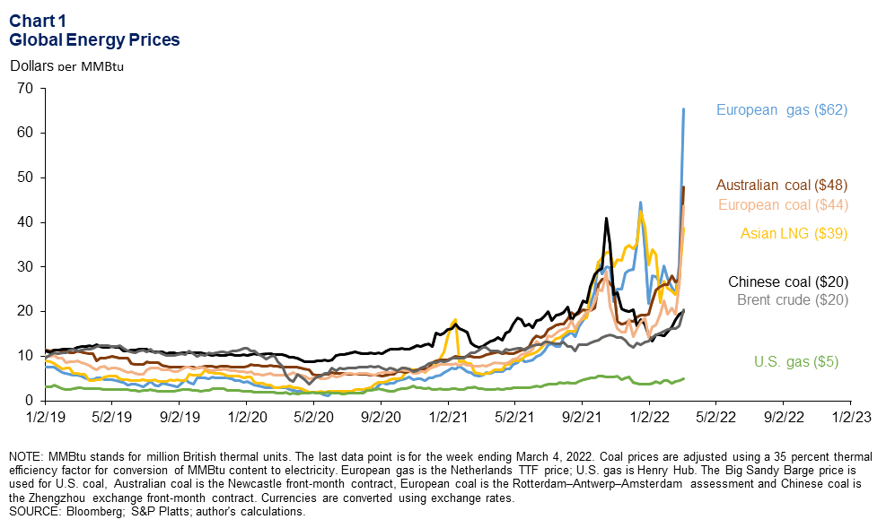

## Table of Contents

## What are economic indicators and why are they important for oil and gas investment?

Economic indicators are statistics that show how well an economy is doing. They can tell us about things like how many people have jobs, how much stuff people are buying, and how fast the economy is growing. These indicators are important because they help people who invest in oil and gas to make smart choices. If the economy is doing well, people might drive more and use more oil and gas. But if the economy is not doing well, people might use less, and that can affect the price of oil and gas.

For oil and gas investment, economic indicators are really useful because they can show if it's a good time to buy or sell. For example, if indicators show that the economy is growing, investors might think it's a good time to invest in oil and gas because demand will probably go up. On the other hand, if indicators show the economy is slowing down, investors might be more careful and wait for a better time to invest. This helps them make decisions that could lead to more money or less risk.

## How do oil prices affect investment decisions in the oil and gas sector?

Oil prices play a big role in deciding whether to invest in the oil and gas sector. When oil prices are high, it can be a good time to invest because companies in the oil and gas industry can make more money. This means they can pay bigger dividends to investors or use the money to grow their business. High oil prices can also make it easier for oil and gas companies to get loans because banks see them as less risky.

On the other hand, when oil prices are low, it can be a riskier time to invest. Low oil prices mean that oil and gas companies might not make as much money, which can lead to smaller dividends or even losses. This can make it harder for these companies to borrow money, and some might even have to cut back on their operations or go out of business. Investors need to think carefully about these risks and might decide to wait for oil prices to go up again before investing.

## What role does global demand for energy play in oil and gas investments?

Global demand for energy is a big deal when it comes to deciding whether to invest in oil and gas. If lots of people around the world need more energy, like when countries are growing fast or more people are buying cars, then the demand for oil and gas goes up. This can make it a good time to invest because oil and gas companies can sell more of their product and make more money. Investors like this because it means they might get more money back from their investments.

But if the global demand for energy is going down, it can be a riskier time to invest in oil and gas. This can happen if countries are using less energy because of new technology or if they're switching to other kinds of energy like solar or wind. When demand is low, oil and gas companies might not sell as much, and they might make less money. This can make investors think twice about putting their money into oil and gas, because they might not get as much back as they hoped.

## How do geopolitical events influence oil and gas investment strategies?

Geopolitical events can shake up the oil and gas world a lot. Things like wars, new laws, or disagreements between countries can change how much oil and gas is available or how much it costs. If there's a problem in a big oil-producing country, like if they can't send out as much oil because of a war, then the price of oil might go up because there's less of it to go around. This can make oil and gas companies more valuable, and investors might want to put their money into them hoping to make more money. But it can also be risky because no one knows how long the problem will last or how bad it will get.

Also, changes in government policies can affect oil and gas investments. For example, if a country decides to put a tax on oil or make new rules about how oil can be produced, it can make things harder for oil and gas companies. This might make investors more cautious because they're not sure how these changes will affect the companies they're thinking about investing in. On the other hand, if a country makes it easier to produce oil, like by giving tax breaks or relaxing rules, it might be a good time for investors to get involved because the companies could do better and make more money.

## What are the key financial ratios to consider when evaluating oil and gas companies?

When looking at oil and gas companies, it's good to check out a few key financial ratios. One important ratio is the price-to-earnings (P/E) ratio, which tells you how much investors are willing to pay for each dollar of the company's earnings. A lower P/E might mean the stock is a good deal, but you have to think about other things too, like how the company is doing compared to others in the industry. Another useful ratio is the debt-to-equity ratio, which shows how much the company is borrowing compared to what the owners have put in. A high debt-to-equity ratio can be risky, especially if oil prices drop, because it might be hard for the company to pay back what it owes.

Another ratio to consider is the return on equity (ROE), which shows how well the company is using the money that shareholders have invested to make a profit. A higher ROE is usually better because it means the company is making more money with the money it has. The reserve replacement ratio is also important for oil and gas companies. It tells you if the company is finding new oil and gas to replace what it's using up. If this ratio is less than 100%, the company might run out of oil and gas over time, which is not good for investors. By looking at these ratios, you can get a better idea of whether an oil and gas company is a good investment.

## How does the U.S. rig count impact investment in the oil and gas industry?

The U.S. rig count is the number of active drilling rigs in the country. It's a big deal for people who want to invest in oil and gas because it shows how much oil and gas companies are looking for new oil. If the rig count goes up, it means companies think they can find more oil and make more money. This can make investors feel good about putting their money into oil and gas because it might mean more oil will be available soon, which could keep prices stable or even make them go down a bit.

But if the rig count goes down, it might mean companies are not looking for as much new oil. This can happen if oil prices are low and it's not worth it for companies to keep drilling. When the rig count drops, investors might worry that there won't be enough new oil coming, which could make prices go up. This can make investing in oil and gas riskier because it's harder to predict what will happen with oil prices and how well the companies will do.

## What is the significance of OPEC's decisions on oil production for investors?

OPEC, which stands for the Organization of the Petroleum Exporting Countries, makes decisions about how much oil its member countries will produce. These decisions can really affect the price of oil. If OPEC decides to produce less oil, there will be less oil available around the world, and the price of oil usually goes up. This can be good for investors because oil and gas companies might make more money when oil prices are high. But it can also make things more risky because if oil prices go too high, people might start using less oil, and that could hurt the companies in the long run.

On the other hand, if OPEC decides to produce more oil, there will be more oil available, and the price of oil usually goes down. This can be bad for investors because oil and gas companies might make less money when oil prices are low. But it can also make things less risky because lower oil prices might mean more people will use oil, and that could help the companies in the long run. So, investors need to keep a close eye on OPEC's decisions because they can change how much money they might make from their investments in oil and gas.

## How do technological advancements in extraction methods affect oil and gas investments?

Technological advancements in extraction methods can change the game for oil and gas investments. When new technology makes it easier and cheaper to get oil and gas out of the ground, like with fracking or better drilling techniques, it can be good for investors. This is because oil and gas companies can produce more oil and gas without spending as much money. More production can mean more profits for the companies, which can make their stocks more valuable. Investors might see this as a good time to put their money into these companies because they could get a bigger return on their investment.

But new technology can also make things more complicated. If a new way of getting oil and gas out becomes popular, it might lead to more oil and gas being available, which can drive down prices. This can be bad for investors because lower oil prices mean less money for oil and gas companies, and that can make their stocks less valuable. Also, some new technologies might be expensive to start using, so companies might need to spend a lot of money before they can start making more oil and gas. This can make investors nervous because it's a big risk if the new technology doesn't work out as planned.

## What are the environmental regulations that investors need to consider in the oil and gas sector?

Environmental regulations are rules that governments make to protect the environment. In the oil and gas sector, these rules can affect how much it costs to get oil and gas out of the ground and how companies can do their work. For example, there might be rules about how much pollution a company can make or what they need to do to clean up after they're done drilling. If these rules get stricter, it can cost oil and gas companies more money to follow them. This can make investors think twice about putting their money into these companies because they might not make as much profit.

But there's another side to it. Some investors care a lot about the environment and want to put their money into companies that are trying to be more eco-friendly. If an oil and gas company is doing a good job of following environmental rules and maybe even going beyond what they have to do, these investors might see it as a good investment. They think that companies that take care of the environment might do better in the long run because they won't have as many problems with the government or with people who care about the environment. So, environmental regulations can make some investors more interested in certain oil and gas companies.

## How do currency fluctuations impact oil and gas investment returns?

Currency fluctuations can really change how much money investors make from oil and gas. Oil is usually bought and sold in U.S. dollars, so if the dollar gets stronger compared to other currencies, it can make oil cheaper for countries that don't use the dollar. This might mean less money for oil and gas companies because they might not be able to sell their oil for as much. But if the dollar gets weaker, oil can become more expensive for those countries, and that could mean more money for the companies and better returns for investors.

But it's not just about the U.S. dollar. If an investor is from a country with a different currency, like the Euro or the Yen, and they invest in an oil and gas company that uses dollars, the value of their investment can go up or down based on how their currency does against the dollar. If their currency gets weaker, their investment might be worth more when they change it back to their own currency. But if their currency gets stronger, their investment might be worth less. So, investors need to think about currency changes when they're deciding whether to put their money into oil and gas.

## What are the long-term trends in oil and gas that investors should be aware of?

One big trend that investors should know about is the move towards cleaner energy. More and more people around the world are worried about the environment, and governments are making rules to cut down on pollution. This means that oil and gas companies might have to spend more money to follow these new rules, and some people might start using less oil and gas and more solar or wind power instead. This can be bad for oil and gas companies because they might make less money, but it can also be good for companies that are trying to be more eco-friendly because they might get more business.

Another trend is the way technology is changing how oil and gas are found and taken out of the ground. New ways of drilling, like fracking, can make it easier and cheaper to get oil and gas, which can be good for oil and gas companies and their investors. But these new technologies can also mean more oil and gas are available, which can drive down prices. So, investors need to think about how these changes might affect the companies they're looking at. Also, the world's need for energy is always growing, especially in countries that are getting richer, and this can be good for oil and gas companies if they can keep up with the demand.

## How can investors use futures and options to hedge risks in oil and gas investments?

Investors can use futures and options to protect themselves from big changes in oil and gas prices. Futures are agreements to buy or sell oil at a certain price on a certain date in the future. If an investor thinks oil prices might go down, they can sell futures contracts to lock in a higher price now. This way, even if the price of oil drops later, they can still sell it at the higher price they agreed on. On the other hand, if they think prices might go up, they can buy futures to lock in a lower price now and buy oil cheaper in the future.

Options give investors more choices. An option is like a ticket that lets you buy or sell oil at a certain price before a certain date, but you don't have to use it if you don't want to. If an investor buys a call option, they have the right to buy oil at a set price. If the price of oil goes up, they can use the option to buy oil cheaper than the market price and then sell it for a profit. If they buy a put option, they have the right to sell oil at a set price. If the price of oil goes down, they can use the option to sell oil at a higher price than the market and make money that way. Using futures and options can help investors manage the ups and downs of oil and gas prices and keep their investments safer.

## References & Further Reading

[1]: Ederington, L. H., & Lee, J. H. (1993). ["How Markets Process Information: News Releases and Volatility."](https://www.jstor.org/stable/2329034) The Journal of Finance, 48(4), 1161-1191.

[2]: Geman, H. (2005). ["Commodities and commodity derivatives: modeling and pricing for agriculturals, metals and energy."](https://www.wiley.com/en-us/Commodities+and+Commodity+Derivatives%3A+Modeling+and+Pricing+for+Agriculturals%2C+Metals+and+Energy-p-9780470012185) Wiley Finance.

[3]: Elder, J. (2010). ["The Oil Market Outlook: Economic and Policy Issues."](https://onlinelibrary.wiley.com/doi/abs/10.1111/j.1538-4616.2010.00323.x) Energy Economics, 32(5), 943–946.

[4]: Cartea, Á., & Figueroa, M. G. (2005). ["Pricing in Electricity Markets: A Mean Reverting Jump Diffusion Model with Seasonality."](https://www.researchgate.net/profile/Alvaro-Cartea/publication/24071715_Pricing_in_Electricity_Markets_A_Mean_Reverting_Jump_Diffusion_Model_with_Seasonality/links/09e4150a7e158472ef000000/Pricing-in-Electricity-Markets-A-Mean-Reverting-Jump-Diffusion-Model-with-Seasonality.pdf) Applied Mathematical Finance, 12(4), 313–335.

[5]: James, G., Witten, D., Hastie, T., & Tibshirani, R. (2013). ["An Introduction to Statistical Learning: With Applications in R."](https://link.springer.com/book/10.1007/978-1-0716-1418-1) Springer Texts in Statistics.

[6]: Mehra, Y. P. (1991). ["Wage Growth and the Inflation Process: An Empirical Note."](https://www.jstor.org/stable/2006652)90019-Q) European Economic Review, 35(2-3), 423-439.