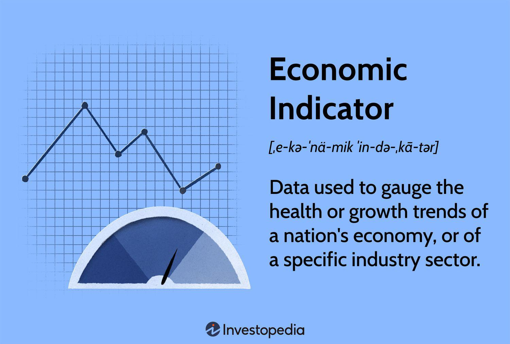

The intersecting worlds of gas investment, economic indicators, oil investment, and algorithmic trading present a complex landscape for investors. Navigating these areas can be crucial for making informed decisions in today's dynamic market environment. This article provides insights into how these factors influence market trends and investment strategies. Economic indicators like inventory levels, production rates, and gross domestic product (GDP) can provide critical signals about supply and demand dynamics, affecting oil and gas prices. Algorithmic trading has emerged as a powerful tool in optimizing investment decisions, harnessing sophisticated algorithms to analyze large datasets and execute trades with unmatched speed and precision.

In the evolving global demand for energy, staying informed about these areas offers a competitive advantage. As countries like China and India exhibit economic growth, energy demand increases, influencing prices and investment strategies. Conversely, economic downturns may reduce consumption and exert downward pressure on prices. Understanding these global demand shifts, along with the impact of government policies such as taxation and environmental regulations, is vital for success in oil and gas investments.



Whether you are an experienced investor or a newcomer, gaining a comprehensive understanding of gas investment, economic indicators, oil investment, and algorithmic trading can enhance your ability to make strategic investment decisions. By integrating economic data with algorithmic trading technologies, investors can achieve better strategic alignment, positioning themselves for success in the competitive energy market.

## Table of Contents

## The Importance of Economic Indicators in Gas and Oil Investment

Economic indicators are essential tools for investors aiming to comprehend market dynamics in the oil and gas sectors. These indicators provide quantitative insights that can guide decision-making by highlighting potential trends in supply and demand. Among these, key metrics such as inventory levels, production rates, and Gross Domestic Product (GDP) are particularly significant.

Inventory levels offer a clear indication of supply conditions in the oil and gas markets. For instance, high inventory levels may suggest an oversupply, potentially leading to downward pressure on prices. Conversely, low inventory levels can indicate a supply deficit, likely resulting in increased prices. Monitoring inventory fluctuations allows investors to anticipate price movements and adjust their strategies accordingly.

Production rates are another critical economic indicator. The rate at which oil and gas are extracted can significantly influence market supply. An increase in production rates often leads to higher availability, potentially moderating prices if demand remains constant. Conversely, reduced production rates can constrain supply and elevate prices, particularly when demand persists.

GDP, representing the total economic output of a country, fundamentally reflects economic health and energy consumption patterns. A growing GDP suggests increased industrial activity and consumer spending, both of which typically enhance energy demand. This growth, in turn, can drive up oil and gas prices. On the other hand, a contracting GDP may signal reduced energy requirements, exerting downward pressure on prices.

Government policies, including taxation and regulatory frameworks, also play a pivotal role in shaping the oil and gas market landscape. Taxes can influence the cost structure of oil and gas operations, directly affecting profitability. Environmental regulations may impact operational processes, potentially increasing costs associated with compliance. Investing in the sector demands an acute awareness of these policy changes to foresee their impacts on market behavior.

An understanding of these economic indicators allows investors to anticipate market changes and make informed decisions. By integrating data on inventory levels, production rates, GDP, and governmental policies, investors can build robust strategies that navigate the complexities of the oil and gas markets effectively.

## How Algorithmic Trading is Shaping Oil and Gas Investments

Algorithmic trading, often associated with high-frequency trading, has become an influential force in the oil and gas investment arena, characterized by its efficiency, speed, and data-driven approach. Sophisticated algorithms enable the automated execution of trades based on specific parameters and market conditions, performing tasks that far exceed human capabilities in terms of speed and accuracy.

These algorithms process massive datasets to identify emerging market patterns and are particularly skilled at executing trades rapidly and without human intervention. This approach is essential given the [volatility](/wiki/volatility-trading-strategies) of oil and gas prices, where market conditions can change in fractions of a second. By utilizing fast computational processes, investors can enter and [exit](/wiki/exit-strategy) positions to capitalize on transient opportunities, maintaining high precision and efficiency in their trading strategies.

Platforms such as UltraAlgo are at the forefront of this technological shift, utilizing [artificial intelligence](/wiki/ai-artificial-intelligence) (AI) and [machine learning](/wiki/machine-learning) to provide advanced tools for traders. These platforms are capable of [backtesting](/wiki/backtesting) trading strategies across historical data, allowing investors to optimize their approaches before actual market deployment. For instance, an investor can test a strategy against past oil price fluctuations to fine-tune parameters that may improve future performance.

Another critical advantage of [algorithmic trading](/wiki/algorithmic-trading) is its enhanced risk management capabilities. By using predefined rules and continuous monitoring, these algorithms can swiftly adapt to market shifts, thus minimizing the potential for human error. This level of automation ensures that trading decisions align with the investor's risk tolerance and objectives, offering improved control over investment outcomes.

Moreover, the application of algo-trading in the oil and gas sector facilitates more reliable exploitation of fleeting opportunities. Given the cyclical nature of energy markets and the influence of geopolitical and economic factors on prices, algorithmic trading positions investors to respond proactively to information as it becomes available, thereby optimizing investment returns.

Python, a widely-used programming language in this context due to its readability and comprehensive ecosystem, is frequently employed to develop these sophisticated algorithms. Here's a simple Python example illustrating a basic implementation of a moving average crossover strategy, commonly used in algorithmic trading:

```python
import pandas as pd

# Load market data, with 'close' being the closing price
data = pd.read_csv('market_data.csv')
# Calculate short and long-term moving averages
data['short_ma'] = data['close'].rolling(window=20).mean()
data['long_ma'] = data['close'].rolling(window=50).mean()

# Implement crossover strategy
data['signal'] = 0
data.loc[data['short_ma'] > data['long_ma'], 'signal'] = 1  # Buy signal
data.loc[data['short_ma'] < data['long_ma'], 'signal'] = -1  # Sell signal

# Display the first few rows
print(data.head())
```
This script leverages pandas, a powerful data handling library, to calculate 20-day and 50-day moving averages and generates buy and sell signals based on their crossovers. While simplistic, this illustrates the fundamental principle of algorithmic strategies: the automation of trading rules based on quantifiable criteria.

In summary, algorithmic trading reshapes oil and gas investments by allowing for rapid, data-informed decisions that enhance investment precision and reliability. Through backtesting, optimized risk management, and the ability to harness fleeting market opportunities, algorithmic trading is an indispensable tool for modern investors aiming for competitive advantage in an ever-evolving energy landscape.

## The Role of Global Demand and Economic Performance in Oil and Gas Markets

Global demand fundamentally influences oil and gas prices, serving as a reliable indicator of broader economic patterns. As nations like China and India experience economic growth, their energy consumption escalates, thereby increasing global demand for oil and gas. This heightened demand typically results in upward pressure on prices. Conversely, during periods of economic downturn, global consumption tends to wane, exerting downward pressure on prices. 

Gross Domestic Product (GDP) figures and other comprehensive economic metrics are instrumental in forecasting energy consumption trends. For instance, a positive correlation exists between GDP growth and energy demand. In simplified terms, as GDP increases, indicating a thriving economy, energy consumption tends to rise. Conversely, stagnation or contraction in GDP often signals a reduction in energy demand. 

To model these relationships, econometric techniques can be applied to historical data, offering predictive insights. For instance, one could use a linear regression model to estimate future energy demand based on GDP projections. Here is a simplified python code snippet demonstrating such a model using hypothetical data:

```python
import numpy as np
from sklearn.linear_model import LinearRegression

# Hypothetical GDP and energy demand data
GDP = np.array([[2.3], [2.8], [3.0], [3.5], [4.0]])  # GDP growth in percentages
Energy_Demand = np.array([50, 55, 58, 60, 65])  # Energy demand in arbitrary units

# Creating and training the model
model = LinearRegression()
model.fit(GDP, Energy_Demand)

# Predicting future energy demand for a GDP growth of 4.5%
predicted_demand = model.predict(np.array([[4.5]]))
print(f"Predicted Energy Demand: {predicted_demand[0]} units")
```

Understanding these global demand dynamics is crucial for investors seeking to navigate the complex and volatile oil and gas markets. Accurate projections of future energy requirements can shape investment strategies, enabling better anticipation of price movements.

As global energy markets continue to evolve, keeping a pulse on these demand indicators, alongside economic performance metrics, remains pivotal for investors. Recognizing how shifts in global demand correlate with economic performance allows investors to mitigate risks and optimize their portfolio strategies amidst changing energy landscapes.

## Government Policies and Their Impact on Oil and Gas Investments

Governmental policies exert significant influence over the oil and gas sector, directing various aspects from exploration practices to pricing mechanisms. This sector is notably sensitive to changes in interest rates, which impact the cost of capital. A rise in interest rates typically increases borrowing costs, thereby discouraging investment and slowing consumption. Such shifts necessitate that companies adjust their financial strategies, particularly in capital-intensive industries like oil and gas.

Taxation and environmental regulations constitute another critical area of government policy that affects the industry's cost structure. For instance, higher taxes can reduce a company's profitability by increasing operational costs. Meanwhile, stringent environmental regulations may necessitate additional investments in cleaner technologies or practices, thus impacting the bottom line. The costs associated with compliance can vary significantly across regions, given the diverse regulatory environments, thus influencing corporate strategies at both local and global levels.

Because governmental policies can alter market conditions rapidly, investors need to maintain a keen awareness of policy changes to adapt their strategies effectively. This vigilance aids in predicting market shifts and optimizing investment returns. For instance, a policy promoting renewable energy sources over fossil fuels could signal a future decline in oil demand, prompting investors to reconsider their asset portfolios accordingly.

Understanding the regulatory landscape is pivotal for forecasting changes in market dynamics and assessing investment returns. By analyzing policy documents, financial reports, and market trends, investors can anticipate how new regulations might influence supply chains, production costs, and ultimately, pricing structures within the oil and gas market. This comprehensive awareness enables investors to make informed decisions, preserving capital and positioning themselves advantageously amidst potential regulatory upheavals. Such strategic planning, built on thorough regulatory understanding, is essential for successful investment navigation within the oil and gas sectors.

## Conclusion

The integration of economic indicators with algorithmic trading offers a progressive framework for optimizing investments in the oil and gas sectors. Investors who understand the interaction between market data, economic trends, and algorithmic strategies can align their investments more strategically. This alignment enables them to respond proactively to the subtle and rapid shifts in market dynamics, resulting in more informed and timely decisions.

Staying informed about changes in global demand, economic performance, and policy adjustments is indispensable for maximizing returns. The dynamic nature of the energy market necessitates a constant awareness of how these factors interplay and influence price movements. Investors who adapt their strategies based on these insights are better equipped to navigate the inherent volatility and capitalize on emerging opportunities.

As the energy market landscape continues to progress, leveraging the combined insights of economic indicators and algorithmic trading can enhance an investor's competitive edge. This strategic harnessing of technology and precise data analysis facilitates the identification of lucrative investment opportunities and resource optimization.

The centrality of integrating technology and data in gas investment and oil trading cannot be overstated. Investors who succeed in leveraging these assets effectively will remain at the forefront of the industry, poised to capitalize on shifts and innovations in the global energy sector. As such, the ongoing evolution in investment strategies, underpinned by advanced analytical tools, positions those well-versed in these concepts for continued success.

## References & Further Reading

[1]: Ederington, L. H., & Lee, J. H. (1993). ["How Markets Process Information: News Releases and Volatility."](https://www.jstor.org/stable/2329034) The Journal of Finance, 48(4), 1161-1191.

[2]: Geman, H. (2005). ["Commodities and commodity derivatives: modeling and pricing for agriculturals, metals and energy."](https://www.wiley.com/en-us/Commodities+and+Commodity+Derivatives%3A+Modeling+and+Pricing+for+Agriculturals%2C+Metals+and+Energy-p-9780470012185) Wiley Finance.

[3]: Elder, J. (2010). ["The Oil Market Outlook: Economic and Policy Issues."](https://onlinelibrary.wiley.com/doi/abs/10.1111/j.1538-4616.2010.00323.x) Energy Economics, 32(5), 943–946.

[4]: Cartea, Á., & Figueroa, M. G. (2005). ["Pricing in Electricity Markets: A Mean Reverting Jump Diffusion Model with Seasonality."](https://www.researchgate.net/profile/Alvaro-Cartea/publication/24071715_Pricing_in_Electricity_Markets_A_Mean_Reverting_Jump_Diffusion_Model_with_Seasonality/links/09e4150a7e158472ef000000/Pricing-in-Electricity-Markets-A-Mean-Reverting-Jump-Diffusion-Model-with-Seasonality.pdf) Applied Mathematical Finance, 12(4), 313–335.

[5]: James, G., Witten, D., Hastie, T., & Tibshirani, R. (2013). ["An Introduction to Statistical Learning: With Applications in R."](https://link.springer.com/book/10.1007/978-1-0716-1418-1) Springer Texts in Statistics.

[6]: Mehra, Y. P. (1991). ["Wage Growth and the Inflation Process: An Empirical Note."](https://www.jstor.org/stable/2006652)90019-Q) European Economic Review, 35(2-3), 423-439.