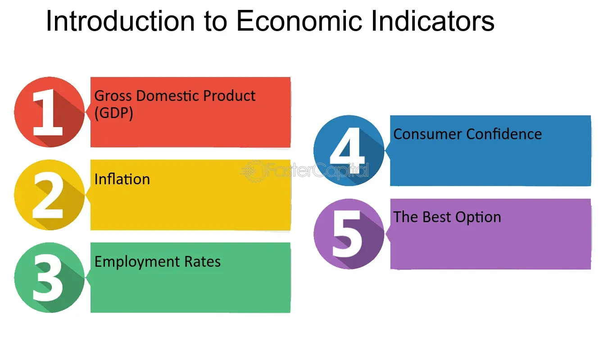

## Table of Contents

## What are economic indicators and why are they important for predicting market trends?

Economic indicators are statistics that show how well an economy is doing. They can tell us about things like how many people have jobs, how much stuff people are buying, and how fast prices are going up. These indicators help us understand if the economy is growing or shrinking. Some common economic indicators include unemployment rates, inflation rates, and gross domestic product (GDP).

These indicators are important for predicting market trends because they give us clues about what might happen next in the economy. For example, if unemployment is going down, it might mean more people will have money to spend, which could make businesses do better. Investors and businesses use these indicators to make decisions about where to put their money. By looking at these signs, they can guess if the market will go up or down and plan accordingly. This helps them make smarter choices and avoid big losses.

## Can you explain the difference between leading, lagging, and coincident indicators?

Leading indicators are like early warnings. They show us what might happen in the economy before it actually happens. For example, if more people are applying for building permits, it could mean that construction will pick up soon, which is good for the economy. These indicators help people get ready for changes because they give us a heads-up.

Lagging indicators, on the other hand, tell us what has already happened. They confirm trends after they've started. For instance, unemployment rates often go down after the economy has already started to grow. These indicators are useful for understanding how well the economy has been doing, but they don't help much with predicting the future.

Coincident indicators happen at the same time as the economic activity they measure. They give us a real-time snapshot of what's going on. An example is personal income, which rises and falls along with the current state of the economy. These indicators help us see the economy as it is right now, which can be useful for making decisions based on current conditions.

## What are some common leading economic indicators used to predict market trends?

Leading economic indicators are like clues that help us guess what the economy might do next. Some common ones are the stock market, which often goes up before the economy starts to grow, and the number of new building permits, which can show if construction is about to pick up. Another one is the length of the average workweek. If it's getting longer, it might mean companies are busier and need more work done, which is a good sign for the economy.

Another important leading indicator is consumer confidence. When people feel good about their money and the future, they're more likely to spend, which helps the economy grow. Also, the number of new orders for goods made in factories can tell us if businesses think they'll sell more stuff soon. If these orders are going up, it's a sign that the economy might be getting better. By watching these indicators, people can make better guesses about where the market is headed.

## How do lagging indicators help in understanding past market performance?

Lagging indicators are like looking in the rearview mirror of the economy. They show us what has already happened, helping us understand how the economy performed in the past. For example, the unemployment rate is a lagging indicator. When it goes down, it usually means the economy has been growing for a while. This helps us see that more people were able to find jobs because businesses were doing well.

By looking at lagging indicators, we can confirm if the economy really did as well or as poorly as we thought. For instance, if the GDP growth rate, another lagging indicator, shows a big increase, it tells us that the economy was strong during that time. This information is useful for making better decisions in the future because we can learn from what worked and what didn't. It's like studying history to avoid repeating the same mistakes.

## What role do coincident indicators play in real-time market analysis?

Coincident indicators are like a snapshot of what's happening in the economy right now. They help us see the current state of things, which is important for making decisions based on what's going on at the moment. For example, personal income is a coincident indicator. When it goes up, it means people are [earning](/wiki/earning-announcement) more money right now, which can affect how much they spend and how the economy is doing overall.

By looking at these indicators, businesses and investors can get a better idea of the market's health in real time. If personal income is rising, it might be a good time for businesses to increase production because people have more money to spend. On the other hand, if these indicators show that things are not going well, like if retail sales are dropping, it might be a sign to hold off on big investments. Coincident indicators help everyone stay on top of what's happening and make smarter choices based on the current situation.

## How can Gross Domestic Product (GDP) growth rates be used as an economic indicator?

Gross Domestic Product (GDP) growth rates tell us how fast the economy is growing or shrinking. It's like checking the health of the whole country's economy. When GDP growth is high, it means more goods and services are being made and sold, which is good for businesses and jobs. If GDP growth is low or negative, it can mean the economy is slowing down or in a recession, which can be tough for everyone.

People use GDP growth rates to make big decisions. For example, if the GDP is growing, businesses might decide to hire more people or invest in new projects because they think the economy will keep doing well. Governments also look at GDP growth to plan their budgets and decide on policies. By watching GDP growth rates, everyone can get a better idea of where the economy is headed and plan accordingly.

## What is the significance of unemployment rates in predicting market trends?

Unemployment rates are important because they show how many people have jobs. When the unemployment rate goes down, it means more people are working. This is good for the economy because people with jobs have money to spend on things like food, clothes, and cars. When people spend more, businesses do better, and this can make the stock market go up. So, a low unemployment rate can be a sign that the market might do well in the future.

On the other hand, if the unemployment rate goes up, it means more people are out of work. This can be bad for the economy because people without jobs have less money to spend. When people spend less, businesses might sell less and make less money, which can make the stock market go down. So, a high unemployment rate can be a warning sign that the market might not do well in the future. By watching unemployment rates, people can get a better idea of what might happen in the market and make smarter choices.

## How do inflation rates influence market predictions and investor behavior?

Inflation rates tell us how fast prices are going up. When inflation is high, it means things like food, gas, and clothes cost more money. This can make people feel like they have less money to spend, which can slow down the economy. Investors watch inflation rates closely because if prices are going up too fast, it might mean the central bank will raise interest rates to slow things down. Higher interest rates can make borrowing money more expensive, which can make businesses and people spend less. This can lead to lower stock prices because companies might not make as much money.

On the other hand, if inflation is low, it means prices are not going up very fast. This can be good for the economy because people feel like they have more money to spend. When people spend more, businesses do better, and this can make the stock market go up. Investors might feel more confident and be more likely to invest in stocks and other things. But if inflation is too low, it might mean the economy is not growing enough, and the central bank might try to help by lowering interest rates. Lower interest rates can make borrowing cheaper, which can help businesses grow and people spend more. So, inflation rates are important for investors to watch because they can give clues about what might happen in the market.

## Can you describe how consumer confidence indices are used to forecast economic trends?

Consumer confidence indices tell us how people feel about their money and the future. When people feel good about their money, they are more likely to spend it on things like new cars or vacations. This spending helps the economy grow because businesses make more money when people buy more stuff. So, if the consumer confidence index is high, it can be a sign that the economy will do well in the future. Businesses and investors watch this index to decide if they should invest more money or start new projects.

On the other hand, if the consumer confidence index is low, it means people are worried about their money and the future. When people feel worried, they are more likely to save their money instead of spending it. This can slow down the economy because businesses make less money when people buy less stuff. A low consumer confidence index can be a warning sign that the economy might not do well soon. By looking at this index, people can get a better idea of what might happen in the economy and plan their actions accordingly.

## What advanced statistical methods are used to analyze economic indicators for market trend prediction?

Advanced statistical methods help us understand economic indicators better so we can predict market trends. One common method is regression analysis. It looks at how different economic indicators, like unemployment rates or inflation, affect things like stock prices or GDP growth. By using regression analysis, we can see which indicators are most important for predicting the market and how they might change in the future. Another method is time series analysis, which looks at how economic indicators change over time. This can help us spot patterns and predict what might happen next in the economy.

Another useful method is [machine learning](/wiki/machine-learning), which uses computers to find patterns in big sets of data. Machine learning can look at lots of different economic indicators at the same time and figure out which ones are the best for predicting market trends. It can also learn from past data to make better predictions in the future. These advanced methods help us make smarter guesses about where the market is headed, so businesses and investors can make better decisions.

## How do global economic indicators affect domestic market predictions?

Global economic indicators can have a big impact on what happens in a country's own market. For example, if the world economy is doing well, other countries might buy more stuff from a particular country. This can make that country's businesses do better and help its economy grow. On the other hand, if the global economy is struggling, other countries might buy less, which can hurt a country's businesses and slow down its economy. Things like global trade numbers, foreign exchange rates, and worldwide stock market trends are all important to watch because they can give clues about what might happen in a country's own market.

Investors and businesses often look at global economic indicators to make decisions about where to put their money. For instance, if global inflation is going up, it might mean that prices everywhere will go up, which can affect how much people spend and how businesses do. Also, if the economies of big countries like the United States or China are growing or shrinking, it can affect the whole world's economy, including smaller countries. By keeping an eye on these global indicators, people can get a better idea of what might happen in their own market and plan their actions accordingly.

## What are the limitations and potential biases in using economic indicators for market trend forecasting?

Using economic indicators to predict market trends can be tricky because they are not always perfect. One big problem is that these indicators can be affected by things that are hard to predict, like natural disasters or sudden changes in government policies. Also, the data we use for these indicators can sometimes be old or not completely accurate. This means that even if we use the best methods to analyze the data, our predictions might still be off because the information we're using isn't up to date or correct.

Another issue is that economic indicators can be biased. For example, if a survey only asks certain people about their confidence in the economy, it might not show how everyone feels. This can lead to wrong predictions if the people surveyed don't represent the whole population. Also, people who make predictions might have their own opinions or interests that can affect how they look at the data. They might focus on certain indicators and ignore others, which can make their predictions less reliable. So, while economic indicators are helpful, it's important to remember their limitations and biases when using them to forecast market trends.

## How can we harness data for forecasting in predictive economics?

Predictive economics leverages historical data to anticipate future economic conditions and market trends. At its core, this discipline integrates econometric models, statistical analysis, and data mining techniques, which together enable economists and analysts to formulate forecasts with varying degrees of accuracy. The primary objective is to foresee economic shifts before they materialize, allowing for strategic adjustments in investment and risk management strategies.

Econometric models form the backbone of predictive economics, applying mathematical and statistical methods to economic data. These models attempt to establish relationships between different economic variables. For instance, a linear regression model could predict consumer spending based on variables such as disposable income and consumer confidence. The general form of a linear regression model is:

$$
Y = \beta_0 + \beta_1X_1 + \beta_2X_2 + \ldots + \beta_nX_n + \epsilon
$$

where $Y$ is the dependent variable (e.g., consumer spending), $X_1, X_2, \ldots, X_n$ are independent variables (e.g., disposable income, consumer confidence), $\beta$ coefficients measure the change in $Y$ per unit change in $X$, and $\epsilon$ represents the error term. By refining these models, analysts can generate more precise forecasts, provided the underlying assumptions are satisfied.

Statistical analysis in predictive economics involves testing hypotheses and examining the data for patterns. Techniques such as time series analysis are commonly employed, particularly ARIMA (AutoRegressive Integrated Moving Average) models, which are adept at handling temporal data. These methods help identify trends and seasonality within datasets, essential for making informed predictions about future economic activities.

Data mining techniques enhance predictive accuracy by uncovering hidden patterns and relationships within large datasets that traditional statistical methods might overlook. Machine learning algorithms, such as decision trees, neural networks, and support vector machines, play a crucial role in this aspect. These advanced techniques can process massive amounts of data, allowing for the development of models that adapt and learn over time, improving their predictive power.

As data availability continues to grow exponentially, predictive economics evolves alongside it. The refinement of data collection methods, coupled with advancements in technology, enables the formulation of increasingly sophisticated models. High-frequency trading data, social media sentiment, and real-time economic indicators provide a more nuanced understanding of market dynamics, further enhancing the precision of forecasts.

In essence, predictive economics stands as a vital tool in contemporary financial and economic analysis. It empowers analysts to manage investments and risks more effectively by anticipating potential market developments and economic conditions. As technology continues to advance and more data becomes accessible, predictive economics will likely play an even more pivotal role in shaping financial strategies and policies.

## References & Further Reading

[1]: Bergstra, J., Bardenet, R., Bengio, Y., & Kégl, B. (2011). ["Algorithms for Hyper-Parameter Optimization."](https://papers.nips.cc/paper/4443-algorithms-for-hyper-parameter-optimization) Advances in Neural Information Processing Systems 24.

[2]: ["Advances in Financial Machine Learning"](https://www.amazon.com/Advances-Financial-Machine-Learning-Marcos/dp/1119482089) by Marcos Lopez de Prado

[3]: ["Evidence-Based Technical Analysis: Applying the Scientific Method and Statistical Inference to Trading Signals"](https://www.amazon.com/Evidence-Based-Technical-Analysis-Scientific-Statistical/dp/0470008741) by David Aronson

[4]: ["Machine Learning for Algorithmic Trading"](https://github.com/stefan-jansen/machine-learning-for-trading) by Stefan Jansen

[5]: ["Quantitative Trading: How to Build Your Own Algorithmic Trading Business"](https://www.amazon.com/Quantitative-Trading-Build-Algorithmic-Business/dp/1119800064) by Ernest P. Chan