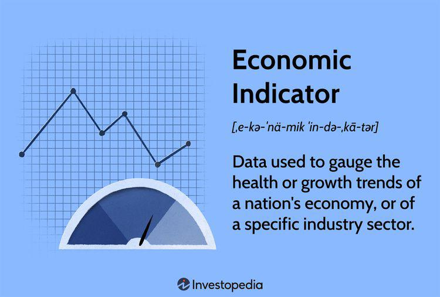

The world of finance and economics is constantly evolving, driven by a myriad of factors that affect global markets. The complexities of these markets are influenced by numerous elements such as political events, economic policies, and technological advancements. For investors, traders, and policymakers, understanding market trends and economic indicators is crucial to navigate these complexities effectively. Market trends provide insights into the general direction in which financial markets are moving, influenced by factors ranging from economic data releases to changes in consumer behavior.

Economic indicators, on the other hand, serve as statistical measures that gauge the health of an economy, thus guiding financial market behavior. Indicators such as Gross Domestic Product (GDP), inflation rates, and unemployment rates serve as critical tools for predicting economic expansions or contractions. 

In recent years, predictive economics and algorithmic trading have gained prominence as essential tools for managing the complexities of today's financial landscape. Predictive economics leverages historical data, econometric models, and statistical techniques to forecast future economic outcomes. This proactive approach allows market participants to anticipate changes and make informed decisions. Algorithmic trading, meanwhile, utilizes computer algorithms to execute trades, optimizing execution and minimizing human error. Its reliance on market trends and economic indicators underscores its role in the evolving financial industry.

This article aims to explore the interconnectedness of these elements—market trends, economic indicators, predictive economics, and algo trading—and their collective influence on investment strategies and financial decision-making. By examining how these components work together, we seek to provide insights into their impact on the financial ecosystem, empowering stakeholders to navigate the market with greater confidence and precision.

## Table of Contents

## Understanding Market Trends

Market trends represent the general direction and movement of a financial market over a specified time frame. They are essential for investors and traders who aim to make strategic decisions based on the expected future behaviors of these markets. The movement of market trends can largely be attributed to numerous factors including economic data releases, geopolitical events, and shifts in consumer behavior.

Economic data releases, such as employment reports, inflation data, and GDP growth rates, provide critical insights into the current and future economic environment. These quantitative aspects influence investor sentiment and market direction. Geopolitical events, like elections, policy changes, or international conflicts, also significantly impact market trends by introducing elements of uncertainty or stability, thereby affecting investor perceptions and actions.

Moreover, changes in consumer behavior, especially in the context of shifts in spending patterns and consumer confidence, can directly influence specific sectors and thereby alter market trends. An understanding of these behavioral shifts is crucial as they can lead to unexpected surges or declines in market performance.

Identifying and analyzing market trends is crucial for making informed trading and investment decisions. Investors utilize various analytical tools to accomplish this, with technical analysis and sentiment analysis being among the most prevalent methods. Technical analysis involves the study of past market data, primarily price and [volume](/wiki/volume-trading-strategy), to forecast future price movements. Sentiment analysis, on the other hand, seeks to gauge the market's mood by analyzing social media, news, and other public information sources to predict market behavior.

The role of technology in the identification and interpretation of market trends has expanded significantly in recent years with advancements in [machine learning](/wiki/machine-learning) and big data analytics. These technologies enable the processing and analysis of vast amounts of data far beyond human capabilities, uncovering patterns and trends that were previously imperceptible. Machine learning algorithms can dynamically adapt to new data, refining their predictions as new information becomes available, thereby offering more accurate forecasts.

Big data analytics supports this by providing the computational power needed to analyze large datasets rapidly, allowing for real-time insights into market movements. Together, these technological advancements provide more sophisticated and precise tools for understanding and leveraging market trends, offering investors and traders a significant edge in navigating the complexities of financial markets.

Overall, understanding market trends is indispensable for anyone engaged in financial markets, requiring a keen awareness of the multifaceted factors driving these trends and the analytical tools available to interpret them.

## The Role of Economic Indicators

Economic indicators are essential statistical metrics that provide insights into the state of an economy. These indicators, such as Gross Domestic Product (GDP), unemployment rates, inflation rates, and consumer confidence indices, serve as fundamental tools for assessing economic health. 

GDP is one of the most comprehensive measures, capturing the total value of goods and services produced within a country over a specific period. It indicates the overall economic output and serves as a key indicator of economic performance. A growing GDP suggests economic expansion, whereas a shrinking GDP may signal a contraction.

Unemployment rates measure the proportion of the workforce that is unemployed and actively seeking employment. This indicator helps assess labor market conditions. High unemployment rates can indicate economic distress, while low rates suggest a robust employment environment, which can lead to increased consumer spending.

Inflation rates, typically measured by consumer price indices (CPI) or producer price indices (PPI), reflect the rate at which the general level of prices for goods and services is rising. Moderate inflation is usually a sign of a growing economy, while hyperinflation or deflation can indicate economic instability.

Consumer confidence indices gauge the overall optimism or pessimism of consumers regarding their financial situation and the broader economic environment. Higher consumer confidence is often associated with increased spending, which can drive economic growth, whereas low confidence may lead to reduced expenditure and economic slowdown.

Traders and investors closely monitor these indicators as they can provide early signals of economic trends, influencing market behavior. For instance, if economic indicators suggest an expansionary phase, investors might anticipate higher corporate earnings and increased stock prices. Conversely, indicators pointing toward an economic downturn could lead to more cautious investment strategies.

Effective investment strategies hinge on understanding the interplay between these indicators and market trends. For example, a simultaneous increase in GDP and inflation might prompt central banks to adjust interest rates, affecting bond prices and currency exchange rates. By interpreting these signals, investors can make informed decisions, positioning themselves advantageously within financial markets.

## Predictive Economics: Harnessing Data for Forecasting

Predictive economics leverages historical data to anticipate future economic conditions and market trends. At its core, this discipline integrates econometric models, statistical analysis, and data mining techniques, which together enable economists and analysts to formulate forecasts with varying degrees of accuracy. The primary objective is to foresee economic shifts before they materialize, allowing for strategic adjustments in investment and risk management strategies.

Econometric models form the backbone of predictive economics, applying mathematical and statistical methods to economic data. These models attempt to establish relationships between different economic variables. For instance, a linear regression model could predict consumer spending based on variables such as disposable income and consumer confidence. The general form of a linear regression model is:

$$
Y = \beta_0 + \beta_1X_1 + \beta_2X_2 + \ldots + \beta_nX_n + \epsilon
$$

where $Y$ is the dependent variable (e.g., consumer spending), $X_1, X_2, \ldots, X_n$ are independent variables (e.g., disposable income, consumer confidence), $\beta$ coefficients measure the change in $Y$ per unit change in $X$, and $\epsilon$ represents the error term. By refining these models, analysts can generate more precise forecasts, provided the underlying assumptions are satisfied.

Statistical analysis in predictive economics involves testing hypotheses and examining the data for patterns. Techniques such as time series analysis are commonly employed, particularly ARIMA (AutoRegressive Integrated Moving Average) models, which are adept at handling temporal data. These methods help identify trends and seasonality within datasets, essential for making informed predictions about future economic activities.

Data mining techniques enhance predictive accuracy by uncovering hidden patterns and relationships within large datasets that traditional statistical methods might overlook. Machine learning algorithms, such as decision trees, neural networks, and support vector machines, play a crucial role in this aspect. These advanced techniques can process massive amounts of data, allowing for the development of models that adapt and learn over time, improving their predictive power.

As data availability continues to grow exponentially, predictive economics evolves alongside it. The refinement of data collection methods, coupled with advancements in technology, enables the formulation of increasingly sophisticated models. High-frequency trading data, social media sentiment, and real-time economic indicators provide a more nuanced understanding of market dynamics, further enhancing the precision of forecasts.

In essence, predictive economics stands as a vital tool in contemporary financial and economic analysis. It empowers analysts to manage investments and risks more effectively by anticipating potential market developments and economic conditions. As technology continues to advance and more data becomes accessible, predictive economics will likely play an even more pivotal role in shaping financial strategies and policies.

## Algorithmic Trading: Automation in Financial Markets

Algorithmic trading represents a significant evolution in financial markets, leveraging computer algorithms to execute trades at speeds and frequencies unattainable for human traders. This approach utilizes predetermined criteria for trade execution, optimizing execution quality while minimizing human error. By harnessing the power of technology, [algorithmic trading](/wiki/algorithmic-trading) efficiently processes vast amounts of data to make swift trading decisions based on market trends and economic indicators.

At its core, algorithmic trading relies on specific sets of rules or instructions developed from historical market data and economic conditions. These algorithms assess various factors, including price, timing, and volume, to identify optimal trading opportunities. The automation of this process allows for the high-speed execution of trades, which is crucial in fast-moving markets where delays can result in missed opportunities or unanticipated losses.

The dependency on market trends and economic indicators is inherent in algorithmic trading strategies. Algorithms often integrate technical analysis, statistical models, and machine learning techniques to analyze historical and real-time data. This process helps determine patterns or trends that inform trading decisions. For instance, moving averages or [momentum](/wiki/momentum) indicators might form the basis for a trading algorithm tuned to exploit short-term price changes.

The proliferation of algorithmic trading has yielded several benefits to the financial markets. One of the most notable is increased market [liquidity](/wiki/liquidity-risk-premium), as algorithms can quickly match buy and sell orders, thereby facilitating smoother market operations. Additionally, the ability to execute large volumes of trades with reduced transaction costs benefits investors, particularly institutional players who deal with substantial quantities of assets. Enhanced liquidity results in narrower bid-ask spreads, reducing the overall cost of trading.

Despite its advantages, algorithmic trading faces multiple challenges. One primary concern is the complexity involved in developing and managing trading algorithms. Ensuring the robustness of these systems is critical, as technical malfunctions or unanticipated market events can lead to significant financial losses. For example, the 'flash crash' of 2010 demonstrated how algorithmic dysfunction could cause dramatic and sudden market declines.

Navigating regulatory considerations adds another layer of complexity. Regulatory bodies worldwide, such as the U.S. Securities and Exchange Commission (SEC) and the European Securities and Markets Authority (ESMA), have implemented guidelines to ensure market stability and protect investors. These regulations demand that trading algorithms are adequately tested and monitored to prevent manipulative practices like spoofing or market manipulation.

Algorithmic trading continues to evolve, integrating advancements in [artificial intelligence](/wiki/ai-artificial-intelligence) and machine learning to enhance decision-making processes. As technology progresses, the financial industry must remain vigilant in addressing the accompanying risks and ethical considerations to foster an equitable and efficient market environment.

## Interconnections and Future Implications

The integration of market trends, economic indicators, predictive economics, and algorithmic trading forms a dynamic and complex financial ecosystem. This interconnectedness offers significant potential for market participants seeking a competitive edge. By understanding how these components interact, investors and traders can improve their decision-making and strategic planning capabilities in the financial markets.

Market trends provide insights into the general direction of asset prices, which are influenced by a combination of economic indicators and predictive analytics. These trends are further interpreted through the use of sophisticated technologies, such as machine learning and big data analytics, allowing investors to identify patterns and make timely investment decisions. Economic indicators serve as barometers for assessing market conditions, guiding predictive models to anticipate future movements. By leveraging historical data, statistical models, and econometric techniques, predictive economics can forecast economic and market behaviors.

 Algorithmic trading complements this process by automating the execution of trades based on pre-defined criteria, thus facilitating fast, efficient responses to market changes. Algorithms can be programmed to adjust their parameters according to new information derived from market trends and economic indicators, enabling traders to capitalize on opportunities with reduced human intervention and minimized errors.

Technological advancements continue to reshape this landscape, presenting both opportunities and challenges. The incorporation of artificial intelligence (AI) is particularly transformative, enhancing the sophistication and accuracy of predictive models. AI algorithms can process vast amounts of data at exceptional speeds, identifying complex relationships and improving predictive capabilities. Quantum computing, although in its early stages, promises to further revolutionize data processing and model optimization, potentially offering even more precise insights into future market movements.

To remain competitive, investors and businesses must adapt to these fast-evolving technologies, continuously updating their strategies and tools. Embracing AI and quantum computing, for instance, could become crucial for developing superior predictive models and more effective algorithmic trading strategies. By harnessing these innovations, market participants can navigate the complexities of the financial ecosystem more adeptly, exploiting technological advancements to stay ahead in an ever-competitive market environment.

## Conclusion

In today's fast-paced financial environment, maintaining an informed and adaptable approach is vital for success. The dynamic interplay of market trends, economic indicators, predictive economics, and algorithmic trading forms the foundation for understanding and navigating the complexities of financial markets. These elements collectively enable investors and traders to make more informed and strategic decisions, adjusting their approaches to align with evolving market conditions.

The integration of data-driven insights and technological advancements defines the future of finance. As data becomes more plentiful and accessible, tools such as machine learning and artificial intelligence offer unprecedented opportunities to analyze trends and forecast outcomes. For instance, econometric models and statistical algorithms can identify patterns and project economic shifts, enhancing decision-making processes. The ability to process large volumes of data quickly allows traders to capitalize on market movements with greater precision.

Algorithmic trading epitomizes the fusion of technology and finance, offering efficiency and speed that surpasses human capabilities. These automated systems can trade on market signals at high frequencies, reduce transaction costs, and increase liquidity. However, the effective deployment of such systems requires a thorough understanding of underlying market dynamics and robust model construction to mitigate risks.

Ultimately, the financial landscape is increasingly shaped by those who can skillfully blend human insight with technological innovation. Professionals who leverage technological tools while exercising sound judgment stand to gain a competitive edge, distinguishing themselves in the rapidly evolving economic environment. As the financial industry continues adapting to technological disruptions, staying attuned to these advancements and maintaining a balanced approach between analytics and intuition will be the hallmark of success.

## References & Further Reading

[1]: Bergstra, J., Bardenet, R., Bengio, Y., & Kégl, B. (2011). ["Algorithms for Hyper-Parameter Optimization."](https://papers.nips.cc/paper/4443-algorithms-for-hyper-parameter-optimization) Advances in Neural Information Processing Systems 24.

[2]: ["Advances in Financial Machine Learning"](https://www.amazon.com/Advances-Financial-Machine-Learning-Marcos/dp/1119482089) by Marcos Lopez de Prado

[3]: ["Evidence-Based Technical Analysis: Applying the Scientific Method and Statistical Inference to Trading Signals"](https://www.amazon.com/Evidence-Based-Technical-Analysis-Scientific-Statistical/dp/0470008741) by David Aronson

[4]: ["Machine Learning for Algorithmic Trading"](https://github.com/stefan-jansen/machine-learning-for-trading) by Stefan Jansen

[5]: ["Quantitative Trading: How to Build Your Own Algorithmic Trading Business"](https://www.amazon.com/Quantitative-Trading-Build-Algorithmic-Business/dp/1119800064) by Ernest P. Chan