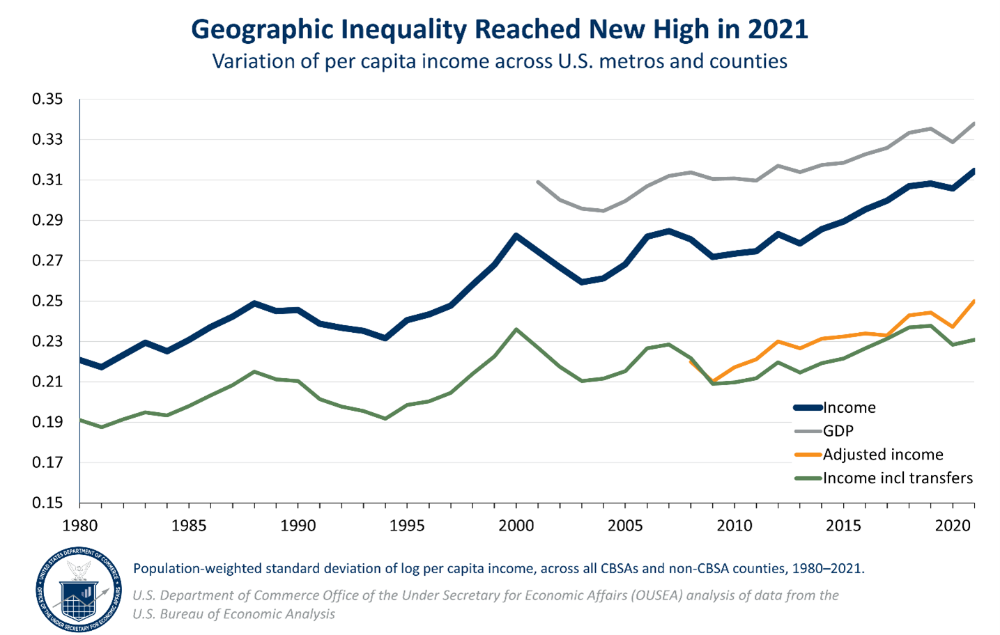

## Table of Contents

## What is economic inequality?

Economic inequality means that people in a country or around the world have different amounts of money and resources. Some people have a lot, while others have very little. This can happen because of things like where someone was born, their education, their job, or even luck. When there is a big difference between the rich and the poor, it can cause problems in society, like making it hard for poor people to get good healthcare, education, or a fair chance at a good job.

This inequality can also affect how people feel about their lives. When people see others with much more than they have, they might feel unhappy or left out. It can also make it harder for everyone to work together and trust each other. Governments and organizations try to reduce economic inequality by making policies like taxes on the rich, giving money to the poor, and making sure everyone has access to basic services. But it's a big challenge and takes a lot of effort to make things more equal.

## How is economic inequality measured?

Economic inequality is measured by looking at how money and resources are spread out among people. One common way to measure it is by using the Gini coefficient. This number goes from 0 to 1, where 0 means everyone has the same amount of money, and 1 means one person has all the money and everyone else has none. A higher Gini coefficient shows more inequality. Another way is by looking at the ratio of income or wealth between the richest and the poorest groups, like the top 10% compared to the bottom 10%.

Other methods include looking at the poverty rate, which shows the percentage of people living below a certain income level. The Palma ratio is another measure, which compares the income of the top 10% to the bottom 40%. These different ways of measuring help us understand how big the gaps are between different groups of people. By using these tools, governments and researchers can see how inequality changes over time and in different places, and then try to make policies to reduce it.

## What are the different types of economic inequality?

Economic inequality can show up in different ways. One type is income inequality, which means some people earn a lot more money than others. This can happen because of the jobs people have, how much they are paid, or if they have other ways to make money, like investments. Another type is wealth inequality, which looks at how much money and things people own, like houses, cars, and savings. Wealth inequality can be even bigger than income inequality because wealth can grow over time and be passed down from one generation to the next.

There's also inequality in opportunities, which means some people have better chances to get good education, jobs, and healthcare than others. This can depend on where they live, their family's background, and even their race or gender. All these types of inequality can affect each other. For example, if someone doesn't have a good education, they might not get a high-paying job, which means they won't earn much income or build much wealth. Understanding these different kinds of inequality helps us see the full picture of how unequal societies can be.

## What are the main causes of economic inequality?

Economic inequality happens because of many reasons. One big reason is the difference in education and skills. People who go to good schools and learn a lot can get better jobs that pay more money. But not everyone can go to these schools. Some people can't afford it, or they live in places where schools are not good. This means they might end up with jobs that don't pay well. Another reason is where someone is born. If you're born in a rich country or a rich family, you start with more money and opportunities than someone born in a poor country or family.

Another cause of economic inequality is discrimination. Sometimes people are treated unfairly because of their race, gender, or where they come from. This can make it hard for them to get good jobs or earn as much money as others. Also, the way the economy works can make inequality worse. For example, when rich people invest their money, it can grow a lot, making them even richer. But poor people might not have any money to invest, so they stay poor. All these reasons together make the gap between the rich and the poor bigger.

## How does education impact economic inequality?

Education plays a big role in economic inequality. When people get a good education, they can learn important skills that help them get better jobs. These jobs usually pay more money, which means they can earn more and build more wealth over time. But not everyone has the same chance to get a good education. Some people live in places where schools are not good, or they can't afford to go to college. This means they might end up with jobs that don't pay well, making it hard for them to earn enough money and save for the future.

This difference in education can make economic inequality worse. If only some people can go to good schools and get high-paying jobs, the gap between the rich and the poor gets bigger. Rich families can afford to send their kids to better schools, which helps them stay rich. Poor families might not have this chance, so their kids might not be able to move up in the world. This cycle can go on for generations, making it really hard to reduce economic inequality.

## What role does globalization play in economic inequality?

Globalization can make economic inequality bigger. It means that countries trade with each other more and businesses can work all over the world. This can be good for some people because it creates new jobs and makes things cheaper. But it can also hurt others. For example, when big companies move their factories to countries where they can pay workers less, it can take away jobs from people in richer countries. At the same time, the workers in poorer countries might not get paid enough to really improve their lives. So, while some people get richer, others might stay poor or even get poorer.

Also, globalization can make the rich even richer. Big companies and rich people can make a lot of money by selling things all over the world. They can invest their money in different countries and make it grow even more. But poor people might not have the same chances. They might not be able to start their own businesses or invest in the global market. This means the gap between the rich and the poor can get bigger. So, while globalization can help the world economy grow, it can also make economic inequality worse if we don't do something to help everyone share in the benefits.

## How does economic inequality affect social mobility?

Economic inequality makes it harder for people to move up in the world. When there's a big gap between the rich and the poor, it's tougher for people at the bottom to get ahead. They might not have the same chances to go to good schools or get good jobs. Rich people can give their kids a head start with better education and connections, while poor people might be stuck in low-paying jobs with no way to climb the ladder. This means that moving up to a higher class becomes a lot harder, and people can feel stuck where they are.

This problem can go on for many years, even passing from parents to kids. If someone grows up poor, it's more likely they'll stay poor when they grow up. They might not have the money to go to college or start a business. On the other hand, if someone grows up rich, they have a better chance of staying rich. This makes the gap between the rich and the poor even bigger over time. So, economic inequality can trap people in their current situation and make social mobility a lot harder to achieve.

## What are the economic consequences of high levels of inequality?

High levels of inequality can hurt the economy. When a lot of money is in the hands of just a few rich people, it can slow down the whole economy. Poor people don't have much money to spend on things like food, clothes, and other stuff. If they can't spend money, businesses don't make as much money, and they might have to close or lay off workers. This can lead to less jobs and slower growth for the whole country. Also, when people see a big difference between the rich and the poor, they might feel less happy and less likely to work hard, which can make the economy even weaker.

Another problem is that high inequality can lead to more debt. Poor people might borrow money to pay for things they need, like healthcare or education. But if they can't pay back these loans, it can cause big problems for banks and the whole financial system. Also, when rich people have a lot of money, they might invest it in ways that don't help the economy grow, like buying fancy things instead of starting new businesses. This can make the gap between the rich and the poor even bigger and make it harder for everyone to have a good life.

## How have historical trends in economic inequality evolved?

Over the past few hundred years, economic inequality has changed a lot. In the 1800s, during the Industrial Revolution, inequality grew a lot. Rich people got richer because they owned factories and businesses, while poor people worked long hours for little pay. This made the gap between the rich and the poor very big. But in the early 1900s, things started to change a bit. Governments started to make laws to help poor people, like setting a minimum wage and making taxes higher for rich people. This helped to reduce inequality a little bit, especially after World War II, when many countries had strong economies and more people could get good jobs.

But since the 1980s, inequality has been growing again. This happened because of things like globalization and technology. Big companies could move their businesses to countries where they could pay workers less, and new technology made some jobs go away. Also, rich people could make a lot more money from investments. At the same time, poor people didn't see their wages go up as much, and they had a harder time getting good education and jobs. So, the gap between the rich and the poor got bigger again. Today, many people are worried about this growing inequality and are trying to find ways to make things more fair.

## What policies have been implemented to address economic inequality?

Governments around the world have tried different policies to make economic inequality smaller. One common way is by using taxes. They make rich people pay more taxes and use that money to help poor people. This can be done through things like welfare programs, which give money to people who need it, or by making sure everyone can get healthcare and education. Another way is by setting a minimum wage, so everyone earns enough money to live on. Some countries also try to make sure everyone has a fair chance at good jobs by helping people get the education and skills they need.

Other policies focus on making sure everyone has the same opportunities. This can mean making sure schools in poor areas are as good as schools in rich areas. It can also mean fighting against discrimination, so people are not treated unfairly because of their race, gender, or where they come from. Some countries have also tried to help workers by making it easier for them to join unions, which can help them get better pay and working conditions. All these policies try to make the gap between the rich and the poor smaller and give everyone a better chance at a good life.

## How effective are these policies in reducing economic inequality?

Policies to reduce economic inequality have had some success, but it's a tough problem to solve. Taxing the rich more and using that money to help the poor through welfare programs can make a big difference. For example, countries like Sweden and Denmark have strong social safety nets that help everyone get healthcare and education, which makes inequality smaller. Setting a minimum wage also helps, because it means everyone earns enough to live on. But these policies can be hard to put in place and keep going, because not everyone agrees on them. Some people think high taxes on the rich are unfair, and it can be hard to make sure the money is used in the best way to help the poor.

Other policies, like making sure schools in poor areas are as good as those in rich areas, can help give everyone a fair chance. Fighting against discrimination also makes a difference, because it means people are not held back just because of who they are. Helping workers join unions can lead to better pay and working conditions, which can help reduce the gap between the rich and the poor. But even with all these efforts, economic inequality is still a big problem in many places. It takes a lot of time and work to make things more equal, and sometimes the gap between the rich and the poor keeps growing despite these efforts.

## What are the current global statistics on economic inequality?

Economic inequality is a big problem all over the world. According to the World Inequality Report, the richest 10% of people in the world own about 76% of all the wealth. The poorest half of the world's population owns just 2% of the wealth. This means that a small group of people have most of the money and things, while a lot of people have very little. In many countries, the gap between the rich and the poor has been getting bigger in recent years. For example, in the United States, the top 1% of earners now take home about 20% of all the income, which is a lot more than they used to.

Different places have different levels of inequality. In Europe, the Gini coefficient, which measures inequality, is around 0.3 for many countries, which means there is some inequality but not as much as in other places. In countries like Brazil and South Africa, the Gini coefficient can be much higher, around 0.5 or more, showing a lot of inequality. Even in rich countries, there can be big differences. For example, in the United States, the top 10% of families own about 70% of the wealth, while in Denmark, the top 10% own about 40%. These numbers show that economic inequality is a global issue that affects every part of the world in different ways.

## How can we measure economic inequality?

Economic inequality is a complex and multifaceted issue that can be quantified through various metrics, helping researchers and policymakers compare levels of inequality across different societies. One of the most widely used tools for measuring economic inequality is the Gini coefficient, a statistical measure that ranges from 0 to 1. A Gini coefficient of 0 indicates perfect equality, where everyone has the same income, while a coefficient of 1 signifies perfect inequality, where a single individual holds all the income.

The Gini coefficient is calculated using the Lorenz curve, which graphically represents the distribution of income or wealth within a population. The Lorenz curve plots the cumulative percentage of total income received by the bottom x% of the population. The Gini coefficient is derived from the area between the Lorenz curve and the line of perfect equality (a 45-degree line), divided by the total area under the line of perfect equality.

The formula for the Gini coefficient is expressed as:

$$
G = \frac{A}{A + B}
$$

where $A$ is the area between the line of equality and the Lorenz curve, and $B$ is the area under the Lorenz curve. In practice, calculating the Gini coefficient involves integrating the Lorenz curve.

Beyond the Gini coefficient, other measures of economic inequality include:

1. **Income Quintile or Decile Ratios**: These ratios compare the income received by different segments of the population, for example, the top 20% (quintile) versus the bottom 20% (quintile). This gives a straightforward indication of the disparity across different societal segments.

2. **Theil Index**: A measure that considers not only the distribution but also the proportions of income within a society. It can decompose overall inequality into within-group and between-group components.

3. **Atkinson Index**: This index specifically incorporates societal aversion to inequality, allowing different weightage depending on the inequality sensitivity parameter selected by researchers.

4. **Palma Ratio**: Focuses on the top 10% of income earners and the bottom 40%, examining the disparity between these groups. This measure has gained attention because it reflects the share of income that middle-income groups receive and emphasizes inequalities at the tails.

These metrics, individually and collectively, provide essential insights into inequality's scope, enabling comparisons both over time within a single country and between different nations. Understanding these measurements is crucial for designing policies aimed at reducing economic inequality, such as adjusting tax systems or implementing targeted subsidies. Each measure offers different perspectives and insights, thus allowing governments and international organizations to address specific aspects of inequality more effectively.

## What are potential solutions to economic inequality?

To address the multifaceted issue of economic inequality, policymakers have considered a range of strategies, including progressive taxation, social safety nets, and financial regulation. Each approach varies in its effectiveness and scope, targeting different aspects of inequality and aiming to create a more balanced economic landscape.

**Progressive Taxation**

Progressive taxation is a pivotal tool for mitigating economic inequality, whereby higher income earners are taxed at higher rates compared to those with lower incomes. This system is designed to redistribute wealth more equitably, narrowing disparity gaps. The effectiveness of progressive taxation hinges on the structure and implementation of tax policies. For instance, applying higher rates on luxury goods and capital gains rather than solely relying on income tax can generate significant revenue for social programs. Progressive taxation can be mathematically represented by the formula:

$$
\text{Tax Liability} = \begin{cases} 
0.1 \times \text{Income}, & \text{if } \text{Income} \leq I_1 \\
0.2 \times \text{Income} - C, & \text{if } \text{Income} > I_1 \, \text{and} \leq I_2 \\
0.3 \times \text{Income} - D, & \text{if } \text{Income} > I_2 
\end{cases}
$$

Where $I_1$ and $I_2$ are income thresholds and $C$ and $D$ are constants representing deductions.

**Social Safety Nets**

Social safety nets comprise government programs aimed at providing financial assistance to individuals and families in need, thereby reducing poverty and inequality. These programs include unemployment benefits, food assistance, healthcare services, and housing support. By ensuring that basic needs are met, safety nets can enhance social mobility and reduce the socioeconomic disparities that often limit access to essential resources. Expanding and adequately funding these programs remains critical to achieving their intended impact.

**Financial Regulation**

Financial regulation seeks to ensure market fairness and stability, protecting consumers from predatory practices and reducing the systemic risks that can exacerbate inequality. By implementing rules that curb excessive speculation and enhance transparency, regulators aim to prevent financial crises that disproportionately affect the economically vulnerable. Financial regulations can also include policies that encourage responsible lending and borrowing practices, thereby promoting broader access to financial services.

**Role of Innovation and Technology**

Innovation and technology play crucial roles in providing new avenues for economic equality. Technological advancements can democratize access to information, education, and financial services, enabling individuals from diverse backgrounds to participate more fully in the economy. For example, fintech solutions can provide low-cost banking options to underserved populations, while online education platforms can offer affordable learning opportunities. However, it is essential to address the digital divide to ensure these benefits reach all segments of society.

In summary, addressing economic inequality requires a holistic approach that integrates progressive taxation, robust social safety nets, and effective financial regulation. Simultaneously, fostering innovation and technology can generate new opportunities, enabling more equitable participation in the global economy. These strategies, when combined, have the potential to create a more just and balanced economic environment.

## References & Further Reading

[1]: Piketty, T. (2014). ["Capital in the Twenty-First Century."](https://www.jstor.org/stable/j.ctt6wpqbc) Harvard University Press.

[2]: Shiller, R. J. (2012). ["Finance and the Good Society."](https://press.princeton.edu/books/hardcover/9780691154886/finance-and-the-good-society) Princeton University Press.

[3]: O’Hara, M. (2015). ["High-Frequency Trading and Its Impact on Markets."](https://www.tandfonline.com/doi/abs/10.2469/faj.v70.n3.6) Financial Analysts Journal, 70(2), 18-27.

[4]: Autor, D. H., Katz, L. F., & Kearney, M. S. (2008). ["Trends in U.S. Wage Inequality: Revising the Revisionists."](https://www.jstor.org/stable/40043148) The Review of Economics and Statistics, 90(2), 300-323.

[5]: Stiglitz, J. E. (2012). ["The Price of Inequality: How Today's Divided Society Endangers Our Future."](https://business.columbia.edu/sites/default/files-efs/imce-uploads/Joseph_Stiglitz/Price%20of%20Inequality%20for%20Sustainable%20Humanity.pdf) W.W. Norton & Company.