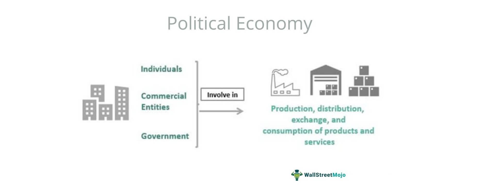

The 2020 United States presidential election, held amidst unprecedented global challenges, was one of significant historical impact. The contest primarily revolved around President Donald Trump, seeking re-election representing the Republican Party, and Democratic challenger Joe Biden, the former Vice President. This election unfolded against the backdrop of a global pandemic, social unrest, and a sharply divided electorate.

Economic issues played a pivotal role in the 2020 election campaign. The outbreak of COVID-19 led to a severe economic downturn, with unemployment rates surging to levels unseen since the Great Depression. Consequently, a significant focus was placed on economic recovery plans, fiscal stimulus measures, and policies aimed at reviving small businesses and restoring jobs. Trade policies, including tariffs and international agreements, became contentious topics. The healthcare system, with its cost implications and accessibility concerns, was another vital economic issue debated during the campaign. Candidates proposed varying approaches to these challenges, each with potential long-term impacts on both the national and global economy.



Algorithmic trading, a concept that has revolutionized modern financial markets, involves using computer algorithms to automate stock trading decisions. Originating in the late 20th century, it gained traction with advancements in technology and has since transformed trading practices. These algorithmic systems can process vast amounts of data far more quickly than human traders, executing trades based on pre-set instructions.

This article aims to explore the intertwined relationships between the economic issues central to the 2020 election, the dynamics of that election itself, and the domain of algorithmic trading. It will examine how these economic circumstances and political developments potentially influenced algorithmic trading activities and the financial markets. Through an analysis of this interplay, the article seeks to provide insights into the broader implications of political decisions on technologically driven financial strategies.

## Table of Contents

## Key Economic Issues in the 2020 Election

The 2020 United States presidential election unfolded against the backdrop of significant economic challenges, primarily driven by the COVID-19 pandemic. The pandemic sparked a global health crisis that precipitated widespread economic turmoil, leading to one of the most severe recessions in modern history. Unemployment rates soared as businesses shuttered and industries contracted. According to the U.S. Bureau of Labor Statistics, the unemployment rate peaked at 14.8% in April 2020, a stark contrast to the pre-pandemic level of 3.5% in February 2020. This sharp increase illustrated the pandemic's immediate impact on the labor market, making employment a central issue in the election discourse.

Trade policies also played a pivotal role in shaping the economic narrative of the 2020 election. The administration's approach to international trade, characterized by increased tariffs and trade tensions, particularly with China, influenced economic conditions. These policies were designed to protect domestic industries but often led to retaliatory actions, impacting sectors such as agriculture and manufacturing. The election discussions frequently centered on whether such protectionist measures should continue or whether a shift towards more open trade policies would better serve the economy.

Tax policies emerged as a contentious topic during the election, with each candidate proposing divergent approaches to taxation. Discussions focused on the structure of corporate taxes, income taxes, and wealth taxes, as well as the implications of these policies on economic growth and income inequality. Debates scrutinized the effectiveness of tax cuts introduced in prior years and evaluated proposals for increasing taxes on high-income earners as a means to address fiscal deficits and fund public services.

Healthcare costs, a perennial issue in American politics, gained heightened attention in the 2020 election due to the pandemic's influence on public health. The economic implications of healthcare access and affordability were underscored by the crisis, revealing gaps in coverage and the financial burdens on individuals and businesses. The convergence of public health and economic policy debates brought healthcare reform to the forefront, with candidates presenting varying strategies to expand coverage and control costs.

These key economic issues—unemployment, trade policies, tax strategies, and healthcare costs—formed the crux of the economic debate in the 2020 election. Each issue demonstrated the complex interplay between policy choices and economic outcomes, influencing voter sentiment and shaping the electoral landscape.

## Algorithmic Trading: An Overview

Algorithmic trading, often referred to as algo trading, is a method of executing orders using automated and pre-programmed trading instructions. This approach leverages variables such as time, price, and [volume](/wiki/volume-trading-strategy) to determine the most advantageous moments to buy or sell financial instruments. The primary objective of [algorithmic trading](/wiki/algorithmic-trading) is to execute orders at such speeds and volumes that are beyond human capability, taking advantage of specific market conditions.

Historically, the foundations of algorithmic trading can be traced back to the introduction of computers in financial markets. The practice began to gain significant traction in the 1970s and 1980s with the advent of electronic trading platforms. During this period, the New York Stock Exchange introduced designated order turnaround (DOT) systems, which automated order routing and execution, setting the stage for further developments. By the late 1990s and early 2000s, advances in computer processing power and connectivity led to a substantial increase in the complexity and speed of algo trading strategies. High-frequency trading ([HFT](/wiki/high-frequency-trading-strategies)), a subset of algorithmic trading, emerged, allowing for transactions to occur in fractions of a second.

The role of automation and technology in transforming trading practices has been profound. Automation has streamlined the execution of large orders, reducing the market impact and slippage that might occur with manual trades. Furthermore, technological advancements have facilitated the use of complex algorithms capable of analyzing large datasets to identify patterns and price inefficiencies. These algorithms often employ [machine learning](/wiki/machine-learning) techniques to adapt to changing market conditions, further enhancing their effectiveness.

By 2020, the scale and scope of algorithmic trading had expanded significantly. Algorithmic trades accounted for roughly 60-70% of total equity trading volume in the United States [1]. This prevalence reflects not only the efficiency of algorithmic methods but also their growing sophistication. Algo trading now encompasses various strategies, such as statistical [arbitrage](/wiki/arbitrage), [market making](/wiki/market-making), and [trend following](/wiki/trend-following), applicable to a wide array of asset classes beyond equities, including derivatives, currencies, and fixed income securities.

Overall, algorithmic trading in 2020 represented a critical intersection of finance and technology, continuously influencing how financial markets operate and evolve.

[1] Hendershott, T., Jones, C. M., & Menkveld, A. J. (2011). Does Algorithmic Trading Improve Liquidity? The Journal of Finance, 66(1), 1-33.

## Interplay Between Economic Policies and Algo Trading

Algorithmic trading plays a vital role in today's financial markets, where automated strategies leverage algorithms to execute trades at speeds and frequencies far exceeding human capabilities. This section examines how algorithmic trading systems respond to economic policies and uncertainties, particularly in the context of the 2020 U.S. presidential election.

### Response to Economic Policies and Uncertainties

Algorithmic trading reacts dynamically to economic policies and the uncertainties accompanying them. These algorithms are designed to process vast amounts of financial data, including news releases, policy changes, and other economic indicators, influencing trade decisions. For instance, shifts in monetary policy, interest rates, and fiscal stimuli can alter the valuation models within these systems, prompting adjustments in asset allocation and trading strategies.

### Market Reactions to Election Outcomes

Elections present a unique set of challenges and opportunities for algorithmic trading. The 2020 U.S. presidential election, characterized by economic upheaval due to the COVID-19 pandemic, posed significant uncertainties. Algorithmic trading systems responded to the election's outcome by rapidly adjusting positions based on real-time cues from polling data, [exit](/wiki/exit-strategy) polls, and news announcements. This responsiveness is often linked to [volatility](/wiki/volatility-trading-strategies) metrics, which algorithms monitor to optimize trade execution and manage risks.

### Predictive Capabilities of Algorithmic Models

Algorithmic models also possess predictive capabilities that can be particularly advantageous during elections. By analyzing historical election data and correlating it with market behaviors, these models can forecast potential market movements. For instance, machine learning models can be trained to identify patterns in election cycles that might suggest specific economic and market outcomes. These predictive insights enable traders to hedge against potential risks or capitalize on anticipated trends.

```python
# Sample Python code for a simple predictive model
import numpy as np
from sklearn.linear_model import LinearRegression

# Sample election data: independent variable (election years), dependent variable (market index changes)
years = np.array([2000, 2004, 2008, 2012, 2016, 2020]).reshape(-1, 1)
market_changes = np.array([5, -2, -8, 7, 3, 1])

# Linear regression model
model = LinearRegression().fit(years, market_changes)

# Predict future market change
future_year = np.array([2024]).reshape(-1, 1)
predicted_change = model.predict(future_year)

print(f"Predicted market change for 2024: {predicted_change[0]}")
```

### Risks and Benefits in a Volatile Landscape

Algorithmic trading systems must navigate the risks and benefits intrinsic to volatile economic and political landscapes. The benefits include increased trading efficiency, reduced transaction costs, and enhanced [liquidity](/wiki/liquidity-risk-premium) provision. These systems also mitigate human error by systematically adhering to predefined trading rules.

However, there are notable risks. The rapid flow of information can lead to market overreactions or flash crashes, where trading algorithms amplify market movements, resulting in sudden, deep price drops. The unpredictability of election outcomes can exacerbate these risks, creating scenarios where algorithms may act on incomplete or inaccurate data, leading to unintended financial consequences.

In conclusion, algorithmic trading is integrally linked to the economic and political contexts within which it operates, responding with precision to policy changes and market signals. As algorithmic systems continue to evolve, they increasingly define the efficiency and behavior of modern markets, particularly during politically charged events such as elections.

## The Impact of the 2020 Election on Algorithmic Trading

The 2020 United States presidential election significantly impacted financial markets, creating both opportunities and challenges for algorithmic trading systems. During this period, market trends and trading volumes experienced notable fluctuations, influenced by political developments and economic uncertainties. 

Algorithmic trading systems, relying on pre-set rules and data-driven models, dynamically adjusted to the influx of election news. Quantitative models, often based on natural language processing (NLP) and sentiment analysis, were deployed to interpret news flows and social media sentiments. This real-time analysis allowed trading algorithms to capture short-term price movements and volatility spikes associated with election-related information. 

Specific economic promises or policies announced during the election campaign also had a substantial impact on trading algorithms. For instance, discussions on tax reforms, fiscal stimulus packages, and healthcare initiatives were key triggers altering market perceptions and anticipated economic conditions. Traders programmed algorithms to respond to such announcements by adjusting asset allocations, hedging strategies, and risk exposures. 

However, the election-induced volatility posed significant challenges. High-frequency trading (HFT) systems, in particular, faced difficulties due to rapid price swings and liquidity fragmentation across markets. To navigate this volatility, some algo traders implemented adaptive algorithms capable of modifying parameters like order sizes, execution strategies, or risk thresholds based on current market states. 

Furthermore, the unprecedented nature of the 2020 election, with high mail-in voting and delayed results due to the COVID-19 pandemic, introduced uncertainty in market timing. Traders had to incorporate scenario analyses and stress tests to preempt potential delays and extended periods of volatility. This often involved using Monte Carlo simulations to assess various election outcome scenarios and their potential market impacts.

The ability to react to these dynamics demonstrates the capacity of algorithmic trading systems to process vast amounts of data swiftly and execute trades with precision. Yet, the 2020 election highlighted the importance of integrating robust risk management frameworks to mitigate adverse effects from volatile political landscapes. As algorithmic trading continues to evolve, its sensitivity to both economic policies and political developments remains a critical [factor](/wiki/factor-investing) shaping market behavior.

## Future Outlook: Elections, Economy, and Algo Trading

The 2020 United States presidential election and its associated economic policies have left a noticeable imprint on the landscape of algorithmic trading. As traders and financial analysts continue to assess the long-term ramifications, several potential effects on algorithmic trading systems emerge.

### Potential Long-Term Effects of 2020 Economic Policies on Algorithmic Trading

The economic policies introduced during the 2020 election, particularly those focusing on fiscal stimulus, interest rates, and taxation, have the potential to influence trading algorithms. Policies that resulted in significant government spending and adjusted interest rates altered market liquidity and volatility. Algorithmic models, with their reliance on historical data patterns, must adapt to these changes to remain effective.

One potential long-term effect is the necessity for algorithmic trading systems to integrate new datasets that capture economic shifts, such as Congressional fiscal policies or Federal Reserve rate adjustments. This integration could enhance predictive accuracy and responsiveness.

### Predictions for Future Elections and Their Impact on Market Strategies

Given the observable patterns from the 2020 election, future elections are expected to play a crucial role in shaping market strategies. Algorithmic trading firms may increasingly focus on political forecasting models to anticipate election outcomes and the ensuing economic policies. These models could incorporate opinion polls, historical election data, and geopolitical events to improve prediction accuracy.

Furthermore, the frequency and intensity of market responses to electoral outcomes suggest that trading strategies may need more dynamic risk management tools. Market actors will likely devote resources to developing algorithms that can swiftly adjust positions based on real-time election developments.

### Emerging Trends in Algorithmic Trading Influenced by Political Landscapes

The intertwined relationship between political events and financial markets is expected to spur new trends in algorithmic trading. One such trend is the increased use of machine learning techniques that can process and analyze large volumes of political and economic data. Sophisticated natural language processing (NLP) tools are being developed to interpret political discourse, regulatory announcements, and media sentiments, providing traders with actionable insights.

Another emerging trend is the development of "event-driven" trading algorithms that specifically respond to political markers such as election debates, policy announcements, or geopolitical tensions. These algorithms aim to exploit short-term market inefficiencies immediately following significant political events.

### Conclusion on the Interconnectedness of Economic Issues, Elections, and Technological Advancements in Trading

The relationship between political developments, economic policy, and algorithmic trading underscores a broader interconnectedness affecting financial markets. Political events and economic policies create variables that algorithmic systems must account for, requiring ongoing technological advancements to process these inputs effectively. As algorithmic trading continues to evolve, its adaptability to political and economic changes will become an essential component in maintaining market efficiency and capitalizing on new opportunities.

In conclusion, the intersection of economic issues, electoral outcomes, and technological innovation is reshaping financial markets. Future elections will likely continue to influence algorithmic trading strategies, emphasizing the need for sophisticated models capable of navigating an increasingly complex economic and political landscape. As technology progresses, the synergy between these domains will play a pivotal role in the evolution of trading paradigms.

## Conclusion

The 2020 United States presidential election unfolded against a backdrop marked by significant economic challenges, primarily driven by the COVID-19 pandemic. These included skyrocketing unemployment rates, a recession that disrupted global trade, ongoing debates over tax policies, and the economic strain imposed by healthcare costs. Such issues dominated the political discourse and were instrumental in shaping voter priorities and candidate platforms.

Amidst this turbulent economic and political landscape, algorithmic trading emerged as a significant player in the financial markets. Utilizing complex algorithms, this form of trading analyzed large datasets to anticipate market movements and execute trades with precision and speed. During the 2020 election, algorithmic trading systems were acutely sensitive to political developments, economic forecasts, and policy announcements. Their ability to rapidly respond to an influx of new information highlighted their integral role in maintaining market fluidity and stability during periods of uncertainty.

The convergence of politics, economics, and technology continued to evolve the fabric of financial markets. While political events like elections pose risks and opportunities for traders, they underscore a broader trend: the increasingly symbiotic relationship between these three domains. As technological advancements push the boundaries of trading strategies, they also invite stakeholders to consider how future elections might further influence economic landscapes and trading paradigms.

Readers interested in exploring this subject further may wish to consider how upcoming electoral events could reshape algorithmic trading strategies. With continued advancements in technology and the ever-present impact of economic policies, the interplay between these forces promises to remain a pivotal area of study and interest in the financial sector.

## References & Further Reading

[1]: Bergstra, J., Bardenet, R., Bengio, Y., & Kégl, B. (2011). ["Algorithms for Hyper-Parameter Optimization."](https://papers.nips.cc/paper/4443-algorithms-for-hyper-parameter-optimization) Advances in Neural Information Processing Systems 24.

[2]: ["Advances in Financial Machine Learning"](https://www.amazon.com/Advances-Financial-Machine-Learning-Marcos/dp/1119482089) by Marcos Lopez de Prado

[3]: ["Evidence-Based Technical Analysis: Applying the Scientific Method and Statistical Inference to Trading Signals"](https://www.amazon.com/Evidence-Based-Technical-Analysis-Scientific-Statistical/dp/0470008741) by David Aronson

[4]: ["Machine Learning for Algorithmic Trading"](https://github.com/stefan-jansen/machine-learning-for-trading) by Stefan Jansen

[5]: ["Quantitative Trading: How to Build Your Own Algorithmic Trading Business"](https://www.amazon.com/Quantitative-Trading-Build-Algorithmic-Business/dp/1119800064) by Ernest P. Chan

[6]: Hendershott, T., Jones, C. M., & Menkveld, A. J. (2011). ["Does Algorithmic Trading Improve Liquidity?"](https://onlinelibrary.wiley.com/doi/full/10.1111/j.1540-6261.2010.01624.x) The Journal of Finance, 66(1), 1-33.