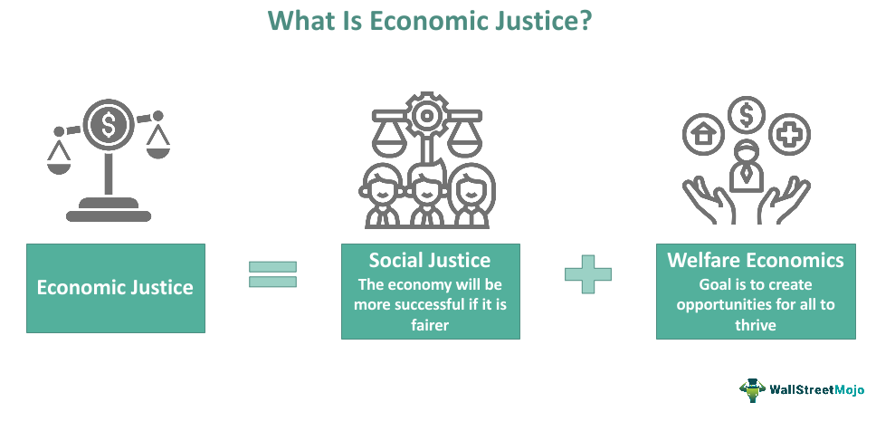

## Table of Contents

## What is economic justice?

Economic justice is about fairness in how wealth, resources, and opportunities are shared in a society. It means everyone should have a chance to earn a good living, no matter who they are or where they come from. This idea focuses on reducing big gaps between the rich and the poor, and making sure everyone has what they need to live well.

To achieve economic justice, policies and systems need to be set up to help everyone. This can include things like fair wages, access to education and healthcare, and support for those who are struggling. When these things are in place, people can have better lives and feel more secure. Economic justice is important because it helps create a society where everyone can succeed and feel valued.

## Why is economic justice important?

Economic justice is important because it helps make sure that everyone in a society has a fair chance to live a good life. When people have access to fair wages, good education, and healthcare, they can take care of themselves and their families. This fairness reduces the big differences between the rich and the poor, which can make society more stable and peaceful. If people feel that they are treated fairly, they are more likely to work hard and contribute to their community.

Without economic justice, many people might struggle to meet their basic needs, like food, shelter, and medical care. This can lead to problems like poverty, crime, and social unrest. When a large part of the population feels left out or ignored, it can harm the whole society. By working towards economic justice, we can create a world where everyone has the opportunity to succeed and feel valued, which is good for everyone in the long run.

## What are the basic principles of economic justice?

The basic principles of economic justice are about making sure everyone gets a fair share of resources and opportunities. This means everyone should have the chance to earn enough money to live well, no matter where they come from or who they are. It's important that everyone has access to good education and healthcare, because these things help people improve their lives. Economic justice also means that the rules and systems in society should help everyone, not just a few people.

Another key part of economic justice is reducing the big gaps between the rich and the poor. When some people have a lot more money and power than others, it can make life harder for those who have less. Economic justice tries to fix this by making sure everyone has what they need to live a good life. This can include things like fair wages, support for people who are struggling, and policies that help everyone have a chance to succeed. By following these principles, we can create a society where everyone feels valued and can contribute to the community.

## How does economic justice differ from economic equality?

Economic justice and economic equality are related but different ideas. Economic justice is about making sure everyone has a fair chance to earn a good living and live well. It focuses on fairness and making sure that everyone has what they need, like good jobs, education, and healthcare. Economic justice tries to reduce the big differences between rich and poor by creating systems and rules that help everyone, not just a few people.

Economic equality, on the other hand, means everyone has the same amount of money and resources. It's about making sure no one has more than anyone else. While economic justice aims to give everyone a fair shot, economic equality wants to make everything the same for everyone. Economic justice is more about creating opportunities and fairness, while economic equality is about making sure everyone has exactly the same.

Both ideas want to make life better for everyone, but they do it in different ways. Economic justice works by making sure systems are fair and everyone gets help when they need it. Economic equality tries to make sure everyone has the same things, which can be hard to do in real life. Understanding the difference between these two ideas can help us think about how to make our society better for everyone.

## What are some common indicators of economic injustice?

Economic injustice can show up in many ways. One big sign is when a lot of people don't earn enough money to live well. This can mean they can't afford basic things like food, a home, and healthcare. When many people are poor while others have a lot of money, it's a sign that something isn't fair. Another sign is when certain groups of people, like those from different races or backgrounds, have a harder time finding good jobs or getting paid fairly. This shows that the system might not be treating everyone the same.

Another common indicator of economic injustice is when people don't have good access to education and healthcare. If only rich people can go to good schools or see doctors, it's not fair to everyone else. This can keep people trapped in poverty because they can't get the tools they need to improve their lives. Also, if the government doesn't help people who are struggling, like by giving them support or making fair rules, it can make economic injustice worse. When we see these signs, it means we need to work on making things more fair for everyone.

## Can you provide examples of economic justice policies?

One example of an economic justice policy is raising the minimum wage. When the government makes sure that people who work get paid enough to live on, it helps reduce poverty. This means workers can afford food, a home, and other basic needs. It's a way to make sure everyone who works hard can have a decent life, no matter what job they do.

Another example is providing free or low-cost healthcare to everyone. When people can see a doctor without worrying about the cost, it helps them stay healthy and work better. This is important because if people are sick, they can't earn money or take care of their families. By making healthcare fair for everyone, we help create a society where people can live well and feel secure.

A third example is offering free education to all children. When everyone can go to school and learn, it gives them a chance to get better jobs in the future. This helps break the cycle of poverty because educated people can earn more money and improve their lives. By making education fair and available to everyone, we help build a society where everyone has the opportunity to succeed.

## How do different economic systems approach economic justice?

In a capitalist system, economic justice is often approached through policies that aim to create equal opportunities for everyone. This can include things like minimum wage laws, which make sure people get paid enough to live on, and regulations that stop businesses from treating workers unfairly. Capitalism focuses on letting people and businesses make their own choices, but it also needs rules to make sure everyone has a fair chance. Sometimes, though, big gaps between rich and poor can still happen in capitalist systems, so governments might use taxes and social programs to help those who are struggling.

In a socialist system, economic justice is more about making sure everyone has what they need, no matter what. This means the government might control things like healthcare, education, and even some businesses to make sure they are fair for everyone. Socialism tries to reduce the big differences between rich and poor by sharing resources more evenly. The idea is that if everyone has access to the same things, like good jobs and healthcare, it will be easier for everyone to live well. But, making everything equal can be hard, and sometimes it can slow down how fast the economy grows.

In a mixed economy, which combines parts of both capitalism and socialism, economic justice is approached by trying to balance freedom and fairness. Governments in mixed economies use policies like progressive taxes, where people who earn more pay more, to help support those who have less. They also might have programs like unemployment benefits and public healthcare to make sure everyone is taken care of. The goal is to let people and businesses make their own choices, but also to have rules and programs that help everyone have a fair shot at a good life.

## What role do governments play in promoting economic justice?

Governments play a big role in promoting economic justice by making rules and policies that help everyone have a fair chance. They can set a minimum wage so that people earn enough money to live on. They can also make sure that businesses treat workers fairly and don't pay them less just because of who they are. Governments can use taxes to help pay for things like education and healthcare, which everyone should be able to use. By doing these things, governments can make sure that everyone has the opportunity to succeed and live well.

Another way governments help with economic justice is by having programs that support people who are struggling. For example, they might give money to people who can't find a job or help families who don't have enough to eat. Governments can also make sure that everyone can go to school and learn, no matter how much money their family has. By doing this, they help people get better jobs and break the cycle of poverty. When governments work to make things fair for everyone, it helps create a society where everyone feels valued and can contribute.

## How can economic justice impact social stability?

Economic justice helps make society more stable by making sure everyone feels they have a fair chance. When people can earn enough money to live well, they feel more secure and happy. This means they are less likely to be angry or upset about how things are. If everyone has access to good jobs, education, and healthcare, it reduces the big gaps between rich and poor. When people see that the system is fair, they are more likely to work together and help each other, which makes society stronger and more peaceful.

When economic justice is missing, it can lead to problems like poverty, crime, and social unrest. If many people are struggling to meet their basic needs, they might feel left out or ignored. This can make them angry or hopeless, which can lead to more crime or even protests. Big differences between rich and poor can also make people feel like the system is unfair, which can cause tension and conflict. By working towards economic justice, governments and communities can help create a world where everyone feels valued and included, making society more stable and peaceful for everyone.

## What are the challenges in implementing economic justice?

One big challenge in implementing economic justice is finding the right balance between fairness and freedom. In some systems, like capitalism, people and businesses want the freedom to make their own choices. But this can lead to big gaps between rich and poor if there aren't enough rules to make things fair. Governments need to figure out how to let people have freedom while also making sure everyone has a fair shot. This can be hard because different people have different ideas about what's fair.

Another challenge is that making big changes can be slow and hard. For example, raising the minimum wage or providing free healthcare to everyone costs a lot of money. Governments have to find ways to pay for these things without hurting the economy. Also, not everyone agrees on what economic justice means or how to get there. Some people might think that helping those who are struggling is important, while others might worry that it will make people less motivated to work hard. These disagreements can make it hard to pass new laws or start new programs.

Lastly, economic justice often needs to deal with deep-rooted problems like discrimination and inequality. If certain groups of people have been treated unfairly for a long time, it can be hard to change that quickly. Policies that aim to help everyone might not work if they don't address these deeper issues. Governments need to think about how to make sure everyone, no matter their background, has a fair chance. This takes a lot of effort and time, but it's important for making society better for everyone.

## How can international cooperation enhance economic justice?

International cooperation can help make economic justice better by sharing resources and ideas between countries. When countries work together, they can help each other create fair rules and policies. For example, rich countries can help poorer ones with money or technology to improve things like education and healthcare. This can make life better for people in those countries and help reduce the big differences between rich and poor around the world. By working together, countries can learn from each other and find new ways to make sure everyone has a fair chance.

Another way international cooperation helps is by setting global rules that make trade and business fair for everyone. When countries agree on rules that stop businesses from treating workers badly or paying them too little, it helps make sure everyone gets a fair deal. This can also mean making sure that big companies don't harm the environment or take advantage of workers in poorer countries. By working together, countries can make the world a fairer place for everyone, no matter where they live.

## What are some case studies that demonstrate successful implementation of economic justice?

One example of successful economic justice is the Nordic model used in countries like Sweden and Norway. These countries have policies that make sure everyone has a fair chance. They have high taxes, but those taxes pay for things like free education and healthcare for everyone. They also have strong social safety nets, which means if someone loses their job, they get help until they find a new one. Because of these policies, there are fewer big gaps between rich and poor, and people feel more secure and happy. This model shows that when governments make sure everyone has what they need, society can be more fair and stable.

Another case study is the minimum wage increase in Seattle, USA. In 2014, Seattle decided to raise the minimum wage to $15 an hour over several years. This was done to make sure that people who work hard can earn enough to live well. Studies showed that after the wage increase, workers had more money to spend on things like food and housing. This helped reduce poverty and made life better for many people. The success in Seattle shows that setting a fair minimum wage can be an important part of making economic justice a reality.

## References & Further Reading

[1]: Piketty, T. (2014). [*Capital in the Twenty-First Century*](https://www.jstor.org/stable/j.ctt6wpqbc). Harvard University Press.

[2]: Van Parijs, P., & Vanderborght, Y. (2017). [*Basic Income: A Radical Proposal for a Free Society and a Sane Economy*](https://www.jstor.org/stable/j.ctv253f7wq). Harvard University Press.

[3]: Wilkinson, R., & Pickett, K. (2009). [*The Spirit Level: Why More Equal Societies Almost Always Do Better*](https://www.tandfonline.com/doi/full/10.1080/15700763.2011.577928). Allen Lane.

[4]: Chetty, R., et al. (2014). ["Where is the land of opportunity? The geography of intergenerational mobility in the United States."](https://academic.oup.com/qje/article/129/4/1553/1853754) The Quarterly Journal of Economics.

[5]: Autor, D. H., et al. (2003). ["The Skill Content of Recent Technological Change: An Empirical Exploration."](https://www.jstor.org/stable/25053940) The Quarterly Journal of Economics.

[6]: Rodrik, D. (1997). [*Has Globalization Gone Too Far?*](https://drodrik.scholar.harvard.edu/publications/has-globalization-gone-too-far). Institute for International Economics.

[7]: Gilens, M., & Page, B. I. (2014). ["Testing Theories of American Politics: Elites, Interest Groups, and Average Citizens."](https://www.cambridge.org/core/journals/perspectives-on-politics/article/testing-theories-of-american-politics-elites-interest-groups-and-average-citizens/62327F513959D0A304D4893B382B992B) Perspectives on Politics.