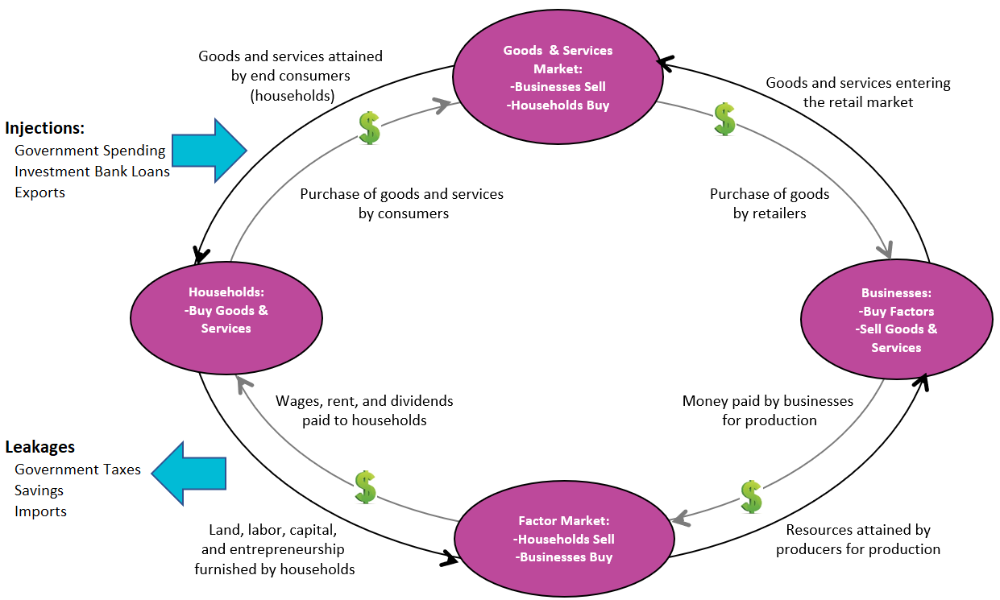

## Table of Contents

## What is economic leakage?

Economic leakage happens when money leaves a local economy instead of staying and helping the community. Imagine you go on a vacation to a small island. You stay at a big hotel owned by a company from another country. When you pay for your stay, some of that money goes back to the company's home country instead of staying on the island. This is an example of economic leakage.

This can be a problem because it means less money is available to create jobs and improve the local area. For example, if tourists buy souvenirs made in another country, the money spent doesn't help the local economy much. To reduce economic leakage, local businesses and governments can try to keep more money within the community by promoting local products and services.

## How does economic leakage affect local economies?

Economic leakage can hurt local economies a lot. When money leaves the local area, there's less of it to go around. This means local businesses might not make as much money, and they might not be able to hire as many people or pay them well. If a lot of money keeps leaving, it can make it hard for the local economy to grow and get stronger. It's like trying to fill a bucket with holes in it; the water just keeps leaking out.

This can also make it tough for local people to improve their lives. With less money staying in the community, there might not be enough to build new schools, fix roads, or start new businesses. Over time, this can lead to fewer opportunities for people living there. They might have to leave to find work elsewhere, which can make the local economy even weaker. Keeping more money in the local economy can help everyone in the community have a better chance at a good life.

## Can you provide examples of economic leakage in tourism?

Economic leakage in tourism happens when money spent by tourists doesn't stay in the local area. For example, imagine tourists staying at a big hotel chain from another country. When they pay for their rooms, some of that money goes back to the company's home country to pay for things like management fees or profits. This means the local economy doesn't get to keep all the money spent by tourists.

Another example is when tourists buy souvenirs that are made in other countries. If a tourist buys a t-shirt that was made somewhere else, the money they spend doesn't help the local economy much. Instead, it goes to the company that made the t-shirt, which might be far away. This can make it harder for local businesses to grow and create jobs because they're not getting as much money from tourists.

To reduce economic leakage, some places try to encourage tourists to spend money on local products and services. For example, a town might have a market where local artisans sell handmade goods. When tourists buy these items, more of their money stays in the community. This helps local businesses and can lead to more jobs and a stronger local economy.

## What are the common causes of economic leakage?

Economic leakage often happens because of things like foreign ownership and imports. When a big company from another country owns a business in a local area, like a hotel or a restaurant, some of the money spent by customers goes back to that company's home country. This can be for things like profits or management fees. So, the local area doesn't get to keep all the money spent there. Another cause is when people buy things that were made somewhere else. For example, if tourists buy souvenirs that were made in another country, the money they spend doesn't help the local economy as much.

Another common cause of economic leakage is when local businesses rely on imported goods and services. If a local restaurant uses ingredients that are shipped from far away, some of the money spent on those meals goes to pay for those imports. This means less money stays in the local economy. Also, if a local business needs to hire experts from other countries, the money paid for their services might leave the local area. To reduce economic leakage, it's important for local businesses and governments to try to keep more money within the community by promoting local products and services.

## How can economic leakage be measured?

Measuring economic leakage involves looking at how much money stays in a local area versus how much leaves it. Economists might track the flow of money by looking at things like how much tourists spend on local goods and services compared to what they spend on things owned by companies from other countries. They can also see how much local businesses rely on imported goods and services. By comparing these numbers, they can figure out how much money is leaking out of the local economy.

To get more detailed measurements, economists might use surveys or data from businesses and governments. For example, they might ask hotels how much of their profits go back to foreign owners or check import records to see how much money is spent on goods from other countries. By putting all this information together, they can estimate the total amount of economic leakage and understand where the biggest leaks are happening. This helps them find ways to keep more money in the local economy.

## What strategies can be used to reduce economic leakage?

One way to reduce economic leakage is to encourage tourists and locals to spend money on things made and owned by people in the area. For example, a town can have a market where local people sell their own crafts and food. When tourists buy these things, more of their money stays in the community. This helps local businesses grow and create more jobs. Another way is for local businesses to use ingredients and supplies that are made nearby. If a restaurant uses local vegetables instead of imported ones, more money stays in the local economy.

Another strategy is for the government to help local businesses. They can do this by giving money or other help to local companies, so they can compete better with big companies from other countries. For example, the government might give loans to local farmers so they can sell more of their products to hotels and restaurants. Also, making rules that encourage tourists to spend money on local things can help. For example, a city might have a tax on hotels owned by foreign companies, which makes it cheaper for tourists to stay at local hotels. By doing these things, more money can stay in the local area, helping everyone in the community.

## How does economic leakage impact sustainable development?

Economic leakage can make it hard for a place to grow in a sustainable way. When money leaves a local area instead of staying there, it means there's less money to spend on things like schools, hospitals, and roads. These things are important for making life better for people living there. If a lot of money keeps leaking out, it can be tough to build a strong and healthy community. This can slow down sustainable development because the community doesn't have the resources it needs to improve and take care of the environment.

On the other hand, reducing economic leakage can help with sustainable development. When more money stays in the local area, it can be used to support local businesses and create jobs. This can lead to a stronger economy that can invest in things like renewable energy and better ways to protect the environment. By keeping more money in the community, people can work together to make their area a better place to live, now and in the future. This is important for sustainable development because it helps make sure that growth is good for both people and the planet.

## What role do multinational corporations play in economic leakage?

Multinational corporations can cause a lot of economic leakage in local areas. When these big companies own businesses like hotels or factories in a local area, some of the money spent by customers goes back to the company's home country. This happens because the company might need to pay for things like management fees or send profits back home. So, even though people in the local area are spending money, not all of it stays there to help the local economy grow.

This can make it hard for local businesses to compete. If a multinational corporation has a big hotel in a small town, tourists might choose to stay there instead of at a local hotel. The money they spend at the big hotel doesn't help the local economy as much because some of it leaves the area. Over time, this can make it harder for the local community to develop and improve. If more money stayed in the local area, it could be used to create jobs and build things like schools and hospitals, which are important for making life better for everyone in the community.

## Can economic leakage be beneficial in any scenario?

Economic leakage can sometimes be good for a local area, even though it usually means money is leaving. For example, if a multinational company builds a big factory in a small town, it might bring in new jobs and help the local economy grow. Even if some of the money goes back to the company's home country, the jobs and money that stay can make a big difference. This can help the town become a better place to live and work.

But, this good side of economic leakage can be tricky. It depends a lot on how much money stays in the local area compared to how much leaves. If the factory brings in more good things like jobs and money than it takes away, then it can be a positive thing. But if too much money leaves, it might not help the local area as much as people hope. So, while economic leakage can sometimes be helpful, it's important to make sure more money stays in the community to really see the benefits.

## How do government policies influence economic leakage?

Government policies can help reduce economic leakage by making rules that keep more money in the local area. For example, a government might give money or help to local businesses so they can grow and compete better with big companies from other countries. They can also make it easier for tourists to spend money on local things by having special markets or giving tax breaks to local hotels and restaurants. By doing these things, the government can make sure more of the money spent by people stays in the community, which helps everyone there.

On the other hand, government policies can sometimes make economic leakage worse. If a government gives a lot of benefits to multinational companies to come and set up businesses in the local area, it might mean more money leaves the community. These big companies might send profits and fees back to their home countries, which takes money away from the local economy. So, it's important for governments to think carefully about their policies and try to find a balance that helps the local area grow and keep more money at home.

## What are the long-term effects of economic leakage on a country's economy?

Over time, economic leakage can hurt a country's economy a lot. When money keeps leaving the local area, there's less of it to go around. This means local businesses might not grow as much, and they might not be able to hire as many people or pay them well. If this keeps happening, the economy can get weaker. It becomes harder to build new schools, fix roads, or start new businesses because there's not enough money staying in the country. This can lead to fewer jobs and opportunities for people living there, which makes it tough for the country to grow and improve.

But, if a country can reduce economic leakage, it can help its economy in the long run. When more money stays in the local area, it can be used to support local businesses and create more jobs. This can lead to a stronger economy that can invest in things like education, health care, and better ways to protect the environment. By keeping more money at home, a country can work towards a better future for everyone who lives there. This is important because it helps make sure that the economy can grow in a way that is good for both people and the planet.

## How can technology be used to track and minimize economic leakage?

Technology can help track economic leakage by using data to see where money is going. For example, special software can look at how much tourists spend on local things compared to things owned by companies from other countries. This software can also check how much local businesses use imported goods and services. By putting all this information together, people can see how much money is leaving the local area and find ways to keep more of it at home.

Technology can also help minimize economic leakage by making it easier for people to spend money on local things. For example, apps can show tourists where to find local markets and restaurants. This helps them spend their money in ways that help the local economy. Also, technology can help local businesses connect with each other, so they can use more local products and services. By using technology in these ways, more money can stay in the community, which helps everyone there have a better chance at a good life.

## References & Further Reading

[1]: Keynes, J. M. (1936). ["The General Theory of Employment, Interest, and Money"](https://link.springer.com/book/10.1007/978-3-319-70344-2). Palgrave Macmillan.

[2]: Baker, D., & Rushing, F. W. (1992). ["The Role of Savings and Investment in Balancing the Current Account: Some Conventional and Unorthodox Insights."](https://en.wikipedia.org/wiki/2011_North_Carolina_Tar_Heels_football_team) Review of Social Economy, 50(3), 278-291.

[3]: Lopez de Prado, M. (2018). ["Advances in Financial Machine Learning"](https://www.amazon.com/Advances-Financial-Machine-Learning-Marcos/dp/1119482089). Wiley.

[4]: Aronson, D. (2006). ["Evidence-Based Technical Analysis: Applying the Scientific Method and Statistical Inference to Trading Signals"](https://www.amazon.com/Evidence-Based-Technical-Analysis-Scientific-Statistical/dp/0470008741). Wiley.

[5]: Jansen, S. (2020). ["Machine Learning for Algorithmic Trading"](https://github.com/stefan-jansen/machine-learning-for-trading). Packt Publishing.

[6]: Chan, E. P. (2009). ["Quantitative Trading: How to Build Your Own Algorithmic Trading Business"](https://github.com/ftvision/quant_trading_echan_book). Wiley.

[7]: Pardo, R. (2011). ["The Evaluation and Optimization of Trading Strategies"](https://onlinelibrary.wiley.com/doi/book/10.1002/9781119196969) (2nd ed.). Wiley.