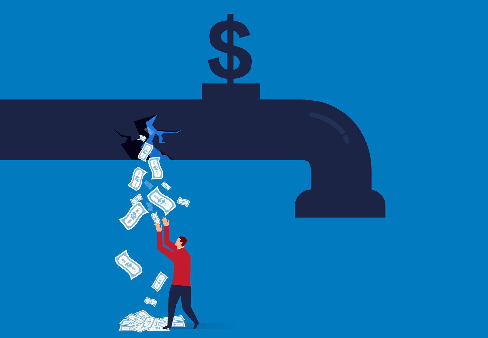

Understanding the concept of leakage in economics and algorithmic trading is crucial for both economists and traders. Leakage represents a divergence of income from a defined circular flow, impacting both economic dynamics and trading algorithms. Within the context of economics, leakage can have significant implications for a nation's capital flow. It occurs when income is diverted from the economic cycle, reducing the amount available for consumption and investment. This can manifest through savings, taxes, and imports that remove funds from the domestic economy, potentially stunting economic growth.

Conversely, in algorithmic trading, data leakage presents a different challenge by introducing bias in model training processes. It occurs when information that should not be available at the time a prediction is made is unintentionally included in the data set used for model training. This false optimization can lead to overly optimistic assessments of model performance, resulting in underperformance when the model is deployed in real-world trading scenarios.



This article explores various examples of leakage in both these domains and provides insights into their implications. By examining real-world scenarios, readers can gain a comprehensive understanding of how leakage influences both economic policies and trading strategies. A deep understanding of these phenomena is essential for developing effective economic interventions and robust trading models, ensuring stability and accuracy in both fields.

## Table of Contents

## Economic Leakage: Concepts and Examples

Economic leakage is a phenomenon where income exits an economic system rather than being cycled within it. This leakage can take several forms, including savings, taxes, and imports, which divert spending away from immediate consumption and, consequently, reduce the velocity of money within an economy. Understanding these concepts is crucial for developing strategies to address economic challenges posed by such leakages.

One significant form of leakage is through imported goods, which can lead to capital outflow and the transfer of wealth from one country to another. When consumers or businesses in a country purchase foreign goods, the payment made for these goods flows out to the foreign economy, potentially weakening the domestic economy unless counterbalanced by equivalent exports. This net outflow can affect the trade balance and put pressure on the nation's currency.

Transnational corporations (TNCs) also contribute to economic leakage when profits derived from operations in a host country are not reinvested locally but are instead transferred back to their home or another country. This practice, known as profit repatriation, can limit the economic benefits that host countries gain from foreign direct investment, such as job creation and infrastructure development.

Tourism is another sector where economic leakage is prevalent. Although tourism can be a substantial source of income, it can also lead to significant leakages if a large portion of the revenue generated is used to pay for imported goods and services, or when profits are repatriated by foreign-owned hotels and travel companies. This reduces the positive impact of tourism on the local economy, as the financial benefits are not fully retained within the host locality.

To measure economic leakage, policymakers and economists often utilize national income accounting and balance of payments [statistics](/wiki/bayesian-statistics), which provide insights into the flow of income and expenditures within and outside an economy. By analyzing these data, governments can identify areas where leakages are most severe and develop targeted policies to mitigate them, such as encouraging domestic production to replace imports, offering incentives for reinvestment of corporate profits, and promoting locally-owned tourism businesses.

Addressing economic leakage involves implementing strategies that enhance domestic consumption and investment, thereby improving national economic resilience. By reducing leakage, a country can better retain its generated wealth, strengthening its economy and providing a more robust platform for sustainable development.

## Understanding Economic Leakage in Keynesian Economics

Keynesian economics is a framework that emphasizes the role of aggregate demand in influencing economic output and fluctuations. At its core, it employs the circular flow model to depict how money moves through an economy as income and expenditure. This model is pivotal in understanding the concept of economic leakage—a situation where potential spending is diverted away from the domestic economy.

Leakages are characterized as non-consumptive uses of income, such as savings, taxes, and imports. These factors effectively withdraw money from the economy's circular flow, thereby reducing aggregate demand. For instance, when individuals save a portion of their income instead of spending it, those funds are temporarily removed from the economic cycle. Similarly, taxes collected by the government also represent a withdrawal until they are spent back into the economy. Imports, by redirecting spending towards foreign products, cause money to flow out of the domestic economy.

The Keynesian perspective contends that excessive leakages can lead to insufficient demand, resulting in unemployment and economic stagnation. To counteract these effects, government interventions are often deemed necessary. Such interventions typically involve capital injections into the economy, either through increased public spending or tax cuts, to stimulate demand. This approach is encapsulated in the Keynesian multiplier effect, where an initial injection of government spending ultimately leads to a more significant increase in national income. 

Mathematically, if $MPC$ is the marginal propensity to consume, the Keynesian multiplier $k$ is defined as $k = \frac{1}{1-MPC}$. A government spending increase $\Delta G$ then results in a total income increase of $\Delta Y = k \times \Delta G$.

Effectively managing leakages ensures the economic system remains balanced and vigorous. By minimizing leakages or countering them with strategic government action, a nation can bolster its economic health and resilience. This equilibrium fosters a stable environment conducive to growth and prosperity, highlighting the critical importance of understanding and addressing economic leakages within the Keynesian framework.

## Data Leakage in Algorithmic Trading: Overview and Implications

Data leakage in [algorithmic trading](/wiki/algorithmic-trading) (algotrading) is a critical issue that can severely compromise the performance of trading models. It occurs when information that should not be part of the model training dataset is inadvertently included, leading to misleadingly high predictive accuracy during model development and evaluation. This unintended incorporation of extraneous data ultimately results in models that perform poorly when deployed in real-world trading environments.

Several types of data leakage can impact algotrading models. **Target leakage** happens when the target variable, which the model is trying to predict, incorporates information that should not be available at prediction time. For example, if a feature used in training a stock price prediction model contains future values of the target stock price, the model can appear to perform exceptionally well during [backtesting](/wiki/backtesting) but fail when applied to unseen data.

**Train-test bleed** occurs when data from the validation or test set inadvertently leaks into the training set, violating the principle of data separation. This leakage results in overfitting, where the model learns patterns specific to the training data rather than generalizable insights. To prevent train-test bleed, proper data splitting techniques, such as time-based splits for time-series data, should be employed.

**Feature leakage** involves the inclusion of features that carry information from the future or are proxies of the target variable. This can happen if future information is accidentally encoded in the features or when features are engineered based on dataset-wide statistics rather than temporal subsets. For algorithms dealing with time-series data, maintaining the causality and ordering of data during feature engineering is essential.

The implications of data leakage are profound. Models trained with leaked data often report overly optimistic performance metrics during development phases, such as high accuracy, precision, or recall. However, this perceived robustness collapses during actual trading, leading to financial losses. Hence, ensuring accurate data handling is not merely a technical formality but a cornerstone of financial risk management.

To mitigate data leakage, traders and data scientists must conduct exhaustive checks and implement strict data-handling protocols. Strong practices include rigorous feature audits and employing robust validation frameworks that mimic the real-world conditions under which the trading strategy will operate. By addressing potential data leakage issues, the reliability and robustness of trading models are significantly enhanced, contributing to sustained profitability and reduced risk in financial markets.

## Examples of Data Leakage in Algorithmic Trading

In algorithmic trading, data leakage is a critical issue that can compromise the predictive performance of trading models. One common form of data leakage occurs through incorrect cross-validation in time-series data. In time-series forecasting, data is inherently ordered by time, and it is essential to maintain this temporal order when testing predictive models. When future information inadvertently influences past data models, it gives an unrealistic assessment of model accuracy. For example, using a standard k-fold cross-validation without regard for temporal sequencing can introduce leakage by mixing data temporally, thus leaking information from the future into the past predictions.

Improper feature engineering is another source of data leakage. Incorporating future-derived statistics as inputs in trading algorithms, such as calculating averages or variances that use future data points, provides the model access to information it should never have during prediction. This leads to overly optimistic performance during backtesting, as the model has learned patterns it will not have access to in live environments.

Mistakes in data preprocessing also contribute to leakage. A frequent error is normalizing data using the entire dataset, including future data points. For instance, if a dataset is normalized by applying the mean and variance of the whole data, including test and validation sets, unseen data inadvertently impacts the model, creating leakage. This blurs the line between training and testing phases, leading to misleading performance indicators.

Real-world examples highlight the necessity for stringent data handling practices to prevent leakage. For instance, improper time-series cross-validation has resulted in significant financial losses when models fail to account for the sequential nature of data, leading to strategies that work on paper but falter in practical applications. Conducting feature audits and verifying data integrity techniques are fundamental to ensure data transparency and accuracy, thus mitigating the risks associated with leakage.

Industry case studies provide valuable insights into effective strategies to prevent data leakage. Companies that have successfully implemented policies like strict temporal dataset partitioning, robust feature selection processes, and ongoing validation demonstrate improved model reliability and performance. For instance, a leading financial firm employed a sliding window approach rather than random cross-validation, ensuring that their model was tested on unseen future data, thus reflecting a more realistic performance metric.

## Detecting and Mitigating Leakage in Algotrading

Detecting and mitigating data leakage in algorithmic trading is pivotal to maintaining the accuracy and reliability of trading models. Data leakage can introduce biases that result in over-optimistic performance estimates, ultimately compromising financial strategies when deployed in actual market conditions.

Thorough feature audits are a fundamental step in detecting data leakage. This process involves scrutinizing the input variables to ensure future information is not inadvertently included in the training dataset. For instance, if a feature derived from future stock prices is used in training a model intended to predict those same prices, it would result in leakage. Hence, a comprehensive audit of features must be conducted to ensure they conform to temporal constraints and do not encroach upon the target variable's domain.

Proper dataset splitting techniques are essential for maintaining model integrity, particularly with temporal datasets. When dealing with time-series data, it is crucial to divide the data chronologically rather than randomly. This approach prevents data from the future (e.g., after a certain point in time) from being used in training, which could lead to misleading outcomes. Implementing time-based cross-validation techniques, such as rolling or expanding window validation, can help preserve the temporal sequence and integrity of the datasets.

Regular evaluation using real-world metrics is another vital practice. This evaluation involves testing the model against out-of-sample data that it has not encountered during training. Utilizing metrics that reflect actual trading conditions, such as drawdowns or Sharpe ratios, helps in identifying latent leakage issues. Continuous evaluation ensures that the model remains robust and that any hidden biases are recognized and rectified promptly.

The application of best practices, such as respecting temporal integrity, is crucial to safeguarding datasets against leakage. Ensuring that data used for training purposes is strictly segregated from validation and testing data is paramount. This segregation can be handled programmatically by utilizing libraries like `scikit-learn` in Python to implement precise data-splitting techniques. For instance:

```python
from sklearn.model_selection import TimeSeriesSplit

# Example of temporal data splitting
tscv = TimeSeriesSplit(n_splits=5)
for train_index, test_index in tscv.split(data):
    train, test = data[train_index], data[test_index]
```

In advanced trading models, rigorous validation frameworks are employed to effectively demonstrate the benefits of these practices. Companies often implement comprehensive backtesting platforms that simulate trading scenarios across various market conditions. These platforms can detect anomalies attributable to data leakage and adjust hyperparameters accordingly to ensure the model's resilience.

In conclusion, addressing data leakage in algorithmic trading necessitates a multifaceted approach, combining systemic audits, strategic dataset partitioning, and ongoing performance evaluations. By adhering to these methodologies, trading entities can mitigate the risks posed by data leakage, thus enhancing the robustness and predictivity of their models. As the industry progresses, continued refinement of these techniques will be critical to preserving the integrity and profitability of trading systems.

## Conclusion

Leakage, as observed in both economics and algorithmic trading, significantly influences economic policy and financial stability. For economists and traders, understanding and effectively addressing leakage is crucial as it optimizes economic performance and enhances the efficacy of trading algorithms.

In economics, leakage, through means such as savings, taxes, and imports, disrupts the continuous flow of money within an economy. By addressing these outflows, policymakers can ensure enhanced national economic performance and stability. Governments can employ strategies such as capital injections or targeted fiscal policies to remedy the adverse impacts of leakages. Effective management of leakages bolsters the resilience and health of the national economy, providing a balanced approach to growth and stability.

In the domain of algorithmic trading, data leakage poses substantial risks to model accuracy and reliability. Leakage, often caused by improper data handling practices, can distort model predictions, which may lead to suboptimal trading decisions and potential financial losses. Traders and data scientists must prioritize rigorous data management, employing strategies like proper dataset splitting, feature audits, and validation frameworks to counteract leakage. Ongoing improvements and adherence to best practices in data management significantly mitigate the risks associated with leakage, ensuring robust and reliable trading models.

By examining practical examples of both economic and data leakage, professionals in these fields are better equipped to identify vulnerabilities and deploy strategic interventions. Learning from real-world cases informs the development of robust strategies to address leakage issues.

Future advancements in detecting and preventing leakage promise to play a pivotal role in ensuring the integrity of both economic systems and trading platforms. Enhancing methodologies for identifying and correcting leakage will be crucial in maintaining profitability and system integrity, safeguarding both economic prosperity and trading success.

## References & Further Reading

[1]: Keynes, J. M. (1936). ["The General Theory of Employment, Interest, and Money"](https://link.springer.com/book/10.1007/978-3-319-70344-2). Palgrave Macmillan.

[2]: Baker, D., & Rushing, F. W. (1992). ["The Role of Savings and Investment in Balancing the Current Account: Some Conventional and Unorthodox Insights."](https://en.wikipedia.org/wiki/2011_North_Carolina_Tar_Heels_football_team) Review of Social Economy, 50(3), 278-291.

[3]: Lopez de Prado, M. (2018). ["Advances in Financial Machine Learning"](https://www.amazon.com/Advances-Financial-Machine-Learning-Marcos/dp/1119482089). Wiley.

[4]: Aronson, D. (2006). ["Evidence-Based Technical Analysis: Applying the Scientific Method and Statistical Inference to Trading Signals"](https://www.amazon.com/Evidence-Based-Technical-Analysis-Scientific-Statistical/dp/0470008741). Wiley.

[5]: Jansen, S. (2020). ["Machine Learning for Algorithmic Trading"](https://github.com/stefan-jansen/machine-learning-for-trading). Packt Publishing.

[6]: Chan, E. P. (2009). ["Quantitative Trading: How to Build Your Own Algorithmic Trading Business"](https://github.com/ftvision/quant_trading_echan_book). Wiley.

[7]: Pardo, R. (2011). ["The Evaluation and Optimization of Trading Strategies"](https://onlinelibrary.wiley.com/doi/book/10.1002/9781119196969) (2nd ed.). Wiley.