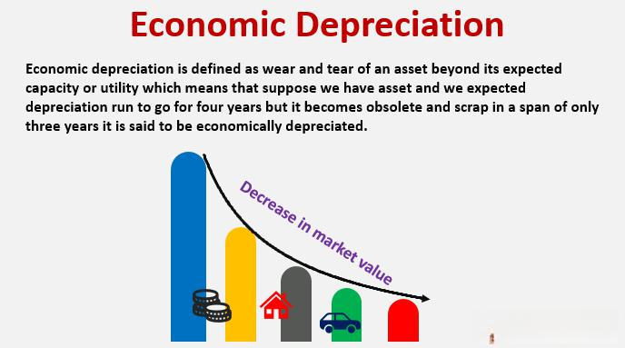

Economic life, asset management, depreciation, and algorithmic trading are essential components of today's complex financial and economic systems. Each of these elements plays a significant role in determining asset valuation, formulating investment strategies, and managing finances effectively. This article investigates how these concepts interact and their importance in contemporary economics. A profound understanding of these concepts is indispensable for businesses, investors, and policymakers aiming to refine their financial decisions and strategies.

Economic life refers to the period during which an asset is economically beneficial to its owner, influencing decisions on investment timelines and replacement strategies. Asset management revolves around the optimal use and maintenance of assets to maximize their value and operational efficiency. Understanding an asset's economic life is crucial for effective asset management, which can extend these periods through strategic utilization, upkeep, and upgrades.



Depreciation, on the other hand, accounts for the decline in an asset's value over time due to factors like wear and tear or technological obsolescence. It is a pivotal component in accounting and taxation, influencing financial statements and tax liabilities. Accurate depreciation assessment aids in planning for asset replacements and managing cash flows, with different methods such as straight-line and accelerated depreciation offering varied financial impacts. Identifying assets nearing the end of their economic life through depreciation analysis is vital for strategic investment decision-making.

Algorithmic trading utilizes computer algorithms to automate trading operations based on defined strategies. This method eliminates emotional bias and increases trading speed and precision, which is especially crucial in volatile markets. Algorithms can process extensive datasets to detect trading opportunities in real-time, improving transaction timeliness. The integration of AI in algorithmic trading has further allowed for dynamic strategies that adapt to market changes, offering a significant edge in markets like forex where currency fluctuation is key.

In contemporary finance, the interplay between these concepts has been significantly enhanced through the inclusion of algorithmic trading, improving asset management practices and depreciation considerations. By understanding and leveraging the relationships between an asset's economic life, its depreciation, and algorithmic trading strategies, stakeholders can optimize investment portfolios and financial performance, thereby maintaining a competitive advantage in the evolving economic landscape.

## Table of Contents

## Understanding Economic Life and Asset Management

Economic life is a fundamental concept in asset management, representing the period during which an asset maintains its economic value and functionality for its owner. This lifespan dictates not only when the asset will eventually be replaced or upgraded but also influences the broader strategic management of resources. The duration of an asset's economic life is determined by factors such as technological advancements, market changes, and the asset's physical condition.

Asset management is the strategic approach to maximizing the value and operational efficiency of an organization's assets. It involves a systematic process of deploying, operating, maintaining, upgrading, and disposing of assets cost-effectively. Effective asset management requires a deep understanding of the economic life of assets to make informed decisions about investment timelines, budgeting for maintenance, and planning for asset replacement. By accurately estimating an asset's economic life, businesses can ensure that their capital is deployed efficiently, mitigating the risk of unexpected costs or operational disruptions.

One of the primary objectives of asset management is to extend the economic life of assets whenever possible. This can be achieved by optimizing usage patterns, implementing rigorous maintenance schedules, and investing in necessary upgrades that enhance the asset's efficiency or capability. For instance, preventive maintenance can significantly reduce the risk of unexpected breakdowns and lengthen the asset's productive period.

Asset management strategies must be adaptive to technological advancements and market changes. As technology evolves, assets may become obsolete more quickly, necessitating proactive management to maximize their value before replacement is required. Businesses that anticipate and adapt to these changes can gain a competitive edge by optimizing the timing of investments in new technology and minimizing the costs associated with asset obsolescence.

In summary, understanding the economic life and employing strategic asset management are crucial for optimizing the value derived from assets. By extending the economic life through careful management and adapting to technological and market changes, businesses can enhance their operational efficiency and financial performance.

## The Importance of Depreciation in Financial Strategy

Depreciation is a fundamental concept in financial management, representing the progressive reduction in an asset's value due to factors such as wear and tear, obsolescence, or market demand shifts. This concept plays a pivotal role in both accounting and taxation, influencing financial statements and affecting a company's tax liabilities. For businesses, accurately estimating depreciation is vital for several reasons, including planning for asset replacement and managing cash flows effectively. 

In accounting, depreciation is essential because it allows companies to allocate the cost of tangible assets over their useful life, thereby matching expenses with the revenue they generate. This allocation aids companies in presenting a realistic picture of their profitability. Moreover, depreciation affects the balance sheet and income statement, as it reduces the book value of assets and contributes to annual expense reports.

Taxation is another area significantly impacted by depreciation. By decreasing taxable income through depreciation deductions, businesses can manage their tax liabilities more efficiently. This is particularly crucial for capital-intensive industries where asset depreciation constitutes a substantial part of expenses.

Various methods exist to calculate depreciation, with straight-line and accelerated depreciation being the most commonly used. The straight-line method distributes the cost of an asset evenly across its useful life. It is represented by the formula:

$$
\text{Depreciation Expense} = \frac{\text{Cost of Asset} - \text{Residual Value}}{\text{Useful Life}}
$$

On the other hand, accelerated depreciation allows for higher depreciation charges in the early years of an asset's life, reflecting the presumption that assets lose value more rapidly soon after purchase. This method includes techniques such as the double-declining balance and sum-of-the-years-digits. Accelerated methods are often used for tax purposes to gain upfront tax relief and improve cash flow in the short term.

By informing investment strategies, depreciation helps businesses identify assets approaching the end of their economic life, allowing for timely replacement or upgrade planning. This proactive stance avoids disruptions in operations and aligns with strategic asset management goals. Furthermore, depreciation schedules provide investors and stakeholders with insights into potential future capital expenditures and the financial health of a company.

In summary, effective management of depreciation is crucial for optimizing financial strategies. It enables businesses to maintain accurate financial records, leverage tax benefits, and make informed investment and asset management decisions. Such an approach ensures that companies remain competitive, adaptable to market changes, and prepared for future growth.

## Algorithmic Trading: Enhancing Financial Decisions

Algorithmic trading is a sophisticated approach that leverages computer algorithms to automate trading processes based on predefined strategies. This method is revolutionizing financial markets by enhancing trading efficiency and accuracy while minimizing emotional bias inherent in human traders. Its significance is particularly pronounced in volatile markets where rapid decision-making is critical.

The core advantage of [algorithmic trading](/wiki/algorithmic-trading) lies in its ability to process large datasets instantaneously, identifying trading opportunities and executing trades with a speed unattainable by human traders. This capability is vital for markets characterized by high [volatility](/wiki/volatility-trading-strategies), as it allows for timely reactions to market events and fluctuations. By swiftly analyzing market conditions and executing trades, algorithms help traders capitalize on transient market inefficiencies.

Integration of [artificial intelligence](/wiki/ai-artificial-intelligence) (AI) in algorithmic trading further enhances this capability. AI-driven algorithms can develop adaptive strategies that learn from historical data and current market trends. These adaptive strategies enable the algorithms to adjust to new information and evolving market conditions, improving their prediction accuracy and performance over time. This feature is particularly beneficial in dynamic markets where conditions can change rapidly.

In foreign exchange ([forex](/wiki/forex-system)) markets, algorithmic trading has proven to be exceptionally effective. Forex trading requires careful analysis of currency appreciation and depreciation trends, which can be influenced by a multitude of factors including economic indicators, geopolitical events, and [interest rate](/wiki/interest-rate-trading-strategies) changes. Algorithms can efficiently process this wide array of information to make informed decisions, thus optimizing the trading process.

Algorithmic trading eliminates the influence of human emotions like fear and greed, which can cloud judgment and lead to suboptimal trading decisions. By relying on objective data and mathematical models, algorithms ensure consistent and rational decision-making. Additionally, automated trading systems enable the execution of trades at unprecedented speeds, an essential attribute in capturing fleeting market opportunities and managing risks in fast-paced environments.

Python, being a popular programming language in the financial industry, often serves as a tool for implementing algorithmic trading strategies. Its extensive libraries for data analysis and [machine learning](/wiki/machine-learning) make it ideal for developing and testing trading algorithms. Here is a simple example of using Python to implement a moving average crossover strategy, a common algorithmic trading technique:

```python
import pandas as pd
import numpy as np

# Load historical price data
data = pd.read_csv('historical_data.csv')
data['Short_MA'] = data['Close'].rolling(window=50).mean()
data['Long_MA'] = data['Close'].rolling(window=200).mean()

# Generate trading signals
data['Signal'] = np.where(data['Short_MA'] > data['Long_MA'], 1, 0)

# Calculate position changes
data['Position'] = data['Signal'].diff()

# Print trading signals
print(data[['Close', 'Short_MA', 'Long_MA', 'Signal', 'Position']])
```

In this code snippet, short and long-term moving averages (MA) are calculated from historical price data. A buy signal is generated when the short-term MA crosses above the long-term MA, indicating a potential upward trend.

Ultimately, algorithmic trading represents a paradigm shift in financial decision-making, offering a robust framework for executing trades with precision and adapting to market dynamics. By harnessing the power of algorithms and AI, traders and financial institutions can achieve enhanced performance and risk management in today’s complex financial markets.

## Interrelations Between Economic Life, Depreciation, and Algo Trading

Understanding the interrelations among economic life, depreciation, and algorithmic trading reveals a nuanced approach to optimizing financial strategies. The economic life of an asset—the period during which it is expected to be productive—plays a critical role in determining its depreciation schedule. Depreciation, which accounts for the reduction in value over time, is not just a tax consideration but a strategic [factor](/wiki/factor-investing) that influences investment decisions and resource allocation.

Algorithmic trading introduces advanced data analytics and automation to financial markets. By utilizing algorithms, investors can predict depreciation trends more accurately, allowing them to adjust holdings accordingly. For instance, if a particular class of assets is expected to depreciate rapidly due to technological advances, an algorithm can alert traders to reduce their holdings in such assets, thereby controlling risk exposure. This predictive capability enhances the timeliness and precision of asset management decisions.

Incorporating depreciation metrics into trading algorithms enables the evaluation of asset values, risk profiles, and potential returns. For example, an algorithm could automatically calculate the remaining economic life of an asset and integrate this information into risk modeling and valuation estimates. This allows for more informed decision-making based on objective criteria rather than subjective assessments. By accounting for depreciation, algorithms provide a more robust analysis of asset performance and market dynamics.

Moreover, the synergy between depreciation models and algorithmic trading enhances investment portfolio performance. Algorithms that consider both current depreciation rates and forecasts of future asset value changes can dynamically adjust portfolios to optimize returns over time. For example, a portfolio might increase investments in sectors with expected asset appreciation while minimizing exposure to those facing accelerated depreciation. 

This interplay between economic life, depreciation, and algorithmic trading represents a strategic evolution in financial management. By integrating these elements, businesses and investors can create a comprehensive framework for making informed, data-driven decisions that are aligned with long-term objectives and market conditions. This approach not only maximizes asset value but also bolsters competitive advantage in the fast-evolving financial landscape.

## Case Studies and Practical Applications

Examining real-world examples underscores the intersection of asset management, depreciation, and algorithmic trading within various industries. This analysis reveals how these elements play crucial roles in enhancing financial efficiency and strategic planning.

In the technology sector, companies like Apple and Samsung illustrate the rapid depreciation of assets due to technological obsolescence. As new models of smartphones or laptops are introduced, older versions quickly lose value, impacting the balance sheets through accelerated depreciation. This cycle necessitates efficient asset management strategies to mitigate losses. Companies employ robust depreciation methods and reinvest in research and development to remain competitive. For instance, straight-line depreciation may be applied initially, but companies often pivot to accelerated methods like the double-declining balance as their products enter late stages of their economic life.

Hedge funds offer another compelling example, employing algorithmic trading to manage asset depreciation risks and optimize returns. By integrating extensive market data, these funds develop algorithms that anticipate asset value changes. These strategies enable funds to hedge against depreciation risks effectively. For example, a [hedge fund](/wiki/hedge-fund-trading-strategies) might use Python to implement a machine learning algorithm that predicts stock value fluctuations, including the impact of accelerating depreciation on related technology stocks. A sample Python code could be:

```python
import numpy as np
from sklearn.linear_model import LinearRegression

# Example data: years and corresponding asset values
years = np.array([1, 2, 3, 4, 5]).reshape(-1, 1)
values = np.array([1000, 800, 600, 400, 200])

model = LinearRegression()
model.fit(years, values)
predicted_value = model.predict(np.array([[6]]))
print(f"Predicted asset value in year 6: {predicted_value[0]}")
```

This linear regression model forecasts asset depreciation, aiding funds in making informed trading decisions that capitalize on predicted depreciation trends.

Algorithmic strategies also facilitate dynamic adjustments to asset portfolios considering depreciation impacts. Algorithmic trading systems can integrate real-time depreciation metrics to assess assets' fair value, thereby recalibrating portfolios to optimize returns. Using advanced algorithms, these systems ensure that assets nearing the end of their economic life are divested in favor of more promising ventures. This approach is particularly effective in volatile sectors such as forex, where currency values are subject to frequent depreciation and appreciation cycles.

Industries like aviation and energy emphasize the economic life and depreciation in strategic planning. Airlines, for instance, consider the economic life of aircraft to schedule maintenance and replacements, using depreciation to account for asset wear and tear over time. Similarly, energy companies factor in the depreciation of infrastructure, such as turbines, to plan for renewal or upgrading investments, ensuring sustained operational efficiency.

These case studies illustrate that optimizing the interplay between asset management, depreciation, and algorithmic trading is not only beneficial but essential for industry leaders to navigate the complexities of modern economic environments. This triadic approach fosters a strategic foundation for financial decision-making, leading to improved long-term operational and investment outcomes.

## Conclusion

Optimizing the economic life of assets, managing depreciation effectively, and leveraging algorithmic trading have become indispensable elements in modern finance. These components collectively provide a robust framework for strategic decision-making, particularly in an era marked by rapid technological advancements and fluctuating market conditions. By understanding the economic life of assets, businesses and investors can maximize asset utilization, extend operational functionality, and plan for timely replacement, thereby stabilizing financial health and ensuring long-term resource allocation.

Effective management of depreciation is equally critical, as it not only influences financial reports and tax obligations but also informs strategic investment decisions. Accurate depreciation calculations enable companies to forecast asset replacement needs and manage cash flows effectively, ensuring fiscal stability and planning accuracy. Moreover, varied depreciation methods, such as straight-line and accelerated depreciation, offer nuanced approaches to asset valuation, accommodating diverse business models and investment strategies.

The introduction of algorithmic trading adds a layer of sophistication to financial strategies by harnessing computational power to analyze market data, predict trends, and execute trades with speed and precision. These algorithms, free from human emotional biases, enhance decision-making processes and allow for adaptive strategies that react dynamically to market transformations. Additionally, the integration of artificial intelligence into algorithmic trading systems further amplifies this capability, providing continuous learning and adjustment mechanisms that optimize trading outcomes.

The intersection of these concepts enhances financial planning and improves investment performance. By understanding and leveraging the synergies between asset economic life, depreciation practices, and algorithmic trading, businesses and investors can craft strategic approaches that are both comprehensive and competitive. This holistic approach is vital for navigating the complexities of modern financial markets, securing competitive advantages, and fostering long-term success.

In conclusion, staying informed and adaptable to these evolving financial dynamics is crucial. The effective integration and application of asset management, depreciation accounting, and algorithmic trading not only provide a competitive edge but also facilitate sustained economic growth and strategic agility in the fluctuating landscape of modern finance.

## References & Further Reading

[1]: ["Advances in Financial Machine Learning"](https://www.amazon.com/Advances-Financial-Machine-Learning-Marcos/dp/1119482089) by Marcos Lopez de Prado

[2]: ["Evidence-Based Technical Analysis: Applying the Scientific Method and Statistical Inference to Trading Signals"](https://www.amazon.com/Evidence-Based-Technical-Analysis-Scientific-Statistical/dp/0470008741) by David Aronson

[3]: ["Machine Learning for Algorithmic Trading"](https://github.com/stefan-jansen/machine-learning-for-trading) by Stefan Jansen

[4]: ["Quantitative Trading: How to Build Your Own Algorithmic Trading Business"](https://www.amazon.com/Quantitative-Trading-Build-Algorithmic-Business/dp/1119800064) by Ernest P. Chan