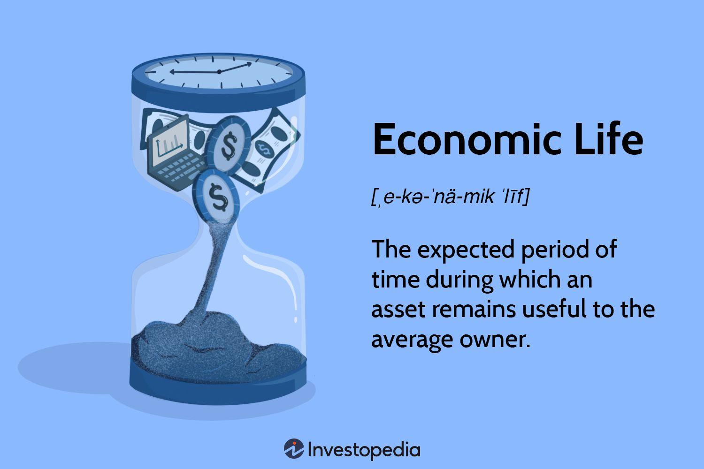

## Table of Contents

## What is economic life in the context of assets?

Economic life refers to the period during which an asset remains useful and profitable for a business. This concept is important for companies because it helps them plan how long they can expect to use an asset before it needs to be replaced or becomes too costly to maintain. For example, a company might buy a machine that they expect to use for 10 years before it wears out or becomes outdated.

Understanding the economic life of an asset is crucial for financial planning and accounting. Businesses use this information to calculate depreciation, which is the process of spreading the cost of an asset over its useful life. By knowing how long an asset will last, a company can better predict its future expenses and make more informed decisions about when to invest in new assets. This helps in maintaining financial stability and planning for growth.

## How is depreciation defined and why is it important?

Depreciation is the way businesses account for the decrease in value of their assets over time. When a company buys something like a machine or a vehicle, it doesn't use up all the money spent on it right away. Instead, it spreads out the cost over the years the asset will be useful. This is called depreciation. For example, if a company buys a machine for $10,000 and expects it to last 5 years, it might record $2,000 of depreciation expense each year.

Depreciation is important for a few reasons. First, it helps businesses match their expenses with the income they earn from using the asset. This gives a more accurate picture of how much profit the business is making each year. Second, depreciation is important for tax purposes. Businesses can often deduct depreciation from their taxable income, which can lower their tax bill. Finally, understanding depreciation helps businesses plan for the future. They can predict when they'll need to replace assets and budget accordingly, keeping their financial planning on track.

## What are the common methods used to calculate depreciation?

There are a few common ways to calculate depreciation. The straight-line method is the simplest and most used. It spreads the cost of the asset evenly over its useful life. For example, if you buy a machine for $10,000 and it will last 5 years, you'd record $2,000 of depreciation each year. This method is easy to understand and apply, making it popular for many businesses.

Another method is the declining balance method, which is a type of accelerated depreciation. It lets you write off more of the asset's cost in the early years and less in the later years. This can be useful if an asset loses value quickly at first. For example, you might use double the straight-line rate to depreciate the asset, so if the straight-line rate is 20% per year, you'd use 40%. This method can help businesses match the expense with the asset's higher productivity in the early years.

The units of production method is different because it bases depreciation on how much the asset is used, not just time. If a machine is expected to produce 100,000 units over its life, and you buy it for $10,000, you'd calculate depreciation per unit. So, if you produce 20,000 units in a year, you'd depreciate $2,000 that year. This method is good for assets whose wear and tear depends on how much they're used, like vehicles or manufacturing equipment.

## How does the economic life of an asset affect its depreciation?

The economic life of an asset is how long it will be useful and make money for a business. This time period is really important when figuring out depreciation. Depreciation is spreading the cost of the asset over its useful life. So, if a business knows how long an asset will last, they can work out how much of its cost to write off each year. For example, if a machine costs $10,000 and will last 5 years, the business might depreciate $2,000 each year.

If the economic life changes, it can change the depreciation too. If a business finds out that a machine will last longer or shorter than they first thought, they need to adjust how they spread out its cost. This means they might have to change the yearly depreciation amount. For example, if they thought a machine would last 5 years but it actually lasts 10, they would cut the yearly depreciation in half. Getting the economic life right helps a business plan better and keep their financial statements accurate.

## What factors influence the economic life of an asset?

Several things can affect how long an asset will be useful for a business. One big [factor](/wiki/factor-investing) is how much the asset gets used. If a machine is used a lot every day, it might wear out faster than if it's only used sometimes. Another thing that matters is how well the asset is taken care of. Regular maintenance can make an asset last longer. For example, if a company keeps up with oil changes and repairs on their vehicles, those vehicles might last longer than if they didn't.

Technology and changes in the industry can also change how long an asset is useful. If new technology comes out that makes an old machine less useful, the economic life of that machine might be shorter than expected. Also, the business's needs can change. If a company grows and needs bigger or different equipment, the old assets might not be useful anymore, even if they still work fine. This can make their economic life shorter.

Sometimes, the environment where the asset is used can affect its life too. If a machine is used in a harsh environment, like a very hot or cold place, or somewhere with a lot of dust, it might not last as long as it would in a better environment. All these things together help a business figure out how long an asset will be useful and profitable.

## Can the economic life of an asset be extended, and if so, how?

Yes, the economic life of an asset can be extended with good care and smart choices. One way to do this is by keeping up with regular maintenance. For example, if a company takes good care of their machines by fixing problems quickly and doing routine checks, those machines can last longer. Another way is to use the asset less often or more carefully. If a truck is driven less or not used for heavy loads, it might wear out more slowly.

Changes in how the business works can also help extend an asset's life. If a company finds new ways to use an old machine that still works well, they can keep using it longer. For example, if a printer can still print well but can't do the newest high-quality prints, it might be used for less important documents. Also, upgrading parts of the asset, like putting new tires on a vehicle or updating software on a computer, can make it useful for a longer time. By doing these things, a business can make their assets last longer and save money.

## How do different depreciation methods impact financial statements?

Different depreciation methods can change how a business's financial statements look. The straight-line method spreads the cost of an asset evenly over its life. This means the same amount of depreciation is recorded each year, so the profit and loss statement shows steady expenses. On the balance sheet, the asset's value goes down by the same amount each year, making the financial statements look stable. This can be good for businesses that want to show consistent earnings.

On the other hand, the declining balance method records more depreciation in the early years and less later on. This makes the profit and loss statement show higher expenses at first, which can lower the reported profit in the early years. Over time, as the depreciation expense goes down, the profit goes up. On the balance sheet, the asset's value drops faster in the beginning, which can make the company look like it has less value early on but can show more value later. This method might be better for businesses that want to match higher costs with higher early productivity of the asset.

The units of production method bases depreciation on how much the asset is used. This means the profit and loss statement will show more depreciation in years when the asset is used a lot and less when it's used less. The balance sheet will reflect this too, with the asset's value dropping more in busy years. This method can give a more accurate picture of costs for businesses where asset use varies a lot, helping to match expenses with the income earned from using the asset.

## What is the relationship between maintenance costs and the economic life of an asset?

Maintenance costs and the economic life of an asset are closely linked. When a business spends money on keeping an asset in good shape, like fixing a machine or changing the oil in a truck, it can make the asset last longer. This means the economic life, or how long the asset is useful and makes money for the business, can be extended. For example, if a company regularly maintains their equipment, they might be able to use it for more years than if they didn't take care of it.

On the other hand, high maintenance costs can also affect how long a business wants to keep an asset. If it starts costing a lot to keep an asset running, the business might decide it's not worth it anymore. At some point, the money spent on maintenance might be more than what the asset is worth or what it can earn. So, while good maintenance can extend an asset's life, too much maintenance cost can make a business choose to replace it sooner, shortening its economic life.

## How do technological advancements affect the depreciation and economic life of assets?

Technological advancements can change how long an asset is useful and how fast it loses value. When new technology comes out, old machines or equipment might not be as good anymore. For example, if a new computer comes out that's much faster, the old computers in a business might not be worth as much. This means the business might have to start using up the cost of the old computers faster, so they would depreciate them more quickly. Also, if new technology makes an old asset less useful, the business might decide to stop using it sooner, which would make its economic life shorter.

But technological advancements can also help extend the economic life of some assets. If a business can update parts of an old machine with new technology, it might keep working well for longer. For example, putting a new engine in an old truck can make it last longer. This can slow down how fast the business has to use up the cost of the asset, so it would depreciate more slowly. By keeping up with new technology, a business can make their assets last longer and save money.

## What role does market demand play in determining the economic life of an asset?

Market demand can change how long an asset is useful for a business. If people want more of what the asset helps make, the business might use the asset more. This can make it wear out faster, so its economic life might be shorter. For example, if a bakery's bread machine is used a lot because more people want bread, it might not last as long as if it was used less.

But if the demand for what the asset makes goes down, the business might not use the asset as much. This can make it last longer because it's not being used as hard. For example, if fewer people want to buy the bakery's bread, the machine might be used less and could last longer. So, market demand can make the economic life of an asset shorter or longer, depending on how much the asset is needed.

## How do regulatory changes influence depreciation strategies and the economic life of assets?

Regulatory changes can change how businesses handle depreciation and how long their assets are useful. If the government makes new rules about how to calculate depreciation, businesses might have to change how they spread out the cost of their assets. For example, if a new law says businesses have to use a different method to figure out depreciation, they might have to switch from the straight-line method to the declining balance method. This can make their financial statements look different and change how much money they report as profit each year.

Regulatory changes can also affect how long an asset is useful. If new rules make it harder or more expensive to use certain assets, businesses might decide to stop using them sooner. For example, if there's a new law that says old machines can't be used because they're not safe or good for the environment, the business might have to replace them sooner. This would make the economic life of those assets shorter. On the other hand, if new rules help businesses keep their assets working longer, like giving tax breaks for maintaining old equipment, the economic life of the assets might be longer.

## What advanced models exist for predicting the economic life and depreciation of assets?

There are some smart ways to guess how long an asset will be useful and how fast it will lose value. One way is to use something called predictive analytics. This is when a business uses computers and math to look at a lot of information about their assets, like how much they're used, how well they're taken care of, and even what's happening in the market. By looking at all this information, the computer can make a good guess about when the asset might wear out or stop being useful. This can help the business plan better and know when to buy new things.

Another advanced model is called the Markov chain model. This is a bit more complicated, but it helps predict how an asset's condition will change over time. It looks at the different states an asset can be in, like new, working well, needing repairs, or worn out. By understanding how the asset moves from one state to another, the model can predict when it might stop being useful. This can be really helpful for planning maintenance and figuring out how to spread out the cost of the asset over its life. Both of these models help businesses make smarter choices about their assets.

## What is the Importance of Depreciation in Financial Strategy?

Depreciation is a fundamental concept in financial management, representing the progressive reduction in an asset's value due to factors such as wear and tear, obsolescence, or market demand shifts. This concept plays a pivotal role in both accounting and taxation, influencing financial statements and affecting a company's tax liabilities. For businesses, accurately estimating depreciation is vital for several reasons, including planning for asset replacement and managing cash flows effectively. 

In accounting, depreciation is essential because it allows companies to allocate the cost of tangible assets over their useful life, thereby matching expenses with the revenue they generate. This allocation aids companies in presenting a realistic picture of their profitability. Moreover, depreciation affects the balance sheet and income statement, as it reduces the book value of assets and contributes to annual expense reports.

Taxation is another area significantly impacted by depreciation. By decreasing taxable income through depreciation deductions, businesses can manage their tax liabilities more efficiently. This is particularly crucial for capital-intensive industries where asset depreciation constitutes a substantial part of expenses.

Various methods exist to calculate depreciation, with straight-line and accelerated depreciation being the most commonly used. The straight-line method distributes the cost of an asset evenly across its useful life. It is represented by the formula:

$$
\text{Depreciation Expense} = \frac{\text{Cost of Asset} - \text{Residual Value}}{\text{Useful Life}}
$$

On the other hand, accelerated depreciation allows for higher depreciation charges in the early years of an asset's life, reflecting the presumption that assets lose value more rapidly soon after purchase. This method includes techniques such as the double-declining balance and sum-of-the-years-digits. Accelerated methods are often used for tax purposes to gain upfront tax relief and improve cash flow in the short term.

By informing investment strategies, depreciation helps businesses identify assets approaching the end of their economic life, allowing for timely replacement or upgrade planning. This proactive stance avoids disruptions in operations and aligns with strategic asset management goals. Furthermore, depreciation schedules provide investors and stakeholders with insights into potential future capital expenditures and the financial health of a company.

In summary, effective management of depreciation is crucial for optimizing financial strategies. It enables businesses to maintain accurate financial records, leverage tax benefits, and make informed investment and asset management decisions. Such an approach ensures that companies remain competitive, adaptable to market changes, and prepared for future growth.

## References & Further Reading

[1]: ["Advances in Financial Machine Learning"](https://www.amazon.com/Advances-Financial-Machine-Learning-Marcos/dp/1119482089) by Marcos Lopez de Prado

[2]: ["Evidence-Based Technical Analysis: Applying the Scientific Method and Statistical Inference to Trading Signals"](https://www.amazon.com/Evidence-Based-Technical-Analysis-Scientific-Statistical/dp/0470008741) by David Aronson

[3]: ["Machine Learning for Algorithmic Trading"](https://github.com/stefan-jansen/machine-learning-for-trading) by Stefan Jansen

[4]: ["Quantitative Trading: How to Build Your Own Algorithmic Trading Business"](https://www.amazon.com/Quantitative-Trading-Build-Algorithmic-Business/dp/1119800064) by Ernest P. Chan