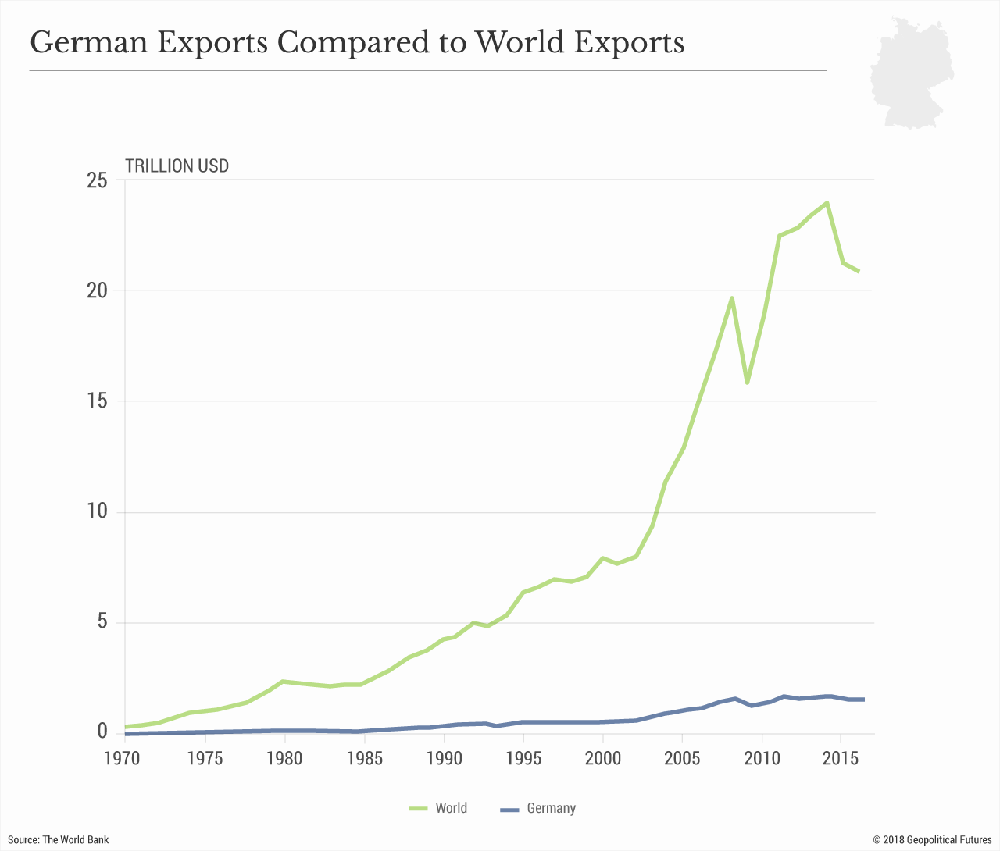

## Table of Contents

## What was the economic situation in Germany immediately after World War II?

Right after World War II ended, Germany's economy was in very bad shape. The country was destroyed from the war. Cities were bombed, factories were ruined, and there were not enough homes for people. Many people lost their jobs and had no money. There was not enough food, and people had to use ration cards to get basic things like bread. The money, called the Reichsmark, was worth very little, and inflation made prices go up fast.

To help fix the economy, the United States, Britain, and France worked together in their zones of Germany. They started the Marshall Plan in 1948, which gave Germany a lot of money and help to rebuild. They also made a new currency called the Deutsche Mark to replace the old, worthless money. This helped stop inflation and made it easier for businesses to start working again. Slowly, the economy began to get better, but it took a long time for Germany to fully recover from the war.

## What is meant by the term 'Economic Miracle' in the context of post-war Germany?

The term 'Economic Miracle' refers to the rapid recovery and growth of West Germany's economy after World War II. This period, also known as the "Wirtschaftswunder," began in the late 1940s and lasted through the 1950s. After the war, Germany was in ruins, with destroyed cities, factories, and a worthless currency. But with help from the Marshall Plan, which provided financial aid from the United States, and the introduction of the new Deutsche Mark, the economy started to recover quickly.

The Wirtschaftswunder was driven by a few key factors. First, there was a lot of hard work and determination from the German people. Second, the government made smart policies that encouraged businesses to grow. Companies like Volkswagen and Siemens expanded rapidly, creating jobs and boosting the economy. By the mid-1950s, West Germany had become one of the strongest economies in Europe, with high employment and rising living standards. This rapid recovery was so impressive that it was called an 'Economic Miracle.'

## Who was Ludwig Erhard and what role did he play in the German Economic Miracle?

Ludwig Erhard was a key person in the German Economic Miracle. He was an economist and politician who became the Minister of Economics in West Germany after World War II. Erhard believed in free markets and thought that people should be able to buy and sell things without too much government control. He thought this would help the economy grow faster.

One of the big things Erhard did was to introduce the new Deutsche Mark in 1948. This helped stop inflation and made the old, worthless money go away. He also got rid of a lot of the price controls that were holding back businesses. These changes helped companies start making things again and people start buying things. Thanks to Erhard's ideas and actions, West Germany's economy grew very quickly, and people called it the 'Economic Miracle.'

## What were the key policies implemented by the German government that contributed to the economic recovery?

The German government implemented several key policies that helped the economy recover after World War II. One important policy was the introduction of the Deutsche Mark in 1948. This new currency replaced the old, worthless Reichsmark and helped stop inflation. By having a stable currency, people and businesses could trust the money they were using, which made it easier for the economy to grow. Another key policy was the removal of price controls. Before this, the government had set prices for many goods, which made it hard for businesses to make money. By letting businesses set their own prices, they could start making and selling things again, which created jobs and helped the economy.

The government also worked with the United States through the Marshall Plan, which provided financial aid to help rebuild Germany. This money was used to repair factories, build new roads, and support businesses. Ludwig Erhard, the Minister of Economics, played a big role in these policies. He believed in free markets and less government control over the economy. His ideas encouraged businesses to grow and innovate, which led to the rapid growth of the economy. These policies, along with the hard work of the German people, helped turn West Germany into one of the strongest economies in Europe during the 1950s.

## How did the currency reform of 1948 impact the German economy?

The currency reform of 1948 was a big change for Germany. Before the reform, the old money called the Reichsmark was worth very little. People had to use a lot of it to buy even small things. This made life hard because prices kept going up fast. The new currency, called the Deutsche Mark, helped fix this problem. It made money worth more again, so people could buy things without needing big piles of cash. This stopped the prices from going up so fast and helped everyone feel more sure about their money.

The new currency also helped businesses start working again. Before, the government told businesses what prices they could charge, which made it hard for them to make money. With the new Deutsche Mark, businesses could set their own prices. This meant they could start making and selling things again. More businesses working meant more jobs for people. As people got jobs, they could buy more things, which helped the whole economy grow. The currency reform was a big step in making Germany's economy strong again after the war.

## What role did the Marshall Plan play in Germany's economic recovery?

The Marshall Plan was very important for Germany's economic recovery after World War II. It was a plan by the United States to help Europe rebuild after the war. The U.S. gave money to countries, including Germany, to fix their broken buildings, roads, and factories. This money helped Germany a lot because the country was in ruins after the war. Without this help, it would have been much harder for Germany to get back on its feet.

The Marshall Plan also helped Germany by giving it a boost to start its economy again. The money from the plan was used to buy machines and materials that businesses needed to start working again. This created jobs for people and made it possible for them to earn money and buy things. As businesses grew and people started spending more, the whole economy got better. The Marshall Plan was a big part of why Germany was able to have its 'Economic Miracle' and become one of the strongest economies in Europe.

## How did the social market economy concept contribute to the Wirtschaftswunder?

The social market economy was a big part of the Wirtschaftswunder, or the 'Economic Miracle,' in Germany after World War II. This idea was about having a free market where people and businesses could buy and sell things without too much government control. But it also had rules to make sure everyone had a fair chance and that the economy helped all people, not just the rich. Ludwig Erhard, who was the Minister of Economics, believed in this idea a lot. He thought that if businesses could grow and make money, they would create jobs and help the economy get better. This mix of freedom and fairness helped Germany's economy grow fast.

The social market economy worked well because it made businesses want to grow and make new things. When businesses did well, they hired more people, and those people could buy more things. This made the whole economy grow. But the government also made sure that there were rules to help everyone, like making sure workers had good jobs and that prices didn't go up too fast. This balance helped Germany recover quickly after the war. By the 1950s, Germany had become one of the strongest economies in Europe, and many people think the social market economy was a big reason why.

## What industries were the main drivers of growth during the German Economic Miracle?

During the German Economic Miracle, a few key industries helped the economy grow fast. One big industry was car making. Companies like Volkswagen and Mercedes-Benz started making a lot of cars. They used new machines and ways of working to make cars faster and better. This created a lot of jobs and made Germany famous for its cars. Another important industry was making machines and tools. Companies like Siemens and Bosch made things like washing machines, fridges, and other tools that people wanted to buy. These companies also sold their products to other countries, which helped the economy even more.

Another industry that helped a lot was making chemicals. Companies like BASF and Bayer made things like paints, plastics, and medicines. These products were used in many other industries, which helped them grow too. The building industry also played a big role. After the war, Germany needed to rebuild its cities and homes. This meant a lot of work for builders and people who made things like bricks and steel. All these industries working together made the economy strong and helped Germany recover quickly after the war.

## How did the labor market evolve during the period of the Wirtschaftswunder?

During the Wirtschaftswunder, the labor market in Germany changed a lot. After the war, many people were out of work because factories and businesses were destroyed. But as the economy started to get better, companies began to hire more people. The car industry, machine making, and chemical companies all needed workers to make their products. This meant that more and more people were able to find jobs. The government also helped by making rules to make sure workers were treated fairly and had good working conditions. This made people feel more sure about their jobs and helped the economy grow even more.

As the economy kept getting better, there were not enough workers in Germany to fill all the jobs. So, the country started to bring in workers from other places, especially from countries like Italy, Spain, Greece, and Turkey. These workers, called guest workers, helped fill the jobs that were open and kept the economy growing. They worked in factories, building sites, and other places where there was a lot of work. The guest workers were a big part of why Germany's economy could keep growing so fast during the Wirtschaftswunder.

## What were the long-term effects of the German Economic Miracle on the country's economic structure?

The German Economic Miracle had a big impact on Germany's economy in the long run. It helped Germany become one of the strongest economies in the world. After the war, Germany's factories and businesses were destroyed, but the Wirtschaftswunder helped them rebuild and grow. This growth made Germany good at making things like cars, machines, and chemicals. Companies like Volkswagen, Siemens, and BASF became big and famous. The economy kept growing because of new ideas and ways of working, which made Germany a leader in technology and industry.

The Wirtschaftswunder also changed how Germany's economy was set up. It brought in the idea of a social market economy, which mixed free markets with rules to help everyone. This made the economy fair and helped it grow. The labor market changed too. Germany started bringing in workers from other countries, called guest workers, to fill jobs. These workers helped keep the economy growing and made Germany more diverse. Over time, these changes helped Germany stay strong and keep its economy growing even after the Wirtschaftswunder was over.

## How did the Wirtschaftswunder influence Germany's position in global economics?

The Wirtschaftswunder helped Germany become a big player in the world's economy. Before the war, Germany was in ruins, but the Economic Miracle changed that. Germany started making a lot of cars, machines, and chemicals. Companies like Volkswagen, Siemens, and BASF became famous all over the world. This made Germany good at making things and selling them to other countries. Germany's economy grew fast, and it became one of the richest countries in Europe. This helped Germany have a strong voice in global trade and business.

The Wirtschaftswunder also changed how other countries saw Germany. After the war, Germany was seen as a beaten country, but the Economic Miracle showed that it could come back strong. Germany joined groups like the European Economic Community, which later became the European Union. This helped Germany work with other countries and make its economy even stronger. By the 1960s, Germany was a leader in Europe and had a big say in world economics. The Wirtschaftswunder made Germany a respected and important country in the global economy.

## What criticisms and challenges arose from the rapid economic growth during the German Economic Miracle?

The fast growth during the German Economic Miracle brought some problems. One big issue was that not everyone got to share in the wealth. Some people, especially those in the east part of Germany, did not see as much improvement. They felt left behind while the west got richer. Also, the quick growth made some people worry about the environment. Factories and businesses were making a lot of things, but they were also making a lot of pollution. This was bad for the air and water, and people started to talk about how to keep the economy growing without hurting the planet.

Another challenge was the way workers were treated. Many guest workers came to Germany to help with the growing economy. They worked hard in factories and building sites, but sometimes they did not get treated fairly. They often had tough jobs and did not always get the same rights as German workers. This caused some tension and made people think about how to make sure everyone was treated well. Even though the Wirtschaftswunder made Germany's economy strong, it also brought up these important issues that needed to be fixed.

## References & Further Reading

[1]: Buchheim, C. (1999). ["The 'Wirtschaftswunder' Trapped: The German Economic Miracles Reassessed."](https://www.jstor.org/stable/20081286) Journal of Economic History, 59(3), 522–549.

[2]: Spicka, M. (2007). ["Selling the Economic Miracle: Economic Reconstruction and Politics in West Germany, 1949-1957."](https://www.jstor.org/stable/j.ctvvb7n6z) Berghahn Books.

[3]: Jánossy, F. A. (1969). ["The End of the Economic Miracle: Appearance and Reality in Economic Development."](https://www.taylorfrancis.com/books/mono/10.4324/9781315638430/end-economic-miracle-ferenc-j%C3%A1nossy) Routledge & Kegan Paul Books.

[4]: Pisani-Ferry, J. (2001). ["The German Economy: Beyond the ‘German Model’."](https://www.semanticscholar.org/paper/The-Euro-Crisis-and-Its-Aftermath-Pisani-Ferry/f093dff295d60722b1e412367b08d8e529f4e15a) Journal of Economic Perspectives, 15(4), 167–188.

[5]: Schild, J. (2018). ["Germany's Wirtschaftsordnung and European Integration: From the German Economic Miracle to the New Crisis Politics."](https://www.sciencedirect.com/science/article/pii/S0165176524006013) Routledge.