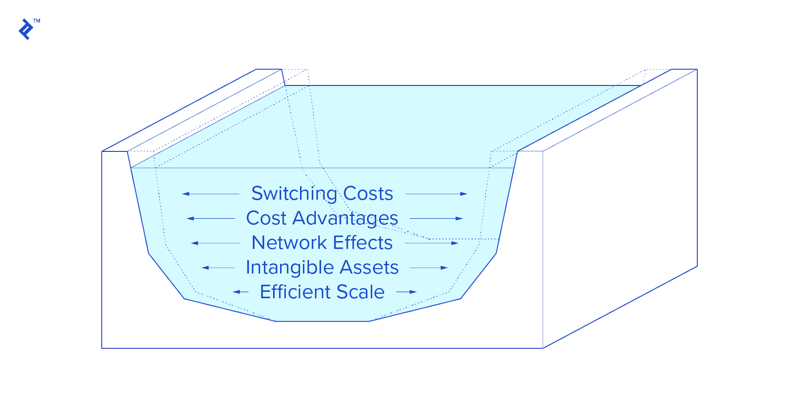

## Table of Contents

## What is an economic moat?

An economic moat is a business term that describes a company's ability to maintain competitive advantages over its rivals. It's like a protective barrier that keeps other companies from taking away its customers or profits. Think of it as a castle surrounded by a moat that keeps invaders away. For a company, this could be things like a well-known brand, unique technology, or being the cheapest option in the market.

Having a strong economic moat helps a company stay successful over a long time. It makes it hard for new competitors to enter the market and challenge the company's position. For example, if a company has a very popular brand, like Coca-Cola, it can keep selling its products even if new soda companies start up. Investors like companies with strong moats because they are more likely to keep making money and growing in the future.

## How does an economic moat relate to competitive advantage?

An economic moat and a competitive advantage are closely related because an economic moat is what creates a competitive advantage for a company. A competitive advantage is when a company can do something better than its competitors, like making a better product, selling at a lower price, or having a famous brand. An economic moat is the set of things that help the company keep that advantage. It's like a shield that protects the company from other businesses trying to take away its customers or profits.

For example, if a company has a unique technology that no one else has, that technology is part of its economic moat. It helps the company keep its competitive advantage by making products that are hard for others to copy. Over time, a strong economic moat makes it very difficult for new companies to enter the market and compete effectively. This is why investors look for companies with strong moats—they are more likely to keep making money and growing in the future.

## What are the different types of economic moats?

There are a few main types of economic moats that help companies stay ahead of their competition. The first type is a cost advantage, which means a company can make or sell things cheaper than others. This can happen if a company can buy materials for less, make things more efficiently, or use technology that saves money. Another type is a strong brand, where customers like and trust the company's name so much that they keep buying from them, even if other companies try to offer similar products. 

The third type is network effects, which happen when a product or service becomes more useful as more people use it. For example, more people using a social media platform makes it more valuable to everyone on it. The fourth type is switching costs, where it's hard or expensive for customers to switch to a different company. This can be because of long-term contracts, the time it takes to learn a new system, or losing data if you switch. All these types of moats help a company keep its customers and profits safe from competitors.

## Can you give examples of companies with strong economic moats?

One company with a strong economic moat is Apple. Apple has a powerful brand that people trust and love. When you think of smartphones, you probably think of the iPhone. This makes it hard for other companies to take away Apple's customers. Apple also has a big advantage because of its ecosystem. Once you start using Apple products like the iPhone, iPad, and MacBook, it's hard to switch to other brands because everything works so well together. This is an example of high switching costs.

Another example is Amazon. Amazon has a strong moat because of its huge network effects. The more people who use Amazon to buy things, the more sellers want to sell on Amazon. This makes Amazon's platform more valuable for everyone. Amazon also has a cost advantage because it can buy things in bulk and has a very efficient delivery system. These factors make it tough for new companies to compete with Amazon in the online shopping world.

## How can a company establish an economic moat?

A company can establish an economic moat by focusing on creating a strong brand that people trust and love. This means making sure their products or services are always good quality and that they keep their customers happy. Over time, if people keep having good experiences with the company, they will stick with it even if other companies try to offer similar things. For example, a company like Coca-Cola has a strong brand because people all over the world know and like their drinks. It's hard for new soda companies to take away Coca-Cola's customers because of this trust and loyalty.

Another way a company can build an economic moat is by being the cheapest option in the market. This can happen if the company finds ways to make or sell things for less money than others. They might do this by buying materials in bulk, using technology to make things faster, or having a very efficient way of getting products to customers. If a company can offer lower prices while still making good products, it can keep its customers and make it hard for new companies to compete. Amazon is a good example of this because they can buy things in large amounts and have a great delivery system, which lets them offer lower prices than many other stores.

## What role does innovation play in maintaining an economic moat?

Innovation is really important for keeping an economic moat strong. It means coming up with new ideas or ways of doing things that make a company different from others. When a company keeps innovating, it can stay ahead of its competitors. For example, if a company makes a new kind of smartphone that's better than what anyone else has, people will want to buy it. This helps the company keep its customers and makes it hard for other companies to catch up.

Innovation can also help a company keep its costs low. If a company finds a new way to make things cheaper or faster, it can sell its products for less money than others. This makes it hard for new companies to compete because they can't match the low prices. For example, if a car company invents a new way to build cars that saves a lot of money, it can sell cars cheaper than other car companies. This keeps the company's economic moat strong because it keeps its competitive advantage.

## How do economic moats affect a company's long-term profitability?

Economic moats help a company stay profitable over a long time. When a company has a strong moat, it means it can keep its customers and profits safe from other companies trying to take them away. This is because the moat makes it hard for new companies to enter the market and compete. For example, if a company has a very popular brand, like Nike, people will keep buying its products even if other shoe companies start up. This means the company can keep making money for many years because it keeps its customers.

A strong economic moat also lets a company keep its prices high or its costs low, which helps it make more profit. If a company can make things cheaper than others or if it has a product that people really want, it can keep selling at good prices. For example, if a company like Amazon can buy things in bulk and deliver them fast, it can sell things for less money than other stores. This means Amazon can keep making good profits over time because it keeps its costs low and its customers happy.

## What are the challenges in sustaining an economic moat?

Keeping an economic moat strong can be hard for a company. One big challenge is that other companies are always trying to copy what the successful company does. If a company has a special way of making things or a popular product, other companies will try to make something similar. This means the company has to keep coming up with new ideas to stay ahead. If it doesn't keep innovating, its moat can get weaker over time as other companies catch up.

Another challenge is that the market can change. What people want or need can change, and new technology can come along that makes old ways of doing things less important. For example, if a company's moat is based on having a lot of stores, but then people start shopping online more, the company has to find new ways to keep its customers. This means the company has to be ready to change and adapt to keep its moat strong.

Sometimes, rules and laws can also make it harder to keep a moat. Governments might make new rules that make it easier for new companies to enter the market or that limit what a company can do to keep its advantage. This can make it harder for a company to keep its moat strong. So, a company has to keep an eye on these changes and find ways to work with them to stay ahead.

## How do investors identify companies with strong economic moats?

Investors look for companies with strong economic moats by checking if the company has something special that keeps it ahead of others. They might see if the company has a famous brand that people trust, like Coca-Cola or Apple. They also check if the company can make things cheaper than others, like how Amazon can buy things in bulk and deliver them fast. Another thing they look for is if the company's product gets better the more people use it, like how more users on a social media platform make it more valuable. All these things help a company keep its customers and profits safe from competitors.

Another way investors identify strong economic moats is by looking at the company's history. If a company has been making good profits for a long time, it might mean it has a strong moat. Investors also look at the company's plans for the future. If the company keeps coming up with new ideas and ways to stay ahead, it's a good sign that its moat will stay strong. By looking at these things, investors can figure out which companies are likely to keep making money and growing over time.

## What is the impact of market dynamics on economic moats?

Market dynamics can have a big impact on a company's economic moat. These dynamics include changes in what people want, new technology, and actions by other companies. For example, if a company's moat is based on having a lot of physical stores, but then people start shopping online more, the company's moat can get weaker. New technology can also change things. If a new way of making things comes along that's cheaper or better, it can make a company's old way of doing things less special. This means the company has to keep up with these changes to keep its moat strong.

Another way market dynamics affect economic moats is through competition. Other companies are always trying to copy what successful companies do. If a company has a special product or way of doing things, other companies will try to make something similar. This can make the company's moat weaker over time if it doesn't keep coming up with new ideas. Also, changes in rules and laws can impact a company's moat. Governments might make new rules that make it easier for new companies to enter the market or that limit what a company can do to keep its advantage. So, a company has to be ready to change and adapt to these market dynamics to keep its economic moat strong.

## How can regulatory changes influence a company's economic moat?

Regulatory changes can have a big impact on a company's economic moat. If the government makes new rules, it can change how a company does business. For example, if a new law makes it easier for other companies to enter the market, it can weaken the moat of a company that was doing well because it was hard for others to compete. On the other hand, if the government makes rules that help a company keep its advantage, like giving it special rights or protections, it can make the moat stronger.

Sometimes, regulatory changes can make it harder for a company to keep its costs low or its prices high. If new rules make it more expensive for a company to make its products, it might not be able to sell them as cheaply as before. This can hurt the company's moat if its advantage was based on being the cheapest option. Also, if new rules limit what a company can do to keep its customers, like how it can advertise or what it can offer, it can make it harder for the company to stay ahead of its competitors.

## What advanced strategies can companies use to widen their economic moats?

One advanced strategy for companies to widen their economic moats is to invest in research and development (R&D) to keep innovating. By constantly coming up with new products or better ways of doing things, a company can stay ahead of its competitors. For example, a tech company might develop new software or hardware that's better than anything else on the market. This keeps customers interested and makes it hard for other companies to catch up. Another part of this strategy is to use data and analytics to understand what customers want and need. By using this information to make products that people really like, the company can keep its customers happy and loyal, which strengthens its moat.

Another strategy is to build a strong ecosystem around its products or services. This means creating a network where different products or services work well together, making it hard for customers to switch to another company. For example, Apple has created an ecosystem with its iPhone, iPad, MacBook, and other products that all work together seamlessly. Once customers start using one Apple product, they are more likely to buy others because everything works so well together. This increases the switching costs for customers and makes Apple's economic moat even wider. By focusing on creating a strong ecosystem, a company can make its competitive advantage even stronger and more difficult for competitors to challenge.

## References & Further Reading

[1]: Bergstra, J., Bardenet, R., Bengio, Y., & Kégl, B. (2011). ["Algorithms for Hyper-Parameter Optimization."](https://dl.acm.org/doi/10.5555/2986459.2986743) Advances in Neural Information Processing Systems 24.

[2]: ["Advances in Financial Machine Learning"](https://www.amazon.com/Advances-Financial-Machine-Learning-Marcos/dp/1119482089) by Marcos Lopez de Prado

[3]: ["Evidence-Based Technical Analysis: Applying the Scientific Method and Statistical Inference to Trading Signals"](https://books.google.com/books/about/Evidence_Based_Technical_Analysis.html?id=MeoJAQAAMAAJ) by David Aronson

[4]: ["Machine Learning for Algorithmic Trading"](https://github.com/stefan-jansen/machine-learning-for-trading) by Stefan Jansen

[5]: ["Quantitative Trading: How to Build Your Own Algorithmic Trading Business"](https://www.amazon.com/Quantitative-Trading-Build-Algorithmic-Business/dp/1119800064) by Ernest P. Chan