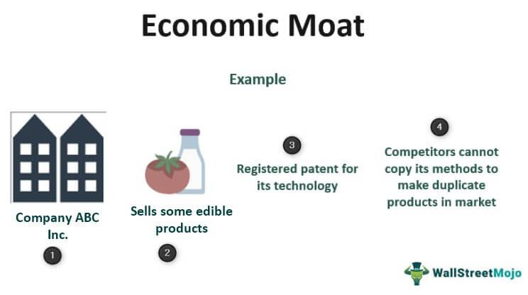

In the rapidly evolving business landscape, companies strive to establish a sustainable competitive advantage. One way to achieve this is through the concept of an economic moat, a term popularized by legendary investor Warren Buffett. An economic moat refers to a company's ability to maintain a competitive edge over its rivals, thereby ensuring long-term profitability. This edge may manifest through unique assets, cost advantages, scale, or customer loyalty, which collectively help a company preserve its market share against competitors.

In parallel, the advancements in technology, particularly in algorithmic trading, have reshaped how businesses can reinforce their market positions. Algorithmic trading uses complex algorithms to automate trading processes, allowing companies to execute trades at optimal speeds and prices, often beyond the capability of human traders. This technology not only enhances decision-making efficiency but also increases the precision with which market opportunities are captured.



By integrating economic moat strategies with advanced technologies like algorithmic trading, companies can further fortify their market position. The synergy between these two approaches can lead to improved operational efficiencies, more robust market insights, and ultimately, a strengthened competitive advantage. This article will investigate this synergistic relationship, highlighting key components, advantages, and real-world applications. By understanding these concepts, businesses can cultivate robust defenses against competitors in today's dynamic economic environment, ensuring their ability to thrive and grow amidst ever-changing market dynamics.

## Table of Contents

## What is an Economic Moat?

An economic moat refers to a business's capacity to sustain its competitive advantages over rivals, thus safeguarding its market share and ensuring sustained profitability. The term draws an analogy from medieval castles where moats acted as defensive barriers against attackers. In the corporate context, these barriers are manifested through various competitive edges that solidify a company's market position.

Several elements contribute to the establishment of an economic moat:

1. **Size Advantage**: Economies of scale can significantly reduce costs per unit, allowing a company to undercut competition on pricing while maintaining profit margins. Larger entities often benefit from bulk purchasing, more extensive distribution networks, and enhanced bargaining power with suppliers.

2. **Cost Advantage**: Companies that can produce goods or services at a lower cost than competitors maintain a robust competitive position. This advantage can stem from proprietary technologies, superior operational efficiencies, or advantageous access to materials and resources.

3. **High Switching Costs**: When customers face substantial costs or inconveniences in switching from one provider to another, they are more likely to remain loyal. Such switching costs can be monetary or logistical and often include factors like retraining staff, reconfiguring systems, or losing accumulated benefits such as loyalty rewards.

4. **Intangibles (Brand Recognition)**: Strong brand recognition can secure customer loyalty and justify premium pricing. Brands that resonate well with consumers, like Apple or Coca-Cola, create perceived value that extends beyond the tangible attributes of their products.

5. **Soft Moats (Exceptional Management)**: Sometimes referred to as soft skills, exceptional management can be a crucial differentiator. A competent leadership team can steer a company through economic challenges, capitalize on emerging opportunities, and maintain a strong, cohesive corporate culture.

Collectively, these elements bolster a firm's ability to consistently outperform competitors, solidifying a resilient stance in the marketplace. By strategically leveraging these components, businesses are better equipped to navigate dynamic economic environments and secure long-term success.

## Understanding Competitive Advantages and Algorithmic Trading

Competitive advantage is a fundamental concept in business strategy, denoting any attribute that enables a company to deliver comparable goods or services more efficiently than its competitors, thus resulting in superior margins or market share. Companies can achieve this through various avenues such as cost leadership, differentiation, or focusing on niche markets. When a firm establishes a robust competitive advantage, it can sustain profitability and fend off competitive pressures over time.

Algorithmic trading, a prominent technological advancement in financial markets, employs complex algorithms to automate and optimize trading operations. This technology enhances decision-making by increasing the speed and accuracy of trade execution while minimizing human error. Algorithmic trading utilizes historical data, predictive analytics, and real-time market information to inform trading strategies, offering a distinct edge to firms who can harness its potential proficiently.

The integration of competitive advantages with [algorithmic trading](/wiki/algorithmic-trading) could dynamically transform a company's operational framework. By leveraging economic moats—such as cost advantages or high customer switching costs—alongside algorithmic trading, firms can significantly enhance operational efficiency. One way this manifests is through reduced transaction costs and improved market responsiveness, enabling firms to swiftly adapt to market fluctuations and sustain their competitive positioning.

Consider a firm with a cost advantage due to economies of scale. By implementing algorithmic trading, this firm can further optimize its pricing strategies and inventory management. For instance, it can automate the rebalancing of portfolios to align with market conditions, reducing the risk of holding underperforming assets. Python code, for instance, can be used to backtest trading strategies to ensure they capitalize on the firm's inherent advantages:

```python
import pandas as pd
import numpy as np

# Load historical market data
data = pd.read_csv('market_data.csv')

# Implement a simple moving average strategy
def moving_average(data, window):
    return data['price'].rolling(window=window).mean()

# Generate signals
data['signal'] = 0
data.loc[moving_average(data, window=40) > moving_average(data, window=200), 'signal'] = 1
data.loc[moving_average(data, window=40) < moving_average(data, window=200), 'signal'] = -1

# Calculate returns
data['returns'] = data['price'].pct_change()
data['strategy_returns'] = data['signal'].shift(1) * data['returns']

# Evaluate strategy
cum_returns = (data['strategy_returns'] + 1).cumprod() - 1
print(f"Strategy cumulative return: {cum_returns[-1]:.2%}")
```

This hypothetical example demonstrates how a firm can enhance its competitive advantage using algorithmic trading by automating a moving average strategy to capitalize on market trends in line with its economic moat attributes. 

Furthermore, firms can utilize algorithmic trading to delve into advanced data analytics, enabling them to predict market trends and customer preferences with greater precision. By leveraging vast datasets through [machine learning](/wiki/machine-learning) algorithms, companies can derive actionable insights that inform strategic decisions, such as entry or [exit](/wiki/exit-strategy) points in markets or product lines.

The synergetic relationship between economic moats and algorithmic trading empowers businesses to bolster their competitive advantages significantly. This integration creates a fortified market position, sustaining profitability and resilience in an ever-evolving economic landscape. By meticulously aligning their technological capabilities with strategic advantages, companies can realize heightened productivity and outmaneuver rivals.

## Real-World Examples of Economic Moat Strategies

Several companies have successfully established economic moats that have allowed them to sustain market dominance over time. Understanding these examples provides valuable insights into how firms can develop and maintain a competitive edge in their respective industries. 

One prime example of a company with a well-established economic moat is Apple Inc. Apple's moat is primarily built on its strong brand recognition, continuous innovation, and a comprehensive ecosystem of products and services. The brand's global reputation for high quality and design excellence provides a significant buffer against competitors. Apple's ecosystem—comprising its range of devices, software, and services—creates high switching costs for users, as they integrate deeply into the platform, thus discouraging migration to competitors. Moreover, Apple's commitment to innovation, exemplified by its consistent release of updated and new products, further fortifies its market position. This continuous innovation ensures that Apple maintains its status as a market leader in consumer electronics and technology.

Amazon serves as another compelling example of an economic moat. The company's primary moat stems from its unparalleled logistics network and scale advantages. With a vast network of warehouses and distribution centers strategically located worldwide, Amazon can offer rapid and reliable delivery services, setting a benchmark for e-commerce platforms. This logistical superiority is complemented by economies of scale that allow Amazon to offer competitive pricing. Additionally, Amazon Prime, with its array of benefits including free shipping and video streaming, creates high switching costs and fosters customer loyalty. By leveraging its vast data resources, Amazon continues to refine its supply chain and personalize customer experiences, further entrenching its dominant market position.

In the financial sector, Visa is highlighted for its strong economic moat, driven by its extensive network of banks, merchants, and consumers. The company's infrastructure enables secure and reliable payment processing globally, acting as a barrier to entry for potential competitors. Visa’s brand trust and scale provide them with extensive user data, which they utilize to enhance their service offerings and maintain competitiveness.

These case studies illustrate that the establishment and sustainability of an economic moat often involve a combination of brand strength, innovation, scale advantages, and the creation of ecosystems or networks that increase customer loyalty and create barriers to entry for competitors. Understanding these strategies allows other firms to adopt similar tactics to reinforce their market positions.

## Creating and Sustaining Economic Moats with Algorithmic Trading

Creating and sustaining economic moats in the context of modern business strategies can significantly benefit from the incorporation of algorithmic trading. Algorithmic trading refers to the use of complex algorithms to automate trading decisions, allowing companies to execute trades at speeds and frequencies impossible for human traders. By integrating algorithmic trading, businesses can refine their cost and size advantages, thereby fortifying their economic moats.

One core strategy is the optimization of operations through algorithmic trading. Algorithms can analyze vast amounts of market data to identify patterns and trends, enabling companies to make data-driven decisions that enhance efficiency. For instance, predictive algorithms can forecast price movements, allowing businesses to preemptively adjust their strategies. By reducing reliance on manual decision-making, firms can lower operational costs and improve precision in their market activities.

Improving market predictions is another essential tactic. Algorithmic trading systems leverage data analytics to interpret real-time market conditions, which facilitates more accurate forecasting. Companies can use machine learning models to continuously learn from market data and refine their predictions over time. Python's libraries, such as TensorFlow or scikit-learn, offer tools for building predictive models that enhance trading strategies:

```python
from sklearn.ensemble import RandomForestRegressor
from sklearn.model_selection import train_test_split
import numpy as np

# Sample data and predicting market prices
X, y = np.random.rand(1000, 5), np.random.rand(1000)  # Features and target price
X_train, X_test, y_train, y_test = train_test_split(X, y, test_size=0.2)

model = RandomForestRegressor()
model.fit(X_train, y_train)
predictions = model.predict(X_test)
```

Reducing inefficiencies is also pivotal. Automation through algorithmic trading minimizes human error and ensures that trading activities align closely with strategic goals. Real-time data allows for the immediate execution of trades under optimal conditions, which can be programmed into algorithms to maintain operational efficiency.

Real-time adjustments form the backbone of agile trading strategies. Algorithmic systems can be programmatically adjusted to react to market conditions instantaneously. Through automation, companies can optimize their market positions by altering exposure as conditions change, whether that involves adjusting strategies based on [volatility](/wiki/volatility-trading-strategies) levels or exploiting [arbitrage](/wiki/arbitrage) opportunities.

In summary, businesses looking to create and sustain economic moats can significantly amplify their competitive advantage by integrating algorithmic trading technologies. By optimizing operations, enhancing market predictions, reducing inefficiencies, and facilitating real-time adjustments, algorithmic trading fortifies the strategic barriers that protect firms from competitive pressures. This technological adoption serves as a pivotal component of a modern, robust economic moat, aligning with evolving market dynamics.

## Challenges and Considerations

Economic moat strategies and algorithmic trading offer substantial benefits, but they are not without their challenges. A foremost concern is the relentless need for innovation. Businesses operating in competitive markets must continuously enhance their products, services, and processes to maintain their advantage. This requires not only substantial investment in research and development but also a keen awareness of emerging industry trends and advancements. Companies must be prepared to pivot and adapt to new technologies that could disrupt established market positions.

In addition to innovation challenges, regulatory compliance poses significant hurdles. The financial and business landscapes are heavily regulated to ensure fair practices, protect consumer interests, and maintain market stability. Companies engaged in algorithmic trading must adhere to regulatory standards such as the Securities and Exchange Commission (SEC) regulations in the United States or the Markets in Financial Instruments Directive (MiFID II) in the European Union. Non-compliance can result in hefty fines, legal battles, and reputational damage, all of which could erode an economic moat.

Algorithmic trading itself introduces specific risks, primarily technological failures and market unpredictability. Systems can malfunction due to coding errors, hardware failures, or unforeseen scenarios not accounted for in algorithm development. Such failures can lead to significant financial losses if they are not promptly detected and corrected. Moreover, algorithms operate in dynamic market environments where unforeseen events, such as economic shifts or geopolitical tensions, can lead to volatile market conditions that challenge predictive accuracy.

To navigate these pitfalls, businesses must develop robust strategies and frameworks. One critical approach is conducting thorough testing and validation of algorithms using historical data and simulations before deployment. This helps to identify potential issues and optimize algorithm performance under various market conditions. Implementing fail-safes and redundancy measures is also crucial to mitigate the impact of technological failures. For instance, creating backup systems that can take over in case of primary system failure can prevent significant disruptions.

Furthermore, monitoring and real-time alerts can aid in quickly identifying anomalies or deviations from expected patterns, allowing for rapid response. Businesses should also foster a culture of compliance by implementing comprehensive policies and training programs to ensure all operations align with regulatory requirements.

In summary, while economic moats and algorithmic trading offer pathways to a sustained competitive advantage, they require careful execution and ongoing management to mitigate associated risks. By staying ahead of technological trends, committing to compliance, and building reliable systems, companies can effectively sustain and protect their market position.

## Conclusion

Economic moat strategies, when paired with algorithmic trading, create a formidable defense in securing sustained competitive advantages for businesses. This synergy not only fortifies a company's market position but also ensures resilience amid economic and technological shifts. By integrating advanced technologies and strategic business practices, companies can significantly enhance their market defenses. Algorithmic trading, with its precision and efficiency, allows firms to automate decision-making processes, reducing human error and optimizing resource allocation. This technological edge enables businesses to swiftly adapt to market changes, maintaining their competitive edge.

Moreover, as the business environment continuously evolves due to globalization and technological advancements, companies that effectively harness these synergies will be positioned for long-term success. The agility provided by algorithmic trading is crucial for responding rapidly to competitors' actions and market trends. Thus, future growth depends heavily on the ability to innovate and integrate cutting-edge solutions. Embracing emerging technologies and refining business strategies ensures not only the preservation of an economic moat but also the potential expansion of market share in dynamic settings.

In conclusion, the convergence of economic moat strategies and algorithmic trading aligns with the demands of modern market dynamics. Businesses adept at leveraging these tools will not only safeguard their existing competitive advantages but will also pave the way for sustainable growth in an unpredictable landscape.

## References & Further Reading

[1]: Bergstra, J., Bardenet, R., Bengio, Y., & Kégl, B. (2011). ["Algorithms for Hyper-Parameter Optimization."](https://dl.acm.org/doi/10.5555/2986459.2986743) Advances in Neural Information Processing Systems 24.

[2]: ["Advances in Financial Machine Learning"](https://www.amazon.com/Advances-Financial-Machine-Learning-Marcos/dp/1119482089) by Marcos Lopez de Prado

[3]: ["Evidence-Based Technical Analysis: Applying the Scientific Method and Statistical Inference to Trading Signals"](https://books.google.com/books/about/Evidence_Based_Technical_Analysis.html?id=MeoJAQAAMAAJ) by David Aronson

[4]: ["Machine Learning for Algorithmic Trading"](https://github.com/stefan-jansen/machine-learning-for-trading) by Stefan Jansen

[5]: ["Quantitative Trading: How to Build Your Own Algorithmic Trading Business"](https://www.amazon.com/Quantitative-Trading-Build-Algorithmic-Business/dp/1119800064) by Ernest P. Chan