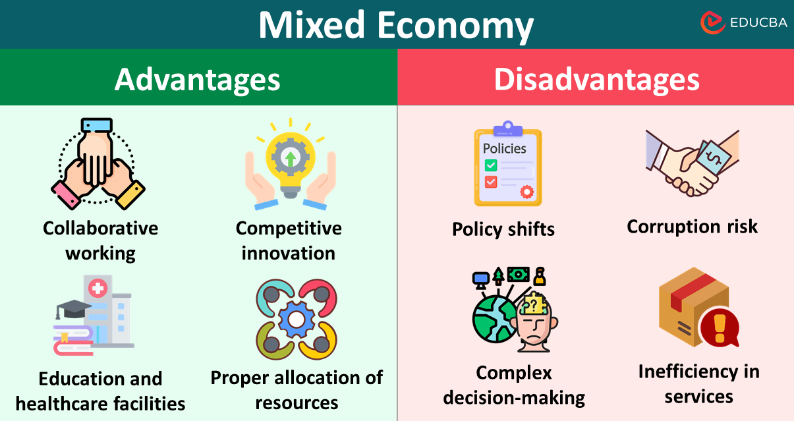

## Table of Contents

## What is an economic network?

An economic network is a group of people, businesses, and organizations that work together to exchange goods, services, and information. It's like a big web where everyone is connected and helps each other to make the economy grow. In an economic network, businesses might buy things from each other, share ideas, or work together on projects. This helps them to be more successful and create more jobs.

These networks can be small, like a local market where farmers sell their produce to nearby shops, or very large, like international trade between countries. The connections in an economic network can make it easier for businesses to find what they need and reach new customers. Strong economic networks can help an area become richer and more stable, because when one part of the network does well, it often helps the others too.

## How do economic networks differ from traditional economic systems?

Economic networks and traditional economic systems are different in how they work and connect people. A traditional economic system is often more structured and can be thought of as a top-down approach. In these systems, big decisions are made by governments or large companies, and the economy is organized around these decisions. For example, in a planned economy, the government decides what to produce and how to distribute goods. In a market economy, large businesses and competition drive what is produced and sold.

On the other hand, economic networks are more about the connections between people and businesses. They are often more flexible and can change quickly because they rely on relationships and cooperation. Instead of being controlled by a few big players, economic networks spread out the power among many smaller groups. This can lead to more innovation and quicker responses to changes in what people want or need. For example, a local farmer might connect with a nearby restaurant to supply fresh produce, creating a small but effective economic network.

In summary, while traditional economic systems focus on larger, more formal structures and decisions made at the top, economic networks are about the links and cooperation between individuals and smaller groups. This difference can affect how quickly and effectively an economy can adapt to new situations and meet the needs of its people.

## What are the main components of an economic network?

The main parts of an economic network are the people, businesses, and organizations that make it up. These are the nodes of the network. They can be individuals, like farmers or shop owners, or larger groups, like companies or government agencies. Each node has something to offer, like goods, services, or information, and they all work together to keep the network going.

Another important part of an economic network is the connections between these nodes. These connections can be formal, like contracts and agreements, or informal, like friendships and trust. These links let the nodes share what they have and help each other out. The stronger and more varied these connections are, the better the network works.

The last part of an economic network is how it flows. This means how goods, money, and information move from one node to another. For example, a farmer might sell vegetables to a local store, which then sells them to customers. Money flows back to the farmer, and information about what people want flows to both the farmer and the store. This flow keeps the network alive and helps it grow.

## What are some common examples of economic networks?

A common example of an economic network is a local farmers' market. At the market, farmers sell their produce directly to people who live nearby. The farmers might also sell to local restaurants or shops. This network helps the farmers make money and gives the community fresh food. Everyone in the network, from the farmers to the shoppers, helps each other out and keeps the local economy strong.

Another example is a business supply chain. Imagine a company that makes bicycles. They need parts like tires, frames, and gears. They buy these parts from different suppliers, who might be in different countries. The suppliers then sell the parts to the bike company, which puts them together and sells the finished bikes to stores or customers. This network of suppliers, manufacturers, and buyers helps the bike company run smoothly and meet the demand for bicycles.

A third example is an online marketplace like eBay or Etsy. Sellers from all over the world can list their products on these websites. Buyers can then find and buy these products from anywhere. The platform connects the sellers and buyers, taking a small fee for each sale. This network makes it easy for people to start their own businesses and for customers to find unique items they want.

## What advantages do economic networks offer to businesses?

Economic networks help businesses grow by connecting them with other people and companies. When businesses are part of a network, they can find new customers and suppliers more easily. For example, a small bakery might join a local food network to sell its bread to nearby restaurants and shops. This can help the bakery make more money and reach more people. Being part of a network also means businesses can share ideas and learn from each other, which can help them improve their products and services.

Another advantage of economic networks is that they can help businesses be more flexible and adapt to changes. In a network, businesses can quickly find new ways to work together if something changes, like a new law or a shift in what customers want. This can help businesses stay strong even when things get tough. For example, if a new type of food becomes popular, a restaurant in a food network can quickly start using ingredients from local farmers who are also part of the network. This helps the restaurant keep up with trends and the farmers sell more of their produce.

## How do economic networks enhance efficiency and productivity?

Economic networks help businesses work better and faster by connecting them with other people and companies. When businesses are part of a network, they can find what they need more easily. For example, a factory might need parts to make their products. In a network, they can quickly find suppliers who have the right parts at the best price. This saves time and money, and helps the factory make more products faster. Being part of a network also means businesses can share ideas and learn from each other. This can help them find new ways to do things better and make more with less.

Another way economic networks boost efficiency and productivity is by helping businesses adapt to changes quickly. In a network, businesses can work together to find new solutions if something changes, like a new law or a shift in what customers want. This means they can keep making and selling things even when things get tough. For example, if a new type of food becomes popular, a restaurant in a food network can quickly start using ingredients from local farmers who are also part of the network. This helps the restaurant keep up with trends and the farmers sell more of their produce. Working together like this makes the whole network more efficient and productive.

## What are the potential drawbacks of relying on economic networks?

Relying on economic networks can have some problems. One big issue is that if one part of the network fails, it can affect everyone else. For example, if a key supplier in a supply chain has a problem, like a factory fire, it can stop the whole network from working. This can lead to delays and lost money for all the businesses that depend on that supplier. Another problem is that small businesses might find it hard to join big networks. Big companies often have more power and connections, which can make it tough for smaller ones to compete and grow.

Another drawback is that economic networks can sometimes lead to less competition. When businesses work closely together, they might agree to keep prices high or share markets, which can hurt customers. Also, being part of a network can make businesses too dependent on each other. If one business decides to leave the network or change its focus, it can cause big problems for the others. This can make it hard for businesses to be flexible and try new things on their own.

## How do economic networks impact global trade and international relations?

Economic networks play a big role in global trade by connecting businesses and countries all over the world. When companies from different countries work together, they can trade goods and services more easily. For example, a car company in one country might buy parts from suppliers in another country. This helps the car company make better cars and sell them in more places. It also helps the countries involved because they can make more money from trade. But, if one country has a problem, like a natural disaster or a political change, it can affect the whole network and cause problems for trade.

Economic networks also affect international relations because they make countries more connected. When countries trade a lot, they often have to work together and talk more to solve problems and make agreements. This can lead to better relationships and more cooperation. But, if countries feel like the network is not fair, or if one country tries to control the network, it can cause tension and disagreements. So, while economic networks can bring countries closer together, they can also make things more complicated and lead to conflicts if not managed well.

## What role does technology play in the development and maintenance of economic networks?

Technology is really important for making and keeping economic networks strong. It helps businesses and people connect with each other easily, no matter where they are. For example, the internet lets a small shop in one country sell things to customers all over the world. Technology also makes it easier to share information quickly. Businesses can use apps and websites to find suppliers, talk to customers, and learn about new trends. This helps them work together better and make the network stronger.

Another way technology helps economic networks is by making things more efficient. Computers and software can help businesses keep track of their orders, manage their money, and plan their work. This saves time and money, which lets businesses focus on growing and improving. Technology also helps networks stay safe and reliable. For example, blockchain technology can make sure that transactions are secure and that everyone in the network can trust each other. Overall, technology makes economic networks better by connecting people, sharing information, and making things run smoothly.

## How can businesses effectively integrate into existing economic networks?

Businesses can join economic networks by first figuring out who is already in the network and what they need. They can start by going to local events like trade shows or joining groups like chambers of commerce. This helps them meet other businesses and see where they can fit in. They should also use the internet to find online networks and platforms where they can connect with others. By understanding what the network needs, a business can offer something valuable, like a special product or service, and become a useful part of the group.

Once a business is part of a network, it needs to keep building relationships and working well with others. They can do this by talking regularly with other members, sharing information, and helping each other out. Using technology, like social media or business apps, can make this easier. It's also important for the business to be flexible and ready to change if the network changes. By staying active and helpful, a business can grow stronger within the network and take advantage of new opportunities as they come up.

## What are the challenges faced by policymakers in regulating economic networks?

Policymakers face big challenges when they try to regulate economic networks. One problem is that these networks are very complex and spread out. They include many different businesses and people, and they can change quickly. This makes it hard for policymakers to keep track of everything and make rules that work well for everyone. If they make rules that are too strict, they might stop the network from growing and innovating. But if the rules are too loose, they might not protect people and businesses from problems like unfair competition or fraud.

Another challenge is balancing the needs of different groups within the network. Big companies might want different things from small businesses, and what's good for one country might not be good for another. Policymakers need to find a way to make rules that help everyone in the network, without favoring one group over another. This can be tricky because economic networks often cross borders, so policymakers have to work with other countries to make sure their rules fit together well. If they don't, it can lead to confusion and conflict, which can hurt the network and the economy as a whole.

## How might economic networks evolve in the future with emerging technologies?

In the future, economic networks will likely change a lot because of new technologies. One big change could come from things like [artificial intelligence](/wiki/ai-artificial-intelligence) and big data. These technologies can help businesses understand what people want and need better. They can also help businesses find the best suppliers and customers quickly. This could make economic networks more efficient and help businesses work together in new ways. For example, a company might use AI to predict what products will be popular and then work with other businesses in the network to make and sell those products faster.

Another way economic networks might evolve is through technologies like blockchain and the Internet of Things (IoT). Blockchain can make transactions safer and more transparent, so businesses in the network can trust each other more. This could lead to more cooperation and less risk. The Internet of Things can help businesses track their goods and services in real-time, which can make the whole network run smoother. For example, a factory might use IoT devices to monitor its machines and share that information with suppliers and customers, helping everyone in the network work better together. Overall, these new technologies could make economic networks stronger and more connected, helping businesses grow and adapt to changes more easily.

## References & Further Reading

[1]: Lopez de Prado, M. (2018). ["Advances in Financial Machine Learning."](https://www.amazon.com/Advances-Financial-Machine-Learning-Marcos/dp/1119482089) John Wiley & Sons.

[2]: Chan, E. P. (2009). ["Quantitative Trading: How to Build Your Own Algorithmic Trading Business."](https://github.com/ftvision/quant_trading_echan_book) John Wiley & Sons.

[3]: Aronson, D. (2006). ["Evidence-Based Technical Analysis: Applying the Scientific Method and Statistical Inference to Trading Signals."](https://www.amazon.com/Evidence-Based-Technical-Analysis-Scientific-Statistical/dp/0470008741) John Wiley & Sons.

[4]: Jansen, S. (2020). ["Machine Learning for Algorithmic Trading: Predictive models to extract signals from market and alternative data for systematic trading strategies with Python."](https://github.com/stefan-jansen/machine-learning-for-trading) Packt Publishing.

[5]: Fabozzi, F. J., Focardi, S. M., & Kolm, P. N. (2010). ["Quantitative Equity Investing: Techniques and Strategies."](https://www.semanticscholar.org/paper/Quantitative-Equity-Investing%3A-Techniques-and-Fabozzi-Focardi/1c49a2a53919f7e65cb96f16691b8ff726fd3cd7) John Wiley & Sons.