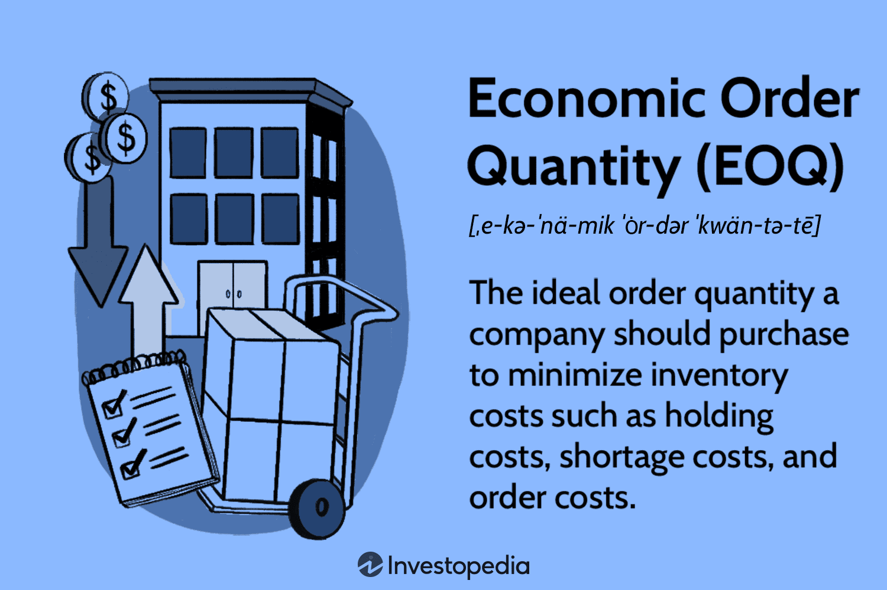

Inventory management plays a crucial role in the efficiency and effectiveness of modern business operations. It involves managing stock levels to ensure that products are available to meet customer demands while minimizing costs. Effective inventory management is instrumental in optimizing supply chain strategies, leading to smoother operations, reduced overheads, and improved customer satisfaction. This interconnectedness between inventory management and the supply chain emphasizes the importance of a well-coordinated approach to address the dynamic needs of today's businesses.

A fundamental tool in achieving optimal inventory levels is the Economic Order Quantity (EOQ). EOQ is a mathematical model that helps determine the ideal order size to minimize the total cost of inventory management, which includes ordering and holding costs. The EOQ formula, $Q = \sqrt{\frac{2DS}{H}}$, where $D$ is the demand rate, $S$ is the order cost, and $H$ is the holding cost, provides a quantitative method to manage inventory efficiently. By calculating the EOQ, companies can balance these costs effectively, avoiding the pitfalls of overstocking or stockouts.



In recent times, algorithmic trading has emerged as a significant advancement in data-driven decision-making, influencing various business domains, including inventory management. Algorithmic trading utilizes advanced algorithms and large datasets to forecast and respond to market changes and inventory demands swiftly. By integrating algorithmic trading approaches, businesses can significantly enhance their supply chain operations. This integration allows for real-time data analytics and automation, leading to more responsive and adaptive inventory strategies that align more closely with market trends and consumer needs.

This article explores the synergy between inventory management, EOQ, supply chain strategies, and algorithmic trading. It will discuss how these elements work together to optimize business operations, reduce costs, and improve overall efficiency. The piece will delve into the nuances of each component, showcasing their roles, benefits, and the innovative integration of technology in modern inventory management systems. Through case studies and examples, the article will illustrate successful implementations, outline potential challenges and solutions, and project future trends in the evolving landscape of inventory management.

## Table of Contents

## Understanding Economic Order Quantity (EOQ)

Economic Order Quantity (EOQ) is a fundamental concept in inventory management, vital for optimizing inventory levels and minimizing total associated costs. EOQ is designed to determine the optimal order quantity that a company should purchase to minimize the total inventory costs, which include holding costs, order costs, and, sometimes, stockout costs. By identifying the ideal order size, businesses can maintain a balance between the costs of ordering and storing inventory, thereby enhancing operational efficiency and cost-effectiveness.

The EOQ formula is mathematically represented as:

$$
Q = \sqrt{\frac{2DS}{H}}
$$

where:
- $Q$ is the optimal order quantity,
- $D$ is the annual demand for the product,
- $S$ is the ordering cost per order, and
- $H$ is the holding cost per unit per year.

This formula thus helps in determining the quantity that minimizes the combination of ordering and holding costs.

EOQ operates under several key assumptions:
1. Constant Demand: It assumes that the demand for the product remains constant throughout the year, which allows for a steady inventory turnover.
2. Fixed Order and Holding Costs: It postulates that both the ordering and holding costs are constant, simplifying the calculation of total costs.
3. Instantaneous Replenishment: It presumes that the entire order quantity is delivered instantaneously without lead times, maintaining consistent inventory levels.
4. No Stockouts: EOQ assumes nil chances of running out of stock and hence doesn't account for stockout costs.

While EOQ offers a solid foundation for inventory management by facilitating cost minimization, it does come with certain limitations. Its assumptions of constant demand and costs may not align with real-world scenarios, where demand can fluctuate, and costs can vary. These limitations can impact its applicability, particularly in dynamic market environments. Moreover, the assumption of instantaneous replenishment does not accommodate the variability in supply chain lead times, which can affect inventory holding.

Despite these drawbacks, the EOQ model provides significant benefits. It simplifies the complex decision-making process involved in inventory management, making it easier to understand and implement. Additionally, it supports cost control by providing insights into the trade-offs between ordering and holding inventory. Many businesses use EOQ calculations as a preliminary step in inventory planning, often adjusting it with real-world data to align more closely with actual conditions.

In conclusion, while EOQ may not perfectly fit every situation, its value as an analytical tool in inventory management is undeniable. By understanding its formula and assumptions, businesses can leverage EOQ to improve inventory efficiency and reduce unnecessary costs, thereby enhancing overall supply chain performance.

## EOQ and Supply Chain Management

Economic Order Quantity (EOQ) plays a pivotal role in supply chain management by enhancing operational efficiency and reducing redundancies. At its core, EOQ is a decision-making tool used to determine the optimal order quantity that minimizes total costs linked to ordering and holding inventory. This efficient approach aligns inventory levels with actual demand, ensuring that supply chain operations maintain a healthy balance between supply and demand.

EOQ provides a structured method to streamline supply chain processes. By calculating the ideal order size, businesses can reduce the frequency of placing orders and carrying excess stock, leading to cost savings and more efficient resource allocation. This optimization process minimizes both order costs, such as delivery charges and processing fees, and holding costs, which include storage and insurance, thereby contributing to a leaner supply chain.

The impact of EOQ extends to cash flow management within the supply chain. By maintaining an optimal inventory level, companies can prevent overinvestment in stock, freeing up cash that can be used for other operational needs or investments. A stable inventory turnover facilitated by EOQ helps in maintaining a steady cash flow, reducing the risks of [liquidity](/wiki/liquidity-risk-premium) shortages or the need for excessive borrowing.

Several case studies illustrate the successful implementation of EOQ in supply chain management. For instance, a leading retailer implemented the EOQ model to refine their inventory management system. By doing so, they reduced their order frequency by 15% and cut holding costs by 25%, resulting in significant savings and improved efficiency. Another example is a manufacturing firm that used EOQ to adjust their production schedules in line with seasonal demand variations, optimizing inventory levels and ensuring timely product availability without overstocking.

Through these applications, EOQ demonstrates its value as a strategic tool in supply chain management, fostering an environment where demand is met accurately, and resources are utilized with precision.

## Algorithmic Trading and Inventory Management

Algorithmic trading, traditionally associated with financial markets, applies advanced mathematical models and algorithms to execute transactions. Its application has expanded beyond finance into areas such as supply chain and inventory management. By using large datasets, [algorithmic trading](/wiki/algorithmic-trading) leverages [machine learning](/wiki/machine-learning) and statistical techniques to make precise, data-driven decisions. This capability is particularly valuable in inventory management, where forecasting demand and adjusting inventory levels accurately is crucial.

Algorithms can forecast demand more precisely by analyzing historical data, market trends, and external factors such as economic indicators or seasonal variations. This predictive capability allows businesses to maintain optimal inventory levels, reducing the risk of overstocking or stockouts. For instance, machine learning algorithms can process vast amounts of sales data to identify patterns and predict future demand. By integrating these predictions with inventory systems, businesses can automate stock replenishment processes, thus ensuring efficient supply chain operations.

The synergy between algorithmic trading technologies and Economic Order Quantity (EOQ) principles further enhances inventory optimization. While EOQ helps determine the ideal order quantity to minimize total costs, algorithms can adjust these calculations dynamically based on real-time data. This adaptability means that EOQ models are no longer static. Algorithms continuously refine EOQ inputs such as demand forecasts and costs, enabling more agile and responsive inventory management.

Practical applications of algorithmic trading in inventory management are diverse. For example, Amazon employs sophisticated algorithms to manage its vast inventory across global warehouses, optimizing stocking levels and minimizing delivery times. Another example is Walmart, which uses machine learning models to predict product demand, aligning inventory levels with anticipated market needs and reducing waste.

The integration of algorithmic trading into inventory management exemplifies the evolving landscape of supply chain strategies. By harnessing real-time data processing, predictive analytics, and machine learning, businesses can enhance their operational efficiency, cost management, and customer satisfaction. As technology advances, the potential for algorithmic trading to revolutionize inventory management continues to grow, setting new standards for data-driven decision-making and strategic planning in modern business operations.

## Practical Implementation of EOQ and Algo Trading

The Economic Order Quantity (EOQ) model is a practical tool that helps businesses optimize their inventory levels by determining the most cost-effective amount of stock to order. To implement EOQ in your operations, follow these steps:

1. **Gather Required Data**: Identify the annual demand (D) for the product, the cost per order (S), and the holding cost per unit per year (H). These parameters are crucial for the EOQ calculation.

2. **Calculate EOQ**: Use the EOQ formula: 
$$
   Q = \sqrt{\frac{2DS}{H}}

$$
   This formula provides the optimal order quantity that minimizes total inventory costs, which include ordering and holding costs.

3. **Interpret EOQ Results**: Evaluate how the calculated EOQ aligns with your business operations. Consider whether the recommended order size is practical concerning storage capacity and supplier constraints.

4. **Implement Replenishment Strategy**: After calculating the EOQ, apply it to schedule inventory replenishment. This helps in maintaining consistent stock levels, reducing stockouts, and managing cash flows effectively.

### Algorithmic Trading Systems in Inventory Management

Algorithmic trading systems bring a dynamic dimension to inventory management through data-driven decision-making processes. These systems can analyze large datasets to identify patterns and predict future demand more accurately than traditional forecasting methods. Implementing algorithmic trading involves:

- **Demand Forecasting**: Use predictive analytics to assess historical sales data, market trends, and external factors affecting demand. This allows businesses to adjust inventory levels proactively.

- **Automated Ordering**: Develop algorithms that trigger order placements automatically when inventory levels reach predetermined thresholds. This reduces human error and ensures timely restocking.

- **Risk Management**: Incorporate algorithms to assess risks associated with supply chain disruptions or demand variability, allowing businesses to mitigate potential losses.

### Technological Infrastructure

Implementing EOQ calculations and algorithmic trading requires robust technological infrastructure, including:

- **Data Analytics Platforms**: Utilize platforms capable of processing and analyzing real-time data from various sources. This is critical for accurate demand forecasting and inventory management.

- **Integration of ERP Systems**: Ensure that Enterprise Resource Planning (ERP) systems are integrated to offer centralized control over inventory processes, financial data, and ordering systems.

- **Cloud Computing**: Harness cloud technology to store and process large volumes of data, ensuring scalability and accessibility across departments and locations.

### Best Practices for Integration

Successfully integrating EOQ and algorithmic trading into business operations involves:

- **Continuous Monitoring**: Regularly review inventory metrics and adjust parameters in the EOQ formula based on changing business conditions and market trends.

- **Pilot Testing**: Before full-scale implementation, conduct pilot tests to identify and rectify potential issues in the algorithmic trading systems and EOQ calculations.

- **Training and Development**: Invest in staff training to ensure they are proficient in using new technologies and systems, enhancing the overall efficiency of inventory management processes.

By combining the EOQ model with advanced algorithmic trading systems, businesses can achieve a streamlined and effective inventory management strategy that adapts to market shifts and internal changes, ultimately enhancing operational efficiency and profitability.

## Challenges and Considerations

In the implementation of Economic Order Quantity (EOQ) and algorithmic trading within inventory management, businesses face several challenges that can impact their efficiency and effectiveness. Understanding these challenges and developing strategies to address them is crucial for optimal inventory management.

A primary challenge in employing the EOQ model is accurately predicting demand. The EOQ formula, $Q = \sqrt{\frac{2DS}{H}}$, relies heavily on constant demand assumptions. However, in reality, demand often fluctuates due to market trends, seasonal changes, and consumer preferences. Such fluctuations can lead to either excess stock or stockouts if not accounted for, thereby increasing holding costs or potential lost sales.

Variable costs present another significant hurdle. Both order and holding costs may not remain constant, as assumed by the EOQ model. Costs can vary due to factors such as supplier pricing strategies, changes in storage costs, and inflation. These variations can skew EOQ calculations, necessitating adjustments to maintain cost-effectiveness.

To address these challenges, businesses should incorporate flexibility and adaptability into their EOQ calculations and inventory strategies. One approach is to implement a rolling forecast mechanism, which constantly updates demand estimations using the most recent data. Statistical models and machine learning algorithms can be employed to analyze historical data and predict future trends with greater accuracy. Here’s a simple Python example using a basic time series forecasting technique:

```python
import pandas as pd
from statsmodels.tsa.holtwinters import ExponentialSmoothing

# Load demand data
data = pd.read_csv('demand_data.csv')  # Assume demand_data.csv is your dataset
# Apply time series forecasting
model = ExponentialSmoothing(data['demand'], seasonal='add', seasonal_periods=12)
fit_model = model.fit()
forecast = fit_model.forecast(steps=6)  # Forecast the next 6 periods
print(forecast)
```

Moreover, incorporating real-time data analytics can equip businesses with the ability to dynamically update EOQ inputs in response to changing conditions. Algorithmic trading systems designed for inventory management can automate these updates, optimizing order quantities and timings to align with current market conditions.

To counteract variable costs, businesses can negotiate flexible contracts with suppliers or use hedging strategies to mitigate the impact of cost fluctuations. Monitoring these costs regularly ensures that EOQ calculations remain valid and reflect the true economic landscape.

Continuous monitoring and adaptation are critical in maintaining efficient inventory management. Businesses should establish regular review processes for their EOQ models and algorithmic trading systems, allowing for prompt adjustments to any deviations detected. By fostering an environment of ongoing assessment and refinement, companies can ensure that their inventory strategies are resilient and responsive to both internal dynamics and external market changes.

Overall, the successful implementation of EOQ and algorithmic trading hinges on a combination of accurate demand forecasting, flexible cost management, and adaptive decision-making. This proactive stance not only addresses the inherent challenges but also paves the way for streamlined and effective inventory management.

## The Future of Inventory Management

As inventory management continues to evolve, several trends and innovations are paving the way for more efficient and effective business operations. One of the most significant technological advancements is the incorporation of [artificial intelligence](/wiki/ai-artificial-intelligence) (AI) and machine learning into supply chain and inventory optimization. These technologies enable businesses to refine their forecasting accuracy, thereby reducing the likelihood of stockouts or overstocking and minimizing waste.

AI and machine learning facilitate the analysis of complex datasets to predict demand with an unprecedented level of precision. Machine learning algorithms can process historical data, identify patterns, and adjust to new information in real-time, ensuring businesses maintain optimal inventory levels. For example, demand forecasting models can learn from seasonal trends, market conditions, and consumer behavior shifts, allowing for dynamic adjustments to inventory positioning and distribution strategies.

The integration of advanced algorithms and real-time data analytics is set to significantly transform inventory management. As these frameworks become increasingly sophisticated, decision-makers can rely on predictive analytics to fine-tune their supply chains. This may involve automating reorder processes, refining Economic Order Quantity (EOQ) calculations to account for variable demand, or employing self-learning algorithms that continually optimize inventory-related tasks without human intervention.

Python emerges as a highly beneficial tool in automating and enhancing inventory management processes. Below is a simple example of how Python can be used to calculate and optimize EOQ in a scenario where AI adjusts inputs based on real-time analytics:

```python
import numpy as np

# Sample dynamic input data retrieved from AI analysis
demand = np.array([100, 120, 105, 130])  # Varying demand predictions
order_cost = 50
holding_cost = 2

# EOQ calculation considering dynamic demand
EOQ = np.sqrt((2 * demand * order_cost) / holding_cost)
print("Dynamic EOQ values:", EOQ)
```

This script demonstrates how businesses can recalibrate order quantities based on fluctuating demand forecasts, indicating substantial potential for operational cost savings.

As we look to the future, the synergy between AI-driven insights and EOQ principles suggests a paradigm shift, where inventory management becomes more intelligent and adaptive. Businesses prepared to integrate these forward-thinking strategies are likely to experience enhanced agility, improved cost management, and ultimately, a more resilient supply chain. As technology advances, companies that adapt will unlock competitive advantages, positioning themselves as leaders in a connected and data-driven marketplace.

## References & Further Reading

[1]: Harris, F. W. (1990). ["How Many Parts to Make at Once"](https://pubsonline.informs.org/doi/abs/10.1287/opre.38.6.947). Operations Research, 38(4).

[2]: Silver, E. A., Pyke, D. F., & Thomas, D. J. (2016). ["Inventory and Production Management in Supply Chains"](https://www.taylorfrancis.com/books/mono/10.1201/9781315374406/inventory-production-management-supply-chains-edward-silver-david-pyke-douglas-thomas). CRC Press.

[3]: Nahmias, S., & Cheng, Y. (2009). ["Production and Operations Analysis"](https://books.google.com/books/about/Production_and_Operations_Analysis.html?id=SIsoBgAAQBAJ). McGraw-Hill/Irwin.

[4]: Chopra, S., & Meindl, P. (2016). ["Supply Chain Management: Strategy, Planning, and Operation"](https://books.google.com/books/about/Supply_Chain_Management_Strategy_Plannin.html?id=gPDQCQAAQBAJ). Pearson.

[5]: Lopez de Prado, M. (2018). ["Advances in Financial Machine Learning"](https://www.amazon.com/Advances-Financial-Machine-Learning-Marcos/dp/1119482089). Wiley.

[6]: Jansen, S. (2018). ["Machine Learning for Algorithmic Trading"](https://github.com/stefan-jansen/machine-learning-for-trading). Packt Publishing.