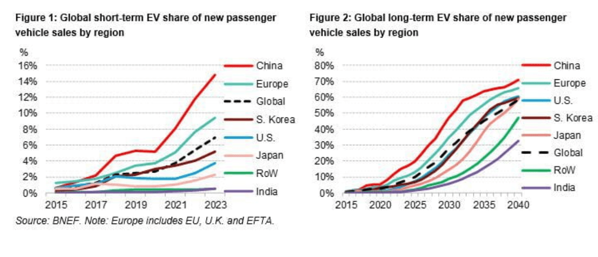

In the evolving global economic landscape, Brazil and India emerge as pivotal players, each wielding vast resources and burgeoning markets that attract global attention. Their roles are further accentuated by their inclusion in the BRICS group of emerging economies, which underscores their importance on the world stage. This article provides a thorough economic comparison of Brazil and India by examining key indicators, challenges, and opportunities inherent in each nation’s financial and structural environment.

Brazil, with its rich natural resources and expansive landscapes, is a leading force in agricultural commodities and other raw materials. Its economy is deeply entwined with these sectors, providing strengths yet presenting challenges in terms of economic stability and diversification. Concurrently, India, renowned as the world's largest democracy, has achieved substantial growth by capitalizing on its technology and service sectors. This sector-led growth has positioned India as a competitive player globally, yet it faces its own hurdles, such as poverty and infrastructure development needs.

Despite differences in their economic foundations, both Brazil and India have shown substantial economic growth trajectories, supported by reforms aimed at integrating more seamlessly into global markets. Each country grapples with unique challenges that demand strategic reforms to maintain momentum and harness new opportunities—challenges such as political stability, economic competitiveness for Brazil, and regulatory and infrastructural advancements for India.

Moreover, the role of algorithmic trading surfaces as a modern catalyst in shaping the economic paths of Brazil and India. By employing advanced financial technologies, algorithmic trading is enhancing the efficiency and liquidity of financial markets in both nations. As these countries navigate complex dynamics of global markets and local growth imperatives, the adoption of such technology offers promising pathways to augment economic development and market robustness. 

In summary, both Brazil and India hold critical positions as emerging markets with vast growth potential. As we compare their economic landscapes, it becomes evident that the intersection of strategic governance, technological adoption, and market-oriented reforms will play indispensable roles in determining their future trajectories.

## Table of Contents

## Overview of Brazil's Economy

Brazil's economy is characterized by its vast natural resources and a significant agricultural sector, each playing crucial roles in commodities trading. As one of the world's largest exporters of soybeans, coffee, sugar, and orange juice, Brazil leverages its fertile lands to maintain a competitive edge in agriculture. The country's mineral wealth, including iron ore and oil, further positions it as a major player in the global commodities market.

However, Brazil's economic stability has been periodically undermined by persistent challenges such as inflation, corruption, and political instability. Inflation, a chronic issue, has at times affected the purchasing power of the populace and complicated fiscal policy. Between 2015 and 2016, Brazil experienced a severe economic recession, exacerbated by political turmoil and corruption scandals, which dented investor confidence and hindered growth.

In response to these challenges, Brazil has initiated efforts to reform its political and economic landscape. Anti-corruption campaigns, most notably Operation Car Wash (Operação Lava Jato), have aimed to enhance transparency and hold accountable those involved in corrupt practices. These initiatives have shown promise, indicating Brazil's commitment to improving its institutional integrity. However, sustaining these efforts remains crucial for the country’s long-term economic prospects, requiring continued focus and policy consistency.

Through these reforms, Brazil seeks to bolster investor confidence and enhance its economic competitiveness. The government's focus on digital transformation and infrastructure development further demonstrates a concerted effort to adapt to global economic shifts and reduce economic vulnerabilities.

## Overview of India's Economy

India, recognized as the world's largest democracy, has witnessed significant economic transformation over the past few decades. The nation has successfully harnessed its burgeoning technology and service sectors to drive economic growth, positioning itself as a major global economic player. This growth is substantiated by the rapid expansion of the Information Technology (IT) and Information Technology-enabled Services (ITES) sectors, which have become cornerstones of India’s economy. These sectors not only generate substantial employment but also contribute significantly to the country's Gross Domestic Product (GDP).

Despite these achievements, India still grapples with enduring challenges. Poverty remains a critical issue, with a considerable portion of the population living below the poverty line. Efforts to alleviate poverty are often hampered by regulatory inefficiencies that obstruct effective policy implementation and service delivery. Furthermore, infrastructure deficits, including insufficient transportation and energy resources, remain formidable obstacles to sustained economic growth.

However, the Indian government has initiated various pro-business reforms aimed at improving the investment climate and driving economic progress. Notable reforms include the introduction of the Goods and Services Tax (GST) and the implementation of the Insolvency and Bankruptcy Code (IBC). These measures are designed to create a more unified and straightforward tax regime while providing a systematic framework for dealing with insolvency, respectively. The reforms have enhanced the ease of doing business in India, thereby attracting foreign direct investment (FDI).

Additionally, initiatives such as "Make in India" and "Digital India" have been launched to encourage manufacturing and digitalization, further strengthening India's economic infrastructure and capabilities. These initiatives aim to increase domestic production, reduce import dependency, and foster innovation and technology adoption across sectors.

In summary, while India's economy benefits significantly from its robust technology and service sectors, the country faces pressing challenges, including poverty, regulatory hurdles, and infrastructure inadequacies. Nevertheless, with ongoing reforms and strategic initiatives, India is enhancing its investment attractiveness and charting a [course](/wiki/best-algorithmic-trading-courses) for sustainable economic development.

## Economic Growth Comparison

India and Brazil have emerged as key players in the global economy, each showcasing notable economic growth patterns. As of recent years, India's economy, measured by Gross Domestic Product (GDP), ranks higher than Brazil's. This distinction is chiefly due to India's sizeable population and a diversified array of economic sectors that encompass information technology, telecommunications, agriculture, and manufacturing. 

India's vast workforce and thriving service sectors, particularly IT and software services, contribute significantly to its GDP. The country's integration into global markets and supply chains, combined with a young, dynamic workforce, propels its economic expansion. Moreover, India's economic strategies have increasingly focused on digitalization and innovation, further enhancing its economic footprint.

Conversely, Brazil, despite being abundant in natural resources like iron ore, oil, and agricultural products, faces challenges related to GDP per capita. Brazil's economic activity is heavily reliant on commodities, which makes it susceptible to global price [volatility](/wiki/volatility-trading-strategies). The country’s smaller population relative to India does not compensate for these disparities in GDP per capita. Furthermore, structural economic issues, such as high levels of informality and income inequality, impede Brazil's balanced economic growth.

Both nations have witnessed considerable GDP growth rates over the years, but these rates have been subject to fluctuations due to external and internal factors. Global economic shifts, currency fluctuations, political instability, and domestic policy changes significantly impact growth trajectories. For instance, global financial crises and variations in commodity prices often result in reduced economic [momentum](/wiki/momentum) for Brazil. India, on the other hand, faces internal challenges such as poverty and infrastructure limitations that sometimes dampen its rapid growth potential.

Overall, while India's economy benefits from structural diversity and a burgeoning technology-driven sector, Brazil's reliance on natural resources and external economic shifts necessitates careful economic planning and diversification to achieve sustained growth.

## Role of Algorithmic Trading in Economic Development

Algorithmic trading has reshaped the landscape of financial markets in both Brazil and India, harnessing the power of advanced computational technology to execute trades at unprecedented speed and precision. This transformation has brought substantial benefits to both countries, influencing market efficiency, price discovery, and [liquidity](/wiki/liquidity-risk-premium).

In Brazil, [algorithmic trading](/wiki/algorithmic-trading) plays a vital role in optimizing commodity trading processes. Brazil's economy, heavily reliant on commodities such as soybeans, sugar, iron ore, and oil, benefits significantly from the precision and speed of algorithmic trading systems. These systems help manage vast amounts of market data, detecting price patterns and executing trades that enhance both profitability and market stability. The efficiency brought by algorithmic trading is crucial for Brazil's commodities markets, which often face volatility driven by global demand and supply fluctuations.

The Brazilian financial market regulator, Comissão de Valores Mobiliários (CVM), has implemented measures to ensure fair and transparent algorithmic trading activities. These measures are designed to prevent market manipulation and ensure that algorithmic trading contributes positively to market integrity. Brazil's financial infrastructures, such as the BM&F Bovespa (now B3), have adopted state-of-the-art technological solutions to support and regulate algorithmic trading, aligning with global best practices.

India, with its rapidly growing tech-driven economy, has integrated algorithmic trading into its financial markets at a remarkable pace. The Bombay Stock Exchange (BSE) and the National Stock Exchange (NSE) have been at the forefront of this transformation, deploying high-frequency trading platforms that cater to both domestic and international traders. These platforms facilitate a high level of automation in trade execution, boosting market efficiency and liquidity.

The integration of algorithmic trading in India aligns with broader economic reforms aimed at liberalizing the financial sector, attracting foreign investment, and fostering an innovation-friendly environment. Regulatory bodies like the Securities and Exchange Board of India (SEBI) have established comprehensive frameworks to ensure that algorithmic trading practices are conducted ethically and responsibly. These frameworks focus on transparency, risk management, and the promotion of equal access to trading technologies.

Both Brazil and India face challenges associated with algorithmic trading, such as the need for continuous technological upgrades and the mitigation of risks related to high-frequency trading. However, the potential for enhancing market efficiency and integrating into global financial networks presents substantial opportunities. Algorithmic trading, as a cornerstone of modern financial systems, promises ongoing economic contributions by facilitating enhanced trading processes and supporting sustainable economic development in both countries.

## Challenges and Prospects

Brazil's future economic trajectory heavily depends on addressing long-standing political scandals and enhancing economic competitiveness. Political instability, often exacerbated by corruption scandals, has historically hindered Brazil's economic development. Transparency International's Corruption Perceptions Index highlights Brazil's struggles with corruption, which deters foreign investment and undermines public trust. Therefore, strengthening institutions and enforcing anti-corruption laws are paramount for Brazil to enhance its business environment and attract international investors.

To bolster economic competitiveness, Brazil must also focus on diversifying its economy beyond commodities. Despite the country's abundant natural resources, reliance on agriculture and raw materials limits economic resilience. Investment in technology and innovation sectors can drive diversification, promoting sustainable economic growth. Furthermore, trade partnerships, both regional and international, can expand market access and reduce trade barriers, proving beneficial for Brazil's economic ambitions.

India faces its own set of challenges, primarily centered around regulatory bottlenecks and infrastructure deficits. The complex regulatory environment in India often impedes business operations, discouraging both domestic and foreign investment. Simplifying regulatory processes and enhancing transparency could significantly boost India's business climate, making it more conducive for economic growth.

Investment in infrastructure remains critical for India. Despite rapid urbanization, infrastructure development has not kept pace, leading to inefficiencies and disruptions. The government must prioritize infrastructure projects, particularly in transportation and energy sectors, to support urban expansion and industrial growth. Strategic partnerships and public-private initiatives can provide the necessary capital and expertise to undertake these large-scale projects.

Both Brazil and India must engage in strategic reforms to maximize their economic potential. For Brazil, the focus should be on institutional reform and economic diversification. In contrast, India should prioritize regulatory simplification and infrastructure enhancement. International collaboration, including technology transfer and trade agreements, can further aid these efforts, ensuring both countries capitalize on global opportunities.

Achieving sustained economic growth depends on proactive measures addressing these challenges. By implementing necessary reforms and fostering international partnerships, Brazil and India can enhance their economic trajectories, achieving long-term prosperity. Their potential as emerging markets is substantial, but realizing this potential requires strategic planning and implementation.

## Conclusion

Brazil and India, although differing in their economic frameworks and cultural landscapes, converge as prominent emerging markets poised for significant growth. Both countries have demonstrated resilience and adaptability amid changing global economic conditions, which underpin their potential for sustained development. The integration of algorithmic trading into their financial systems illustrates a shared commitment to harnessing technology to bolster market depth and efficiency. This approach not only modernizes trading infrastructures but also enhances liquidity and price discovery, essential components for robust market performance.

The expansion of algorithmic trading platforms is complemented by ongoing economic reforms in both nations. Brazil's initiatives aimed at increasing transparency and enhancing competitiveness align with India's push towards deregulation and improved governance. These reforms, while unique to each country's socio-economic context, are critical for attracting foreign investments and fostering a stable economic environment.

Moreover, technology adoption across sectors in Brazil and India is pivotal for driving productivity and innovation. As these nations continue to embrace digital transformation, they are better positioned to address systemic challenges, such as infrastructure deficits and regulatory inefficiencies, that could otherwise impede progress.

In conclusion, the trajectory of Brazil and India's economic expansion will substantially depend on their ability to adapt to technological advancements and sustain reformative measures. Collaborative efforts on international platforms could also amplify their influence and accelerate their growth potential. Through strategic investments in technology and governance, both countries are well-placed to navigate the complexities of the global economy and achieve long-term prosperity.

## References & Further Reading

[1]: IMF Staff. (2013). [India - 2013 Article IV Consultation: Concluding Statement](https://www.elibrary.imf.org/view/journals/002/2013/037/article-A002-en.xml). International Monetary Fund.

[2]: IMF Staff. (2019). [Brazil - Article IV Consultation: Staff Report](https://www.imf.org/en/Publications/CR/Issues/2019/07/23/Brazil-2019-Article-IV-Consultation-Press-Release-Staff-Report-and-Statement-by-the-48520). International Monetary Fund.

[3]: Mallaby, S. (2016). ["The Man Who Knew: The Life and Times of Alan Greenspan."](https://www.amazon.com/Man-Who-Knew-Times-Greenspan/dp/1594204845) Penguin Press.

[4]: Stiglitz, J. E., & Greenwald, B. C. (2014). ["Creating a Learning Society: A New Approach to Growth, Development, and Social Progress."](https://www.jstor.org/stable/10.7312/stig15214) Columbia University Press.

[5]: Pigato, M. A., & Tang, W. (2015). ["China and Brazil: Strengthening Trade and Investment Ties"](https://www.tralac.org/images/docs/7659/pigato-and-tang-china-and-africa-expanding-economic-ties-in-an-evolving-global-context-march-2015.pdf). World Bank Group.