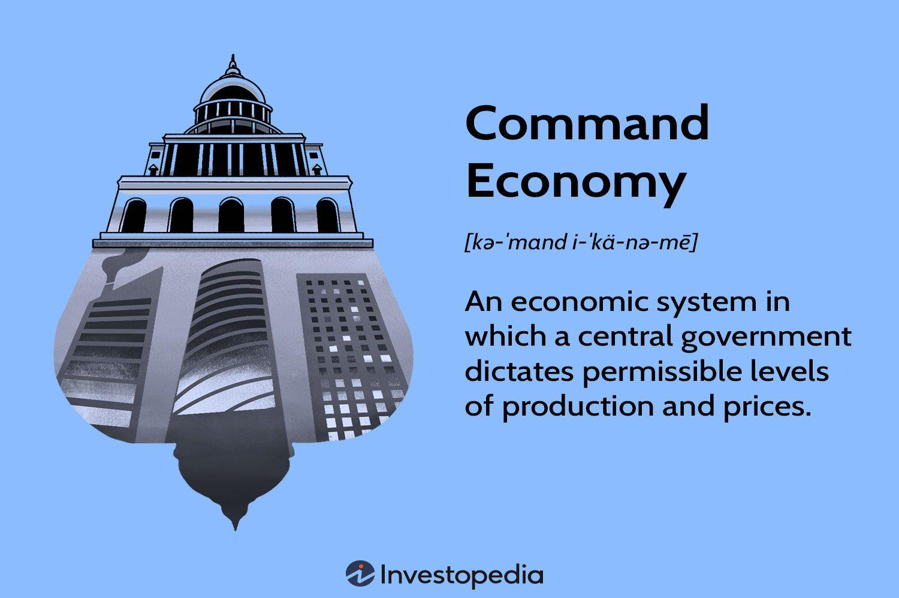

Command economies present a fascinating case within global economic systems, distinctively characterized by their reliance on central planning. Unlike market economies, where the forces of supply and demand dictate the production and distribution of goods and services, command economies operate under the directive of government or central authorities. This unique approach is designed to address specific socio-economic challenges by aligning economic production with broader political and social objectives.

Understanding the functioning of command economies is essential to comprehend the interplay between economic and political ideologies on global markets. Central planning allows governments to set macroeconomic goals which ideally lead to economic stability and equitable resource distribution. Such economies have historically attempted to prioritize collective goals over individual interests, yet, they often grapple with issues related to efficient implementation and adaptability.



Modern technology, particularly algorithmic trading, introduces new dimensions to these systems. Algorithmic trading leverages computational prowess to analyze vast datasets, offering the potential to refine economic forecasting and resource management within command economies. These tools promise to address some of the persistent inefficiencies of classical command economies by providing precise data-driven insights, potentially optimizing economic output and resource allocation.

However, despite theoretical attractiveness, command economies face considerable challenges. Their centralized nature often results in inefficiencies and a lack of innovation, attributed to the absence of competitive pressure and responsive pricing mechanisms typically found in free-market systems. Historical evidence from command economies like the Soviet Union and North Korea underscores the difficulty in balancing state objectives with operational efficiency and consumer satisfaction.

This article aims to navigate through these intricate dynamics, examining both the theoretical and practical aspects of command economies. By considering historical precedents alongside modern economic theories, this exploration seeks to offer a comprehensive perspective on how such systems could evolve with the integration of cutting-edge technological solutions like algorithmic trading.

## Table of Contents

## Understanding Command Economies and Central Planning

In a command economy, a central authority or government is responsible for making critical decisions about the production and distribution of goods and services. This system is characterized by its reliance on macroeconomic objectives, which are often shaped by political considerations rather than market forces such as supply and demand. Unlike a market economy, where prices and production levels are determined by consumer demand and competition, command economies emphasize achieving specific societal goals set by the state.

The role of the central planner is pivotal in determining what goods are produced, the price points, and the quantities to supply. These decisions are typically made with the aim of fulfilling state objectives, which may include ensuring national security, promoting social welfare, or advancing technological development. However, this focus on state objectives often comes at the expense of individual needs and preferences.

Countries like North Korea and the former Soviet Union serve as prominent examples of command economies. These nations have demonstrated the model's capacity to mobilize resources swiftly and direct them towards national priorities. For instance, during periods of war or economic reconstruction, the centralized control allowed for rapid redirection of resources to meet strategic goals. However, such systems also reveal significant weaknesses, particularly in terms of flexibility and responsiveness to changing market conditions.

One of the primary motivations for adopting central planning is the pursuit of economic stability and equitable distribution of resources. Proponents argue that by controlling resources and production, governments can prevent economic fluctuations and ensure that all citizens have access to essential goods and services. Nonetheless, command economies often encounter challenges related to inefficiencies and a lack of innovation. The absence of competitive pressures means there is little incentive for firms to improve their products or services, leading to stagnation and poor consumer satisfaction.

Furthermore, in command economies, the disconnect between production and consumer demand can result in surpluses of unwanted goods or shortages of essential items. This is because the central planners, despite their best intentions, may not have access to accurate information about the wants and needs of the populace. The inability to accurately respond to consumer demands can lead to economic imbalances and a reduction in overall welfare.

Overall, while command economies offer certain theoretical advantages, such as coordinated and rapid allocation of resources for national objectives, they often struggle with implementation due to their inherent rigidity and lack of market signals. The balance between achieving state-directed economic goals and maintaining efficiency and innovation remains a fundamental challenge for countries operating under this economic model.

## The Pros and Cons of Command Economies

Command economies possess distinct advantages that can be particularly beneficial during specific economic scenarios. One primary benefit is their capability to quickly mobilize resources to meet national objectives, a critical feature during periods of crisis or significant societal need. This centralization ensures that essential services and industries can be prioritized, providing economic stability and continuity.

Moreover, command economies focus on reducing income inequality by regulating wages and guaranteeing employment. This approach offers citizens a degree of economic security and predictability not always found in market economies. Government involvement in wage setting aims to create a more equitable distribution of income, reducing the socio-economic gaps that can arise in more laissez-faire systems.

Central planning allows for strategic targeting of key industries, potentially fostering national growth and development. By directing resources towards sectors deemed vital, command economies can catalyze infrastructure projects, defense industries, or industrialization efforts, aligning with broader state goals.

However, these advantages are counterbalanced by several disadvantages. Bureaucratic inefficiencies are commonly associated with command economies due to the complex administrative requirements needed to execute central planning. This can result in a slower decision-making process, often hindering timely responses to economic changes.

Consumer choices in command economies are generally restricted, as the allocation of resources is controlled by the state rather than guided by consumer demand. This limitation can lead to shortages of goods, reduced variety for consumers, and an overall lack of responsiveness to consumer preferences.

Furthermore, the absence of competitive pressures significantly diminishes innovation. The lack of competition means there is little incentive for firms to innovate or improve product quality, leading to stagnation. As a result, command economies may find it challenging to adapt to technological advancements, potentially hampering long-term economic growth and development.

In summary, while command economies can efficiently direct resources towards strategic objectives and provide security for citizens, they face inherent challenges that can limit economic dynamism and flexibility. These systems must navigate the delicate balance between centralized control and market forces to maximize their potential benefits while mitigating the drawbacks.

## The Role of Human Incentives and Political Self-Interest

Command economies rely heavily on centralized decision-making and control over economic activities. Within these systems, human incentives play a crucial role in determining the success of economic production and distribution. Unlike market economies, where profit serves as the primary motivator for innovation and efficiency, command economies require alternative incentives to drive productivity. These may include ideological commitment, social goals, or state-imposed objectives. However, aligning these incentives with national economic targets remains challenging, as it often involves balancing the interests of various stakeholders within the political hierarchy.

Political self-interest often takes precedence in command economies, significantly influencing economic decisions. Leaders may prioritize policies that strengthen their political power or align with their ideological stance, rather than optimizing economic efficiency or addressing consumer needs. This focus on political agendas can result in resource misallocation, with the pursuit of state objectives sometimes compromising the broader economic well-being. For example, decisions may be made to bolster political support through infrastructure projects or industrial investments that lack commercial viability but serve to appease influential political figures.

The historical experiences of the Soviet Union provide insight into how political self-interest can affect command economies. The Soviet system struggled with inefficiencies partly due to the need to satisfy political leaders rather than the actual demands of consumers. These practices often led to production targets that emphasized quantity over quality, causing long-term problems in competitiveness and innovation. As a result, industries were more focused on meeting quotas than on adapting to changing market conditions or technological advancements.

Political corruption further exacerbated these challenges, undermining the integrity of central planning. Corruption often resulted in favoritism, where political connections could influence economic decisions, leading to ineffective or unjust resource allocation. This undermined the goals of central planning by introducing distortions that favored certain groups or individuals over collective national benefits. The consequences were widespread inefficiencies and a lack of transparency, which ultimately contributed to the economic challenges faced by command economies like that of the Soviet Union.

In summary, human incentives and political self-interest are central to understanding the operational dynamics of command economies. With incentives not directly tied to economic efficiency, these systems often encounter hurdles in fostering innovation and responsiveness. Political agendas and corruption further complicate this landscape, challenging the effectiveness of centralized economic planning.

## The Impact of Algorithmic Trading on Command Economies

Algorithmic trading, a marriage of technology and finance, presents intriguing possibilities for enhancing efficiency within command economies. In systems where central planning dictates economic directions, the introduction of [algorithmic trading](/wiki/algorithmic-trading) could offer data-driven insights crucial for optimizing resource allocation and production schedules.

One of the primary advantages of algorithmic trading is its ability to process vast amounts of data rapidly. This capacity can be instrumental in a command economy, which often grapples with issues of information asymmetry and resource misallocation. By leveraging algorithms, these economies might improve the accuracy of economic calculations, addressing long-standing criticisms of inefficiency. For instance, algorithms can be programmed to analyze historical data, current trends, and external variables to predict demand and supply needs accurately. This predictive capability could lead to more informed decision-making, enhancing the overall effectiveness of central planning.

Moreover, algorithmic trading can facilitate the integration of real-time data into economic strategies, enabling planners to adjust production schedules and resource distribution dynamically. This flexibility is crucial for command economies, where static plans often result in shortages or surpluses. An example implementation might involve [machine learning](/wiki/machine-learning) models that constantly refine their predictions based on new data inputs, thus optimizing economic outcomes.

Here is a simple Python example to illustrate how a basic predictive model might work within this context:

```python
import numpy as np
from sklearn.linear_model import LinearRegression

# Sample data: historical demand and economic indicators
X = np.array([[1, 2], [2, 3], [3, 4], [4, 5]])  # Economic indicators
y = np.array([10, 15, 25, 35])  # Corresponding demand

# Create a linear regression model
model = LinearRegression()
model.fit(X, y)

# Predict future demand based on new economic indicators
new_data = np.array([[5, 6]])
predicted_demand = model.predict(new_data)
print("Predicted Demand:", predicted_demand)
```

While these technological capabilities promise enhanced precision, their integration within a command economy framework presents significant challenges, particularly related to adaptability and human oversight. Command economies are typically characterized by rigid structures that may resist the flexible nature of algorithmic solutions. Algorithmic trading requires a level of flexibility and rapid response to market-like conditions that are not typically present in centrally planned systems.

Additionally, reliance on algorithms necessitates effective human oversight to ensure that these automated decisions align with broader socio-economic goals. Human oversight is essential in preventing systemic biases present in data from affecting economic decisions. Thus, a fundamental challenge lies in harmonizing the insights gained from algorithmic trading with the inherently hierarchical and controlled nature of command economies.

In conclusion, while algorithmic trading harbors potential for revitalizing command economies through improved efficiency and resource management, successful implementation demands a careful balance between technological innovation and existing economic frameworks. This requires not only technological integration but also a paradigm shift in how economic planning is perceived and executed within these systems.

## The Socialist Calculation Problem

The socialist calculation problem highlights a critical limitation within command economies, primarily centered on the absence of a functioning price mechanism. This issue fundamentally questions the efficacy of these economies in performing accurate economic calculations. At the heart of the problem is the challenge of resource allocation and pricing in environments where market signals are absent or muted.

Austrian economist Ludwig von Mises played a pivotal role in articulating this problem. He contended that in the absence of free markets, determining the value of goods and services becomes an insurmountable task. In market economies, prices emerge as a result of the interactions between supply and demand, reflecting the relative scarcity and desirability of commodities. These price signals are crucial for producers and consumers to make informed decisions about production, consumption, and investment.

In command economies, where central planning replaces market mechanisms, the task of setting prices must be undertaken by planners who may not possess the granular knowledge or responsive capability inherent in decentralized markets. Without true price indicators, command economies face significant hurdles in achieving a rational allocation of resources. This leads to economic inefficiencies, often manifesting as surpluses and shortages of goods and services.

Mises argued that the lack of a price system inhibits the ability to perform economic calculations necessary for effective resource distribution. The information contained within price signals is vital to understand the opportunity cost of resource deployment, something that centralized bodies may struggle to replicate artificially. Indeed, the inefficiencies resulting from this absence can contribute to the misallocation of labor and materials, ultimately hindering economic progress and innovation.

This problem becomes especially pertinent when considering more complex and technologically advanced economies where the coordination of innumerable variables is essential. While central planners can attempt to use mathematical models or algorithms to simulate market conditions, the dynamic and ever-changing nature of economic environments presents a significant challenge. Advanced computational techniques, though promising, have yet to resolve fully the complexities posed by the socialist calculation problem. Therefore, this issue remains a central critique of command economies, underscoring a fundamental difficulty in achieving effective economic management without the guiding mechanism of market prices.

## The Future of Command Economies in a Tech-Driven World

As technology advances, it reshapes the economic frameworks within which countries operate, including command economies. The integration of [artificial intelligence](/wiki/ai-artificial-intelligence) (AI) and machine learning (ML) holds the potential to transform the efficiency and planning capabilities in these centrally managed systems.

AI-driven central planners offer a sophisticated model for enhancing the coordination and management of resources, a critical aspect in command economies where central authorities dictate economic activities. Through predictive analytics, AI can forecast demand trends, aiding in the efficient organization of production schedules and supply chain logistics. For instance, machine learning algorithms can analyze historical data to anticipate future market needs, thereby optimizing the allocation of scarce resources. This method contrasts with traditional command economy practices where decisions may rely on less dynamic data sets, potentially leading to improved decision-making accuracy.

The prospect of an AI-enhanced command economy, however, remains largely theoretical at this stage due to various implementation challenges. Technical issues such as data integrity, computational needs, and the development of sophisticated algorithmic models present significant obstacles. Moreover, ethical considerations, including concerns about data privacy, transparency, and algorithmic biases, further complicate the application of AI in economic planning.

Despite these challenges, early experiments can be initiated with AI-powered tools to assist human planners. This hybrid approach can serve as a bridge, allowing command economies to leverage technology while maintaining the necessary human oversight and accountability. Various machine learning libraries like TensorFlow and PyTorch can facilitate the development of models capable of handling large-scale data analysis required in economic planning.

In summary, while AI and machine learning present significant opportunities for enhancing the efficiency of command economies, their practical application must be carefully managed. Addressing the technical and ethical obstacles will be crucial to realizing the full potential of technology in improving central planning and resource distribution.

## Conclusion

Command economies offer a fascinating exploration of central planning with inherent advantages and challenges. Historically, these systems have struggled with efficiency and innovation. The rigidity of central planning often hinders the flexibility needed to adapt to changing economic conditions and consumer preferences. The absence of market-driven signals can lead to inefficiencies in resource allocation and stifle innovation, as demonstrated by historical examples such as the former Soviet Union.

However, the advent of technological advancements, notably in algorithmic trading and artificial intelligence (AI), presents potential for reinvigoration. Algorithmic trading could provide command economies with real-time data analysis and predictive insights, optimizing resource allocation and production processes. For instance, machine learning algorithms can analyze vast datasets to forecast demand patterns, thereby enhancing the responsiveness and precision of economic planning. AI-driven systems could simulate market dynamics, offering a quasi-market mechanism to aid decision-making in environments traditionally devoid of price signals.

Yet, the successful integration of these technologies requires a careful balance between technological prowess and traditional economic principles. The automation and data-driven insights delivered by AI and algorithms must be complemented by human oversight to ensure that ethical considerations and societal needs remain at the forefront. Policymakers must navigate the challenges of implementing these technologies within the constraints of command structures, maintaining transparency and accountability.

Future discourse should focus on harmonizing technological tools with the human-centric needs of economic systems. It is imperative that advancements in technology serve the broader welfare of society, enhancing the quality of life, promoting equitable growth, and ensuring that the benefits of innovation are widely shared. This approach will necessitate ongoing research, collaboration between technologists and economists, and a commitment to ethical governance in deploying technology within command economies.

## References & Further Reading

[1]: Mises, L. von. (1990). ["Economic Calculation in the Socialist Commonwealth."](https://mises.org/library/book/economic-calculation-socialist-commonwealth) Ludwig von Mises Institute.

[2]: Hayek, F.A. (1945). ["The Use of Knowledge in Society."](https://german.yale.edu/sites/default/files/hayek_-_the_use_of_knowledge_in_society.pdf) American Economic Review, 35(4), 519-530.

[3]: Naughton, B. (1995). ["Growing out of the Plan: Chinese Economic Reform, 1978-1993."](https://www.jstor.org/stable/2667711) Cambridge University Press.

[4]: Coase, R., & Wang, N. (2012). ["How China Became Capitalist."](https://www.semanticscholar.org/paper/How-China-Became-Capitalist-Coase-Wang/5f809e5ef6712c67f37bcc451ea4266a039c35cd) Palgrave Macmillan.

[5]: Slepov, V. A., & Orlova, E. V. (2013). ["Algorithmic Trading on the Moscow Exchange: Economic Analysis and Development Prospects."](https://www.researchgate.net/profile/Ev-Orlova) Journal of Regional Economics, 2, 19-27.

[6]: Polanyi, K. (2001). ["The Great Transformation: The Political and Economic Origins of Our Time."](https://www.amazon.com/Great-Transformation-Political-Economic-Origins/dp/080705643X) Beacon Press.

[7]: Kornai, J. (1992). ["The Socialist System: The Political Economy of Communism."](https://academic.oup.com/book/4729) Princeton University Press.

[8]: Bourne, C. (Ed.). (2002). ["Studies in Economic Planning Over Space and Time."](https://www.sciencedirect.com/book/9780121190620/food-texture-and-viscosity) Palgrave Macmillan.