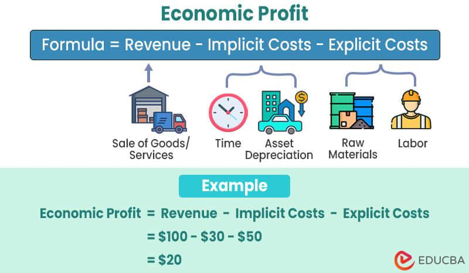

## Table of Contents

## What is economic profit?

Economic profit is the money a business makes after paying all its costs, including the opportunity costs. Opportunity costs are what you give up when you choose to do one thing instead of another. For example, if you start a business, you might give up a salary from a job. Economic profit is different from accounting profit, which only looks at the money coming in and going out without considering opportunity costs.

To calculate economic profit, you start with the total revenue, which is all the money the business earns. Then, you subtract both the explicit costs, like rent and wages, and the implicit costs, which are the opportunity costs. If the result is positive, the business is making an economic profit. If it's negative, the business is not covering all its costs, including what could have been earned elsewhere. Understanding economic profit helps business owners make better decisions about where to put their time and money.

## How is economic profit different from accounting profit?

Economic profit and accounting profit are two ways to measure how well a business is doing, but they look at different things. Accounting profit is what you see on a business's financial statements. It's calculated by taking the total revenue, which is all the money the business makes, and subtracting the explicit costs, like rent, salaries, and supplies. This number tells you if the business is making money in a straightforward way.

Economic profit goes a step further. It not only subtracts the explicit costs but also the implicit costs, which are the opportunity costs. Opportunity costs are what you give up when you choose to do one thing instead of another. For example, if you start a business, you might give up a salary from a job. So, economic profit shows if the business is doing better than other possible uses of your time and money. If the economic profit is positive, the business is doing well compared to other options; if it's negative, you might be better off doing something else.

## What is the formula for calculating economic profit?

The formula for calculating economic profit is simple. You start with the total revenue, which is all the money your business makes. Then, you subtract two types of costs: explicit costs and implicit costs. Explicit costs are the actual payments you make, like rent, salaries, and supplies. Implicit costs are the opportunity costs, which are what you give up by choosing to run your business instead of doing something else, like taking a job.

So, the formula looks like this: Economic Profit = Total Revenue - Explicit Costs - Implicit Costs. If the result is a positive number, your business is making an economic profit. This means it's doing better than other possible uses of your time and money. If the result is negative, your business isn't covering all its costs, including what you could have earned elsewhere.

## Can you explain the concept of opportunity cost in relation to economic profit?

Opportunity cost is what you give up when you choose to do one thing instead of another. Imagine you have $10,000 and you can either start a small business or invest it in a safe savings account that earns 5% interest. If you choose to start the business, the opportunity cost is the $500 you would have earned from the savings account. This cost is important because it helps you see if your business is really making a profit when you consider what you could have done with your money and time instead.

In terms of economic profit, opportunity cost is a big part of the calculation. When you figure out your economic profit, you take your total revenue and subtract both your explicit costs, like rent and supplies, and your implicit costs, which include the opportunity cost. If your business makes more money than what you could have earned elsewhere, then you have a positive economic profit. This means your business is a good choice compared to other options. But if your economic profit is negative, it might be better to use your money and time in a different way.

## What does a positive economic profit indicate about a business?

A positive economic profit means that a business is doing better than other ways the owner could have used their time and money. It shows that the business is making more money than what the owner could have earned if they had chosen a different option, like working a job or investing in something else. This is a good sign because it means the business is a smart choice compared to other possibilities.

When a business has a positive economic profit, it's not just covering its bills and expenses. It's also making enough money to be better than the next best thing the owner could have done. This helps the owner know that their business is successful and that they are using their resources in the best way possible.

## How do you calculate economic loss?

Economic loss happens when a business is not making enough money to cover all its costs, including what it could have earned elsewhere. To figure out if you have an economic loss, you start with the total revenue, which is all the money your business makes. Then, you subtract the explicit costs, like rent and salaries, and the implicit costs, which are the opportunity costs. Opportunity costs are what you give up by choosing to run your business instead of doing something else.

If the result of this calculation is a negative number, then you have an economic loss. This means your business is not doing as well as other ways you could have used your time and money. For example, if you could have earned a salary by working a job instead of starting your business, and your business isn't making more than that salary, then you are experiencing an economic loss. Understanding economic loss helps business owners see if they should keep going with their business or try something different.

## What are the implications of an economic loss for a business?

When a business has an economic loss, it means the business is not making enough money to cover all its costs, including what the owner could have earned doing something else. This tells the owner that the business might not be the best way to use their time and money. It's like if you could have made more money working a job, but instead, you're losing money with your business. This can be a sign that the business needs to change how it works or maybe even stop altogether.

An economic loss can make it hard for a business to keep going. If the business keeps losing money, it might run out of money to pay for things like rent, supplies, and salaries. This can lead to the business closing down. It can also make it tough to get loans or investments because banks and investors see the economic loss and might think the business is too risky. So, figuring out why there's an economic loss and trying to fix it is really important for the future of the business.

## Can you provide a simple example of calculating economic profit for a small business?

Let's say you own a small coffee shop. Last month, you made $10,000 in total revenue from selling coffee and snacks. Your explicit costs, like rent, supplies, and employee wages, were $6,000. You also gave up a job that paid $3,000 a month to run your coffee shop, so that's your opportunity cost, or implicit cost.

To calculate your economic profit, you start with your total revenue of $10,000. Then, you subtract your explicit costs of $6,000 and your implicit costs of $3,000. So, $10,000 - $6,000 - $3,000 equals $1,000. Since the result is positive, your coffee shop made an economic profit of $1,000 last month. This means running your coffee shop was a better choice than working at the job you gave up.

## How does economic profit relate to the concept of normal profit?

Economic profit and normal profit are two ways to think about how a business is doing. Normal profit happens when a business is just covering all its costs, including the opportunity costs. This means the business is making enough money to keep going, but not more than what the owner could have made doing something else. If a business makes a normal profit, it's breaking even in a way that considers all the costs, including what the owner gave up to run the business.

Economic profit, on the other hand, is when a business makes more money than just covering all its costs. If a business has an economic profit, it's doing better than other ways the owner could have used their time and money. For example, if you start a business and it makes more money than the job you gave up, you have an economic profit. This shows the business is a good choice compared to other options. So, economic profit is when you're doing better than normal profit, and normal profit is when you're just breaking even when you consider everything.

## What role do implicit costs play in determining economic profit?

Implicit costs are really important when figuring out economic profit. They are the things you give up when you choose to do one thing instead of another. For example, if you start a business, you might give up a job that pays you money. This money you could have earned is an implicit cost. When you calculate economic profit, you need to take away these implicit costs from your total money made. This helps you see if your business is doing better than other ways you could have used your time and money.

If you don't think about implicit costs, you might think your business is doing well when it's not. For example, if your business makes $5,000 a month, but you gave up a job that paid $4,000 a month, the real profit of your business is only $1,000 after you take away the implicit cost. If you forget about the $4,000 you could have earned, you might think you made a bigger profit than you really did. So, looking at implicit costs gives you a true picture of how your business is doing compared to other choices.

## How can economic profit be used to assess the efficiency of resource allocation in a firm?

Economic profit is a good way to see if a business is using its time and money well. It looks at all the money the business makes and takes away all the costs, including what the owner could have earned doing something else. If the business has a positive economic profit, it means the business is doing better than other ways the owner could have used their time and money. This tells the owner that they are using their resources in a smart way.

If a business keeps having a negative economic profit, it might mean they need to change how they use their resources. Maybe they should try a different business idea or find a better way to do things. By looking at economic profit, the owner can see if they need to make changes to use their time and money better. This helps them decide if they should keep going with the business or try something else.

## What advanced methods or models are used by economists to predict economic profit and loss in different market scenarios?

Economists use different models and methods to guess how businesses will do in different markets. One popular way is using something called the "discounted cash flow" model. This model looks at the money a business expects to make in the future and figures out what that money is worth now. It takes into account things like how much money the business might make, how risky it is, and how much money they need to spend. By using this model, economists can guess if a business will make a profit or a loss in different situations.

Another method economists use is called "scenario analysis." This means they think about different things that could happen in the future and see how those things might change a business's profit. For example, they might look at what happens if prices go up or down, or if there's a new law that changes how the business can work. By thinking about these different possibilities, economists can help businesses plan for the future and make better choices. This helps them understand if they might make a profit or a loss depending on what happens in the market.

## What is Understanding Economic Profit?

Economic profit is a key measure distinguishing itself from traditional accounting profit by including opportunity costs in its calculation. Unlike accounting profit, which is derived from subtracting explicit costs from total revenue, economic profit offers a more comprehensive evaluation by incorporating the costs of foregone alternatives. This means that economic profit accounts for implicit costs—those not recorded in financial statements but crucial for determining a firm's true economic performance.

A company's economic profit is calculated using the formula:

$$
\text{Economic Profit} = \text{Total Revenue} - (\text{Explicit Costs} + \text{Implicit Costs})
$$

In this framework, implicit costs represent the potential returns from the best alternative investment. For example, if a trader allocates capital to a particular stock, the economic profit would consider not only the direct costs of trading but also the potential gains that could have been earned had the capital been invested elsewhere. This consideration is crucial for making informed decisions in resource allocation, guiding traders to optimize their portfolio based on comprehensive profitability insights.

For traders, understanding economic profit is essential in evaluating the efficacy of trading strategies. It allows them to assess whether their chosen methods offer returns that justify the associated opportunity costs. A trading strategy that yields a positive accounting profit may still result in a negative economic profit if the resources employed could have generated higher returns in a different asset or market. Thus, economic profit becomes crucial in assessing the long-term viability and success of a trading strategy, ensuring that the allocation of resources maximizes economic value over time.

Implications for trading strategies are significant: a strategy focused solely on accounting profit can mislead by obscuring the broader financial landscape affecting investments. By analyzing economic profit, traders can identify strategies that genuinely contribute to wealth accumulation, enhancing decision-making accuracy. This focus is particularly relevant in [algorithmic trading](/wiki/algorithmic-trading), where precise profitability assessments are vital for developing algorithms that effectively balance risk and reward.

In conclusion, economic profit offers an invaluable tool for traders by transcending traditional profit measurements. By accounting for opportunity costs, it provides a deeper insight into financial performance, aiding in the development of robust trading strategies that align with long-term economic success.

## What is the role of Financial Analysis in Trading?

Financial analysis in trading is a critical discipline that involves scrutinizing various metrics to inform investment decisions. This process incorporates both quantitative and qualitative evaluations to identify potential investment opportunities and mitigate risks.

Key financial ratios and indicators are fundamental tools in financial analysis. Ratios such as Price-to-Earnings (P/E), Return on Equity (ROE), and Debt-to-Equity (D/E) provide insights into a company’s valuation and financial health. For instance, the P/E ratio, which is calculated as:

$$
\text{P/E Ratio} = \frac{\text{Market Price per Share}}{\text{Earnings per Share (EPS)}}
$$

serves as a measure of how much investors are willing to pay per dollar of earnings, indicating market expectations of future growth. ROE, expressed as:

$$
\text{ROE} = \frac{\text{Net Income}}{\text{Shareholder's Equity}}
$$

assesses a company’s efficiency at generating profits from shareholders’ equity, while the D/E ratio highlights the company’s leverage level.

Identifying profitable trades often relies on a combination of fundamental and technical analysis. Fundamental analysis examines a company’s financial statements and market positioning to forecast future performance. It considers factors like revenue growth, profit margins, and competitive advantages.

In contrast, technical analysis focuses on historical price charts and trading volumes to predict future market movements. It employs tools like moving averages, support and resistance levels, and patterns like head and shoulders to anticipate price shifts.

Algorithmic trading integrates these financial analyses to automate trading processes. Algorithms use financial ratios and indicators to identify trends and patterns, allowing for timely and precise execution of trades. These systems can analyze vast datasets at a speed unachievable by human traders, resulting in enhanced decision-making capabilities.

Technical and fundamental analyses complement each other in financial decision-making. While [fundamental analysis](/wiki/fundamental-analysis) helps in understanding the intrinsic value of securities, technical analysis provides timing cues for the entry and exit of trades. The synergy between these analyses is crucial in crafting a holistic and effective trading strategy.

In summary, financial analysis is indispensable in trading as it provides a structured approach to evaluate and capitalize on market opportunities. The integration of fundamental and technical analysis within algorithmic trading ensures informed decision-making, aiding in the pursuit of profitability and efficiency in the financial markets.

## How can economic profit and financial analysis be integrated in algo trading?

Integrating economic profit and financial analysis into algorithmic trading enhances the efficacy and precision of trading strategies. Economic profit, defined as the difference between total revenue and total costs, including opportunity costs, provides a comprehensive understanding of a company's true financial performance. In algo trading, this concept is utilized to evaluate and optimize trading strategies more effectively.

Traders leverage economic profit by incorporating it into decision-making processes. For example, algorithms may be designed to include metrics such as the Economic Value Added (EVA), which calculates the net profit after deducting the cost of capital. The EVA formula is expressed as:

$$

EVA = NOPAT - (C \times IC)
$$

where $\text{NOPAT}$ is the Net Operating Profit After Taxes, $\text{C}$ is the cost of capital, and $\text{IC}$ is the invested capital.

By embedding these calculations into trading algorithms, traders can discern which strategies are adding value beyond merely covering costs, leading to more informed execution of trades.

Financial analysis in algorithmic trading involves evaluating various financial metrics to identify favorable trading opportunities. Key financial ratios and indicators, such as price-to-earnings ratios (P/E), moving averages, and relative strength index (RSI), are integrated into automated systems to enhance predictive accuracy. For instance, algorithms can be programmed to buy or sell when specific indicators meet predefined thresholds.

The integration of economic profit and financial analysis in algorithmic models facilitates robust risk management and market trend prediction. By blending these elements, algorithms can adjust more dynamically to market conditions, leading to optimized trade execution and loss mitigation.

Utilizing cutting-edge technology, such as [machine learning](/wiki/machine-learning) and [artificial intelligence](/wiki/ai-artificial-intelligence), further enhances the capability of algorithmic strategies. These technologies allow for real-time data processing and pattern recognition, empowering traders to execute precise and timely trades. The synergy between economic insights and technological advancements supports sustained trading performance and competitiveness in the financial markets.

Ultimately, the convergence of economic profit considerations and detailed financial analysis, enabled by sophisticated technology, empowers traders to refine their algorithmic trading strategies. This integration is not only crucial for maximizing returns but also for mitigating risks and achieving long-term success in the dynamic trading environment.

## References & Further Reading

[1]: Bergstra, J., Bardenet, R., Bengio, Y., & Kégl, B. (2011). ["Algorithms for Hyper-Parameter Optimization."](https://papers.nips.cc/paper/4443-algorithms-for-hyper-parameter-optimization) Advances in Neural Information Processing Systems 24.

[2]: ["Advances in Financial Machine Learning"](https://www.amazon.com/Advances-Financial-Machine-Learning-Marcos/dp/1119482089) by Marcos Lopez de Prado

[3]: ["Evidence-Based Technical Analysis: Applying the Scientific Method and Statistical Inference to Trading Signals"](https://www.amazon.com/Evidence-Based-Technical-Analysis-Scientific-Statistical/dp/0470008741) by David Aronson

[4]: ["Machine Learning for Algorithmic Trading"](https://github.com/stefan-jansen/machine-learning-for-trading) by Stefan Jansen

[5]: ["Quantitative Trading: How to Build Your Own Algorithmic Trading Business"](https://www.amazon.com/Quantitative-Trading-Build-Algorithmic-Business/dp/1119800064) by Ernest P. Chan