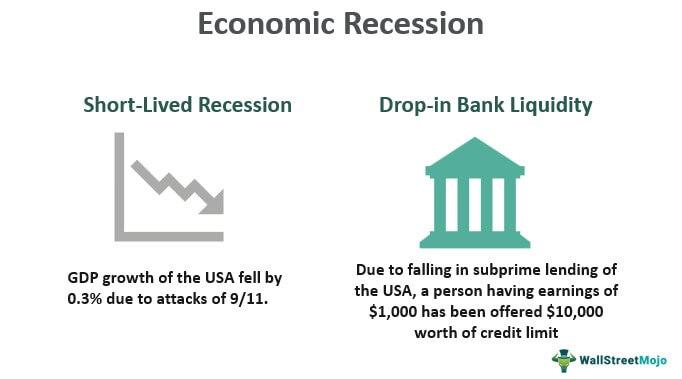

A recession is a fundamental concept in understanding the economic health of nations and the cyclical nature of economies. It is generally characterized by a decline in gross domestic product (GDP) over two or more consecutive quarters, but its effects extend beyond this technical definition. Recessions influence societies by impacting key economic drivers such as employment levels, investment activities, and overall financial stability. A downturn in economic activity, during a recession, often results in increased unemployment, reduced consumer spending, and lower industrial production, which, in turn, affects the standards of living and economic growth prospects.

Recessions hold significant implications for both microeconomic and macroeconomic paradigms. Policymakers, economists, and businesses closely monitor economic indicators to predict and respond to these downturns effectively. Understanding the multifaceted implications and drivers of recessions allows societies to develop strategic responses to mitigate adverse consequences.

This article investigates into the definition and causes of economic recessions, citing major historical examples that illustrate their impacts and evolution. It also explores modern elements such as algorithmic trading that influence financial markets during these turbulent periods, highlighting their dual capacity to stabilize and destabilize economies. The objective is to provide a comprehensive understanding of economic recessions, enabling informed decision-making and forecasting to cushion economies against future recessions.

## Table of Contents

## What is an Economic Recession?

An economic recession is characterized by a significant decline in economic activity that lasts for an extended period, typically visible in real GDP, real income, employment, industrial production, and wholesale-retail sales. The technical definition of a recession is two consecutive quarters of negative GDP growth. However, this definition, while widely used, does not capture every nuance of what makes up a recession.

When assessing the broader economic performance, employment and industrial productivity are also crucial indicators. During a recession, employment rates typically fall due to lower demand for goods and services, resulting in layoffs and heightened unemployment. Industrial productivity often declines as businesses reduce production in response to decreasing consumer demand and tightening access to financing.

Recessions can have prolonged and widespread impacts on economies. They can lead to long-term decreases in personal wealth, adversely affect national and global markets, and increase poverty levels. Notably, recessions are often triggered by a complex interplay of factors, with financial disruptions being a substantial driving force. For instance, a financial crisis, such as a collapse in housing markets or banking systems, can swiftly lead to a recession through tightening credit and reduced consumer spending.

Geopolitical factors, such as significant political instability or trade deficits, also play essential roles in inducing economic slowdowns. Additionally, policy decisions, particularly regarding fiscal and monetary policies, can either mitigate or exacerbate the depth and duration of a recession. Poorly timed policy changes or mismanagement during economic contraction phases can lead to decreased consumer confidence and further economic deterioration.

Overall, while the technical definition of a recession as two consecutive quarters of GDP decline holds a fundamental place in economic discourse, the total impact of a recession is measured through a more comprehensive set of indicators. Understanding these indicators is critical for policymakers and investors who need to navigate and mitigate the effects of economic downturns.

## Causes of Economic Recession

Economic recessions stem from various interconnected factors that disrupt the balance of national and global economies. One primary cause is financial market instability. This can arise from speculative bubbles in markets such as real estate or stocks, which, when burst, result in a rapid loss of wealth and subsequent economic contraction. The Great Recession, for instance, was largely triggered by the bursting of the housing bubble, leading to widespread financial turmoil.

Declining consumer confidence is another critical [factor](/wiki/factor-investing). When individuals predict economic downturns, they often reduce spending. Since consumer expenditure constitutes a substantial part of Gross Domestic Product (GDP) in many economies, a decrease in spending can severely affect economic growth. The resulting decrease in demand prompts businesses to scale back production, leading to layoffs and further reducing consumer spending in a downward spiral.

External economic shocks also play a crucial role. Events such as natural disasters, geopolitical tensions, or sudden changes in oil prices can disrupt economic stability. For instance, an oil price spike can increase production costs across various sectors, leading to inflationary pressures and reduced consumer spending. 

Fiscal and monetary policies significantly influence the onset and depth of recessions. Missteps in these policies, such as excessive monetary tightening or lax fiscal regulation, can exacerbate economic downturns. For instance, if central banks raise interest rates too abruptly, borrowing costs increase, which can curtail investment and consumer spending. Conversely, insufficient fiscal stimuli can result in prolonged recovery periods.

Global events like pandemics are potent recession catalysts. The COVID-19 pandemic exemplified how widespread health crises can lead to simultaneous supply and demand shocks. On the supply side, lockdowns disrupt production and supply chains, while on the demand side, fear and uncertainty curb consumer spending and business investments. 

In summary, economic recessions are complex phenomena usually resulting from an interplay of various factors including financial instability, decreased consumer confidence, external shocks, and policy decisions. Understanding these causes is essential for developing effective measures to prevent or mitigate future recessions.

## Historical Examples of Recessions

The Great Depression, spanning from 1929 to 1939, stands as a prominent example of a global economic downturn that severely impacted various economies worldwide. This recession was marked by a catastrophic decline in economic activity, with unemployment rates soaring as high as 25% in the United States, and industrial production plummeting by approximately 46%[1]. The stock market crash of October 1929, often cited as a principal trigger, led to a profound crisis of confidence among businesses and consumers, resulting in significant reductions in spending and investment.

Moving forward in history, the Great Recession, which officially took place from 2007 to 2009, was heavily influenced by the collapse of the housing market in the United States. The rapid increase in housing prices, fueled by subprime mortgage lending and risky financial products, culminated in a housing bubble burst. The resultant fallout saw major financial institutions collapsing or requiring government bailouts, leading to widespread panic and a sharp contraction in consumer wealth and spending. This recession had a global impact, causing a substantial decline in international trade, and severely affecting economies across Europe and other parts of the world[2].

In recent history, the COVID-19 pandemic recession of 2020 presented another distinct case of economic downturn. Triggered by global health concerns and ensuing lockdown measures, this recession saw unprecedented disruptions in global supply chains and labor markets. The abrupt halt in economic activity led to one of the fastest onset recessions in history, with the International Monetary Fund (IMF) noting a contraction in global GDP by approximately 3% in 2020[3]. Despite the unique trigger—an abrupt health crisis—the economic impacts mirrored those of previous recessions with significant job losses and declines in industrial output observed worldwide.

While each of these recessions was precipitated by unique circumstances, they shared common consequences such as heightened unemployment and reduced industrial activity. These historical examples provide crucial insights into the complexities of economic recessions and underscore the importance of effective policy measures to mitigate their impacts.

### References
1. Kindleberger, C. P., & Aliber, R. Z. (2011). Manias, Panics, and Crashes: A History of Financial Crises. Palgrave Macmillan.
2. Reinhart, C. M., & Rogoff, K. S. (2009). This Time is Different: Eight Centuries of Financial Folly. Princeton University Press.
3. International Monetary Fund [IMF]. (2020). World Economic Outlook, April 2020: The Great Lockdown. 

## Algorithmic Trading and Recession

Algorithmic trading employs sophisticated computer algorithms to execute trading decisions according to predefined criteria. The advent of this technology has transformed the financial markets, enhancing the speed and efficiency of trading processes. During economic recessions, [algorithmic trading](/wiki/algorithmic-trading) presents a double-edged sword—capable of both stabilizing and destabilizing markets based on the strategies employed.

Markets experiencing economic downturns often exhibit increased [volatility](/wiki/volatility-trading-strategies), characterized by rapid price fluctuations and uncertainty. This volatility challenges traditional trading but creates opportunities for algorithmic traders who adapt swiftly to changing conditions. Algorithms can help stabilize markets by providing [liquidity](/wiki/liquidity-risk-premium), reducing bid-ask spreads, and facilitating efficient price discovery. For instance, market-making algorithms can continuously offer buy and sell quotes, ensuring smoother transactions even during heightened market stress.

However, the same algorithms can exacerbate market instability if not properly managed. High-frequency trading ([HFT](/wiki/high-frequency-trading-strategies)) strategies, which involve executing a large number of orders at incredibly fast speeds, can increase volatility by amplifying price movements. These strategies, if based on flawed assumptions or reacting to erroneous signals, contribute to "flash crashes"—sudden, drastic stock price drops followed by quick recoveries. Such events underline the need for stringent oversight and refined algorithmic strategies, as poorly designed algorithms can trigger self-reinforcing cycles of buying or selling.

Algorithm adjustments are crucial in risk management during recessions. Dynamic algorithms that incorporate [machine learning](/wiki/machine-learning) models or adaptive strategies can better respond to evolving market conditions. For example, an algorithm designed to adjust its risk exposure based on real-time volatility measures—such as the VIX (Volatility Index)—can mitigate losses and optimize returns even amidst economic turmoil.

In summary, while algorithmic trading offers tools for managing the complexities of recession-impacted markets, it also raises significant challenges. Balancing innovation in trading technology with robust regulatory frameworks and strategic foresight is imperative to leverage algorithmic trading's potential while safeguarding financial market stability during economic downturns.

## Conclusion

Understanding economic recessions is critical for formulating effective policies aimed at minimizing their detrimental effects. Lessons from past economic downturns provide valuable insights into the mechanisms of recession dynamics, emphasizing the importance of adaptive and proactive strategies. Historical data illustrates how different economic policies and interventions have either alleviated or exacerbated recessionary impacts, forming a foundation for future policy-making.

The integration of technological advancements, particularly in algorithmic trading, plays a crucial role in contemporary economic management. Algorithmic trading's systematic and quantitative nature allows for more precise market interventions, potentially mitigating abrupt market fluctuations common during recessions. The ability to execute high-frequency trades and utilize predictive analytics helps stabilize markets by managing financial risks more effectively.

Continued research and adaptation in economic strategies are essential to fortify economies against the adverse consequences of recessions. Economists and policymakers must remain vigilant, continuously assessing economic indicators and market conditions to adjust strategies accordingly. This vigilance ensures that economic policies remain effective and relevant amid changing global dynamics and unforeseen shocks.

In summary, a comprehensive understanding of economic recessions, bolstered by historical perspectives and modern trading technologies, is indispensable for navigating and mitigating future economic downturns. This approach not only safeguards economic stability but also fosters resilience, allowing societies to better withstand the challenges posed by recessions.

## References & Further Reading

[1]: Kindleberger, C. P., & Aliber, R. Z. (2011). ["Manias, Panics, and Crashes: A History of Financial Crises"](https://link.springer.com/book/10.1057/9780230628045). Palgrave Macmillan.

[2]: Reinhart, C. M., & Rogoff, K. S. (2009). ["This Time is Different: Eight Centuries of Financial Folly"](https://www.nber.org/system/files/working_papers/w13882/w13882.pdf). Princeton University Press.

[3]: International Monetary Fund [IMF]. (2020). ["World Economic Outlook, April 2020: The Great Lockdown"](https://www.imf.org/en/Publications/WEO/Issues/2020/04/14/weo-april-2020).

[4]: Jansen, S. (2020). ["Machine Learning for Algorithmic Trading: Predictive models to extract signals from market and alternative data for systematic trading strategies with Python"](https://github.com/stefan-jansen/machine-learning-for-trading). Packt Publishing.

[5]: Chan, E. P. (2008). ["Quantitative Trading: How to Build Your Own Algorithmic Trading Business"](https://github.com/ftvision/quant_trading_echan_book). John Wiley & Sons.

[6]: Aronson, D. R. (2006). ["Evidence-Based Technical Analysis: Applying the Scientific Method and Statistical Inference to Trading Signals"](https://www.amazon.com/Evidence-Based-Technical-Analysis-Scientific-Statistical/dp/0470008741). Wiley.