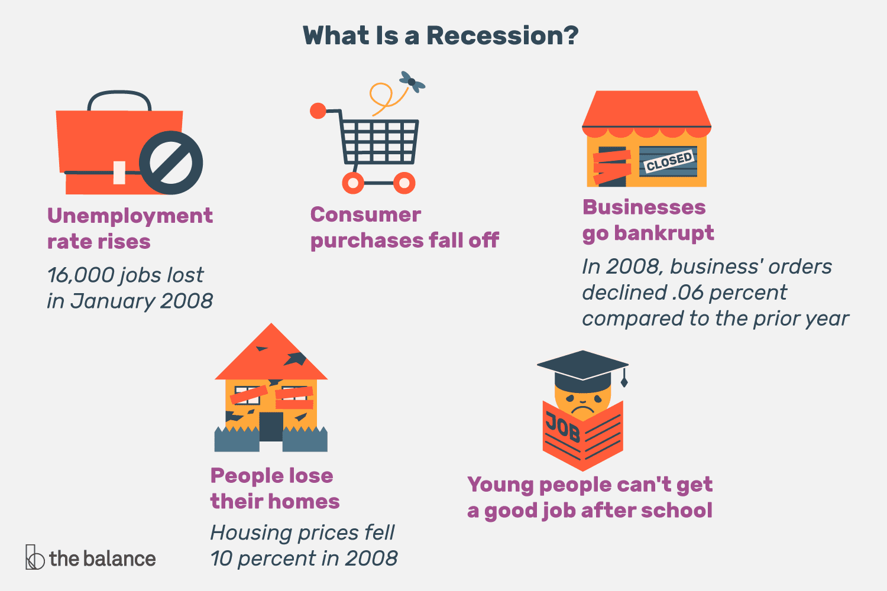

## Table of Contents

## What is an economic recession?

An economic recession is when a country's economy gets smaller for a while. It usually happens when people buy less stuff, businesses make less money, and more people lose their jobs. A common way to know if there's a recession is when the economy shrinks for two quarters in a row, which means six months.

During a recession, it can be hard for people because they might not have as much money. Prices can go up, and it's tougher to find a job. Governments and banks often try to help by lowering interest rates or giving out money to keep the economy going. Recessions don't last forever, and eventually, the economy starts to grow again.

## What are the common causes of an economic recession?

Economic recessions can happen for many reasons. One big reason is when people and businesses start to feel unsure about the future. If they think things might get worse, they might spend less money and save more. This can slow down the economy because businesses make less money when people aren't buying things. Another reason is when there's a big problem in an important part of the economy, like housing or banking. If a lot of people can't pay their loans, banks can lose a lot of money, and this can spread to other parts of the economy.

Sometimes, recessions can start in one country and then spread to others. This can happen because countries trade with each other a lot. If one country's economy slows down, it can affect the economies of the countries it trades with. Also, if the government or central bank makes bad decisions, like raising interest rates too high, it can make borrowing money more expensive. This can slow down spending and investment, leading to a recession.

In some cases, natural disasters or big changes in the world, like a war or a health crisis, can cause a recession. These events can disrupt businesses and supply chains, making it hard for the economy to keep going as usual. Governments and central banks try to prevent or lessen the impact of recessions by using different tools, like changing interest rates or spending more money, but sometimes these problems are too big to stop a recession from happening.

## How is a recession officially defined and measured?

A recession is officially defined by many economists as a period when the economy shrinks for two quarters in a row. This means that for six months, the total value of all goods and services produced in a country, known as the Gross Domestic Product (GDP), goes down instead of growing. In the United States, the National Bureau of Economic Research (NBER) is the group that officially says when a recession starts and ends. They look at more than just GDP; they also check things like how many people have jobs, how much people are spending, and how much businesses are making.

To measure a recession, economists look at a lot of different numbers. The most important one is GDP, which they calculate every three months. If GDP goes down for two quarters in a row, it's a strong sign that a recession is happening. But they also look at other things, like the unemployment rate, which goes up during a recession because more people lose their jobs. They also watch how much people are spending, because when people spend less, it can mean the economy is slowing down. By putting all these pieces of information together, economists can tell if the economy is in a recession or not.

## Can you explain the business cycle and its relation to recessions?

The business cycle is like a roller coaster for the economy. It goes up and down over time, showing how the economy grows and shrinks. There are four main parts to the business cycle: expansion, peak, contraction, and trough. During an expansion, the economy is growing. More people have jobs, businesses make more money, and people spend more. This growth keeps going until it reaches a peak, which is the highest point of the cycle. After the peak, the economy starts to slow down and goes into a contraction. This is when things can get tough, with fewer jobs and less spending. The contraction keeps going until it hits a trough, which is the lowest point of the cycle. Then, the economy starts to grow again, and the cycle begins all over.

Recessions are a part of the business cycle, happening during the contraction phase. When the economy shrinks for a while, usually for at least two quarters, that's called a recession. It's like the economy taking a big dip on the roller coaster. During a recession, businesses might make less money, more people might lose their jobs, and people might spend less because they're worried about the future. But after a recession, the economy usually starts to recover and go back into an expansion. Understanding the business cycle helps people and governments see when a recession might be coming and plan for it, so they can try to make things better when the economy is down.

## What role do interest rates play in causing or mitigating a recession?

Interest rates are like the price of borrowing money. When they are high, it costs more for people and businesses to borrow. This can slow down the economy because people might not want to take out loans to buy things like houses or cars, and businesses might not want to borrow money to grow. If the economy is already slowing down, high interest rates can make things worse and even push it into a recession. For example, if people can't afford to buy homes because loans are too expensive, the housing market can slow down, which can affect other parts of the economy too.

On the other hand, when interest rates are low, borrowing money is cheaper. This can help the economy grow because more people and businesses might take out loans. If the economy is in a recession, lowering interest rates can help it recover by encouraging spending and investment. Central banks, like the Federal Reserve in the United States, often lower interest rates during a recession to try to get the economy moving again. By making it cheaper to borrow, they hope to boost spending and help businesses grow, which can pull the economy out of a recession.

## How do consumer confidence and spending impact the onset of a recession?

Consumer confidence is how people feel about the economy and their own money. If people feel good about their jobs and the future, they are more likely to spend money on things they want or need. This spending helps the economy grow because businesses make more money when people buy their products. But if people start to feel worried about losing their jobs or think the economy might get worse, they might spend less and save more money instead. When a lot of people start to spend less, it can slow down the economy, and if it slows down enough, it can lead to a recession.

When consumer spending goes down, it can have a big effect on the economy. Businesses make less money when people aren't buying as much, and they might have to cut jobs or close down. This can make even more people worried about the future, so they spend even less, creating a cycle that can push the economy into a recession. Governments and central banks often try to boost consumer confidence by doing things like lowering interest rates or giving people money to spend. If they can get people to feel more confident and start spending again, it can help stop a recession from happening or make it less bad.

## What are some historical examples of economic recessions?

One famous recession happened in the United States in the early 1980s. It started in July 1981 and lasted until November 1982. This recession was tough because a lot of people lost their jobs, and it was hard for businesses. The main reason for this recession was that the government raised interest rates a lot to try to stop inflation, which is when prices go up too fast. When interest rates went up, it made borrowing money more expensive, so people bought fewer things like houses and cars. This slowed down the economy a lot and led to the recession.

Another big recession happened around the world in 2007-2009, and it's often called the Great Recession. It started in the United States because of problems in the housing market. A lot of people had taken out loans they couldn't pay back, and when they couldn't pay, banks lost a lot of money. This problem spread to other countries because economies are connected through trade and finance. Many people lost their jobs, and it took a long time for the economy to get better. Governments and central banks around the world had to work hard to help the economy recover by lowering interest rates and spending more money.

There was also a recession in the early 1990s in many countries, including the United States and parts of Europe. It started in July 1990 and ended in March 1991 in the U.S. This recession was caused by a mix of things, like high interest rates, problems in the savings and loan industry, and the Gulf War, which made people feel unsure about the future. During this time, unemployment went up, and people spent less money. It was a tough time, but the economy started to grow again after a while.

## How do government policies and interventions affect recessions?

Government policies and interventions can play a big role in how bad a recession gets and how fast the economy recovers. When a recession starts, governments often try to help by spending more money on things like building roads or helping people who lost their jobs. This spending can create jobs and make people feel more confident about the future, which can encourage them to spend more money. Governments might also cut taxes so that people and businesses have more money to spend. By doing these things, governments hope to boost the economy and stop the recession from getting worse.

Central banks, which are part of the government, also have tools to fight recessions. One of the main things they do is change interest rates. When the economy is in a recession, central banks often lower interest rates to make borrowing money cheaper. This can help people buy things like houses and cars, and it can help businesses grow. Sometimes, central banks also buy bonds to put more money into the economy, a process called quantitative easing. All these actions are meant to help the economy get back on track and recover from a recession faster.

## What is the difference between a recession and a depression?

A recession and a depression are both times when the economy gets smaller, but a depression is much worse and lasts a lot longer. A recession is when the economy shrinks for at least two quarters in a row, which means six months. During a recession, people might lose their jobs, and businesses might make less money, but it usually doesn't last too long, and the economy starts to grow again after a while. On the other hand, a depression is a really deep and long-lasting downturn in the economy. It can last for years, and it's much harder for people and businesses because a lot more people lose their jobs, and it's very tough to find work.

The Great Depression in the 1930s is a famous example of a depression. It started in the United States but affected many countries around the world. It lasted for about ten years, from 1929 to 1939, and during that time, many people lost their jobs, businesses went bankrupt, and people had a hard time just getting by. Governments and central banks today use different tools and policies to try to stop a recession from turning into a depression. They might spend more money, cut taxes, or lower interest rates to help the economy recover faster and avoid the kind of deep, long-lasting problems that happen during a depression.

## How do global economic factors contribute to national recessions?

Global economic factors can make a country's economy go into a recession. When countries trade a lot with each other, problems in one country's economy can spread to others. For example, if a big country like the United States goes into a recession, it might buy fewer things from other countries. This can hurt those countries' economies because they make less money from their exports. Also, if there's a big problem in the world, like a financial crisis or a health crisis, it can affect many countries at the same time. If people around the world start to spend less money because they're worried, it can slow down the whole global economy, making it harder for any single country to avoid a recession.

Another way global factors can lead to a national recession is through financial markets. Banks and businesses in different countries are often connected. If a bank in one country gets into trouble, it can make banks in other countries worried, and they might stop lending money as much. This can make it harder for businesses to grow and for people to borrow money, which can slow down the economy. Governments and central banks around the world try to work together to stop these problems from spreading too far. They might lower interest rates or help banks that are in trouble, but sometimes these global issues are too big to stop a recession from happening in one country.

## What are the long-term effects of a recession on an economy?

A recession can have big effects on an economy that last a long time. When a recession happens, a lot of people lose their jobs and businesses make less money. This can make people feel unsure about the future, so they might spend less money even after the recession is over. This can slow down the economy for a while. Also, if a lot of businesses go bankrupt during a recession, it can take a long time for new businesses to start up and grow. This means fewer jobs and less money being made in the economy.

Another long-term effect is that governments might have to spend a lot of money to help the economy during a recession. They might spend money on things like helping people who lost their jobs or giving money to businesses. This can mean the government has less money to spend on other things like schools or roads. Also, if the government borrows a lot of money to help the economy, it might have to pay back that money later, which can make taxes go up or make it harder for the government to spend money on new things. So, a recession can affect an economy for many years after it's over.

## What advanced economic indicators should experts monitor to predict and manage recessions?

Experts should keep an eye on a few important economic indicators to predict and manage recessions. One key indicator is the yield curve, which shows the difference between short-term and long-term interest rates. When the yield curve inverts, meaning short-term rates are higher than long-term rates, it often signals that a recession might be coming. Another important thing to watch is the unemployment rate. If it starts to go up quickly, it can mean the economy is slowing down and a recession could be on the way. Also, experts should look at the Purchasing Managers' Index (PMI), which tells how much new business factories and service companies are getting. If the PMI starts to drop, it can be a sign that the economy is weakening.

Other indicators that can help predict a recession include consumer confidence and retail sales. If people start to feel less confident about their money and the economy, they might spend less, which can slow things down. Retail sales numbers can show if people are buying less stuff, which is another sign of a slowing economy. Finally, experts should watch the housing market. If fewer people are buying homes and home prices start to fall, it can mean the economy is heading into a recession. By keeping an eye on all these indicators, experts can get a good idea of when a recession might happen and take steps to manage it.

## References & Further Reading

[1]: Kindleberger, C. P., & Aliber, R. Z. (2011). ["Manias, Panics, and Crashes: A History of Financial Crises"](https://link.springer.com/book/10.1057/9780230628045). Palgrave Macmillan.

[2]: Reinhart, C. M., & Rogoff, K. S. (2009). ["This Time is Different: Eight Centuries of Financial Folly"](https://www.nber.org/system/files/working_papers/w13882/w13882.pdf). Princeton University Press.

[3]: International Monetary Fund [IMF]. (2020). ["World Economic Outlook, April 2020: The Great Lockdown"](https://www.imf.org/en/Publications/WEO/Issues/2020/04/14/weo-april-2020).

[4]: Jansen, S. (2020). ["Machine Learning for Algorithmic Trading: Predictive models to extract signals from market and alternative data for systematic trading strategies with Python"](https://github.com/stefan-jansen/machine-learning-for-trading). Packt Publishing.

[5]: Chan, E. P. (2008). ["Quantitative Trading: How to Build Your Own Algorithmic Trading Business"](https://github.com/ftvision/quant_trading_echan_book). John Wiley & Sons.

[6]: Aronson, D. R. (2006). ["Evidence-Based Technical Analysis: Applying the Scientific Method and Statistical Inference to Trading Signals"](https://www.amazon.com/Evidence-Based-Technical-Analysis-Scientific-Statistical/dp/0470008741). Wiley.