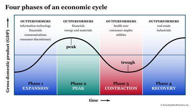

## Table of Contents

## What is an economic recession?

An economic recession is a time when a country's economy is not doing well. It happens when the economy shrinks for a while, usually for six months or more. During a recession, people might lose their jobs, businesses might make less money, and it can be harder for people to buy things they want or need.

Recessions can start for many reasons, like when people stop spending money, or when big companies fail. Governments and banks try to help by lowering interest rates or giving money to businesses. But it can take a long time for things to get better. During this time, people often feel worried about money and the future.

## What are the common causes of economic recessions?

Economic recessions can happen for many reasons. One big reason is when people and businesses stop spending money. When people are worried about the future, they might save their money instead of buying things. This can make businesses sell less, so they might have to lay off workers or even close down. When people lose their jobs, they spend even less money, and the cycle keeps going.

Another cause can be big problems in important parts of the economy, like the housing market or the financial system. For example, if house prices fall a lot, people might owe more on their mortgages than their homes are worth. This can lead to banks losing money and being less willing to lend. If banks stop lending, businesses can't borrow money to grow or even stay open, which can lead to a recession.

Sometimes, events outside of a country can cause a recession too. Things like wars, big changes in oil prices, or global health crises can shake up the world economy. When these things happen, countries might trade less with each other, and businesses might struggle to get the things they need to make their products. All of these problems can add up and push an economy into a recession.

## How do economic recessions affect everyday people?

Economic recessions can make life harder for everyday people. When a recession happens, many people might lose their jobs or have their hours cut at work. This means they have less money to spend on things they need, like food, rent, or healthcare. Families might have to make tough choices, like deciding whether to pay for their home or buy groceries. It can be really stressful and scary, especially if people don't know when things will get better.

Also, during a recession, prices might go up for some things while wages stay the same or even go down. This makes it harder for people to afford the things they used to buy easily. People might have to cut back on fun things like going out to eat or taking vacations. They might also have to dip into their savings or borrow money, which can be risky. Overall, a recession can make people feel worried about their future and their money.

## What are some immediate negative impacts of a recession?

When a recession hits, one of the first things people notice is that it's harder to find or keep a job. Companies start to lay off workers or cut back on hours because they're not making as much money. This means more people are out of work and looking for jobs, but there are fewer jobs available. Losing a job can be really scary and stressful, especially if it happens suddenly. Families might struggle to pay their bills and might have to use up their savings or borrow money to get by.

Another quick impact of a recession is that people start to spend less money. When people are worried about losing their jobs or not having enough money, they cut back on buying things they don't really need. This can hurt businesses, especially small ones, because they rely on people spending money to stay open. As businesses struggle, they might have to raise prices on the things they sell, which makes it even harder for people to afford what they need. All of this can make people feel more worried and unsure about the future.

## Can a recession have any positive effects on the economy?

Even though recessions can be tough, they can sometimes lead to good changes in the economy. One way they can help is by making companies more efficient. When businesses are struggling, they often look for ways to save money and do things better. This can mean they find new ways to work or use new technology that makes them stronger in the long run. Also, during a recession, prices for things like houses or cars might go down. This can make it easier for some people to buy things they couldn't afford before.

Another positive effect of a recession is that it can lead to new businesses starting up. When big companies have to lay off workers, those workers might decide to start their own businesses. These new businesses can bring fresh ideas and new jobs to the economy. Recessions can also make the government and banks take a closer look at how they do things. They might change rules or start new programs to help the economy recover faster and be more stable in the future. Even though it might not feel like it at the time, these changes can make things better in the long run.

## What historical examples show positive outcomes from recessions?

One good example of a positive outcome from a recession is the Great Depression in the 1930s. It was a really tough time, but it led to big changes in the United States. The government started programs like Social Security to help people who lost their jobs or couldn't work anymore. They also made new rules for banks to make sure they were safer. These changes helped a lot of people and made the economy stronger over time.

Another example is the recession in the early 2000s. It was hard for many people, but it also pushed companies to find new ways to do business. A lot of businesses started using the internet more and came up with new technology that changed how we work and shop. This helped the economy grow again and created new jobs in areas like tech and online services. Even though the recession was tough, it led to some good things that we still see today.

## How can businesses benefit from a recession?

During a recession, businesses might find ways to become more efficient. When money is tight, companies often look for ways to save money and work better. They might use new technology or find smarter ways to do their jobs. This can make the business stronger and ready for when the economy gets better. Even though it's hard at the time, the changes they make can help them in the long run.

Another way businesses can benefit from a recession is by finding new opportunities. When big companies struggle, smaller businesses might have a chance to grow. People who lose their jobs might start their own businesses, bringing fresh ideas and new products to the market. This can lead to more competition and innovation, which is good for the economy. So, even though a recession is tough, it can open doors for new businesses and new ways of doing things.

## What opportunities arise for individuals during a recession?

During a recession, individuals might find new opportunities that they wouldn't have thought about before. When big companies lay off workers, some people might decide to start their own businesses. This can be a chance to follow a dream or try something new. Starting a business during a recession can be tough, but it can also be rewarding. People might find that there are new needs in the market that they can fill with their ideas and hard work.

Another opportunity that comes up during a recession is the chance to learn new skills. When people lose their jobs, they might go back to school or take classes to learn something new. This can help them find a better job when the economy gets better. Learning new skills can also make people feel more confident and ready for the future. Even though a recession is hard, it can be a time to grow and prepare for better days ahead.

## How do recessions influence long-term economic policy?

Recessions can make big changes in how governments and banks handle the economy in the long run. When a recession happens, leaders see what didn't work and try to fix it. They might make new rules for banks to stop them from taking too many risks. They could also start programs to help people who lose their jobs or can't afford healthcare. These changes are meant to make the economy stronger and stop big problems from happening again.

Another way recessions change long-term policy is by making governments spend more on things like education and job training. They know that when people have better skills, they can find better jobs and help the economy grow. So, they might put more money into schools and programs that teach new skills. This can help the country be ready for the next recession and make sure people are not as hurt by it. Even though recessions are hard, they can lead to better policies that help everyone in the long run.

## What role does government intervention play in mitigating and leveraging recessions?

When a recession hits, the government steps in to help make things better. They might lower interest rates so it's easier for people and businesses to borrow money. This can help businesses keep going and people keep spending. The government might also give money to people who lost their jobs or start programs to help them find new work. These steps can help stop the recession from getting worse and help the economy start growing again.

Governments also use recessions as a chance to make the economy stronger in the long run. They might change rules for banks to make sure they don't take big risks that could hurt everyone. They could also spend more on schools and job training so people have the skills they need to find good jobs. These changes can help the country be ready for the next recession and make sure people are not as hurt by it. Even though recessions are tough, the government's actions can help make things better for everyone in the future.

## How can technological advancements be spurred by economic downturns?

Economic downturns can push companies to use technology in new ways. When businesses are struggling, they look for ways to save money and do things better. They might start using new tools or computer programs to make their work easier and faster. This can lead to big changes in how they do business. For example, during the early 2000s recession, many companies started using the internet more. This helped them reach more customers and sell things online, which made their businesses stronger.

These changes can also help the whole economy. When companies use new technology, they often need people with special skills to help them. This can lead to new jobs in areas like tech and software. People might go back to school or take classes to learn these new skills. Even though a recession is hard, it can make businesses and the economy more ready for the future. The new ways of doing things can help the economy grow again and be stronger than before.

## What are the expert strategies for capitalizing on the positive aspects of a recession?

One way to make the most of a recession is to learn new skills. When times are tough, people might lose their jobs, but this can be a chance to go back to school or take classes. Learning new things can help someone find a better job when the economy gets better. It can also make them feel more ready for the future. So, even though losing a job is hard, it can be a good time to grow and prepare for better days.

Another way to use a recession to your advantage is to start a new business. When big companies are struggling, there might be new needs in the market that a small business can fill. People who start their own businesses during a recession can bring fresh ideas and new products to people. This can lead to more competition and new ways of doing things, which is good for the economy. Even though it's tough to start a business during a recession, it can be a chance to follow a dream and make a difference.

## References & Further Reading

[1]: Bergstra, J., Bardenet, R., Bengio, Y., & Kégl, B. (2011). ["Algorithms for Hyper-Parameter Optimization."](https://dl.acm.org/doi/10.5555/2986459.2986743) Advances in Neural Information Processing Systems 24.

[2]: ["Advances in Financial Machine Learning"](https://www.amazon.com/Advances-Financial-Machine-Learning-Marcos/dp/1119482089) by Marcos Lopez de Prado

[3]: ["Evidence-Based Technical Analysis: Applying the Scientific Method and Statistical Inference to Trading Signals"](https://www.amazon.com/Evidence-Based-Technical-Analysis-Scientific-Statistical/dp/0470008741) by David Aronson

[4]: ["Machine Learning for Algorithmic Trading"](https://github.com/stefan-jansen/machine-learning-for-trading) by Stefan Jansen

[5]: ["Quantitative Trading: How to Build Your Own Algorithmic Trading Business"](https://www.amazon.com/Quantitative-Trading-Build-Algorithmic-Business/dp/1119800064) by Ernest P. Chan