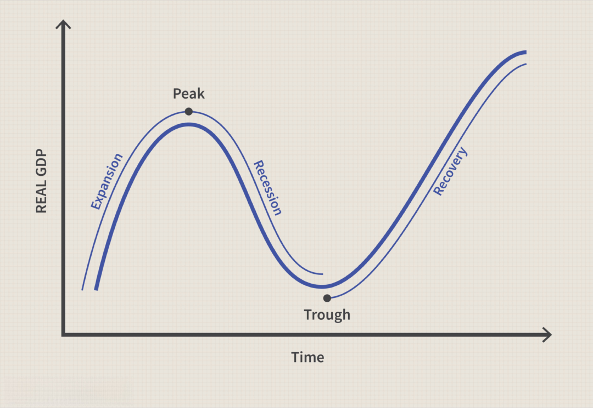

Economic recessions are periods characterized by a significant decline in economic activity across markets, typically lasting more than a few months. The indicators of a recession often include a decrease in GDP, falling incomes, a reduction in retail sales, and increasing unemployment rates. Historically, recessions have been associated with adverse outcomes such as widespread job losses, business closures, and financial instability, leading to their negative connotations. These downturns can trigger a cascade of hardships, affecting both households and businesses as they struggle to navigate the challenging economic environment.

Traditionally, recessions are viewed as periods of economic contraction that severely impact economies and workforce dynamics. Businesses often face plummeting demand, forcing them to cut costs by laying off employees or shutting down entirely. This leads to an increase in unemployment, further reducing consumer spending and perpetuating the economic decline. The psychological impact on the workforce and companies can be profound, as uncertainty and insecurity become prevailing sentiments.



Despite these challenges, recessions are not without their potential positive outcomes. When examined through the paradigm of algorithmic trading, recessions can offer unique opportunities. Algorithmic trading, which involves the use of computer programs to execute trades at high speed and volume, thrives on market fluctuations. Recessions, characterized by high volatility, present a fertile ground for algorithmic trading strategies. These strategies can capitalize on rapid price changes, allowing traders to potentially reap significant gains even during economic downturns.

This article will explore both the challenges and opportunities presented by economic recessions. Starting with an analysis of what constitutes a recession and its typical impacts, the discussion will lead into the dual nature of these periods. On one hand, recessions pose significant risks to economies and jobs, traditionally leading to negative outcomes. On the other hand, they can act as catalysts for innovation, investment opportunities, and market efficiency improvements.

Algorithmic trading's role during recessions will be a focal point, highlighting how advancements in technology and trading strategies can transform challenges into opportunities. The article will also investigate the efficacy of various algorithmic strategies, outlining their potential in mitigating risks and exploiting market inefficiencies. By examining specific cases and analyzing potential risks associated with these strategies, the aim is to provide a balanced perspective on the potential of algorithmic trading during economic downturns. Thus, by embracing both the challenges and opportunities of recessions, the adoption of innovative technologies like algorithmic trading can contribute to greater economic resilience and recovery.

## Table of Contents

## Understanding Economic Recessions

Economic recessions are significant declines in economic activity across an economy, lasting more than a few months. Traditionally, a recession is identified by observing a decrease in the GDP for two consecutive quarters, although alternative definitions may use different criteria such as changes in employment, industrial production, and other measures of economic activity. Key characteristics of recessions include reduced consumer spending, declining business investments, increasing unemployment rates, and contraction in credit. These indicators collectively signify a slowdown in economic momentum, creating a challenging environment for businesses and individuals alike.

Historically, recessions have occurred periodically and have been triggered by a variety of factors. The Great Depression of the 1930s is perhaps the most significant economic downturn in modern history, marked by widespread unemployment and drastic declines in economic output. More recent examples include the dot-com bubble burst in the early 2000s and the global financial crisis of 2007-2008, both of which had profound and immediate impacts on global markets. The 2007-2008 financial crisis, for instance, was precipitated by a collapse in housing prices and complex financial derivatives, which led to widespread banking failures, a credit crunch, and a subsequent downturn in global economic activity.

Misconceptions about recessions often stem from a lack of understanding of their cyclical nature. Economies naturally experience cycles of expansion and contraction; recessions are a part of this cyclical process. The notion that recessions can be entirely avoided is a misconception. Although governments and central banks can employ monetary and fiscal policies to mitigate the severity of recessions, completely eliminating the cyclical downturns in economies is virtually impossible due to the complex interplay of global markets, consumer behavior, and unforeseen shocks to the economic system.

Thus, acknowledging the cyclical reality of recessions helps frame them not solely as periods of economic hardship but as natural phases in the broader economic cycle that can, in some cases, lead to periods of recovery and growth. Understanding recessions in this context allows for the exploration of potential opportunities that they might present, setting the stage for discussions on how certain sectors, such as [algorithmic trading](/wiki/algorithmic-trading), could leverage these circumstances to foster innovation and resilience.

## Negative Impacts of Recessions

Economic recessions are often associated with a range of negative impacts, predominantly characterized by a downturn in economic activity. A primary consequence of recessions is heightened unemployment rates, as businesses grapple with reduced demand for goods and services. This downturn compels companies to cut costs, often leading to workforce reductions. Historical data show that during the Great Recession of 2007-2009, the U.S. unemployment rate soared from 4.7% in 2007 to 10% in October 2009, exemplifying the profound effect of recessions on employment levels.[^1] 

Additionally, recessions can precipitate business failures, particularly affecting small and medium-sized enterprises (SMEs) that may lack the financial resilience to weather prolonged economic downturns. During a recession, credit becomes less accessible, and consumer spending declines, creating a challenging environment for businesses to maintain operations. According to a report by the National Bureau of Economic Research, nearly 1.8 million businesses in the U.S. ceased operations in 2009 alone, highlighting the severe strain recessions place on businesses.[^2]

Beyond the tangible effects on employment and business viability, recessions also exact a psychological toll. On an individual level, the stress of job loss or income instability can lead to increased anxiety and depression. A study published by the American Psychological Association found that economic downturns were associated with significant psychological distress in affected populations.[^3] The fear of financial insecurity can permeate households, exacerbating mental health issues and reducing overall quality of life.

At the corporate level, recession-induced uncertainty can result in a cautious approach towards investment and expansion. Companies may defer new projects, leading to stagnation in innovation and development. The psychological impact within corporate structures often reflects an increased aversion to risk, as businesses prioritize stability over growth during turbulent times.

Certain sectors are particularly vulnerable to economic recessions. The construction and manufacturing industries typically experience significant disruptions due to their reliance on consumer spending and credit availability. For instance, during the 2007-2009 recession, the construction industry in the United States saw a decline in output by nearly 20%, exacerbating the crisis in housing markets and related financial sectors.[^4] Similarly, the hospitality and retail sectors face severe contractions as consumer confidence wanes, and discretionary spending diminishes.

In summary, the negative impacts of economic recessions are multifaceted, affecting employment, business viability, and psychological well-being. These downturns often hit specific sectors harder, underscoring the cyclical vulnerabilities present in different parts of the economy. Understanding these impacts is crucial for developing robust strategies to mitigate the effects of future recessions.

[^1]: Bureau of Labor Statistics, U.S. Department of Labor, "The Recession of 2007–2009," Monthly Labor Review, April 2012.
[^2]: Haltiwanger, John, et al., "Business Dynamics Statistics Briefing: The Dynamics of Employment Growth," National Bureau of Economic Research, 2013.
[^3]: "Stress in America: The impact of economic stress," American Psychological Association, 2009.
[^4]: "The U.S. Construction Sector: Historical Trends and the Current Outlook," Federal Reserve Bank of St. Louis, 2010.

## Positive Outcomes of Economic Recessions

Economic recessions, although often dreaded due to their immediate negative impacts, can also yield positive outcomes. These counterintuitive benefits manifest as market corrections, new investment opportunities, increased efficiency, innovation, and technological advancement. During recessions, inefficient businesses may either restructure to improve or [exit](/wiki/exit-strategy) the market, leading to a healthier economic landscape.

Market corrections are a notable positive outcome. During economic booms, asset prices can become inflated, resulting in unsustainable market conditions. Recessions precipitate essential corrections, aligning prices more closely with intrinsic values. This correction can create more stable markets in the long run and present investment opportunities, particularly for those with a long-term perspective who can endure short-term [volatility](/wiki/volatility-trading-strategies).

Investment opportunities arise as asset prices decline. Stocks, bonds, and real estate can become more affordable, attracting savvy investors aiming to capitalize on future recovery. This period often witnesses increased mergers and acquisitions as stronger companies absorb weaker competitors at reduced costs, enhancing market efficiency and competitiveness.

Recessions can foster increased business efficiency and innovation. Companies faced with reduced demand and tighter financial constraints must optimize operations to survive. This pressure can drive the adoption of new technologies and innovative practices that streamline processes and reduce costs. For instance, automation and digital transformation often accelerate during downturns as firms seek efficiency gains.

Historical precedent supports the notion that recessions can catalyze technological advances and entrepreneurial ventures. The Great Depression of the 1930s, despite its severe economic hardships, spurred significant innovation. During this period, companies such as Hewlett-Packard were founded, introducing pioneering technological solutions that would shape future industries. Similarly, the recession of the early 2000s saw the rise of tech giants like Google, which capitalized on the growing importance of digital advertising and information technology.

In conclusion, while recessions pose undeniable challenges, they also offer opportunities for market correction, investment, increased efficiency, innovation, and technological advancement. These potential benefits underscore the complex dynamics of economic downturns and the resilience of market economies.

## The Role of Algorithmic Trading During Recessions

Algorithmic trading refers to the use of computer algorithms to automate trading strategies with speed and precision. This method has gained increasing prominence in financial markets due to its ability to process vast amounts of data and execute trades at speeds unattainable by human traders. Algorithmic trading systems operate based on pre-defined criteria such as timing, price, or complex mathematical models, thereby eliminating human emotions from trading decisions and enhancing consistency.

One of the primary advantages of algorithmic trading, particularly during the market volatility induced by recessions, is its capacity for processing and reacting to information rapidly. Recessions often lead to heightened market volatility, characterized by sudden price swings and unpredictable market movements. In such environments, the speed of execution becomes crucial. Algorithmic trading systems can quickly analyze new information, identify trading opportunities, and execute trades before the market can adjust. This capability allows traders to exploit short-lived price dislocations and [arbitrage](/wiki/arbitrage) opportunities that might arise due to market inefficiencies.

Moreover, algorithmic trading enhances risk management during volatile periods. By implementing complex strategies that include stop-loss orders and dynamic hedging, these algorithms can limit potential losses and safeguard profits. For example, a simple code snippet for a stop-loss mechanism in Python could look something like this:

```python
def execute_trade(price):
    stop_loss_threshold = 0.90 * entry_price  # Set stop-loss at 10% below entry price
    if price <= stop_loss_threshold:
        close_position()  # Close position if price falls below the stop-loss threshold
    else:
        monitor_market()  # Continue monitoring if price conditions are met
```

In addition to speed and enhanced risk management, algorithmic trading enables market participants to backtest their strategies against historical data, improving the likelihood of success when applied in live markets. By simulating performance under various market conditions, traders can refine their algorithms to respond optimally to expected scenarios, thus capitalizing on opportunities even in declining markets.

The advancement in technology powering algorithmic trading has further broadened its scope, incorporating [machine learning](/wiki/machine-learning) models that improve prediction accuracy. Such systems learn from historical and real-time data to identify patterns and adjust strategies accordingly, optimizing trading performance during recessionary periods. For instance, a machine learning model might be trained to detect early indicators of market sentiment shifts, allowing the trader to react proactively.

In summary, algorithmic trading provides substantial advantages during economic recessions by expediting trades, enhancing risk management, and leveraging technology to identify market opportunities. As financial markets continue to evolve, the role of algorithmic trading will likely expand, playing a pivotal part in how traders respond to economic downturns.

## Algorithmic Trading Strategies in Recessive Markets

Algorithmic trading has become a pivotal element in financial markets, particularly during recessions when market volatility presents both challenges and opportunities. Understanding the strategies employed by algorithmic traders in these conditions is crucial for maximizing returns and managing risks effectively.

### Effective Algorithmic Trading Strategies

1. **Mean Reversion Strategy:** 
   During recessions, markets often experience sharp movements that are not always indicative of long-term trends. Mean reversion strategies assume that asset prices will revert to their average over time. This involves statistical analysis to identify overbought or oversold conditions. Traders can use indicators such as the Bollinger Bands to implement such strategies. 

   ```python
   import numpy as np
   import pandas as pd
   from ta.volatility import BollingerBands

   def mean_reversion_strategy(prices):
       bb_indicator = BollingerBands(prices.close, window=20, window_dev=2)
       was_below_lower = prices['close'] < bb_indicator.bollinger_lband()
       was_above_upper = prices['close'] > bb_indicator.bollinger_hband()
       return np.where(was_below_lower, 'Buy', np.where(was_above_upper, 'Sell', 'Hold'))
   ```

2. **Trend Following Strategy:**
   Although counterintuitive during recessions, [trend following](/wiki/trend-following) can capture long-lasting price trends due to economic shifts. Algorithms can employ moving averages or [momentum](/wiki/momentum) indicators to detect and exploit emerging trends.

   ```python
   def trend_following_strategy(prices):
       short_window = 40
       long_window = 100

       signals = pd.DataFrame(index=prices.index)
       signals['signal'] = 0.0

       signals['short_mavg'] = prices['close'].rolling(window=short_window, min_periods=1).mean()
       signals['long_mavg'] = prices['close'].rolling(window=long_window, min_periods=1).mean()

       signals['signal'][short_window:] = np.where(signals['short_mavg'][short_window:] > signals['long_mavg'][short_window:], 1.0, 0.0)
       signals['positions'] = signals['signal'].diff()

       return signals
   ```

### Enhanced Risk Management Techniques

Algorithmic trading systems implement advanced risk management techniques to mitigate potential losses during recessions. Key components include:

- **Stop-Loss Orders:** Automatically executed orders that limit an investor's loss on a position in a security. Algorithms dynamically adjust stop-loss levels based on volatility measures.

- **Portfolio Diversification:** Algorithms can manage portfolios with different asset classes, reducing exposure to any single economic sector. 

- **Volatility Control Models:** Algorithms may utilize volatility scaling, which adjusts the trading size in response to volatility changes, thereby stabilizing returns.

### Case Studies of Successful Algorithmic Trading

1. **The 2008 Financial Crisis:** Renaissance Technologies, a notable quantitative hedge fund, reportedly thrived during the 2008 crisis. By leveraging data-driven models, the firm capitalized on pervasive market inefficiencies and volatility.

2. **COVID-19 Recession:** Algorithmic trading firms like Citadel Securities maintained resilience by utilizing high-frequency trading (HFT) strategies, capturing profit from rapid price changes during the early pandemic-related downturn.

In conclusion, while recessions present unique challenges, they also offer significant opportunities for those employing algorithmic trading strategies. By effectively managing risk and leveraging sophisticated algorithms, traders can navigate and even profit from market uncertainties. Investing in technology and strategic development allows market participants to harness the potential of algorithmic trading, turning economic downturns into avenues for growth and innovation.

## Challenges and Risks of Algorithmic Trading in Recessions

Algorithmic trading, despite its numerous advantages, faces distinctive challenges and risks during economic recessions. One concern is the heightened market volatility characteristic of such downturns, which can complicate algorithmic models that depend on historical data patterns. Consequently, strategies that performed well in stable conditions may fail when the market exhibits abnormal fluctuations.

A significant risk is over-optimization or curve-fitting, where algorithms are excessively tailored to past data, reducing their ability to adjust to unexpected market changes. This results in models that perform well during [backtesting](/wiki/backtesting) but poorly in live trading, especially during recessions when market conditions deviate from historical norms. 

Furthermore, the reliance on high-frequency trading ([HFT](/wiki/high-frequency-trading-strategies)) can exacerbate market instability. Algorithms executing trades in microseconds could contribute to flash crashes, as seen in the 2010 Flash Crash, where rapid automated trading led to drastic market swings. Such events highlight the systemic risk posed by large volumes of algorithmic trades occurring simultaneously, which can amplify downward trends in already declining markets.

Ethical and regulatory considerations also pose significant challenges. Algorithmic trading can lead to unfair market advantages through practices like quote stuffing, where a high number of orders is placed and canceled to create confusion among competitors. Regulatory bodies worldwide have implemented rules to curb such practices, but compliance can be complex and costly. Firms must ensure their algorithms adhere to these regulations while maintaining profitability.

To mitigate these risks, robust risk management frameworks must be established. Algorithms should include adaptive strategies that respond to sudden market movements, such as employing dynamic stop-loss orders to limit potential losses. Diversifying algorithmic strategies and incorporating hedging can also reduce exposure to market volatility.

Backtesting remains critical, but models should be stress-tested against extreme scenarios, including those that are unlikely but possible during recessions. This helps identify potential weaknesses in the trading strategy under various market conditions. Incorporating machine learning techniques can further enhance model resilience, allowing algorithms to learn from new data patterns and adjust dynamically.

In addressing regulatory concerns, transparency in algorithmic trading practices is crucial. Firms should maintain comprehensive records of their algorithmic activities and demonstrate compliance with existing regulations. Engaging in dialogues with regulatory authorities can also help preemptively address potential compliance issues.

Algorithmic trading during recessions requires a careful balance of innovation and caution. By addressing the outlined challenges and implementing effective risk mitigation strategies, traders can harness the potential of algorithmic trading while minimizing associated risks.

## Conclusion

Economic recessions present both challenges and opportunities, demonstrating a dual nature that impacts economies globally. Traditionally, recessions are associated with negative outcomes like increased unemployment and business closures. However, they also provide a fertile ground for market corrections and innovation, acting as catalysts for economic efficiency and competitive realignments.

Algorithmic trading has emerged as a transformative force in how markets respond to such downturns. With its capacity to analyze vast datasets and execute trades at unparalleled speed, algorithmic trading can identify investment opportunities even amidst the chaos of a recessed market. This technological approach not only helps stabilize market fluctuations by providing [liquidity](/wiki/liquidity-risk-premium) but also enables traders to strategically navigate volatile conditions with precision and foresight.

Looking ahead, the integration of advanced technologies and innovative practices offers a path to resilience against future economic downturns. By embracing algorithmic methodologies and adaptive technologies, financial entities can enhance both risk management and strategic investment, turning potential downturns into opportunities for growth and development. Thus, the fusion of technology and finance holds the promise of a more robust and adaptable economic landscape.

## References & Further Reading

[1]: Bergstra, J., Bardenet, R., Bengio, Y., & Kégl, B. (2011). ["Algorithms for Hyper-Parameter Optimization."](https://dl.acm.org/doi/10.5555/2986459.2986743) Advances in Neural Information Processing Systems 24.

[2]: ["Advances in Financial Machine Learning"](https://www.amazon.com/Advances-Financial-Machine-Learning-Marcos/dp/1119482089) by Marcos Lopez de Prado

[3]: ["Evidence-Based Technical Analysis: Applying the Scientific Method and Statistical Inference to Trading Signals"](https://www.amazon.com/Evidence-Based-Technical-Analysis-Scientific-Statistical/dp/0470008741) by David Aronson

[4]: ["Machine Learning for Algorithmic Trading"](https://github.com/stefan-jansen/machine-learning-for-trading) by Stefan Jansen

[5]: ["Quantitative Trading: How to Build Your Own Algorithmic Trading Business"](https://www.amazon.com/Quantitative-Trading-Build-Algorithmic-Business/dp/1119800064) by Ernest P. Chan