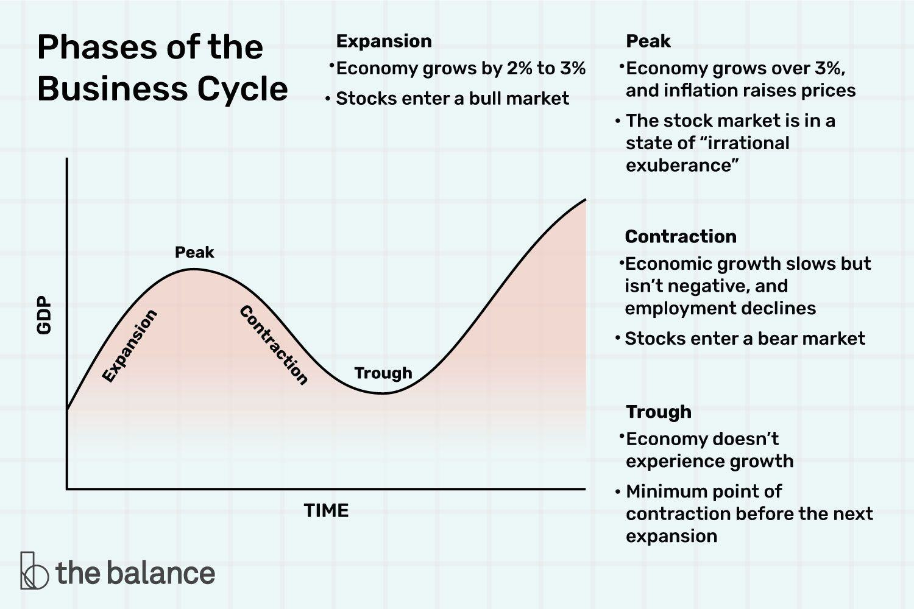

Economic recovery has become a central focus as nations worldwide attempt to rebuild their economies following periods of recession. This concept is essential for understanding how economies rebound and stabilize, driven by a range of economic indicators that signal positive change. Key indicators such as GDP growth, employment rates, consumer confidence, and stock market trends provide insights into an economy's health and its trajectory towards recovery.

In the modern financial landscape, algorithmic trading introduces a new layer of complexity to economic recovery analyses. This sophisticated trading approach leverages algorithms and computer systems to execute trades based on specific criteria, offering the potential to enhance market efficiency and liquidity. By analyzing market data and economic indicators, algorithmic trading can influence and be influenced by the economic recovery process. 



This article will explore the intricacies of economic recovery, placing particular emphasis on the indicators that define it and the impact of algorithmic trading within this context. By examining these elements, we shed light on their collective influence on economic progression, offering a comprehensive understanding that is crucial for policymakers, investors, and businesses navigating post-recession landscapes. Through this exploration, we aim to provide a detailed overview of how economic data interactions and trading strategies are shaping the future of economic stability and growth.

## Table of Contents

## Understanding Economic Recovery

Economic recovery is defined as the phase in which an economy begins to grow following a period of recession. This growth is evidenced by various indicators including increased productivity, higher employment rates, and overall economic expansion. The transition from recession to recovery is crucial as it marks the return to a path of economic health and stability.

During recovery, productivity gains are one of the first indicators of economic improvement. Enhanced productivity typically leads to higher output with the same or fewer inputs, which in turn can stimulate further economic activities. Employment rates are another pivotal factor, as rising employment often leads to increased consumer spending, creating a positive feedback loop that supports continued growth and expansion. Successfully identifying the onset of recovery allows policymakers, investors, and businesses to implement strategies that can consolidate and capitalize on these gains.

Detecting the beginning of recovery, however, is challenging. Various models and statistical methods are employed to accurately pinpoint the turning point from recession to recovery. Economists often monitor diverse economic indicators such as GDP, unemployment rates, and industrial production indexes to assess the economy's trajectory. For example, the Gross Domestic Product (GDP) growth rate is a fundamental measure of economic performance. A consistent increase in GDP signals that the economy is growing, which is a hallmark of recovery.

The speed and trajectory of the recovery process can vary significantly, influenced by underlying economic and policy conditions. Economic policies such as fiscal stimuli, monetary easing, and regulatory adjustments can either accelerate or hinder recovery. Policy frameworks must be adaptable to address emerging challenges and leverage opportunities presented during this phase.

Moreover, the global economic environment and external shocks also play a role in shaping recovery dynamics. For instance, international trade policies, geopolitical developments, and global financial conditions can either support or complicate the path to recovery. Successful economic recovery requires both strategic domestic policies and an understanding of international economic trends to foster sustainable growth.

In conclusion, navigating economic recovery is a complex but essential task for sustaining long-term economic health. By effectively recognizing the start of recovery, decision-makers can implement targeted strategies to consolidate growth, ensure employment increases, and achieve overall economic expansion.

## Key Economic Indicators of Recovery

Economic indicators serve as vital tools for assessing the health and trajectory of an economy, particularly during periods of recovery. These indicators provide critical insights that help both policymakers and investors make informed decisions. Among the most important indicators are Gross Domestic Product (GDP) growth, employment rates, consumer confidence, and stock market trends.

GDP growth is perhaps the most direct measure of economic performance and recovery. This indicator reflects the aggregate value of goods and services produced within a country over a specified period. Positive GDP growth signifies economic expansion and is typically associated with increased production and consumption. Economists and analysts often track quarterly GDP growth rates to gauge the economy's recovery [momentum](/wiki/momentum):

$$

\text{GDP Growth Rate} = \left( \frac{\text{GDP}_{\text{current period}} - \text{GDP}_{\text{previous period}}}{\text{GDP}_{\text{previous period}}} \right) \times 100
$$

Employment rates, including metrics like the unemployment rate and job creation numbers, are another critical class of indicators. High employment levels generally indicate a robust economy, as more people [earning](/wiki/earning-announcement) incomes typically translates to heightened consumer spending and business investment. Conversely, elevated unemployment rates can signal economic distress. Policymakers closely monitor these [statistics](/wiki/bayesian-statistics) to adjust fiscal and monetary policies aimed at fostering job creation and economic stability.

Consumer confidence indexes are also essential indicators, reflecting the public's optimism or pessimism about their financial situation and the economy's future. High consumer confidence generally leads to increased spending, which can spur economic growth. Conversely, low confidence may lead consumers to cut back on spending, potentially slowing or stalling recovery.

Stock market trends provide yet another dimension of economic recovery assessment. Rising stock prices can indicate investor confidence in future economic performance, while declining trends might suggest economic concerns. However, it is crucial to interpret stock market movements with caution, as they can be influenced by factors other than fundamental economic conditions, such as speculation or geopolitical events.

In summary, monitoring these key economic indicators allows stakeholders to anticipate economic upswings or downturns more effectively. Each of these indicators—GDP growth, employment rates, consumer confidence, and stock market trends—contributes to a comprehensive understanding of an economy's recovery status and provides the necessary data to guide strategic economic decision-making.

## The Recovery Process: Phases and Challenges

Recovery from an economic downturn typically progresses through a series of distinct phases: trough, expansion, peak, and contraction. Understanding these phases and their inherent challenges is crucial for economic stakeholders, including policymakers, investors, and businesses, to effectively guide the economy toward sustained growth and avoid future recessions. 

The trough phase marks the lowest point of economic activity during a recession. At this stage, economic output is at its nadir, and unemployment rates are often high. Economic stimuli, such as monetary policy adjustments, fiscal stimulus, or tax incentives, are typically deployed to spark economic activity and encourage growth. These measures aim to increase consumer spending and business investment, setting the stage for recovery.

As the economy moves out of the trough phase, it enters the expansion phase. During this period, economic activity begins to increase, characterized by rising GDP, growing employment, and heightened consumer and business confidence. Investment sees a marked increase as businesses gain confidence in the recovering market environment, leading to job creation and an uptick in consumer spending. Nonetheless, stakeholders must remain vigilant against potential inflationary pressures that may emerge as demand outstrips supply capabilities.

The peak phase represents the zenith of economic activity during the recovery process. Economic indicators, such as GDP and employment, reach their highest levels. However, this phase also presents a critical challenge: identifying signs of overheating in the economy. If unchecked, such conditions can lead to unsustainable asset bubbles, prompting corrective measures that might inadvertently trigger a downturn.

Contraction follows the peak phase, characterized by a slowdown in economic activity. Recognizing this transition involves analyzing leading indicators, such as declines in consumer confidence and slowing industrial production. Identifying these potential challenges early during recovery phases can prevent more severe economic downturns by enabling timely policy interventions. 

Effective management of these phases requires a nuanced understanding of the complex interplay between various economic indicators and timely, well-calibrated policy responses. By addressing the unique challenges presented by each phase, stakeholders can contribute to a stable economic trajectory that mitigates the risk of subsequent recessions.

## Role of Algorithmic Trading in Economic Recovery

Algorithmic trading, a method that utilizes computer systems to execute trades based on pre-set criteria, plays a significant role during economic recovery phases. By enhancing market efficiency, it can contribute positively to reducing [volatility](/wiki/volatility-trading-strategies) and maintaining [liquidity](/wiki/liquidity-risk-premium) in financial markets, particularly as economies transition from recession to growth.

One of the primary benefits of [algorithmic trading](/wiki/algorithmic-trading) is its ability to provide liquidity. During economic recovery, increased market participation facilitated by algorithmic trading can lead to tighter bid-ask spreads, making markets more efficient. This heightened liquidity ensures that markets function smoothly, a critical [factor](/wiki/factor-investing) when economic conditions are improving and market optimism is returning. The availability of liquidity helps investors execute large orders without substantial price changes, a crucial aspect when market confidence begins to rise.

Algorithmic trading systems are also adept at identifying profitable opportunities in recovering markets. These systems can analyze large data sets quickly, detecting patterns and trends that may not be immediately apparent to human traders. By doing so, algorithmic trading can uncover investment opportunities that align with the early signs of economic recovery, allowing traders to make informed decisions that capture emerging growth potential.

Additionally, the speed at which algorithmic systems operate allows for quick reactions to economic recovery signals and market changes. When new data, such as improved GDP figures or rising employment rates, are released, algorithms can instantly adjust trading strategies to reflect the new economic landscape. This rapid adaptability is a significant advantage, as it enables market participants to capitalize on positive economic shifts more effectively than traditional manual trading methods.

However, the role of algorithmic trading is not without controversy. Critics argue that if not well-regulated, it can contribute to market instability. High-frequency trading, a subset of algorithmic trading, has been linked to abrupt market movements and flash crashes. These occurrences can create uncertainty and exacerbate market fluctuations, particularly if algorithmic systems amplify market signals or react to anomalies in ways that lead to intensified volatility. Therefore, it is imperative to have robust regulatory frameworks in place to mitigate potential risks associated with algorithmic trading, ensuring it supports rather than disrupts the recovery process.

In conclusion, algorithmic trading offers substantial benefits during economic recovery by enhancing market liquidity and enabling quick adaptations to market changes. Nevertheless, appropriate measures must be implemented to safeguard against potential drawbacks, maintaining stability in recovering financial markets.

## How Algorithmic Trading Interacts with Economic Indicators

Algorithmic trading systems serve as pivotal tools in modern finance, leveraging advanced computational techniques to analyze economic indicators for making informed trading decisions. These systems process vast amounts of real-time data related to various economic indicators such as Gross Domestic Product (GDP), unemployment rates, and consumer spending. By examining these indicators, algorithmic trading systems can anticipate market trends and optimize trading strategies.

Economic indicators, which provide critical insights into the health and trajectory of an economy, are indispensable in trading algorithms. For instance, GDP growth signals economic expansion, prompting algorithms to adjust asset allocations accordingly. Similarly, changes in unemployment rates can influence consumer spending power, which in turn affects sector preferences in trading models.

Algorithms not only process this data but also detect patterns and correlations that may not be immediately evident to human traders. For example, if a sustained increase in consumer spending is observed, an algorithm may infer potential stock market gains and adjust its trading strategy to capitalize on this trend. Python, with its robust libraries like NumPy and pandas, is frequently used to implement such data-driven trading models. Here's a simplified example of how real-time economic data might be used in a trading algorithm:

```python
import pandas as pd

# Load real-time economic data
gdp_data = pd.read_csv('gdp_data.csv')
unemployment_data = pd.read_csv('unemployment_data.csv')

# Analyze trends
gdp_trend = gdp_data['GDP'].pct_change().mean()
unemployment_trend = unemployment_data['Unemployment_Rate'].mean()

# Simple trading decision based on economic data
if gdp_trend > 0.02 and unemployment_trend < 5.0:
    decision = "Buy"
else:
    decision = "Sell"

print("Trading Decision:", decision)
```

The integration of macroeconomic data into trading models enhances strategic positioning by allowing algorithms to react promptly to economic shifts. When significant changes in the economic indicators are detected, algorithms can automatically re-balance portfolios, mitigating risk and maximizing opportunities for returns.

For investors utilizing algorithmic trading, understanding the interaction between these systems and economic indicators is crucial. As trading models become increasingly sophisticated, the capability to synthesize macroeconomic data into market strategies enables more precise predictions and agile responses to dynamic market conditions. Therefore, leveraging algorithmic systems effectively necessitates not only technical expertise but also a solid grasp of economic fundamentals to interpret signals accurately and ethically. This knowledge ensures that trading decisions are not only driven by data but are contextually relevant, aligning with long-term investment goals and market realities.

## Conclusion

Economic recovery, directed by an astute understanding of key indicators, continues to be a cornerstone of economic policy formulation. These indicators guide policymakers and investors alike in shaping strategies to foster growth and stability. As economies transition from recession to expansion, algorithmic trading has emerged as an influential tool in navigating this often complex landscape. By leveraging computational power and sophisticated algorithms, market participants can execute trades with unprecedented precision and speed, responding swiftly to recovery signals and potential market shifts.

With the rapid advancement of technology, the interplay between economic data and trading strategies is poised to deepen further. The integration of real-time macroeconomic indicators with algorithmic models allows for more strategic and informed decision-making. For instance, GDP growth rates, employment figures, and consumer confidence indexes can be assimilated into algorithms, offering insights that can enhance trading outcomes and support overall economic recovery efforts.

To harness the full potential of these advancements, stakeholders across the economic spectrum must develop the capability to analyze and respond to market changes effectively. This requires not only technological acumen but also a collaborative approach to economic strategy. By fostering partnerships between technologists, economists, and policymakers, the benefits of economic recovery can be maximized, thus ensuring a more robust and resilient economic landscape.

In essence, the synergy between economic understanding and algorithmic innovation offers a powerful pathway to sustained and strengthened economic recovery. Through strategic collaboration and a commitment to continuous improvement, economies can aspire not only to return to pre-recession levels but to exceed them, ushering in an era of sustainable and inclusive growth.

## References & Further Reading

[1]: Bergstra, J., Bardenet, R., Bengio, Y., & Kégl, B. (2011). ["Algorithms for Hyper-Parameter Optimization."](https://papers.nips.cc/paper/4443-algorithms-for-hyper-parameter-optimization) Advances in Neural Information Processing Systems 24.

[2]: ["Advances in Financial Machine Learning"](https://www.amazon.com/Advances-Financial-Machine-Learning-Marcos/dp/1119482089) by Marcos Lopez de Prado

[3]: ["Evidence-Based Technical Analysis: Applying the Scientific Method and Statistical Inference to Trading Signals"](https://www.amazon.com/Evidence-Based-Technical-Analysis-Scientific-Statistical/dp/0470008741) by David Aronson

[4]: ["Machine Learning for Algorithmic Trading"](https://github.com/stefan-jansen/machine-learning-for-trading) by Stefan Jansen

[5]: ["Quantitative Trading: How to Build Your Own Algorithmic Trading Business"](https://www.amazon.com/Quantitative-Trading-Build-Algorithmic-Business/dp/1119800064) by Ernest P. Chan