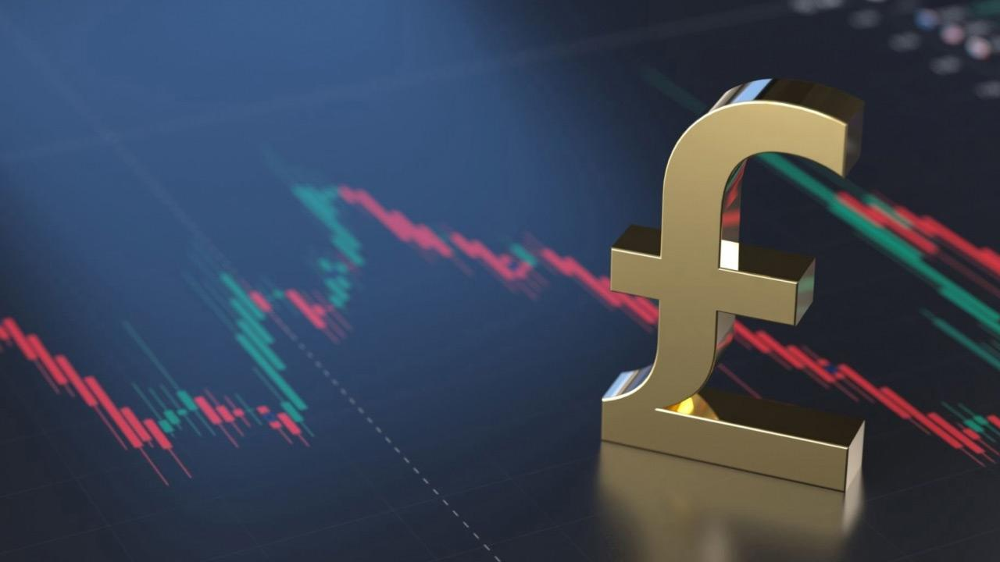

## Table of Contents

## What is the British Pound and why is it important?

The British Pound, also known as the pound sterling, is the official currency of the United Kingdom. It is symbolized by £ and sometimes written as GBP. The pound is one of the oldest currencies still in use today, with its origins tracing back to Anglo-Saxon times. It is used every day by people in the UK to buy things like food, clothes, and other goods and services.

The British Pound is important for many reasons. Firstly, it is one of the most traded currencies in the world, which means many businesses and countries use it to buy and sell things internationally. This makes it a key player in the global economy. Secondly, the value of the pound can affect the UK's economy. If the pound is strong, it can make things cheaper for people in the UK to buy from other countries. But if it is weak, it can make things more expensive. This is why many people and governments pay close attention to the value of the pound.

## How do economic reports affect currency values?

Economic reports can change how much a country's money, like the British Pound, is worth. These reports tell us about things like how many people have jobs, how much stuff a country is making, and how much money people are spending. If a report says the economy is doing well, people might want to buy that country's money because they think it will be worth more later. But if the report says the economy is not doing well, people might not want to buy the money because they think it will be worth less.

For example, if a report shows that more people in the UK have jobs, it might make the British Pound go up in value. This is because more people working means more money being spent, which is good for the economy. On the other hand, if a report shows that fewer people are buying things, the value of the pound might go down. People who trade money watch these reports closely to decide whether to buy or sell a currency.

## What are the key economic reports that influence the British Pound?

Some important reports that can change the value of the British Pound are the ones about jobs, how much the country is making, and how prices are changing. The jobs report tells us how many people in the UK have work. If more people have jobs, it's good for the economy because they can spend more money. The report about how much the country is making, called Gross Domestic Product (GDP), shows if the UK is making more or less stuff than before. If the GDP goes up, it usually means the pound might go up too. The report about prices, called inflation, tells us if things are getting more expensive. If prices go up a lot, it can make the pound weaker.

Another report that matters is the one about what the Bank of England is doing with interest rates. If the Bank of England raises interest rates, it can make the pound stronger because people might want to keep their money in the UK to get more interest. On the other hand, if they lower interest rates, it can make the pound weaker because people might take their money out of the UK to find better interest rates somewhere else. These reports are watched closely by people who trade money because they help them guess what will happen to the value of the pound.

## How does the UK's Gross Domestic Product (GDP) report impact the Pound?

The UK's Gross Domestic Product (GDP) report tells us how much stuff the country is making and how well its economy is doing. When the GDP report shows that the UK is making more stuff than before, it usually makes the British Pound stronger. This is because people think a growing economy means the pound will be worth more later. They want to buy the pound now to make money later when its value goes up.

On the other hand, if the GDP report shows that the UK is making less stuff, it can make the British Pound weaker. When the economy is not doing well, people might not want to buy the pound because they think it will be worth less in the future. They might sell their pounds or not buy them at all, which can push the value of the pound down. So, the GDP report is really important for deciding if the pound will go up or down in value.

## What role does the UK's inflation rate play in the value of the Pound?

The UK's inflation rate tells us how much prices are going up. If inflation is high, it means things are getting more expensive faster. This can make the British Pound weaker. When prices go up a lot, people might think the pound is worth less because they can buy less with it. People who trade money might sell their pounds or not want to buy them, which pushes the value of the pound down.

On the other hand, if inflation is low, it can make the pound stronger. Low inflation means prices are not going up very fast, so people might think the pound is worth more. They might want to buy the pound because they can buy more with it. This demand for the pound can make its value go up. So, the inflation rate is really important for deciding if the pound will be strong or weak.

## How do employment data, such as unemployment rates, affect the British Pound?

Employment data, like the unemployment rate, can have a big effect on the British Pound. When the unemployment rate goes down, it means more people in the UK have jobs. This is good for the economy because people with jobs can spend more money on things they need and want. When people see that more people are working, they might think the UK's economy is doing well. This can make them want to buy the British Pound, which can make its value go up.

On the other hand, if the unemployment rate goes up, it means fewer people have jobs. This can be bad for the economy because people without jobs might not spend as much money. When people see that fewer people are working, they might think the UK's economy is not doing well. This can make them not want to buy the British Pound, which can make its value go down. So, the unemployment rate is an important thing to watch when trying to guess what will happen to the value of the pound.

## What is the significance of the Bank of England's interest rate decisions for the Pound?

The Bank of England's [interest rate](/wiki/interest-rate-trading-strategies) decisions are really important for the British Pound. When the Bank of England raises interest rates, it can make the pound stronger. This is because higher interest rates mean people can earn more money by keeping their savings in the UK. People from other countries might want to move their money to the UK to get these higher interest rates, which increases the demand for the pound and makes its value go up.

On the other hand, if the Bank of England lowers interest rates, it can make the pound weaker. Lower interest rates mean people earn less money on their savings in the UK. This can make people move their money to other countries where they can get better interest rates. When people sell their pounds to buy other currencies, it can decrease the demand for the pound and make its value go down. So, the Bank of England's interest rate decisions are watched closely by people who trade money because they can guess what will happen to the pound's value based on these decisions.

## How do retail sales figures influence the value of the British Pound?

Retail sales figures tell us how much stuff people in the UK are buying. When these figures go up, it means people are spending more money. This is good for the economy because it shows that people feel confident and have money to spend. When people see that retail sales are going up, they might think the UK's economy is doing well. This can make them want to buy the British Pound because they think it will be worth more later. So, high retail sales can make the value of the pound go up.

On the other hand, if retail sales figures go down, it means people are spending less money. This can be bad for the economy because it shows that people might not feel as confident or have less money to spend. When people see that retail sales are going down, they might think the UK's economy is not doing well. This can make them not want to buy the British Pound because they think it will be worth less later. So, low retail sales can make the value of the pound go down.

## What impact does the UK's trade balance have on the Pound's exchange rate?

The UK's trade balance tells us if the country is selling more stuff to other countries than it is buying from them. If the UK is selling more, it has a trade surplus. This is good for the British Pound because it means more money is coming into the UK. When people see that the UK is making money from selling stuff, they might want to buy the pound because they think it will be worth more later. So, a trade surplus can make the pound stronger.

On the other hand, if the UK is buying more stuff from other countries than it is selling, it has a trade deficit. This can be bad for the British Pound because it means money is leaving the UK. When people see that the UK is spending more money than it is making, they might not want to buy the pound because they think it will be worth less later. So, a trade deficit can make the pound weaker.

## How do international events and global market sentiments affect the British Pound?

International events and how people feel about the world's economy can change the value of the British Pound a lot. For example, if there is a big problem somewhere else in the world, like a war or a financial crisis, people might want to move their money to safer places. If they think the UK is a safe place, they might buy the pound, which can make it stronger. But if they think the UK is not safe, they might sell their pounds or not buy them, which can make the pound weaker.

Global market feelings also play a big role. If people around the world feel good about the economy, they might want to buy more pounds because they think the UK's economy will do well. This can make the pound go up in value. But if people feel worried or scared about the economy, they might not want to buy pounds or might even sell the ones they have. This can make the pound go down in value. So, what happens in the world and how people feel about it can really affect the British Pound.

## What advanced indicators should experts monitor to predict movements in the British Pound?

Experts should keep an eye on something called the Purchasing Managers' Index (PMI) to predict how the British Pound might move. The PMI tells us how businesses in the UK are doing, like if they are making more stuff or if they are getting more orders. If the PMI goes up, it means businesses are doing well, which can make people think the UK's economy is strong. This can make them want to buy the pound, pushing its value up. But if the PMI goes down, it means businesses are not doing as well, which can make people think the UK's economy is weak. This can make them not want to buy the pound, pushing its value down.

Another important thing to watch is the Consumer Confidence Index. This tells us how people in the UK feel about their money and the economy. If people feel good, they might spend more money, which is good for the economy and can make the pound stronger. But if people feel worried, they might spend less, which can make the economy weaker and the pound weaker too. Also, experts should look at the yield curve, which shows the difference between short-term and long-term interest rates. If the yield curve gets steeper, it might mean people expect the economy to grow, which can be good for the pound. But if it gets flatter or even inverts, it might mean people expect the economy to slow down, which can be bad for the pound.

## How can traders use economic reports to develop strategies for trading the British Pound?

Traders can use economic reports to make smart guesses about where the British Pound might go next. They look at reports like the UK's GDP, unemployment rate, inflation, and the Bank of England's interest rate decisions. If these reports show the UK's economy is doing well, like when GDP is growing or unemployment is going down, traders might think the pound will get stronger. They could buy the pound now, hoping to sell it later for more money. On the other hand, if the reports show the economy is not doing well, like when inflation is too high or there's a trade deficit, traders might think the pound will get weaker. They could sell their pounds or avoid buying them, expecting the value to drop.

Another way traders use these reports is by watching how the numbers change over time. For example, if the Purchasing Managers' Index (PMI) keeps going up, it might mean businesses in the UK are doing better and better. Traders might see this as a sign to keep buying the pound. They also pay attention to how people in the UK feel about their money, which is shown in the Consumer Confidence Index. If people feel good and spend more, it can help the economy and the pound. By putting all this information together, traders can make plans to buy or sell the pound at the right times, hoping to make money from the changes in its value.

## References & Further Reading

[1]: ["Forex and the Role of the British Pound: Fundamental Analysis Approach"](https://www.forex.com/en-us/news-and-analysis/guide-to-pound-sterling/) Bank of England.

[2]: ["United Kingdom Economic Indicators"](https://tradingeconomics.com/united-kingdom/indicators) Trading Economics.

[3]: ["Algorithmic Trading: A Practitioner’s Guide"](https://www.amazon.com/Algorithmic-Trading-Practitioners-Jeffrey-Bacidore/dp/0578715236) by Adam Grant

[4]: ["Advanced Trading Strategies and Models"](https://investinganswers.com/advanced-trading) by Ernie Chan

[5]: ["Trading Economics: Consumer Price Index (CPI)"](https://tradingeconomics.com/united-states/consumer-price-index-cpi) Trading Economics.

[6]: ["Gross Domestic Product (GDP) by Country"](https://www.worldometers.info/gdp/gdp-by-country/) International Monetary Fund.