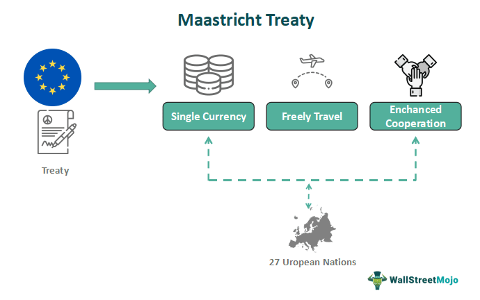

The European economy, driven by its diverse and interdependent member states, is a pivotal force in global markets. As of 2021, the European Union (EU) collectively represents one of the largest economies worldwide, with a Gross Domestic Product (GDP) that competes closely with other leading economic powers. The Euro, introduced in 1999, serves as the unified currency for 19 of the 27 EU member states, facilitating seamless trade and economic stability within the Eurozone. The Euro's status as the second most traded currency globally underscores the significant role Europe plays in the international financial landscape.

Economic reports are integral to shaping investment strategies within this framework. These reports, including those from the European Central Bank (ECB), provide crucial data on key economic indicators such as GDP growth, employment rates, and inflation. Investors and policymakers rely on these metrics to gauge economic health and forecast future economic conditions. The release of economic data can lead to market volatility, reflecting revised investor expectations and confidence levels.



The rise of algorithmic trading has added a layer of complexity and precision to modern financial markets. Algorithmic trading involves the use of advanced algorithms to execute trades based on data-driven insights. This approach promises increased speed and accuracy, allowing traders to capitalize on market movements swiftly, often triggered by new economic data releases. The integration of artificial intelligence (AI) and machine learning further enhances the capabilities of algorithmic trading systems, enabling them to process vast amounts of data and identify patterns that may not be immediately apparent to human traders.

This article will examine the interaction between these elements: the European economy's significance, the Euro's role in global stability, and the impact of economic reports on investment strategies. The discussion will include an exploration of algorithmic trading and its use of economic data to make informed trading decisions. By analyzing these components, we aim to provide a comprehensive understanding of the current and future landscape of trading within the European market. The article will also address the challenges and opportunities presented in this dynamic environment, offering insights for investors navigating the evolving financial terrain.

## Table of Contents

## Overview of the European Economy

The European economy represents a significant force in global markets, characterized by its vastness, diversity, and interconnectedness among member states. As of recent data, the European Union (EU) encompasses a population exceeding 440 million people and boasts a Gross Domestic Product (GDP) of approximately €14 trillion, making it one of the largest economic entities worldwide [1].

Key economic indicators such as GDP, employment rates, and inflation offer insights into the health of the European economy. For instance, the GDP growth rate provides a snapshot of economic expansion or contraction, indicating periods of economic prosperity or recession. In the last few years, the EU has navigated various economic challenges, maintaining moderate GDP growth despite fluctuations. Employment rates and inflation are integral metrics; as of 2023, the EU reports an average unemployment rate around 6%, with inflation rates influenced by global supply chain disruptions and energy price increases [2].

The European economy's diversity stems from the economic structures and policies of its member states. From Germany's robust manufacturing base to France's emphasis on agriculture and luxury goods, each country brings unique strengths, fostering economic interdependence. This interconnectedness facilitates trade and investment flows, creating an integrated market that supports economic stability. Furthermore, policies such as the Single Market aim to eliminate trade barriers, enhancing economic cooperation and competitiveness [3].

Major sectors like manufacturing and services play pivotal roles in the European economy. Manufacturing, led by automotive production, machinery, and chemicals, serves as a cornerstone of European economic output. Meanwhile, the services sector, encompassing finance, tourism, and retail, drives job creation and consumer activity. This sectoral composition underscores the EU's position as a diversified economic powerhouse capable of weathering economic fluctuations [4].

Geopolitical events have notably impacted the European economy in recent times. The COVID-19 pandemic led to unprecedented economic disruptions, prompting large-scale fiscal interventions and policy adjustments to mitigate its effects. More recently, geopolitical tensions, including the conflict in Ukraine, have strained energy supplies and trade relations, contributing to economic uncertainty [5]. These events highlight the need for adaptive strategies to sustain economic resilience and growth.

In conclusion, the European economy is a dynamic entity, shaped by its diversity, economic metrics, and global interactions. Understanding these elements is crucial for businesses, investors, and policymakers navigating its complex landscape.

### References

1. European Commission. "European Economic Forecast." 
2. Eurostat. "Unemployment Statistics." 
3. European Union. "The EU Single Market." 
4. European Central Bank. "Sectoral Contributions to Economic Growth in the EU."
5. International Monetary Fund. "Regional Economic Outlook: Europe."

## The Euro: Europe's Unified Currency

The Euro was introduced as a unified currency to foster economic integration and stability among European Union (EU) member states. Established by the Maastricht Treaty in 1992, the Euro officially came into existence in 1999, with physical notes and coins entering circulation in 2002. The primary purpose of the Euro was to eliminate currency exchange fluctuations and transaction costs, thereby facilitating trade and investment across the Eurozone.

The impact of the Euro on trade within the Eurozone has been substantial. By simplifying trade transactions and removing exchange rate risk among member countries, it has significantly boosted intra-EU trade. This has created a more stable economic environment, fostering economic cohesion. The Euro has also strengthened the region's global economic presence, making the EU one of the world's largest economic entities.

However, the Euro also presents several economic challenges. A unified currency means individual member countries cannot independently adjust their monetary policies in response to local economic conditions. This has resulted in economic imbalances, especially among countries with disparate economic conditions. For example, during the European debt crisis, countries like Greece struggled under a monetary policy that was not tailored to their specific economic realities.

The Euro's fluctuating value has significant implications for global markets. As a major global currency, any fluctuation in its value affects international trade, investment flows, and even non-Eurozone economies. A strong Euro can make Eurozone exports more expensive, potentially reducing demand, while a weaker Euro can make imports more costly, affecting inflation rates. Periods of uncertainty, such as the financial crises or Brexit, have shown the Euro's susceptibility to geopolitical changes, impacting its stability and valuation.

Recent trends in Euro valuation reflect a mix of economic dynamics and geopolitical tensions. For instance, the Euro has faced depreciation pressures due to quantitative easing policies by the European Central Bank (ECB) and political uncertainties. Conversely, it has experienced periods of appreciation due to recoveries in European economies and comparative weaknesses in other major currencies like the U.S. dollar.

In summary, the Euro was created to unify and stabilize the European economic landscape, but it carries inherent complexities. Its impact on trade and market stability underscores its vital role, while its fluctuations demonstrate the interconnectedness of modern global markets. Understanding these dynamics is crucial for investors and policymakers aiming to navigate the intricacies of the Eurozone economy.

## Understanding Economic Reports and Their Impact

Economic reports hold significant sway over Europe's financial landscape, serving as essential tools for policymakers, investors, and traders. Among these reports, those issued by the European Central Bank (ECB) are particularly influential. These reports typically include GDP growth rates, inflation figures, employment [statistics](/wiki/bayesian-statistics), and other critical metrics that help shape economic policy decisions. The ECB's monetary policy decisions are largely guided by these reports, as they provide a quantitative basis for determining interest rates and other financial instruments. For example, rising inflation rates might prompt the ECB to increase interest rates to control economic overheating, which can subsequently affect investor confidence and market stability.

Economic forecasts and statistical releases also play a critical role in shaping expectations and strategies. Forecasts offer a predictive look at future economic conditions, guiding investment decisions and risk assessments. Reports such as the Eurostat release provide data on consumer behavior, business investment, and trade balances, which are essential for understanding market dynamics and setting future economic policies.

Historical reports serve as valuable case studies, providing insights into how economic trends have evolved over time. Analyzing past reports can reveal patterns and correlations, aiding in predicting future economic conditions. For instance, the period following the 2008 financial crisis saw numerous ECB interventions, whose outcomes can be studied to enhance understanding of effective economic stabilization strategies.

The timing and periodic release of these reports are equally important. Most key reports follow a regular schedule, such as monthly unemployment data or quarterly GDP figures. The consistency in timing allows policymakers and investors to plan and react systematically. For instance, ECB press conferences and the subsequent publication of their Economic Bulletin occur on a well-known schedule, ensuring that markets are prepared for any policy announcements and can adjust their positions accordingly.

In essence, economic reports are vital for steering both monetary policy and market sentiment. By providing a comprehensive view of the current economic landscape, these reports enable stakeholders to make informed decisions, ensuring smoother economic operations across the European Union. The timely and periodic nature of their release ensures that these reports remain relevant and continue to provide a foundation for strategic planning and decision-making.

## Algorithmic Trading: Harnessing Economic Data

Algorithmic trading, often referred to as algo trading, is a method of executing orders using automated and pre-programmed trading instructions to account for variables such as timing, price, and [volume](/wiki/volume-trading-strategy). This technology-driven approach leverages computational algorithms to make high-speed trading decisions based on quantitative data, enabling traders to capitalize on fleeting opportunities in the market.

### Integration of Economic Reports into Trading Algorithms

Incorporating economic reports into trading algorithms is crucial for informed decision-making. Economic reports, such as those from the European Central Bank (ECB), provide essential data on variables like GDP growth, inflation rates, and unemployment statistics. Algorithms use this information to predict market trends and adjust trading strategies accordingly. By analyzing historical data alongside current reports, algorithms can identify patterns and correlations, optimizing trade executions under varying market conditions. For example, a decrease in unemployment rates might trigger an automated purchase of equities, anticipating a positive market reaction.

### Benefits of Algorithmic Trading: Speed and Accuracy

Algorithmic trading offers significant advantages in terms of speed and accuracy. Due to automated algorithms, trades can be executed within microseconds, far quicker than any human trader could achieve. This speed ensures that traders can quickly respond to market changes, securing optimal pricing. Moreover, [algorithmic trading](/wiki/algorithmic-trading) eliminates human emotional biases, fostering precision in trade execution. Algorithms follow predefined criteria, ensuring consistent and repeatable outcomes. Consequently, the accuracy of entry and [exit](/wiki/exit-strategy) points improves profitability and reduces the likelihood of errors.

### Challenges and Risks in Volatile Markets

Despite its advantages, algorithmic trading is not without challenges and risks, particularly during volatile market conditions. Rapid price fluctuations can cause trading algorithms to execute orders based on outdated or misleading data, potentially leading to significant losses. Moreover, reliance on algorithms can result in systemic risks, as seen in events like the 2010 Flash Crash. These incidents highlight the importance of robust risk management protocols and the incorporation of safeguards, such as circuit breakers, within trading systems. 

### Examples of European Trading Platforms

Several algorithmic trading platforms focus on the European markets, providing tailored solutions for handling local economic reports and trends. Notable platforms include:
- **QuantConnect:** An open-source algorithmic trading platform that supports trading strategies across multiple European exchanges. It provides access to extensive market data and facilitates the backtesting of trading algorithms.
- **AlgoTrader:** A comprehensive platform supporting high-frequency trading strategies. It offers integrations with various European exchanges and provides tools for the development, testing, and execution of trading algorithms.
- **MetaTrader 5:** Widely used for forex, futures, and CFD trading, it provides algorithmic trading functionality specifically tailored for European market conditions, thereby enabling traders to automate their strategies efficiently.

In conclusion, algorithmic trading capitalizes on economic data to enhance decision-making capabilities, proving beneficial in terms of speed and accuracy. However, it also demands vigilant risk management, especially in volatile markets. Platforms focusing on European markets facilitate the integration of regional economic insights, making them a vital tool for traders operating within Europe.

## The Interaction Between Algo Trading and Economic Reports

Traders utilize algorithmic trading systems to quickly capitalize on economic reports, which can have a significant influence on market movements. These systems are designed to process vast amounts of data and execute trades at speeds beyond human capabilities. This speed and efficiency are pivotal; markets can react to new information within milliseconds, often leading to rapid price adjustments. For example, the release of the European Central Bank's (ECB) [interest rate](/wiki/interest-rate-trading-strategies) decisions can lead to immediate fluctuations in the Euro's value. Algorithmic trading systems are programmed to detect such releases, interpret the data, and execute trades based on predefined criteria.

Machine learning and [artificial intelligence](/wiki/ai-artificial-intelligence) (AI) have significantly enhanced the capabilities of algorithmic trading. Through these technologies, algorithms can be trained to recognize patterns and predict market movements with increased accuracy. Techniques such as supervised learning allow models to improve their predictions by learning from historical data. Machine learning models can be employed to forecast economic indicators or detect anomalies in market data, thereby enabling more informed trading decisions. For instance, neural networks can be used to model complex, non-linear relationships between different financial instruments and economic indicators.

Sentiment analysis also plays a crucial role in interpreting economic reports. By analyzing the tone of an economic report or related news articles, algorithms can infer the potential impact on markets. Sentiment analysis entails processing textual data to gauge public mood regarding economic announcements. This is achieved using natural language processing (NLP) techniques. Python libraries like TextBlob or NLTK can be used to quantify sentiment from text, providing a metric that can be integrated into trading algorithms. For instance:

```python
from textblob import TextBlob

def calculate_sentiment(text):
    analysis = TextBlob(text)
    return analysis.sentiment.polarity

report = "The ECB has announced a decrease in interest rates, which is expected to stimulate economic growth."
sentiment_score = calculate_sentiment(report)
```

Technological advancements will continue to shape the interaction between algorithmic trading and economic reports. As AI and [machine learning](/wiki/machine-learning) technologies evolve, algorithms will become increasingly sophisticated, capable of analyzing not only the numerical data but also contextual information from a variety of unstructured data sources. Improved computational power and enhanced data processing capabilities will enable more comprehensive real-time analyses, likely increasing the market's efficiency in incorporating new information.

Future advancements may see the integration of quantum computing, which could exponentially increase processing speeds and data handling capabilities. Additionally, the advancement of edge computing could allow algorithms to function with minimal latency, even in highly volatile markets. These developments could lead to even more synchronized and precise responses to economic reports, fundamentally transforming trading strategies in the European and global financial markets.

## Challenges and Opportunities in the European Economic Landscape

The European economic landscape is characterized by a blend of challenges and opportunities, influenced by its diverse political and economic environment. One of the primary challenges facing the European economy is the ongoing geopolitical uncertainty, which impacts trade relations and investments. Events such as Brexit have transformed traditional trade dynamics, altering market access and creating economic friction between the United Kingdom and European Union member states [1].

Additionally, the European economy grapples with disparities in economic performance across member countries. While nations like Germany and the Netherlands maintain robust economies, others, such as Greece and Italy, continue to confront economic stagnation and high debt levels [2]. These variances pose challenges to achieving uniform economic growth across the Eurozone, further complicated by varying fiscal policies and structural reforms necessary in different regions.

Inflationary pressures also challenge the European economy. With energy prices fluctuating significantly due to geopolitical tensions and supply-chain disruptions, maintaining monetary stability remains arduous for the European Central Bank (ECB). The ECB regularly adapts its policies to mitigate these effects, influencing the valuation and strength of the Euro, which in turn affects global trade dynamics [3].

Despite these challenges, the European economy presents significant opportunities for growth and innovation. The push towards digital transformation and sustainability has spurred investment in green technologies and renewable energy sectors. The European Green Deal, an ambitious plan by the EU, aims to make Europe the first climate-neutral continent by 2050, creating new markets and employment opportunities [4].

The region's strong commitment to research and development fosters innovation in technology-driven sectors, particularly in artificial intelligence and biotechnology. This emphasis on innovation provides fertile ground for startups and established firms to explore novel solutions and drive economic growth within the Eurozone.

Moreover, as algorithmic trading becomes increasingly integral to financial markets, potential regulatory changes in Europe warrant attention. The Markets in Financial Instruments Directive II (MiFID II) provides a comprehensive regulatory framework governing trading practices, seeking to enhance transparency and protect investors [5]. Adhering to these regulations while leveraging technological advancements can bolster the competitive edge of European markets.

Cross-border trading and economic integration in Europe face a dynamic future. The commitment to enduring economic ties among EU member states underscores the potential for continued cooperation, which can enhance economic resilience. However, balancing national interests with collective EU policies necessitates careful negotiation and policy formulation.

Investors can capitalize on this evolving landscape by closely monitoring economic trends and regulatory changes. Diversifying investments across sectors and regions can mitigate risks associated with economic [volatility](/wiki/volatility-trading-strategies). Strategic partnerships and collaboration with firms that align with sustainable and innovative practices can enhance investment portfolios while supporting broader economic objectives.

In conclusion, the European economic landscape is marked by a synergistic interplay of challenges and opportunities. Navigating these complexities requires astute awareness of economic indicators, regulatory frameworks, and geopolitical developments, enabling investors to strategically position themselves for future growth within the Eurozone.

References:
1. European Commission: Trade Policy.
2. International Monetary Fund: World Economic Outlook.
3. European Central Bank: Monetary Policy Decisions.
4. European Commission: The European Green Deal.
5. European Securities and Markets Authority: MiFID II.

## Conclusion

In conclusion, the integration of economic reports with algorithmic trading offers significant advantages, enhancing both the speed and precision of financial market responses. These reports, which include detailed analyses from institutions like the European Central Bank, serve as essential inputs for trading algorithms, influencing market strategies and investor decisions. As these economic indicators are released, they directly impact trading patterns, demonstrating the critical role of real-time data processing. 

The European economic landscape is dynamic, driven by factors such as ongoing geopolitical changes, technological innovations, and evolving market conditions. This context demands that both traders and policymakers remain vigilant and adaptive. The fast-paced nature of algorithmic trading, fueled by real-time economic information, necessitates continuous research and development to refine strategies and optimize trading outcomes.

Looking forward, the future of trading in Europe will likely be shaped by further technological advancements, including artificial intelligence and machine learning, which are set to enhance the predictive capabilities of algorithmic trading systems. As these technologies become more sophisticated, they will offer traders unprecedented tools to navigate the complexities of the European economy. Additionally, regulatory frameworks must evolve to manage the risks associated with these innovations while maximizing their benefits. 

Ultimately, staying informed and adaptable will be crucial for investors and policymakers alike, as they seek to optimize their strategies in a complex and ever-changing trading environment. This will ensure that the European economic framework continues to support growth and stability, even amidst uncertainty and rapid technological change.

## References & Further Reading

[1]: European Commission. ["European Economic Forecast."](https://economy-finance.ec.europa.eu/economic-forecast-and-surveys/economic-forecasts_en)

[2]: Eurostat. ["Unemployment Statistics."](https://ec.europa.eu/eurostat/statistics-explained/index.php/Unemployment_statistics)

[3]: European Central Bank. ["Economic Bulletin."](https://www.ecb.europa.eu/press/economic-bulletin/html/index.en.html)

[4]: International Monetary Fund. ["Regional Economic Outlook: Europe."](https://www.imf.org/en/Publications/REO/EU/Issues/2024/10/24/regional-economic-outlook-Europe-october-2024)

[5]: European Securities and Markets Authority. ["MiFID II."](https://www.esma.europa.eu/publications-and-data/interactive-single-rulebook/mifid-ii)