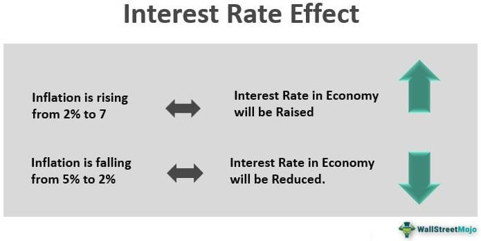

Financial markets serve as the backbone of the global economy, facilitating the efficient allocation of resources and enabling various economic activities. They encompass a range of platforms where financial instruments—stocks, bonds, derivatives, currencies—are traded. These markets are vital for raising capital, maintaining liquidity, and distributing risk. By channeling savings into productive investments, financial markets stimulate economic growth and innovation, thereby playing a crucial role in societal development.

Economic sectors, classified into primary, secondary, and tertiary categories, intersect with financial markets, influencing their operation and evolution. The primary sector involves the extraction of raw materials, the secondary sector covers manufacturing and industrial production, and the tertiary sector encompasses services. Each sector contributes to the economy in unique ways, and changes within these sectors can have significant ripple effects on financial markets. For instance, technological advancements in the secondary sector might increase demand for related stocks, affecting overall market dynamics.

Interest rates, often regarded as the economy's heartbeat, are pivotal in shaping economic activities. Set by central banks, interest rates determine the cost of borrowing and the return on savings. They influence inflation, investment decisions, and consumption patterns. When interest rates are low, borrowing becomes cheaper, stimulating investment and spending. Conversely, high interest rates might lead to reduced borrowing and spending. As such, interest rates are a crucial tool for economic stabilization and growth, impacting various economic sectors and, in turn, financial markets.

Algorithmic trading, or algo trading, represents the modern evolution of trading practices in financial markets. It involves the use of computer algorithms to execute trades at high speed and precision, based on pre-set criteria. This form of trading has gained increasing popularity due to its ability to handle complex calculations and data analyses swiftly, providing significant advantages over traditional methods. However, it also introduces new risks and challenges, necessitating robust regulatory frameworks.

The purpose of this article is to explore the interplay between these elements—financial markets, economic sectors, interest rates, and algo trading—and how they collectively shape the global economic landscape. Understanding these relationships is crucial for navigating the complexities of modern finance and making informed investment decisions.

## Table of Contents

## Understanding Financial Markets

Financial markets are structured systems enabling the exchange of financial securities, commodities, and other fungible assets. They are pivotal in channeling savings and investments between suppliers and those in need of capital, thereby facilitating resource allocation and contributing significantly to economic growth.

There are various types of financial markets, each serving a unique purpose:

1. **Capital Markets**: These include both the stock and bond markets, where long-term securities are bought and sold. The stock market is vital for companies to raise equity capital, while the bond market allows for the issuance of debt obligations. Capital markets are critical for economic expansion as they provide businesses with the necessary funds to grow and innovate.

2. **Money Markets**: Short-term debt securities are traded in money markets, often having maturities of less than one year. Instruments like treasury bills, certificates of deposit, and commercial paper are common. These markets provide liquidity and safety to investors looking to park funds temporarily.

3. **Derivatives Markets**: Financial derivatives, such as futures, options, and swaps, derive their value from an underlying asset. These markets are essential for risk management as they allow investors and companies to hedge against potential price fluctuations of commodities, currencies, or interest rates.

4. **Foreign Exchange Markets**: These are global decentralized markets for the trading of currencies. The forex market determines the relative value of different currencies and is essential for international trade and investment.

Financial markets are integral to resource allocation, effectively directing capital towards productive use. By determining prices based on supply and demand dynamics, these markets ensure that resources are efficiently allocated, thereby fostering economic growth and stability.

Key players in financial markets include individual investors, institutional investors like mutual funds and pension funds, banks, brokers, and government bodies. The instruments traded span equities, bonds, currencies, and various derivatives. Each player and instrument has a specific function, contributing to the fluidity and efficiency of the markets.

Financial markets are dynamic, constantly responding to a myriad of factors including economic indicators, corporate news, geopolitical events, and technological advancements. For instance, unexpected political developments can lead to market [volatility](/wiki/volatility-trading-strategies) as investors reassess risks and opportunities. Similarly, changes in economic policies, such as interest rates adjustments by central banks, can lead to shifts in investor behavior and market valuation.

Technological innovation, particularly [algorithmic trading](/wiki/algorithmic-trading), further enhances the adaptability of financial markets by enabling rapid transaction execution and processing of large volumes of data. This, in turn, helps markets react more swiftly to global events, ensuring continued [liquidity](/wiki/liquidity-risk-premium) and price discovery in an ever-evolving economic landscape.

Understanding the types, roles, and dynamic nature of financial markets is crucial for stakeholders to navigate and make informed decisions in the global economy.

## Economic Sectors and Their Influence

Economic sectors are fundamental components of the economy, each representing a distinct phase of production and services. Economists generally categorize them into three broad categories: primary, secondary, and tertiary sectors. These sectors, in turn, have significant implications for financial markets, influencing economic activities, trends, and investment decisions.

### Explanation of Economic Sectors

1. **Primary Sector**: This sector encompasses activities related to the extraction and harvesting of natural resources. It includes industries such as agriculture, mining, forestry, and fishing. The primary sector is integral to supplying raw materials for the other sectors, and it often experiences fluctuations due to factors like weather conditions and geopolitical events.

2. **Secondary Sector**: This sector involves the processing of raw materials into finished goods. It includes manufacturing, construction, and other industries that transform primary goods into consumer products. The health of the secondary sector is often used as a measure of industrial growth and is closely tied to technological advancements and consumer demand.

3. **Tertiary Sector**: Representing the service industry, the tertiary sector includes activities related to retail, entertainment, financial services, healthcare, and education. This sector has grown significantly in modern economies, contributing to a major share of gross domestic product (GDP) in developed countries, driven by increased demand for services.

### Impact on Financial Markets

Different economic sectors impact financial markets in varied ways. For instance, a boom in the primary sector, such as a surge in agricultural output, leads to increased revenues and profits for companies involved in this sector. This may boost stock prices and attract more investments. Conversely, adverse events affecting these sectors can cause market instability and lead to decreased investor confidence.

The secondary sector's performance is usually measured by industrial production indices, and these indicators are closely watched by investors and policymakers to gauge economic health. Strong manufacturing output typically indicates economic expansion, prompting positive market sentiment, while downturns might signal an impending recession.

The tertiary sector's influence is often measured by consumer spending data and services output. As this sector largely signifies consumer confidence and spending capacity, it can considerably affect stock market trends. A robust service sector generally correlates with a thriving economy, attracting investments and increasing market liquidity.

### Sectoral Performance Indicators and Significance

Sectoral performance indicators provide insights into the economic health and potential growth areas within an economy. These include:

- **Gross Domestic Product (GDP) Contribution**: The share of each sector in the overall GDP is a primary indicator of its economic significance. It helps identify which sectors are driving growth and where potential vulnerabilities might lie.

- **Employment Statistics**: Employment levels across sectors serve as indicators of economic vitality. A sector that generates significant employment opportunities is crucial for sustaining economic wellbeing and can impact market stability.

- **Industrial Indices**: Indices such as the Purchasing Managers' Index (PMI) for manufacturing and services sectors are key in predicting economic trends and market dynamics.

### Ripple Effect on the Overall Market

Changes within a particular sector can have a ripple effect throughout the economy. For example, a rise in [crude oil](/wiki/crude-oil) prices—an input for many industries—can lead to increased costs for manufacturing and transportation, affecting both secondary and tertiary sectors. This, in turn, may lead to higher consumer prices, influencing inflation and affecting central banks' monetary policies.

Moreover, advancements or disruptions in one sector can trigger technological or regulatory changes that impact other sectors. For instance, technological innovation in the secondary sector can enhance productivity in the primary sector and increase the efficiency of services in the tertiary sector.

In summary, economic sectors are intricately linked to financial market dynamics. Understanding the performance and trends of these sectors helps investors, policymakers, and businesses navigate the complexities of market environments, making informed decisions that capitalize on opportunities and mitigate risks associated with economic fluctuations.

## Interest Rates: The Economic Pulse

Interest rates are a fundamental component of macroeconomic policy, primarily set by central banks as a tool to regulate economic activity. Central banks, such as the Federal Reserve in the United States, the European Central Bank in the Eurozone, and the Bank of Japan, set benchmark interest rates like the federal funds rate or the discount rate. These rates are determined based on a variety of economic indicators, including inflation, employment levels, and overall economic growth.

Interest rates serve as the cost of borrowing money. They influence the economy by affecting consumer spending and business investment. When interest rates are low, borrowing is cheaper, which can spur investment and consumption. Conversely, higher interest rates can dampen economic activity by making loans more expensive. The relationship between interest rates and inflation is crucial: generally, when inflation is high, central banks might raise interest rates to curb excessive price increases by reducing spending and borrowing. The basic relationship can be represented by the Fisher equation:

$$
i = r + \pi
$$

where $i$ is the nominal interest rate, $r$ is the real interest rate, and $\pi$ is the inflation rate. Adjusting interest rates helps maintain a balance between growth and inflation, aiming for a stable economic environment.

Changes in interest rates directly impact various economic sectors. For example, the housing sector is particularly sensitive to [interest rate](/wiki/interest-rate-trading-strategies) adjustments; lower rates typically lead to increased mortgage borrowing and housing purchases. In contrast, higher rates might slow down this activity, affecting construction and real estate. Similarly, sectors reliant on capital investment, such as manufacturing and technology, may see reduced activity as borrowing costs rise.

Historically, significant interest rate changes have led to notable market reactions. For instance, the sharp interest rate hikes by the Federal Reserve in the early 1980s successfully curbed the then-rampant inflation but also led to a recession. Market participants closely monitor central bank policies for signals on interest rate adjustments, as these movements can trigger wide-ranging effects across the financial markets, from stock and bond prices to currency valuations.

In conclusion, understanding interest rates and their economic implications is essential for both policymakers and investors. They play a pivotal role in shaping economic conditions by influencing inflation, investment, and consumption. Recognizing the historical context and sector-specific impacts of interest rate changes can guide strategic decision-making in navigating financial markets.

## Algo Trading: The High-Speed Revolution

Algorithmic trading, commonly known as algo trading, is a method of executing orders using automated and pre-programmed trading instructions accounting for variables such as time, price, and [volume](/wiki/volume-trading-strategy). These instructions are implemented using algorithms, which are a set of rules and calculations executed by computers. The primary aim of algorithmic trading is to leverage advanced mathematical models and rapid data analysis to make high-speed trading decisions that are typically impossible for human traders to achieve manually.

**Benefits of Algo Trading:**

One of the foremost benefits of algorithmic trading is efficiency. By automating trading processes, computers can execute orders at a much faster pace than human traders. This is crucial in markets where the time to execute can mean the difference between profit and loss. In addition, the precision afforded by algorithmic systems eliminates the risk of human error during trading, ensuring accurate and consistent execution of trades according to the pre-defined criteria.

Another advantage is the speed at which trades can be executed. Algorithms can process vast amounts of market data in real-time and make split-second decisions, allowing traders to capitalize on short-lived trading opportunities without the delays associated with manual order placements.

**Risks and Challenges:**

Despite its advantages, algorithmic trading also comes with its set of challenges and risks. One major risk is the potential for algorithmic errors if the trading instructions are not accurately programmed or tested. These errors can lead to significant financial losses and have, in some instances, triggered large market disruptions.

Moreover, algo trading can contribute to increased market volatility. High-frequency trading, a subset of algorithmic trading, involves executing a large number of orders at very high speeds, which can exacerbate price movements during volatile conditions. Additionally, there is a risk of data overload, where the system can be overwhelmed by excessive information, leading to erroneous trading decisions.

**Reshaping Financial Markets:**

Algorithmic trading has had a profound impact on financial markets, reshaping how they function and who participates in them. The increase in trading volume due to algorithms has improved liquidity, meaning trades can be executed more easily without causing significant price fluctuations. This liquidity is beneficial, particularly in large markets such as [forex](/wiki/forex-system) or equities.

Algo trading has also changed the competitive landscape of financial markets. With the emphasis on speed and efficiency, firms and traders who invest in sophisticated technological infrastructure and data analytics capabilities gain a competitive edge. This technological race has led to significant investments in computer systems, co-location services, and market data feeds.

Overall, while algorithmic trading presents substantial opportunities for efficiency and faster decision-making, market participants must remain aware of its inherent risks and adapt their strategies to the evolving landscape it creates. The interplay of these factors continues to dynamically reshape financial markets, making a nuanced understanding of algorithmic trading crucial for participants.

## Interconnections and Market Dynamics

Financial markets, economic sectors, and interest rates are intricately interconnected, creating a dynamic ecosystem that is continuously influenced by both internal and external factors. The interplay between these elements can dramatically affect market behavior and economic performance worldwide. Interest rates, dictated by central banks, are a pivotal component, acting as both a barometer and a driving force for economic activity. They influence borrowing costs, consumer spending, and business investment, which in turn affect various economic sectors differently. The secondary sector, for instance, might be more sensitive to interest rate fluctuations due to its capital-intensive nature, influencing production levels and employment rates.

Algorithmic trading (algo trading) plays an increasingly crucial role in this complex environment. Utilizing advanced mathematical models and computational power, algo trading can quickly adapt to changes in market conditions, including shifts in interest rates or economic indicators. This rapid response capability can both stabilize and destabilize markets, as algorithms can execute large volumes of trades in fractions of a second, sometimes leading to liquidity provisioning but also potentially exacerbating volatility during unexpected market events.

A pertinent example that highlights these interactions is the "flash crash" of May 6, 2010. During this event, interest rate concerns and economic signals triggered a massive sell-off, compounded by algorithmic trading systems reacting faster than human traders could. The rapid succession of orders overwhelmed market exchanges, causing a sharp and temporary drop in stock prices. This illustrates not only the speed and efficiency of algo trading but also its susceptibility to creating abrupt market movements without considering the broader economic context.

Investors seeking to navigate these complex market dynamics need robust strategies that incorporate an understanding of how economic signals, interest rates, and algo trading influence financial markets. Diversification can mitigate risks associated with sudden market shifts, while a focus on [fundamental analysis](/wiki/fundamental-analysis) helps in understanding underlying economic trends. Additionally, investors can leverage technology and data analytics to better predict algorithm-driven responses to economic changes.

Active monitoring of central bank announcements and economic indicators, such as employment rates, GDP growth, and inflation, is crucial. These factors provide insight into potential interest rate adjustments, thereby allowing investors to anticipate market movements. By understanding the feedback loops between interest rates, economic sectors, and algo trading, investors can more effectively devise strategies that account for both short-term market fluctuations and long-term economic trends. 

Ultimately, the interconnectedness of financial markets, economic sectors, interest rates, and algo trading underscores the importance for investors to maintain a holistic view. This comprehensive approach enables adaptive strategies that encompass technological advancements, regulatory developments, and shifting economic paradigms.

## Future Trends and Considerations

Emerging trends in financial markets and algorithmic trading indicate significant transformations driven by technological innovations and regulatory adaptations. As technology continues to evolve, its influence on financial markets is becoming increasingly profound.

### Technological Advancements and AI in Trading

Artificial intelligence (AI) is at the forefront of transforming trading strategies. With [machine learning](/wiki/machine-learning) algorithms, traders can analyze vast datasets to identify patterns and trends that are not immediately visible to humans. AI facilitates the development of predictive models that enhance decision-making processes, providing a competitive advantage in executing trades with precision and speed.

For example, natural language processing (NLP) is being leveraged to analyze news articles, reports, and social media, allowing traders to assess market sentiment and react accordingly. This capability enhances the predictive power of trading algorithms by incorporating qualitative data sources alongside traditional numerical data.

Moreover, advancements in quantum computing hold potential for the financial industry. While still in nascent stages, quantum computing could significantly enhance computational power, thereby solving complex optimization problems more efficiently. This could lead to more sophisticated algorithmic trading models capable of handling multifaceted market conditions.

### Considerations for Regulatory Measures and Ethical Implications

As algorithmic trading becomes more prevalent, regulatory bodies face the challenge of ensuring fair and transparent market operations. High-frequency trading ([HFT](/wiki/high-frequency-trading-strategies)), a subset of algo trading that executes a large number of orders at extremely high speeds, has raised concerns about market manipulation and systemic risk.

Regulators are tasked with developing frameworks that mitigate these risks without stifling innovation. This includes establishing guidelines for the testing and deployment of trading algorithms, ensuring proper disclosure, and enhancing monitoring systems to detect potentially disruptive trading activities.

Ethically, the use of AI in financial markets poses dilemmas related to accountability and data privacy. There is an ongoing debate on the extent to which self-learning algorithms should be permitted to operate autonomously, and who is responsible when AI-driven decisions lead to adverse outcomes. Moreover, ensuring that trading algorithms do not exploit market inefficiencies to the detriment of market stability remains a key ethical consideration.

### Preparing for Future Financial Market Transformations

The integration of AI and technology in financial markets necessitates proactive strategies for adaptation. Financial institutions are investing in talent that combines expertise in finance, data science, and technology to develop and manage sophisticated trading systems.

Continuous education and training programs are crucial to ensure that professionals are equipped with the necessary skills to operate in this evolving landscape. This includes a focus on data analytics, algorithmic design, and an understanding of regulatory requirements.

In addition, collaboration between market participants and regulators can foster an environment conducive to innovation while maintaining stability. Creating regulatory sandboxes can enable financial institutions to test new technologies and business models under the oversight of regulators, offering a balanced approach to innovation and risk management.

In conclusion, the future of financial markets and algorithmic trading is poised for transformation through technological advancements and AI. Addressing regulatory and ethical considerations is critical to harnessing the potential benefits while minimizing risks. By preparing strategically, market participants can navigate the complexities of this evolving environment effectively.

## Conclusion

The interconnectedness of financial markets, economic sectors, interest rates, and algorithmic trading forms a complex web that dictates the modern economic landscape. Financial markets act as the arteries of the global economy, distributing capital efficiently across various sectors, which in turn drive production, innovation, and consumption. These markets are inherently linked to economic sectors, such as primary, secondary, and tertiary, each influencing and being influenced by market activities and sectoral shifts. Interest rates, often seen as the economic pulse, play a pivotal role in this network, orchestrating investment flows, consumption levels, and even inflationary pressures. Algorithmic trading has emerged as a transformative element, dramatically enhancing market speed and efficiency while presenting new challenges and risks.

Understanding these relationships is crucial for informed decision-making. Investors, policymakers, and stakeholders must appreciate the way in which interest rate adjustments can ripple through economic sectors, influencing everything from raw material extraction to high-tech service industries. Similarly, the advent of algorithmic trading requires a grasp of both its potential to provide competitive advantages and the ethical and regulatory considerations it necessitates. Informed decision-making also hinges on anticipating how technological progress, such as AI advancements, might further reshape these interconnected elements.

As we navigate this ever-evolving financial landscape, it is imperative to remain adaptable and open to new trends. A deep understanding of the interplay between financial markets, economic sectors, interest rates, and algorithmic trading can provide a foundation for strategic investments and policy decisions. Encouragement for further exploration in these areas is paramount, as the continuous evolution of markets demands agility and foresight. Engaging with these dynamics not only enhances one's ability to navigate uncertainty but also fosters resilience in the face of global economic transformations.

## References & Further Reading

[1]: Bergstra, J., Bardenet, R., Bengio, Y., & Kégl, B. (2011). ["Algorithms for Hyper-Parameter Optimization."](https://papers.nips.cc/paper/4443-algorithms-for-hyper-parameter-optimization) Advances in Neural Information Processing Systems 24.

[2]: ["Advances in Financial Machine Learning"](https://www.amazon.com/Advances-Financial-Machine-Learning-Marcos/dp/1119482089) by Marcos Lopez de Prado

[3]: ["Evidence-Based Technical Analysis: Applying the Scientific Method and Statistical Inference to Trading Signals"](https://www.amazon.com/Evidence-Based-Technical-Analysis-Scientific-Statistical/dp/0470008741) by David Aronson

[4]: ["Machine Learning for Algorithmic Trading"](https://github.com/stefan-jansen/machine-learning-for-trading) by Stefan Jansen

[5]: ["Quantitative Trading: How to Build Your Own Algorithmic Trading Business"](https://www.amazon.com/Quantitative-Trading-Build-Algorithmic-Business/dp/1119800064) by Ernest P. Chan