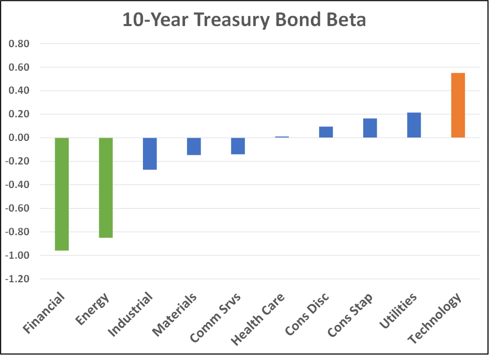

## Table of Contents

## What are interest rates and how do they affect the economy?

Interest rates are the cost of borrowing money, usually shown as a percentage. When you borrow money from a bank, you have to pay back the amount you borrowed plus some extra. This extra is the interest. Banks also pay interest to people who save money with them. The central bank, like the Federal Reserve in the U.S., decides the basic interest rate that affects all other rates.

Interest rates have a big impact on the economy. When interest rates are low, borrowing money is cheaper. This encourages people and businesses to take loans to buy things like houses, cars, or to start new projects. This can help the economy grow because more money is being spent. On the other hand, when interest rates are high, borrowing becomes more expensive. People and businesses might borrow less, which can slow down the economy. So, by changing interest rates, the central bank tries to keep the economy stable, balancing growth and inflation.

## Which economic sectors are most sensitive to changes in interest rates?

Some sectors are more affected by interest rate changes than others. The housing sector is very sensitive because many people need loans to buy homes. When interest rates go up, mortgages become more expensive, and fewer people might buy houses. This can slow down the construction industry too, because if fewer houses are being sold, builders might build less. On the other hand, when interest rates go down, more people can afford to buy homes, which can help the housing and construction sectors grow.

Another sector that feels big changes from interest rates is the financial sector, including banks and insurance companies. Banks make money from the difference between what they pay on savings and what they charge on loans. When interest rates rise, banks can charge more for loans, which can be good for them. But if rates go too high, fewer people might borrow, which can hurt banks. Insurance companies also invest a lot of money, and their profits can go up or down depending on interest rates.

Lastly, the automotive industry is also sensitive to interest rates. Many people finance their cars with loans. When interest rates are low, car loans are cheaper, and more people might buy cars. But when rates go up, car loans become more expensive, and fewer people might buy cars, which can affect car manufacturers and dealers.

## How do increased interest rates benefit the banking sector?

When interest rates go up, banks can make more money from the difference between what they pay on savings and what they charge for loans. This difference is called the 'net interest margin'. When rates are higher, banks can charge more for loans while still paying less on savings. This means they earn more profit from each loan they give out. So, higher interest rates can make banks more profitable because they get more money from borrowers.

However, if interest rates go up too much, it can also hurt banks. When loans become very expensive, fewer people and businesses might want to borrow money. If fewer people are taking out loans, banks might not make as much money as they hoped. But usually, a moderate increase in interest rates helps banks because it increases their income from loans without scaring away too many borrowers.

## What impact do higher interest rates have on the savings and investment sector?

When interest rates go up, it's good news for people who save money. Banks usually pay more interest on savings accounts when rates are higher. This means people can earn more money just by keeping their money in the bank. It encourages people to save more because they get a better reward for their savings. This can be especially helpful for people who are saving for big things like buying a house or for their retirement.

Higher interest rates can have a mixed effect on the investment sector. On one hand, they can make some investments, like bonds, more attractive because they pay more interest. People might move their money into these safer investments, which can push up their prices. On the other hand, higher rates can make borrowing more expensive for businesses. This can slow down their growth and make them less profitable, which might make their stocks less attractive to investors. So, while some parts of the investment sector might benefit, others might struggle when interest rates go up.

## How do insurance companies benefit from an increase in interest rates?

Insurance companies often have a lot of money saved up from the premiums people pay. They invest this money to make more money for themselves. When interest rates go up, the investments they make, like bonds, start paying more interest. This means insurance companies can earn more money from their investments without doing anything extra. So, higher interest rates can help insurance companies make bigger profits.

But it's not always simple. If interest rates go up a lot, it can make things harder for insurance companies too. When rates are high, people might not want to borrow as much, which can slow down the economy. If the economy slows down, fewer people might buy insurance, and the insurance companies might not get as many new customers. So, while higher interest rates can help insurance companies earn more from their investments, they need to be careful because a big increase might also bring some problems.

## In what ways do higher interest rates affect the real estate sector?

When interest rates go up, it makes borrowing money more expensive. In the real estate sector, this means that people who want to buy a house have to pay more for their mortgages. Because mortgages are more expensive, fewer people might decide to buy a house. This can make the real estate market slow down because there are fewer buyers. Also, if people are not buying as many houses, builders might not build as many new homes, which can affect the construction industry too.

Higher interest rates can also affect people who already own homes. If they have a variable rate mortgage, their monthly payments might go up when interest rates rise. This can make it harder for them to pay their bills. On the other hand, people who have saved up a lot of money might benefit from higher rates because they can earn more interest on their savings. But overall, when interest rates go up, it usually means fewer people are buying and selling houses, which can make the real estate market less active.

## How can the automotive industry be influenced by rising interest rates?

When interest rates go up, it becomes more expensive for people to borrow money to buy cars. Many people use car loans to pay for their vehicles, so if the interest rates are higher, the monthly payments on these loans will be higher too. This can make people think twice about buying a new car because it will cost them more money every month. If fewer people are buying cars, car dealers might sell fewer cars, and car manufacturers might make fewer cars. This can slow down the whole automotive industry.

On the other hand, if someone has saved up money to buy a car without a loan, higher interest rates might actually help them. They can earn more interest on their savings, which could help them buy a car more easily. But this is not as common as people using loans to buy cars. So, overall, when interest rates go up, it usually means fewer people are buying cars, and the automotive industry might not do as well.

## What are the effects of increased interest rates on consumer goods and retail sectors?

When interest rates go up, it can make people spend less money on consumer goods. This is because borrowing money becomes more expensive, so people might not want to take out loans to buy things like furniture, electronics, or other big items. If people are spending less, stores that sell these things might not sell as much. This can make the retail sector slow down because there are fewer customers buying things.

Also, higher interest rates can make people more careful with their money. They might decide to save more and spend less on things they don't really need. This can affect stores that sell clothes, toys, and other everyday items. If people are not buying as much, these stores might have to lower their prices or offer sales to get people to buy things. So, higher interest rates can make the consumer goods and retail sectors struggle because people are spending less money.

## How do financial markets and investment firms react to higher interest rates?

When interest rates go up, it can change how financial markets and investment firms behave. Higher interest rates often make bonds more attractive to investors because they pay more interest. This can cause the prices of bonds to go up. At the same time, when interest rates rise, borrowing money becomes more expensive for companies. This can make companies less profitable because they have to pay more for their loans. As a result, investors might think that the stocks of these companies are not as good of an investment anymore, which can make stock prices go down.

Investment firms also have to adjust their strategies when interest rates increase. They might move more of their money into investments that benefit from higher rates, like bonds. But they also have to be careful because if the economy slows down because of higher rates, it can affect all kinds of investments. Investment firms need to think about how higher interest rates will change the economy and adjust their investments to try to make the most money they can. It's a tricky balance, but it's important for them to get it right.

## What role do interest rates play in the profitability of utility companies?

Interest rates can affect how much money utility companies make. These companies often need to borrow money to build things like power plants or water systems. When interest rates go up, it costs them more to borrow this money. This means they have to pay more in interest, which can make it harder for them to make a profit. If the rates are too high, it can even stop them from starting new projects because it's too expensive.

On the other hand, when interest rates go up, utility companies can also earn more money from their investments. They usually have a lot of money saved from what customers pay them, and they invest this money to make more money. When interest rates are higher, the investments they make, like bonds, pay more interest. So, even though borrowing is more expensive, they can earn more from their savings. It's a balance between higher borrowing costs and higher earnings from investments that affects how profitable utility companies are.

## How do increased interest rates impact international trade and currency valuation?

When interest rates go up in a country, it can affect how much people want to buy and sell things with other countries. If rates are higher, the country's currency usually becomes more valuable. This is because people from other countries might want to invest their money in that country to get the higher interest rates. When the currency is stronger, it makes things made in that country more expensive for people in other countries. This can make it harder for the country to sell its products abroad because they cost more. On the other hand, it makes things from other countries cheaper to buy, which can lead to more imports.

Higher interest rates can also make borrowing money more expensive for businesses that want to trade internationally. If it costs more to borrow, these businesses might not want to take out loans to buy things from other countries or to sell things to other countries. This can slow down international trade. Also, if a country's currency gets stronger because of higher interest rates, it can affect how much other countries want to trade with them. If the currency is too strong, it might make other countries less interested in buying from them, which can hurt the country's trade balance.

## What advanced strategies can businesses in various sectors employ to capitalize on rising interest rates?

Businesses can use different strategies to take advantage of higher interest rates. One way is to invest more money in things that pay more when rates go up, like bonds. This can help them earn more money without doing much extra work. Another strategy is for businesses to save more money instead of spending it. When interest rates are higher, they can earn more interest on their savings, which can help them grow their money over time. They can also be smart about when they borrow money. If they know rates are going to go up, they might borrow money before the rates increase so they can get a lower rate.

In the real estate sector, businesses can focus on selling properties to people who have saved up a lot of money. These buyers might not need loans, so higher interest rates won't affect them as much. In the automotive industry, car dealers can offer special deals or financing options to attract buyers even when rates are high. This can help them keep selling cars even if people are worried about higher loan payments. For companies in the retail sector, offering discounts or sales can encourage people to keep buying things even when they're trying to spend less because of higher rates. By using these strategies, businesses in different sectors can do well even when interest rates are going up.

## What is the relationship between interest rates and the economic pulse?

Interest rates are a fundamental component of macroeconomic policy, primarily set by central banks as a tool to regulate economic activity. Central banks, such as the Federal Reserve in the United States, the European Central Bank in the Eurozone, and the Bank of Japan, set benchmark interest rates like the federal funds rate or the discount rate. These rates are determined based on a variety of economic indicators, including inflation, employment levels, and overall economic growth.

Interest rates serve as the cost of borrowing money. They influence the economy by affecting consumer spending and business investment. When interest rates are low, borrowing is cheaper, which can spur investment and consumption. Conversely, higher interest rates can dampen economic activity by making loans more expensive. The relationship between interest rates and inflation is crucial: generally, when inflation is high, central banks might raise interest rates to curb excessive price increases by reducing spending and borrowing. The basic relationship can be represented by the Fisher equation:

$$
i = r + \pi
$$

where $i$ is the nominal interest rate, $r$ is the real interest rate, and $\pi$ is the inflation rate. Adjusting interest rates helps maintain a balance between growth and inflation, aiming for a stable economic environment.

Changes in interest rates directly impact various economic sectors. For example, the housing sector is particularly sensitive to [interest rate](/wiki/interest-rate-trading-strategies) adjustments; lower rates typically lead to increased mortgage borrowing and housing purchases. In contrast, higher rates might slow down this activity, affecting construction and real estate. Similarly, sectors reliant on capital investment, such as manufacturing and technology, may see reduced activity as borrowing costs rise.

Historically, significant interest rate changes have led to notable market reactions. For instance, the sharp interest rate hikes by the Federal Reserve in the early 1980s successfully curbed the then-rampant inflation but also led to a recession. Market participants closely monitor central bank policies for signals on interest rate adjustments, as these movements can trigger wide-ranging effects across the financial markets, from stock and bond prices to currency valuations.

In conclusion, understanding interest rates and their economic implications is essential for both policymakers and investors. They play a pivotal role in shaping economic conditions by influencing inflation, investment, and consumption. Recognizing the historical context and sector-specific impacts of interest rate changes can guide strategic decision-making in navigating financial markets.

## References & Further Reading

[1]: Bergstra, J., Bardenet, R., Bengio, Y., & Kégl, B. (2011). ["Algorithms for Hyper-Parameter Optimization."](https://papers.nips.cc/paper/4443-algorithms-for-hyper-parameter-optimization) Advances in Neural Information Processing Systems 24.

[2]: ["Advances in Financial Machine Learning"](https://www.amazon.com/Advances-Financial-Machine-Learning-Marcos/dp/1119482089) by Marcos Lopez de Prado

[3]: ["Evidence-Based Technical Analysis: Applying the Scientific Method and Statistical Inference to Trading Signals"](https://www.amazon.com/Evidence-Based-Technical-Analysis-Scientific-Statistical/dp/0470008741) by David Aronson

[4]: ["Machine Learning for Algorithmic Trading"](https://github.com/stefan-jansen/machine-learning-for-trading) by Stefan Jansen

[5]: ["Quantitative Trading: How to Build Your Own Algorithmic Trading Business"](https://www.amazon.com/Quantitative-Trading-Build-Algorithmic-Business/dp/1119800064) by Ernest P. Chan