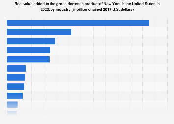

## Table of Contents

## What are the primary economic sectors in New York?

New York's economy is diverse and strong. The main sectors include finance, media, and technology. New York City, especially Wall Street, is a global leader in finance. Many big banks and financial companies have their headquarters there. The city is also a major center for media and entertainment, with companies like NBC and CBS based there. Tech companies are growing fast in New York, with many startups and big firms like Google and Amazon expanding their presence.

Another important sector is healthcare, which employs many people in New York. Hospitals and research centers contribute a lot to the economy. Tourism is also a big deal, with millions of visitors coming to see landmarks like the Statue of Liberty and Broadway shows. Manufacturing and retail are other key sectors, though they have faced challenges in recent years. Overall, New York's economy benefits from its diverse industries and its role as a global city.

## How is New York's GDP calculated?

New York's GDP, or Gross Domestic Product, is calculated by adding up the value of all goods and services produced within the state in a year. This includes everything from the financial services on Wall Street to the hot dogs sold at street carts. To figure out the GDP, economists use data from businesses, government agencies, and other sources to estimate the total value of what's produced.

The calculation can be done in three main ways: the production approach, the income approach, and the expenditure approach. The production approach adds up the value added at each stage of production. The income approach sums up all the income earned by people and businesses, like wages and profits. The expenditure approach totals up all the spending on goods and services by consumers, businesses, and the government. Usually, all these methods should give the same result, but in practice, they might differ a bit due to data collection challenges.

## Which sector has contributed the most to New York's GDP growth in the last decade?

In the last decade, the finance sector has been the biggest contributor to New York's GDP growth. New York City, especially Wall Street, is a global hub for finance. Many big banks and financial companies have their headquarters there. They make a lot of money from trading stocks, bonds, and other financial products. This sector has been growing steadily, helping to boost the state's economy.

Another important sector for GDP growth has been technology. Tech companies have been expanding quickly in New York. Big firms like Google and Amazon have been setting up more offices, and there are lots of new startups. These companies bring in new jobs and investment, which helps the economy grow. While not as big as finance, the tech sector's growth has been a key part of New York's economic success in recent years.

## What role does the finance sector play in New York's economy?

The finance sector is a big part of New York's economy. It's the biggest sector and makes a lot of money for the state. New York City, especially Wall Street, is where a lot of this happens. Big banks and financial companies have their headquarters there. They make money by trading stocks, bonds, and other financial products. This sector has been growing and helps the economy grow too.

The finance sector also brings in a lot of jobs. Many people work in banks, investment firms, and other financial businesses. These jobs pay well and help people spend money in the city, which helps other parts of the economy too. The finance sector is important because it not only makes money but also helps other sectors grow by providing them with money to invest and spend.

## How has the technology sector influenced New York's GDP?

The technology sector has been a big help to New York's GDP. It's been growing fast, with lots of new startups and big companies like Google and Amazon setting up more offices in the city. These tech companies bring in new jobs and money, which helps the economy grow. The tech sector might not be as big as finance, but it's been a key part of New York's economic success in the last few years.

When tech companies come to New York, they don't just make money for themselves. They also help other businesses grow. For example, they might need offices, so construction companies get more work. They also need services like food and transport, which helps those businesses too. Overall, the tech sector's growth has been good for New York's GDP because it creates jobs and helps other parts of the economy.

## What impact do tourism and hospitality have on New York's GDP?

Tourism and hospitality are big parts of New York's economy. They bring in a lot of money because millions of people come to visit every year. They want to see famous places like the Statue of Liberty, Times Square, and Broadway shows. All these visitors spend money on hotels, restaurants, and shopping, which adds to New York's GDP.

The tourism and hospitality sector also creates a lot of jobs. People work in hotels, restaurants, and tourist attractions. These jobs help people earn money and spend it in the city, which helps the economy grow even more. So, tourism and hospitality are important because they not only bring in money from visitors but also help keep the local economy strong by creating jobs.

## How does the real estate sector contribute to New York's economic growth?

The real estate sector is a big part of New York's economy. It helps the state's GDP grow because people and businesses spend a lot of money on buying, selling, and renting properties. New York City has some of the most expensive real estate in the world, and this brings in a lot of money. When people buy homes or businesses rent office spaces, they pay money that goes into the economy.

Real estate also creates jobs. People work in construction, real estate agencies, and property management. These jobs help people earn money, and then they spend it in the city, which helps other parts of the economy too. So, real estate is important because it not only brings in money but also helps other sectors grow by creating jobs and keeping the local economy strong.

## What are the emerging sectors that are expected to drive future GDP growth in New York?

In the future, New York's GDP growth is expected to be driven by the tech sector and green energy. The tech sector is growing fast in New York. More and more startups and big companies like Google and Amazon are setting up offices there. They bring in new jobs and money, which helps the economy grow. The tech sector is also creating new kinds of jobs, like in software development and data analysis, which are important for the future.

Another emerging sector is green energy. New York is focusing on becoming more sustainable and using less fossil fuel. This means more jobs in solar power, wind energy, and other green technologies. These jobs help the economy grow because they bring in new money and help the environment at the same time. Green energy is important because it's a way to make money while also taking care of the planet.

Overall, these two sectors, tech and green energy, are expected to be big drivers of New York's future GDP growth. They are bringing in new jobs and money, and they are also helping to make New York a more modern and sustainable place.

## How do government policies affect the growth of different economic sectors in New York?

Government policies can have a big impact on how different economic sectors in New York grow. For example, tax policies can help or hurt businesses. If the government gives tax breaks to tech companies, more of them might move to New York, which can create jobs and boost the economy. On the other hand, if taxes are too high, businesses might leave, which can slow down growth. The government can also make rules about things like the environment, which can affect sectors like green energy. If the government supports green energy with good policies, more companies might start working on solar or wind power, helping that sector grow.

Another way government policies affect economic sectors is through spending. If the government spends money on building new roads or schools, it can help the construction sector grow. This spending creates jobs and can make other parts of the economy grow too. Also, the government can help sectors like tourism by promoting New York as a great place to visit. Policies that make it easier for people to travel or enjoy the city can bring in more tourists, which helps the hospitality sector. So, government policies can really shape how different sectors in New York do, by changing taxes, making rules, and deciding where to spend money.

## What are the challenges faced by New York's key economic sectors in sustaining GDP growth?

New York's key economic sectors face several challenges in keeping the GDP growing. One big challenge is the high cost of living and doing business in the city. It's expensive to rent office space or find a place to live, which can make it hard for new businesses to start and grow. This can slow down sectors like tech and finance because they need a lot of space and workers. Also, the competition for talent is tough. Many companies want to hire the best people, but with so many jobs in New York, it can be hard to find and keep good workers.

Another challenge is the changing economy. For example, the finance sector has to deal with new rules and technology that can make old ways of doing things less useful. This means banks and other financial companies need to change how they work, which can be hard and costly. The tourism sector also faces challenges because it depends a lot on how many people want to travel. If there's a big event like a health crisis or economic trouble, fewer people might visit New York, which can hurt the hospitality industry. Overall, these challenges mean that New York's key sectors have to keep adapting and finding new ways to grow to keep the GDP going strong.

## How does New York's GDP growth compare to other major global cities?

New York's GDP growth is strong, but it can be different compared to other big cities around the world. For example, cities like London and Tokyo have big economies too. New York often does better than many other cities because it's a big center for finance and business. But sometimes, other cities like Singapore or Hong Kong might grow faster because they focus a lot on tech and new industries.

One reason New York's GDP growth can be different is because of what happens in the world. If there's a big problem like a health crisis or a change in the world's economy, it can affect New York more than other cities. Also, New York has to compete with other cities for businesses and people. If other cities offer better deals or have cheaper living costs, companies might choose to go there instead of New York. Overall, New York's GDP growth is good, but it depends a lot on what's happening around the world and how well the city can keep attracting businesses and people.

## What advanced economic models are used to predict future GDP contributions from various sectors in New York?

To predict how different sectors will contribute to New York's GDP in the future, economists use advanced models like the Input-Output Model and the Computable General Equilibrium (CGE) Model. The Input-Output Model looks at how different sectors in the economy depend on each other. For example, it can show how the tech sector might grow if the finance sector does well. This model helps economists understand how changes in one sector can affect others and the overall GDP. It's like a big puzzle where each piece affects the others.

The Computable General Equilibrium Model is another tool that economists use. This model is more complex and looks at how all parts of the economy, like households, businesses, and the government, interact with each other. It can predict how things like new taxes or changes in technology might affect different sectors and the whole economy. By using this model, economists can make better guesses about how sectors like tech, finance, or green energy will grow and contribute to New York's GDP in the future.

## References & Further Reading

[1]: Bergstra, J., Bardenet, R., Bengio, Y., & Kégl, B. (2011). ["Algorithms for Hyper-Parameter Optimization."](https://papers.nips.cc/paper/4443-algorithms-for-hyper-parameter-optimization) Advances in Neural Information Processing Systems 24.

[2]: ["Advances in Financial Machine Learning"](https://www.amazon.com/Advances-Financial-Machine-Learning-Marcos/dp/1119482089) by Marcos Lopez de Prado

[3]: ["Evidence-Based Technical Analysis: Applying the Scientific Method and Statistical Inference to Trading Signals"](https://www.amazon.com/Evidence-Based-Technical-Analysis-Scientific-Statistical/dp/0470008741) by David Aronson

[4]: ["Machine Learning for Algorithmic Trading"](https://github.com/stefan-jansen/machine-learning-for-trading) by Stefan Jansen

[5]: ["Quantitative Trading: How to Build Your Own Algorithmic Trading Business"](https://www.amazon.com/Quantitative-Trading-Build-Algorithmic-Business/dp/1119800064) by Ernest P. Chan