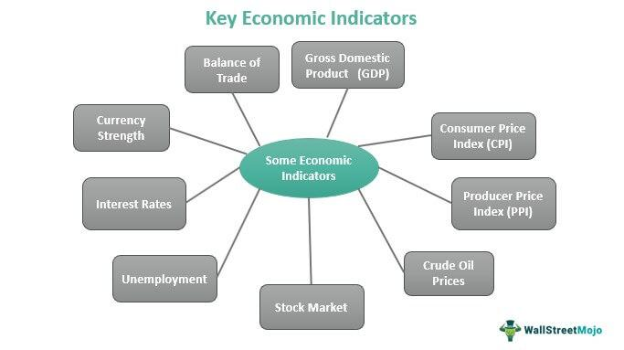

Understanding the diverse landscape of economic sectors is crucial for analyzing the economic activity and health of a nation. Economic sectors classify distinct areas of economic activities, each contributing uniquely to a country's overall economic performance. They act as a framework for evaluating the operational structure of economies, enabling analysts and policymakers to assess productivity and growth prospects. Examining these sectors helps in comprehending the intricate web of interactions that drive national and global economies.

The article aims to investigate various types of economic sectors, their functions within the economy, and their significance concerning algorithmic trading, commonly known as algo trading. Algo trading utilizes advanced computational methods to conduct trading decisions and transactions based on pre-established guidelines, which are often executed at high speed—a phenomenon growing increasingly in importance with technological advancements.



An understanding of how economic sectors are organized offers valuable insights into their role in financial markets. This knowledge is pivotal in crafting effective investment strategies that align with sector trends and market demands. Moreover, by analyzing the intersection of algo trading with different sectors, investors can harness sector-specific data to optimize trading strategies.

As technology's role in automating trading systems expands, a nuanced comprehension of these economic sectors and their varying characteristics becomes imperative. Recognizing sector classifications and their dynamics is not only essential for traditional financial analysis but increasingly for leveraging automation in trading environments. This article sets the stage for exploring how economic sectors impact and shape investment strategies, helping investors to capitalize on market opportunities and manage risks effectively.

## Table of Contents

## What Are Economic Sectors?

An economic sector is a substantial grouping of businesses and enterprises that engage in analogous business activities or produce interconnected products and services. This classification system facilitates a detailed analysis of the economy by breaking it down into manageable components, thereby aiding in the assessment of economic expansion or contraction. In finance, these sectors are further specialized into investment sectors, permitting more targeted analyses and refined investment strategies.

The primary types of economic sectors include the primary, secondary, tertiary, and quaternary sectors. The primary sector is involved in the extraction and harvesting of natural resources. Its activities encompass agriculture, mining, forestry, and fishing, which form the foundational stage of the economic output by providing raw materials. This sector is crucial for economies heavily reliant on these natural resources, and its health directly impacts food security and resource availability.

The secondary sector is concerned with manufacturing and construction. It utilizes raw materials provided by the primary sector to produce finished goods. This sector includes industries such as automobile manufacturing, textiles, and electronics. The expansion of the secondary sector is often associated with industrialization, fostering economic development and workforce expansion.

The tertiary sector provides services rather than goods. This includes a diverse array of services like retail, finance, healthcare, and education. As economies grow, the tertiary sector often expands as a reflection of increased consumer demand for services. It is integral to modern economies due to its role in improving quality of life and driving innovation.

The quaternary sector is characterized by knowledge-based activities. It includes information technology, research and development, and educational services. These activities are vital in fostering innovation, driving technological advancements, and creating a robust intellectual infrastructure. As economies advance, emphasis increasingly shifts towards this sector, highlighting the importance of knowledge and innovation in economic growth.

By understanding these sectors, analysts and investors can better navigate the complexities of the economy. This segmentation allows for recognizing potential growth areas and vulnerabilities, ultimately supporting informed decision-making processes and strategic planning within various economic landscapes.

## Types of Economic Sectors

Economic sectors are a fundamental framework for understanding the organization and operation of national and global economies. Each sector encompasses distinct types of economic activities that contribute differently to economic growth, employment, and development. Here's an exploration of the various economic sectors:

**Primary Sector:** The primary sector is centered around the extraction and harvesting of natural resources. It includes industries such as agriculture, mining, forestry, fishing, and oil extraction. This sector is foundational as it provides the raw materials that fuel the activities of the secondary sector. For example, agriculture supplies the food products that populate supermarket shelves, while mining delivers minerals that are used in various manufacturing processes.

**Secondary Sector:** This sector involves manufacturing and construction activities that utilize raw materials from the primary sector. The secondary sector transforms these raw materials into finished goods and products through different processes. Industries in this sector include automobile manufacturing, textile production, and building construction. The value addition in this sector is significant as it converts basic inputs into products that are vital for consumption and further industrial activities. 

**Tertiary Sector:** The tertiary sector is characterized by the provision of services rather than goods. It encompasses a wide range of activities, including retail, finance, healthcare, education, hospitality, and entertainment. This service-oriented sector is critical for the functioning of the economy as it facilitates trade, supports other sectors, and helps in the distribution of goods and information. With advancements in technology, the tertiary sector has expanded to include complex financial services and digital entertainment platforms.

**Quaternary Sector:** This sector is associated with knowledge-based activities and intellectual services. It includes industries that specialize in information technology, research and development, consultancy, and education. The quaternary sector focuses on high-level tasks that drive innovation, economic planning, and the growth of intellectual capital. It plays a crucial role in enhancing productivity and advancing technological progress, which in turn benefits other sectors.

**Quinary Sector:** The quinary sector comprises activities involving high-level decision-making and policy creation. It includes government roles, research scientists, top-tier executives, and non-governmental organizations. The quinary sector is instrumental in shaping economic policies, strategic planning, and societal development. Decision-makers in this sector influence the direction of national and international policies, impacting every other sector of the economy.

Understanding these economic sectors provides clarity on how resources flow through different parts of the economy, influencing employment, economic policies, and investment strategies. Each sector has its unique role but is interconnected with others, forming a comprehensive economic ecosystem.

## Economic Sectors and Algo Trading

Algorithmic trading, commonly known as algo trading, has revolutionized the financial markets by utilizing sophisticated algorithms to execute trades at speeds unattainable by human traders. These algorithms execute trades based on pre-defined criteria that are derived from quantitative models and statistical analyses.

Economic sectors play a pivotal role in shaping algo trading strategies. Algorithms can be tailored to react to sector-specific data, allowing traders to capitalize on unique trends and opportunities inherent to each sector. For instance, an algo trading strategy might focus on the technology sector by examining trends in innovation, revenue growth patterns, or industry-specific regulatory changes. This sector concentration enables the development of highly specialized strategies that exploit sector characteristics.

Different economic sectors exhibit varying attributes such as [volatility](/wiki/volatility-trading-strategies), [liquidity](/wiki/liquidity-risk-premium), and growth prospects, which influence trading strategy development. Algorithms can be designed to accommodate these attributes, ensuring that the risk profiles and market dynamics of each sector are aligned with the trading objectives. This capability is especially crucial for sectors with rapid changes, like technology or healthcare, where timely responses to data can drive competitive advantage.

Here is an example of how an algorithm might be structured to focus on the tech sector using Python:

```python
import yfinance as yf  # For more datasets, visit: https://paperswithbacktest.com/datasets
import pandas as pd

def tech_sector_trading_strategy(stock_symbols, start_date, end_date):
    data = {}

    # Fetching historical data for each stock in the tech sector
    for symbol in stock_symbols:
        stock_data = yf.download(symbol, start=start_date, end=end_date)
        data[symbol] = stock_data['Adj Close']

    df = pd.DataFrame(data)

    # Example Strategy: Simple Moving Average Crossover
    df['SMA_50'] = df.mean(axis=1).rolling(window=50).mean()
    df['SMA_200'] = df.mean(axis=1).rolling(window=200).mean()

    # Generating trade signals
    df['Signal'] = 0
    df['Signal'][50:] = [1 if df['SMA_50'].iloc[i] > df['SMA_200'].iloc[i] else 0 for i in range(50, len(df))]

    df['Position'] = df['Signal'].diff()

    return df

# Example usage
tech_stocks = ['AAPL', 'MSFT', 'GOOGL']
trading_signals = tech_sector_trading_strategy(tech_stocks, '2022-01-01', '2023-01-01')
print(trading_signals)
```

This Python script retrieves historical price data for selected technology stocks and implements a basic moving average crossover strategy. The algorithm generates trade signals based on the relative positions of a short-term (50-day) and long-term (200-day) moving average of these stocks' average prices. The trading signals derived from this strategy can guide buy or sell decisions, aiming to capitalize on anticipated price trends within the tech sector.

Sector-focused algo trading can enhance investment returns by exploiting sector-specific trends and opportunities. For instance, during periods of technological innovation or economic upheaval, such as the introduction of 5G technologies or widespread adoption of remote working solutions, algorithms focused on the tech sector can be particularly lucrative. By analyzing and reacting promptly to sector-specific developments, algo traders can improve their portfolio's performance and achieve strategic financial outcomes.

## Investment Sectors and Economic Growth

Investment sectors play a crucial role in financial markets by enabling detailed performance analysis and offering insights into potential investment opportunities. By dividing the market into distinct sectors, investors can compare and analyze the strengths and weaknesses of various industries, guiding their investment decisions.

Understanding sector expansion is vital for identifying growth opportunities. For instance, a flourishing technology sector might suggest lucrative investment prospects, while a stagnating sector like retail could indicate potential risks. Monitoring these trends helps investors adjust their portfolios to maximize returns. The oil sector serves as an illustrative example. An increase in oil prices often signals a burgeoning sector, presenting profitable opportunities for investors. Conversely, if the sector faces regulatory challenges or declining demand, it may signal caution.

Sector rotation is an investment strategy that takes advantage of the changing economic landscape by reallocating investments across sectors. This strategic shift occurs when investors predict changes in sector performance due to economic cycles, aiming to maximize returns by investing in sectors poised for growth.

Here's a python code snippet to illustrate a basic concept of sector rotation using a hypothetical performance dataset:

```python
# Simulating sector performance data
import pandas as pd
import numpy as np

data = {
    'Sector': ['Technology', 'Healthcare', 'Energy', 'Finance'],
    'Growth_Rate': [0.15, 0.10, 0.05, 0.08]
}

# Convert to DataFrame
df = pd.DataFrame(data)

# Strategy to invest in top two sectors with highest growth rates
sector_rotation_strategy = df.nlargest(2, 'Growth_Rate')
print(sector_rotation_strategy)
```

By knowing the performance and potential of each sector, investors can strategically diversify their portfolios, spreading risk across various sectors while capturing sector-specific growth opportunities. This approach mitigates the risks associated with investing solely in one sector. Diversification ensures that a downturn in one sector does not significantly impact the entire investment portfolio, balancing potential losses with gains in other, thriving sectors.

Hence, grasping the dynamics of investment sectors is essential for navigating economic cycles and optimizing investment outcomes, enhancing both risk management and profit potential for investors.

## Conclusion

The study of economic sectors is a vital tool for investors and economists, providing a comprehensive framework for assessing economic activity and potential. By understanding the different economic sectors, from primary to quinary, stakeholders can make informed decisions that enhance financial outcomes. This knowledge is particularly crucial in both traditional and [algorithmic trading](/wiki/algorithmic-trading) environments, where decisions are driven by sector-specific data and trends.

Integrating economic sector knowledge with algorithmic trading allows investors to optimize their strategies. Algorithms can be fine-tuned to respond to changes within specific sectors, enabling better risk management and profit maximization. For instance, by developing algorithms that are sector-oriented, traders can capitalize on unique sector characteristics, such as growth patterns or regulatory changes. This targeted approach can lead to improved returns by exploiting sector-specific opportunities.

As technology continues to advance, the landscape of the economy evolves. It becomes increasingly important to stay informed about sector dynamics. Advancements in technology not only transform the sectors themselves but also how data from these sectors is analyzed and leveraged for investment purposes. This ongoing evolution necessitates a deep and current understanding of sector trends, which can inform both the development of new trading algorithms and the adjustment of existing strategies.

Ultimately, a nuanced understanding of economic sectors empowers investors to make strategic investment and trading decisions. This insight enables navigating the complexities of the economic landscape with greater precision and foresight. Whether through traditional analysis or sophisticated algorithmic strategies, recognizing and responding to sectorial shifts ensures that investors maintain a competitive edge in the ever-changing financial markets.

## References & Further Reading

[1]: Bergstra, J., Bardenet, R., Bengio, Y., & Kégl, B. (2011). ["Algorithms for Hyper-Parameter Optimization."](https://dl.acm.org/doi/10.5555/2986459.2986743) Advances in Neural Information Processing Systems 24.

[2]: ["Advances in Financial Machine Learning"](https://www.amazon.com/Advances-Financial-Machine-Learning-Marcos/dp/1119482089) by Marcos Lopez de Prado

[3]: ["Evidence-Based Technical Analysis: Applying the Scientific Method and Statistical Inference to Trading Signals"](https://www.amazon.com/Evidence-Based-Technical-Analysis-Scientific-Statistical/dp/0470008741) by David Aronson

[4]: ["Machine Learning for Algorithmic Trading"](https://github.com/stefan-jansen/machine-learning-for-trading) by Stefan Jansen

[5]: ["Quantitative Trading: How to Build Your Own Algorithmic Trading Business"](https://github.com/LucindaYa/quant-resources/blob/master/Quantitative%20Trading%20How%20to%20Build%20Your%20Own%20Algorithmic%20Trading%20Business.pdf) by Ernest P. Chan